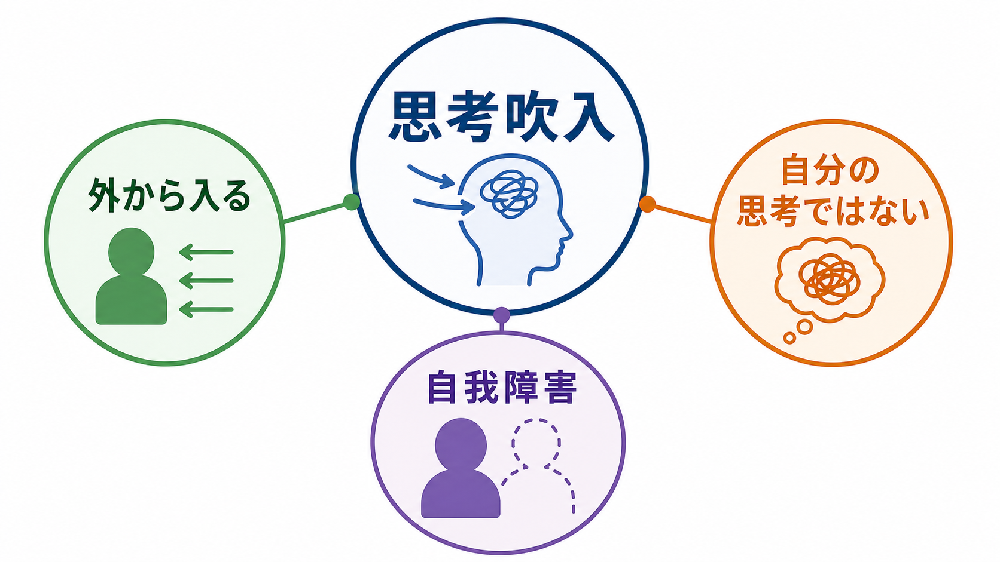
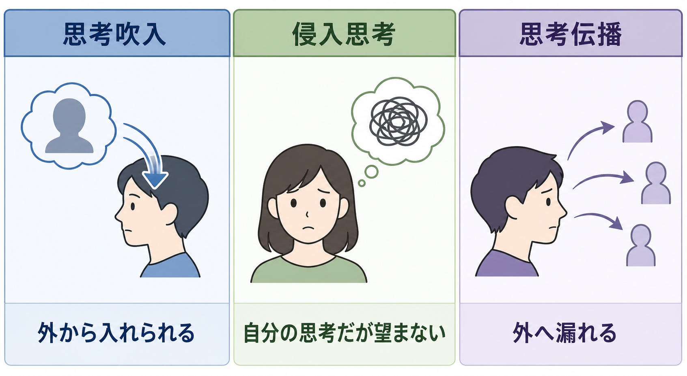
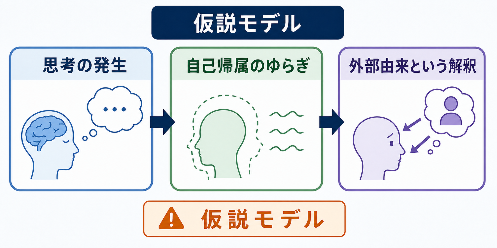

# 思考吹入とは何か

## 要点

- 思考吹入は、「ある考えが自分の内側にある」と感じながら、その思考の起源や所有感を「自分ではない」と体験する症状である。
- 典型的には「他者、機械、組織、霊的存在などが自分の心に考えを入れてくる」という確信を伴う。
- [[侵入思考とは何か]]のように「自分の考えだが望まない」体験とは異なり、思考吹入では思考の自己帰属そのものが揺らぐ。
- 歴史的にはシュナイダーの一級症状に含められ、統合失調症との関連が強調されてきたが、現在は単独で診断を決める徴候ではなく、全体の精神状態・経過・苦痛・機能障害と合わせて評価する。
- この記事は教育・研究目的の概説であり、個別の診断や治療指示ではない。

## この記事で答える問い

このノートでは、思考吹入を「不思議な訴え」としてではなく、[[精神症候学とは何か]]の観察対象として整理する。中心になる問いは次の4つである。

1. 思考吹入はどのような体験か。
2. [[妄想とは何か]]、[[幻聴とは何か]]、[[侵入思考とは何か]]と何が違うのか。
3. 自我障害・自己帰属・予測処理の観点から、どのように理解できるのか。
4. 臨床評価では何を確認し、何を過剰に断定しないべきか。

## まず結論

思考吹入とは、心の中に生じた思考が「自分によって生じたものではなく、外部から入れられたものだ」と体験される現象である。SNOMED CT 系の概念定義では、他者によって特定の思考が心に置かれているという妄想的確信として記述される[1]。ただし、実際の面接では「本当に外から来たか」を議論するよりも、本人がどの程度その体験を確信しているか、どのような文脈で起こるか、声として聞こえるのか、思考として体験されるのか、苦痛や行動への影響がどれほどあるかを丁寧に分ける必要がある。

重要なのは、思考吹入を「変な考えが浮かぶこと」と同一視しないことである。誰にでも、望まない考え、場違いなイメージ、ふと浮かぶ記憶は起こりうる。思考吹入では、思考内容の不快さだけでなく、「この思考は私のものではない」「外から入ってきた」という自己帰属の変化が前景に出る。

## 背景

思考吹入は、シュナイダーが記述した一級症状の一つとして精神医学史で扱われてきた。一級症状には、思考奪取、思考伝播、思考吹入、作為体験、特定の形の[[幻聴とは何か]]などが含まれる。コクランレビューは、これらが診断体系の中で重視されてきた一方、統合失調症にだけ特異的とは言い切れず、診断のための単独検査としては限界があることを整理している[2]。

近年の臨床ガイドラインも、精神病症状の評価を単一症状の有無だけで完結させない。NICE の成人の精神病・統合失調症ガイドラインは、早期認識、全人的評価、長期的回復、身体合併症、家族・支援者への支援を含む包括的な対応を扱っている[3]。したがって、思考吹入は「統合失調症を決める魔法の症状」ではなく、精神病症状の構造を理解するための重要な手がかりとして読むのが適切である。

## 基本概念

### 思考吹入の中核

中核は、思考内容そのものよりも「思考の所有感」の障害である。本人は、ある考えが自分の心の中に現れていることは認める。しかし、その思考が自分から生じたとは感じられず、他者や外部の力によって挿入されたと解釈する。この点で、思考吹入は自我障害や自己の境界の変化と深く関わる。

現象学的研究では、思考吹入は「私にとっての経験である」という最小限の自己性、すなわち for-me-ness の変化として議論される[4]。これは単に「変な内容を信じる」というより、考えるという行為が自分に属しているという前反省的な感覚が揺らぐ問題である。

### 関連症状との違い

思考吹入と近い体験は多いが、鑑別の軸は比較的明確である。

| 体験 | 中核 | 典型的な言い方 |
|---|---|---|
| 思考吹入 | 思考が外から入れられる | 「これは私の考えではない。入れられている」 |
| 思考奪取 | 思考が外へ抜き取られる | 「考えを抜かれる」 |
| 思考伝播 | 思考が外へ漏れる・伝わる | 「考えが周囲に知られている」 |
| [[侵入思考とは何か]] | 自分の考えだが望まない | 「嫌な考えが勝手に浮かぶ」 |
| [[幻聴とは何か]] | 声や音として知覚される | 「声が聞こえる」 |

## 仕組み

思考吹入の仕組みについて、確立した単一の原因モデルはない。臨床的には「妄想だから脳のこの部位が原因」と短絡しない方がよい。現在の議論は、少なくとも次の3層に分けられる。

### 1. 自己帰属のゆらぎ

通常、思考は内容として現れるだけでなく、「自分が考えている」という感覚を伴う。思考吹入では、この自己帰属が弱まり、思考が自分のものとして統合されにくくなる。Sass と Parnas は、統合失調症を自己意識の基礎的変容として捉える枠組みを提示し、過剰反省性と自己親和性の低下を重視した[5]。この視点では、思考吹入は奇妙な信念の一種である前に、「考えが私のものとして自然にまとまる」感覚の変化として理解される。

### 2. 異常な顕著性と解釈

ある思考が通常より強く、唐突で、連続性を欠いて感じられると、その思考は「なぜここにあるのか」という説明を要求する。思考吹入の一部は、内的な出来事が過度に目立ち、それを外部の行為者に由来するものとして説明する過程と考えられる[6]。この説明は有用だが、すべての症例を同じ機構で説明できるわけではない。

### 3. 予測処理・ベイズ的推論の仮説

予測処理モデルでは、脳は世界や身体の状態を予測し、予測と入力のずれを更新しながら意味づけると考える。精神病症状では、事前信念と感覚・内的信号の精度づけが変化し、不適応な推論が生じる可能性が議論されている[7]。思考吹入に当てはめるなら、内的な思考生成に対する「これは自分由来である」という予測や帰属が弱まり、外部由来という説明が過度に確からしく感じられる、という仮説になる。

## 図解

図で押さえるべき点は、思考吹入が「考えの内容」だけの問題ではなく、次の連鎖として現れることである。

| 段階 | 観察する点 | 面接での確認例 |
|---|---|---|
| 思考の発生 | どんな考えが、いつ、どの頻度で起こるか | 「どのような考えが入ってくる感じですか」 |
| 自己帰属 | それを自分の考えと感じるか | 「その考えは自分で考えた感じがありますか」 |
| 外部由来の解釈 | 誰が、何が、どのように入れていると感じるか | 「どこから来ると感じますか」 |
| 確信度 | 疑える余地があるか | 「そうでない可能性はどのくらいありますか」 |
| 影響 | 苦痛、睡眠、生活、対人関係、行動への影響 | 「その体験で生活はどう変わりましたか」 |

## 臨床・研究との接続

臨床では、思考吹入を本人の言葉で記述することが重要である。評価者が先に「思考吹入ですね」と名づけると、体験の構造を取り逃がすことがある。とくに、[[強迫観念とは何か]]、[[侵入思考とは何か]]、[[解離とは何か]]、[[現実感消失とは何か]]、[[幻覚とは何か]]との境界は、本人の説明を急がず聞くことで見えてくる。

縦断研究では、思考吹入・思考奪取・思考伝播は、[[幻聴とは何か]]、身体的幻覚、作為体験、不安、離人感などと時間的に関連しうることが示されている[8]。これは、思考吹入が孤立した「単発の症状」ではなく、自己・身体・対人世界のまとまりの変化の中に位置づけられることを示している。

研究上は、現象学的記述、認知モデル、予測処理モデルを橋渡しすることが課題である。現象学は「体験がどのように与えられるか」を精密に記述し、認知神経科学は「どの処理が変わるとその体験が生じうるか」を仮説化する。両者を混同せず、同じ現象を異なる説明レベルで扱うことが重要である。

## よくある誤解

### 誤解1: 思考吹入があれば統合失調症と診断できる

できない。思考吹入は重要な精神病症状だが、診断は症状の組み合わせ、持続期間、経過、機能障害、物質・身体疾患、気分症状、文化的背景などを総合して行う。シュナイダー一級症状の診断的有用性には限界がある[2]。

### 誤解2: 侵入思考と同じである

異なる。侵入思考は「自分の考えだが望まない」体験であることが多い。思考吹入では「自分の考えではない」「外部から入れられている」という帰属の変化が中核になる。

### 誤解3: 幻聴の一種にすぎない

重なることはあるが、同一ではない。幻聴は声や音として知覚される体験であり、思考吹入は思考の自己帰属の障害である。本人が「声として聞こえる」と言うのか、「考えとして頭に入ってくる」と言うのかを分けて聞く必要がある。

### 誤解4: 本人を説得すれば消える

強い確信を伴う場合、正面から否定しても苦痛や不信を強めることがある。臨床的には、体験の真偽をその場で論破するより、苦痛、安全、睡眠、生活への影響、支援につながる条件を確認する方が現実的である。

## 関連ノート

- [[精神症候学とは何か]]
- [[妄想とは何か]]
- [[幻覚とは何か]]
- [[幻聴とは何か]]
- [[侵入思考とは何か]]
- [[強迫観念とは何か]]
- [[解離とは何か]]
- [[現実感消失とは何か]]
- [[被害妄想とは何か]]
- [[注察妄想とは何か]]

## MOC更新候補

- `content/00_MOC/` 配下の精神医学・症候学系 MOC に「[[思考吹入とは何か]]」を追加する候補。
- 並列ジョブとの競合を避けるため、このタスクでは MOC 本体は更新しない。

## 理解チェック

1. 思考吹入と侵入思考の最も重要な違いは何か。
2. 思考吹入を幻聴と区別して聞くには、どのような質問が役立つか。
3. シュナイダー一級症状は、なぜ現在では単独診断の根拠として慎重に扱うべきか。
4. 予測処理モデルは、思考吹入をどの説明レベルで理解しようとしているか。

## 未解決問題

- 思考吹入に特異的な神経機構があるのか、それとも複数の経路が同じ現象記述に合流するのか。
- 自己帰属の障害、幻聴、離人感、不安、作為体験が時間的にどの順序で結びつくのか。
- 文化的説明様式やテクノロジー観が、外部由来の解釈内容にどのように影響するのか。
- 体験の確信度を下げることと、本人の苦痛・生活機能を改善することはどの程度一致するのか。

## 参考文献

[1] NCBI MedGen. Delusion of thought insertion, Concept ID: C5967418. https://www.ncbi.nlm.nih.gov/medgen/1871211

[2] Soares-Weiser, K., Maayan, N., Bergman, H., Davenport, C., Kirkham, A. J., Grabowski, S., & Adams, C. E. (2015). First rank symptoms for schizophrenia. *Cochrane Database of Systematic Reviews*. https://pmc.ncbi.nlm.nih.gov/articles/PMC7079421/

[3] National Institute for Health and Care Excellence. (2014). *Psychosis and schizophrenia in adults: prevention and management* (CG178). https://www.nice.org.uk/guidance/cg178

[4] Henriksen, M. G., Parnas, J., & Zahavi, D. (2019). Thought insertion and disturbed for-me-ness (minimal selfhood) in schizophrenia. *Consciousness and Cognition, 74*, 102770. https://doi.org/10.1016/j.concog.2019.102770

[5] Sass, L. A., & Parnas, J. (2003). Schizophrenia, consciousness, and the self. *Schizophrenia Bulletin, 29*(3), 427-444. https://doi.org/10.1093/oxfordjournals.schbul.a007017

[6] Martin, J. R., & Pacherie, E. (2013). Out of nowhere: Thought insertion, ownership and context-integration. *Consciousness and Cognition, 22*(1), 111-122. https://doi.org/10.1016/j.concog.2012.11.012

[7] Sterzer, P., Adams, R. A., Fletcher, P., Frith, C., Lawrie, S. M., Muckli, L., Petrovic, P., Uhlhaas, P., Voss, M., & Corlett, P. R. (2018). The predictive coding account of psychosis. *Biological Psychiatry, 84*(9), 634-643. https://doi.org/10.1016/j.biopsych.2018.05.015

[8] López-Silva, P., Harrow, M., Jobe, T. H., Tufano, M., Harrow, H., & Rosen, C. (2024). "Are these my thoughts?": A 20-year prospective study of thought insertion, thought withdrawal, thought broadcasting, and their relationship to auditory verbal hallucinations. *Schizophrenia Research, 265*, 46-57. https://doi.org/10.1016/j.schres.2022.07.005
