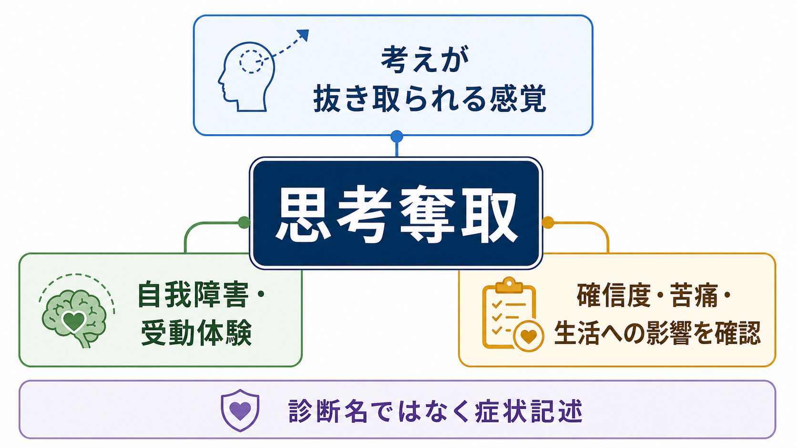
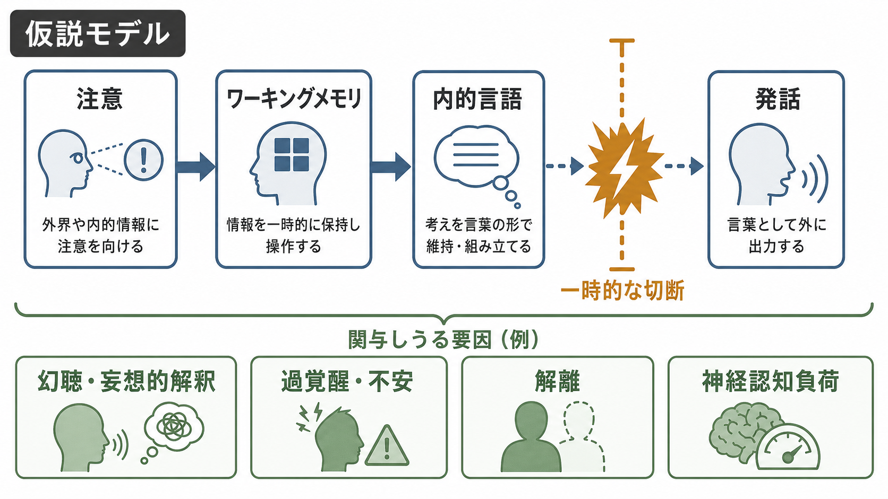
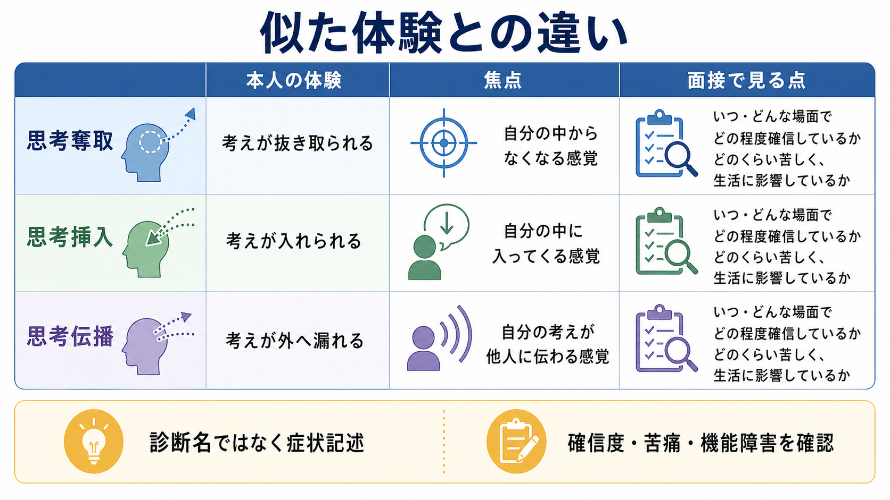

# 思考奪取とは何か

## 要点

- 思考奪取とは、「自分の考えが、外部の力・人物・装置などによって抜き取られる」と体験される症状である。英語では thought withdrawal と呼ばれ、思考挿入、思考伝播、思考吹入、思考途絶などとともに、思考の自己帰属が変化する現象として扱われる[1]。
- 古典的には Schneider の一級症状に含まれ、統合失調症の診断論で重視されてきた。ただし現在は、単独で診断を決める「決定的サイン」ではなく、[[精神症候学とは何か]]の面接で記述される症状の一つとして見る[1][2]。
- ICD-11 では、統合失調症の中核症状の一群として「影響・受動・支配の体験」が挙げられ、思考が外部の力に支配されるような体験もこの範囲に入る[2]。
- 臨床では、「本当に考えが抜かれたか」を論争するのではなく、本人にとっての現実感、確信度、苦痛、危険感、機能障害、他の[[妄想とは何か|妄想]]・[[幻覚とは何か|幻覚]]・気分症状・物質使用・身体疾患との関係を丁寧に確認する[3][4]。
- 本稿は教育・研究目的の整理であり、個別の診断や治療指示ではない。本人や周囲に切迫した危険、自傷他害の恐れ、著しい不眠や混乱がある場合は、地域の医療機関や緊急窓口に相談する。

## この記事で答える問い

1. 思考奪取とは、ふつうの「考えがまとまらない」「頭が真っ白になる」と何が違うのか。
2. なぜ「自分の考えなのに、自分のものではない」「外部に抜かれた」と感じられるのか。
3. 統合失調症、精神病性症状、自己障害、予測処理の研究とはどう接続できるのか。
4. 臨床面接では、どのような点を確認すればよいのか。

## まず結論

思考奪取を一文でいうなら、「思考内容が消える」だけでなく、「その消失が外部からの作用によって起きた」と体験される症状である。単なる忘却、注意散漫、疲労、沈黙、言葉の出にくさとは異なり、本人は「考えが奪われた」「頭から取り出された」「誰かが抜き取った」といった形で、思考の所有感と主体感の変化を語ることがある[1]。

ここで重要なのは、症状を「奇妙な信念」とだけ見ないことである。思考奪取には、少なくとも三つの層がある。

| 層 | 見るポイント | 例 |
|---|---|---|
| 思考内容の変化 | 考えが途切れる、空白になる、消える | 「途中で考えがなくなる」 |
| 自己帰属の変化 | それが自分の自然な思考過程として感じられない | 「自分で忘れた感じではない」 |
| 外部作用の確信 | 誰か・何かが抜き取ったと解釈される | 「外から持っていかれた」 |

この三層が強く結びつくと、思考奪取は[[妄想とは何か|妄想的確信]]や受動体験として目立つ。反対に、本人が「そう感じるが、変かもしれない」と距離を取れる場合、現象はより揺らぎをもった体験として記述される。

## 背景

思考奪取は、Schneider が統合失調症の一級症状として挙げた症状群の一部としてよく知られている。一級症状には、思考化声、第三者的な声、考想伝播、思考挿入・思考奪取、身体への受動体験、作為体験、妄想知覚などが含まれる[1]。これらに共通するのは、本人の内的体験、身体、行為、思考が「自分から出ている」という感覚を失い、外部から作られたり支配されたりするように感じられる点である。

ただし、現代の診断では、一級症状だけで統合失調症を機械的に判断しない。Cochrane レビューは、一級症状が歴史的に重視されてきた一方で、診断特異性や研究方法には限界があることを整理している[1]。また、ICD-11 でも、統合失調症は思考、知覚、自己体験、認知、意欲、感情、行動など複数の領域の障害として記述され、症状の持続、他疾患や物質の影響の除外、機能への影響を合わせて評価する[2]。

NIMH も、統合失調症の症状を精神病症状、陰性症状、認知症状に分け、精神病症状には[[幻覚とは何か|幻覚]]、[[妄想とは何か|妄想]]、思考障害が含まれると説明している[3]。思考奪取は、この広い意味での精神病性体験のうち、「思考が自分のものとして保たれない」という自己体験の変化に近い。

## 基本概念

### 思考奪取の定義

思考奪取は、思考が外部の主体や力によって取り去られると感じられる体験である。重要なのは、「考えが浮かばない」だけでは足りない点である。たとえば疲労、睡眠不足、不安、抑うつ、薬剤、せん妄、認知機能低下でも、考えがまとまらない、言葉が出ない、途中で考えが止まることはある。しかし思考奪取では、その停止や消失が「自分の中で自然に起きたこと」ではなく、「外部から抜き取られたこと」として意味づけられる[1]。

このため、思考奪取は[[侵入思考とは何か]]とは逆向きの体験として理解するとわかりやすい。侵入思考では、望まない思考が「入ってくる」。思考奪取では、自分の思考が「抜き取られる」。どちらも思考内容と自己帰属の境界が問題になるが、侵入思考は多くの場合「自分の中に浮かぶが嫌なもの」として体験されるのに対し、思考奪取では「外部作用によって奪われる」という確信が中心になりやすい。

### 関連する症状との違い

| 症状 | 典型的な訴え | 中心にある変化 |
|---|---|---|
| 思考奪取 | 「考えが抜き取られる」 | 思考が外部に取り去られる |
| 思考挿入 | 「考えを入れられる」 | 自分のものではない思考が入る |
| 思考伝播 | 「考えが周囲に漏れる」 | 思考が他者に知られる |
| 思考途絶 | 「途中で考えが止まる」 | 思考の流れが中断する |
| [[侵入思考とは何か|侵入思考]] | 「考えたくないことが浮かぶ」 | 不快な思考が自動的に浮かぶ |
| [[強迫観念とは何か|強迫観念]] | 「不合理だと思うが気になってしまう」 | 不安と中和行為が循環する |

この区別は、用語をきれいに分類するためだけではない。面接では、本人がその体験をどの程度「現実に起きている」と確信しているか、どのような外部作用を想定しているか、その結果どのような回避・確認・安全行動が起きているかを見る必要がある。

## 仕組み

### 1. 自我体験のゆらぎ

思考奪取を理解する一つの入口は、「自分の思考である」という当たり前の感覚がどのように保たれているかである。通常、考えは内容として意識されるだけでなく、「私が考えている」「私の中で起きている」という暗黙の自己帰属を伴う。自己障害の理論では、統合失調症スペクトラムにおいて、この最小限の自己感、つまり経験が自分に属しているという基礎的な感覚が揺らぐことがあると考えられてきた[5]。

Sass と Parnas は、統合失調症を自己障害、すなわち ipseity disturbance として捉える見方を提示した。この見方では、通常は背景に退いている自己の働きが過度に対象化されたり、自己が経験の源として感じられにくくなったりする[5]。思考奪取は、この理論だけで説明し尽くせるわけではないが、「考えている私」という感覚が弱まると、思考の中断や空白が外部作用として体験されやすくなる、という理解につながる。

### 2. 受動体験としての思考奪取

思考奪取は、受動体験または作為体験の一部としても整理できる。受動体験とは、感情、衝動、行動、身体感覚、思考などが、自分から生じたものではなく、外部の力によって起こされたと感じられる体験である。ICD-11 では、影響・受動・支配の体験が統合失調症の中核症状群に含まれ、思考が外部の力に支配される体験もその例として扱われる[2]。

この観点では、思考奪取は単なる「考えの量の低下」ではなく、「思考の能動性が失われる」現象である。本人にとっては、考えが自然に途切れたのではなく、誰かが介入した、装置が働いた、外部の力が頭の中に作用した、と感じられる。

### 3. 予測処理・予測誤差の観点

認知神経科学では、妄想や精神病性体験を、予測誤差、注意配分、学習、信念更新の異常として説明するモデルが提案されている。Corlett らは、妄想形成において予測誤差信号の乱れが関与しうることを示し、異常な注意配分や連合学習が信念形成に影響する可能性を論じた[6]。

この枠組みを思考奪取に当てはめるなら、思考の途切れ、内的感覚、違和感、偶然の出来事などに過剰な意味が付与され、それを説明する仮説として「考えを抜き取られた」という解釈が形成・強化される、という流れが考えられる。ただし、これは有力な説明候補であって、思考奪取の単一原因ではない。実際の症状は、睡眠、ストレス、孤立、気分、トラウマ、薬物、文化的文脈、対人関係、神経発達的要因などと絡み合う。

### 4. 異常サリエンスの観点

Kapur の異常サリエンス仮説では、ドパミン系の変調により、本来は中立的な外界刺激や内的表象に過剰な重要性が付与され、精神病性の意味づけが形成されると考えられた[7]。この見方では、思考の空白や違和感が「ただの疲労」ではなく「誰かが奪った証拠」として目立ち、周囲の出来事もそれを支持する手がかりとして結びつきやすくなる。

ただし、異常サリエンス仮説は精神病性体験全体を説明する大きなモデルであり、思考奪取だけを特異的に説明するものではない。臨床では、モデルを診断の代替にせず、本人の語り、生活史、現在のストレス、身体状態、薬物・アルコール、睡眠、リスクを合わせて評価する。

## 図解

この記事の図は、次の三つの観点をまとめている。

1. 概念地図：思考奪取を、体験、位置づけ、評価軸に分ける。
2. 仕組みの仮説：内的な思考の流れ、自己帰属のゆらぎ、外部作用としての解釈、確信の形成をつなぐ。
3. 比較図：思考奪取、思考挿入、思考伝播を区別する。

## 臨床・研究との接続

### 面接で確認すること

思考奪取が疑われるときは、用語を先に当てはめるより、本人の言葉で現象を聞く。たとえば次の点を確認する。

| 評価軸 | 確認する内容 |
|---|---|
| 体験の内容 | 何が、いつ、どのように「抜き取られる」と感じるのか |
| 外部作用の想定 | 誰が、何が、どのような方法で作用していると感じるのか |
| 確信度 | どの程度、本当に起きていると感じているか |
| 洞察・揺らぎ | 「そう感じるが違うかもしれない」という余地があるか |
| 苦痛 | 恐怖、不安、怒り、恥、混乱がどれくらいあるか |
| 行動への影響 | 回避、確認、対人不信、受診拒否、攻撃性、自傷念慮があるか |
| 併存症状 | [[幻聴とは何か|幻聴]]、[[被害妄想とは何か|被害妄想]]、[[関係妄想とは何か|関係妄想]]、気分症状、[[解離とは何か|解離]]、せん妄、物質使用など |

NICE の成人の精神病・統合失調症ガイドラインは、早期認識、包括的評価、本人と家族への支援、身体健康、心理社会的介入を含む管理を重視している[4]。思考奪取の評価でも、症状名を付けることだけでなく、その体験が生活、対人関係、安全、治療へのアクセスにどう影響しているかを把握する必要がある。

### 研究上の注意

思考奪取は、研究ではしばしば一級症状、受動症状、自己障害、精神病性体験の一部として扱われる。Herbener と Harrow は、思考挿入・思考奪取を含む受動症状の長期経過と機能的関連を検討し、自己体験の変化が幻覚・妄想など他の症状と関連しうることを示した[8]。このような研究は、思考奪取を単独の珍しい症状としてではなく、自己体験、陽性症状、機能転帰のネットワークの中で捉える視点を与える。

一方で、思考奪取は文化的表現、面接者の質問の仕方、翻訳語、診断体系によって記述が変わりやすい。したがって、研究では操作的定義、評価尺度、面接手順、対象集団を明確にする必要がある。

## よくある誤解

### 誤解1: 思考奪取があれば必ず統合失調症である

思考奪取は統合失調症で重要な症状として扱われてきたが、それ単独で診断が決まるわけではない。現代の診断では、症状の持続、複数領域の症状、機能障害、除外診断、経過を総合して判断する[2][3]。

### 誤解2: 本人が「考えを抜かれた」と言うなら、内容を否定すればよい

真正面から「それはありえない」と論破しても、苦痛や不信が強まることがある。臨床的には、「そう感じるほど切実な体験がある」ことを受け止めつつ、確信度、危険感、行動への影響、安全性を確認する。

### 誤解3: 思考奪取は単なる注意力低下である

注意力低下や[[認知機能障害とは何か|認知機能障害]]では、考えがまとまらない、作業記憶が保てない、言葉が出にくいことがある。しかし思考奪取では、思考の中断が「外部から奪われた」と体験される点が中心である。

### 誤解4: 症状名を聞き出すことが面接の目的である

症状名は記述の道具であり、本人の生活を理解する目的そのものではない。どのような場面で起きるのか、恐怖や回避を強めているのか、睡眠や薬物、孤立、家族関係、職場・学校のストレスとどう関係しているのかを合わせて見る必要がある。

## 関連ノート

- [[精神症候学とは何か]]
- [[妄想とは何か]]
- [[幻覚とは何か]]
- [[幻聴とは何か]]
- [[侵入思考とは何か]]
- [[強迫観念とは何か]]
- [[解離とは何か]]
- [[現実感消失とは何か]]
- [[認知機能障害とは何か]]
- [[症状と徴候は何が違うのか]]

### 今後の作成候補

- 思考挿入とは何か
- 思考伝播とは何か
- 作為体験とは何か
- 自我障害とは何か
- 統合失調症の一級症状とは何か

## 理解チェック

1. 思考奪取は、単なる「考えがまとまらない」状態とどこが違うか。
2. 思考奪取、思考挿入、思考伝播は、それぞれ思考のどの方向の変化を表しているか。
3. なぜ、思考奪取だけで統合失調症と診断してはいけないのか。
4. 面接で「考えを抜かれる」と語られたとき、確信度以外に何を確認する必要があるか。
5. 自己障害、予測誤差、異常サリエンスの説明は、それぞれ思考奪取のどの側面を理解する助けになるか。

## 参考文献

[1] Soares-Weiser K, Maayan N, Bergman H, et al. First rank symptoms for schizophrenia. *Cochrane Database of Systematic Reviews*. 2015. PMC full text. https://pmc.ncbi.nlm.nih.gov/articles/PMC7079421/

[2] Jauhar S, et al. Schizophrenia and catatonia: from ICD-10 to ICD-11. *Der Nervenarzt*. 2025. PMC full text. https://pmc.ncbi.nlm.nih.gov/articles/PMC12638403/

[3] National Institute of Mental Health. Schizophrenia. Revised 2024 / reviewed December 2024. https://www.nimh.nih.gov/health/publications/schizophrenia

[4] National Institute for Health and Care Excellence. Psychosis and schizophrenia in adults: prevention and management. NICE Clinical Guideline CG178. 2014. https://www.ncbi.nlm.nih.gov/books/NBK555203/

[5] Sass LA, Parnas J. Schizophrenia, consciousness, and the self. *Schizophrenia Bulletin*. 2003;29(3):427-444. https://pubmed.ncbi.nlm.nih.gov/14609238/

[6] Corlett PR, Murray GK, Honey GD, et al. Disrupted prediction-error signal in psychosis: evidence for an associative account of delusions. *Brain*. 2007;130(9):2387-2400. https://pmc.ncbi.nlm.nih.gov/articles/PMC3838942/

[7] Kapur S. Psychosis as a state of aberrant salience: a framework linking biology, phenomenology, and pharmacology in schizophrenia. *American Journal of Psychiatry*. 2003;160(1):13-23. https://doi.org/10.1176/appi.ajp.160.1.13

[8] Herbener ES, Harrow M. Course and symptom and functional correlates of passivity symptoms in schizophrenia: an 18-year multi-follow-up longitudinal study. *Psychological Medicine*. 2021;51(3):503-510. https://doi.org/10.1017/S0033291719003428

