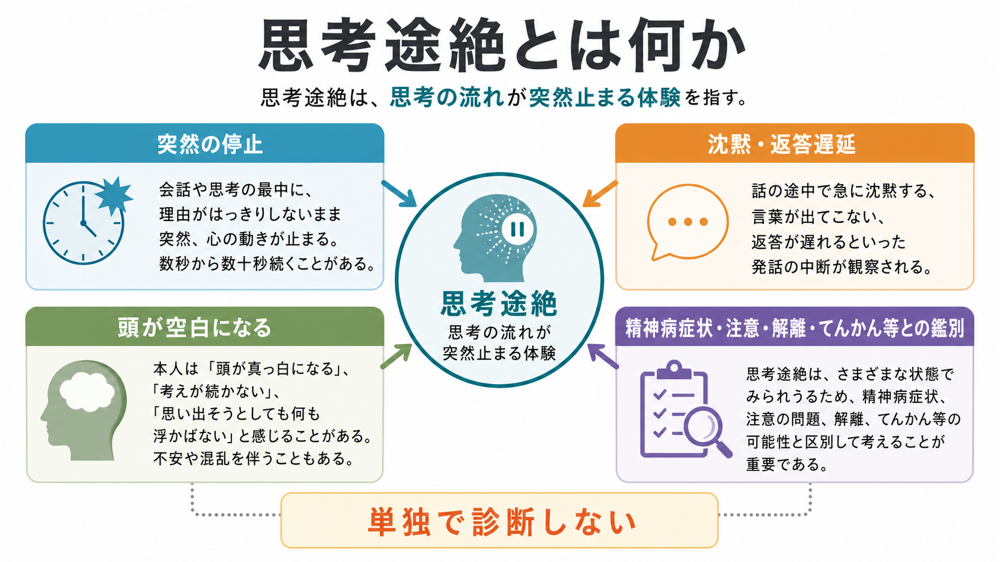

# 思考途絶とは何か

## 要点

- 思考途絶とは、思考や発話の流れが突然止まり、本人にも面接者にも「途中で切れた」ように見える症候である。MSEでは主に[[MSEで思考過程をどう評価するか|思考過程]]の所見として記述される[1]。
- 典型的には、話している途中で急に沈黙し、同じ話題へ戻れない、あるいは「頭が空白になった」と説明される。ただし、短い言いよどみや通常の注意散漫だけで思考途絶と決めるべきではない[1][2]。
- 統合失調症スペクトラムでよく論じられるが、思考途絶だけで診断は決まらない。[[幻聴とは何か|幻聴]]、[[妄想とは何か|妄想]]、解体した発話、陰性症状、気分症状、意識障害、物質使用、神経疾患などと合わせて評価する[2][3]。
- 研究上は、形式的思考障害の一部として、言語、意味処理、注意、ワーキングメモリ、実行機能、社会機能との関連が検討されている[4][5][7]。
- 本記事は教育・研究目的の整理であり、個別の診断や治療指示を行うものではない。

## この記事で答える問い

1. 思考途絶は、通常の「言葉に詰まる」「忘れる」と何が違うのか。
2. 臨床面接では、どのように観察し、どのように記録するのか。
3. どのような症状や状態と鑑別する必要があるのか。
4. 注意、ワーキングメモリ、言語、精神病症状の研究とどう接続するのか。

## まず結論

思考途絶は、**思考の内容**ではなく、**思考や発話の流れの途切れ方**を表す症候である。たとえば「誰かに見られている気がする」は思考内容の問題だが、話している途中で急に止まり、話題を再開できなくなる場合は思考過程の問題として記述される。

重要なのは、思考途絶を「嘘」「怠慢」「単なる沈黙」とみなさないこと、同時に「これがあれば統合失調症」と短絡しないことである。MSEでは、沈黙の長さ、前後の文脈、本人の主観、再開の仕方、注意や意識水準、幻聴・妄想との関係を具体的に記録する[1][2]。

## 背景

精神症候学では、話の内容だけでなく、話がどのような構造で進むかを観察する。[[MSEで思考過程をどう評価するか|思考過程]]には、迂遠、接線的、観念奔逸、連合弛緩、滅裂、保続、思考途絶などが含まれる[1]。

思考途絶は英語では *thought blocking* と呼ばれる。統合失調症のMSEでは、患者が文の途中で急に話すのをやめる所見として説明され、思考過程の解体や発話の中断として扱われる[2]。NIMHも統合失調症の「thought disorder」の例として、思考の途中で話すのを止める、話題が飛ぶ、意味のない語を作るといった現象を挙げている[3]。

ただし、形式的思考障害は統合失調症に限定される単一症状ではない。古典的なTLC尺度以降、思考・言語・コミュニケーションの障害は複数の下位項目からなる多次元構成概念として扱われてきた[4]。近年のレビューでも、形式的思考障害は言語、意味処理、実行機能、主観的体験、社会的コミュニケーションの交差点にある症候群として整理される[5]。

## 基本概念

### 思考途絶の中心

思考途絶の中心は、会話や内的思考の流れが「突然切れる」ことである。面接者からは、文の途中で発話が止まる、目線や表情が止まる、問いかけに対する応答が急に途切れる、促しても元の話題に戻りにくい、と観察されることがある[1][2]。

本人の主観としては、「何を言おうとしていたか消えた」「頭が真っ白になった」「急に言葉が出なくなった」と語られることがある。ただし、本人が説明できない場合もあり、観察所見と主観報告の両方を分けて記録する必要がある。

### 思考内容ではなく思考過程

思考途絶は[[妄想とは何か|妄想]]のような「何を信じているか」ではなく、「考えがどう流れ、どう中断するか」の問題である。そのため、同じ人に幻聴や妄想があっても、思考途絶そのものは別の観察軸として記述する。

### 通常の言いよどみとの違い

誰でも疲労、緊張、睡眠不足、プレッシャー、難しい質問で言葉に詰まる。思考途絶を疑うのは、通常の言いよどみよりも突然で、文脈上不自然で、本人が再開に困り、同じ話題へ戻れない、または反復的に起こる場合である。単発の沈黙を過剰に病的化しないことが重要である[1]。

## 仕組み

思考途絶の単一の確定機序はない。説明モデルとしては、少なくとも三つの水準を分けると理解しやすい。

第一に、注意とワーキングメモリの水準である。会話では、直前の質問、話題の文脈、言おうとしている内容、言葉への変換、相手の反応を一時的に保持する必要がある。[[注意障害とは何か|注意]]や[[認知機能障害とは何か|認知機能]]が不安定になると、この連鎖が途切れやすくなる。

第二に、言語・意味処理の水準である。形式的思考障害研究では、意味連想の拡散、抑制の弱さ、言語産出、実行機能との関係が検討されてきた[5]。思考途絶は、話が逸れるタイプの障害とは異なり、「次の語や文へ進む橋」が一時的に失われるように見える。

第三に、精神病症状や主観的体験の水準である。[[幻聴とは何か|幻聴]]、被注察感、妄想的解釈、強い不安、[[過覚醒とは何か|過覚醒]]があると、会話中の注意が内的刺激や脅威解釈へ吸い取られ、発話が止まることがある。KoutsoukosとAngelopoulosは、思考途絶を脳活動の時間的構造や協調の乱れという仮説から論じているが、これは研究仮説であり、個人の症状を単独で説明する確定機序ではない[8]。

## 図解

図1は、思考途絶を「突然の停止」「沈黙・返答遅延」「頭が空白になる」「鑑別」「単独で診断しない」という観点から整理した概念地図である。

図2は、注意、ワーキングメモリ、内的言語、発話出力の連鎖が一時的に途切れるという仮説モデルである。重要なのは、この図を「脳内で必ずこう起きる」という説明ではなく、観察と研究仮説をつなぐための作業モデルとして読むことである。

## 臨床・研究との接続

### 面接での観察

面接では、「思考途絶あり」とだけ書くより、何が起きたかを短く具体的に記録する方が有用である。

| 観察軸 | 確認すること | 記録例 |
|---|---|---|
| 中断の形 | 文の途中で急に止まるか、質問後に長く沈黙するか | 「家族の話題で文途中に約20秒沈黙」 |
| 再開 | 同じ話題に戻れるか、別話題へ移るか | 「促すと『何を言うか消えた』と述べ、別話題へ移行」 |
| 主観 | 頭が空白、声に邪魔される、考えを取られる感じがあるか | 「本人は『急に空白になる』と説明」 |
| 文脈 | 緊張、疲労、薬物、睡眠、意識、神経症状との関係 | 「睡眠不足時に増悪」 |
| 関連症状 | 幻聴、妄想、不安、解離、せん妄、てんかん様症状 | 「内的刺激への反応を伴う可能性」 |

### 鑑別で見る状態

思考途絶に似た現象は複数ある。

- [[せん妄とは何か|せん妄]]や意識障害では、注意の変動、見当識障害、覚醒水準の変化が目立つことがある。
- [[解離とは何か|解離]]では、自己感、記憶、現実感、身体感覚の統合が一時的にゆるみ、「空白」や切断として語られることがある。
- 強い不安やパニックでは、過覚醒、呼吸困難、身体感覚への注意集中により言葉が出にくくなることがある。
- てんかん、片頭痛、脳血管障害、薬物・アルコール、睡眠障害などでも、発話停止や一過性の応答困難が起こりうる。
- 失語、聴覚障害、言語の違い、発達特性、文化的な会話様式も考慮する必要がある。

このため、思考途絶は「診断名」ではなく、鑑別診断を進めるための観察所見である。

### 研究との接続

形式的思考障害は、統合失調症研究で長く扱われてきた。AndreasenのTLC尺度は、思考・言語・コミュニケーションの症状を信頼性高く記述するための基盤を作った[4]。その後の研究では、形式的思考障害が言語ネットワーク、意味処理、実行機能、神経認知、社会機能とどう関係するかが検討されている[5][7]。

双極症との比較を含むメタ分析では、急性期には形式的思考障害が診断横断的に出現しうる一方、安定期の持続的な障害や陰性形式的思考障害は統合失調症群で目立ちやすい可能性が示された[6]。これは、思考途絶を含む思考過程の症状を、単一診断の印としてではなく、経過、状態、重症度、機能への影響と合わせて見る必要を示している。

## よくある誤解

### 誤解1: 思考途絶があれば統合失調症である

そうではない。思考途絶は統合失調症スペクトラムで重要な所見になりうるが、単独で診断を決める所見ではない。診断には、症状のまとまり、期間、生活機能、気分症状、物質・身体疾患、発達歴、文化的背景などを総合する必要がある[2][3]。

### 誤解2: ただ黙っているだけである

沈黙だけなら、考えている、緊張している、話したくない、言葉を選んでいる、文化的に控えめに話している、という可能性がある。思考途絶として扱うには、突然性、文脈からの不自然さ、再開困難、本人の「空白」体験、反復性などを確認する。

### 誤解3: 本人が説明できなければ評価できない

本人の主観は重要だが、説明できないこともある。面接者は、発話の中断、促しへの反応、再開の仕方、視線や行動、内的刺激への反応らしさ、周囲情報を合わせて、観察事実として記述する。

### 誤解4: 研究モデルをそのまま臨床判断に使える

注意、言語ネットワーク、神経同期、ワーキングメモリなどのモデルは理解を助けるが、個人の症状の原因を一つに決めるものではない。研究知見は、面接、身体評価、経過観察、生活機能評価と統合して読む必要がある[5][8]。

## 関連ノート

既存ノート:

- [[精神症候学とは何か]]
- [[MSEで思考過程をどう評価するか]]
- [[MSEで話し方から何がわかるのか]]
- [[幻聴とは何か]]
- [[妄想とは何か]]
- [[注意障害とは何か]]
- [[認知機能障害とは何か]]
- [[せん妄とは何か]]
- [[解離とは何か]]
- [[過覚醒とは何か]]

今後の作成候補:

- 形式的思考障害とは何か
- 連合弛緩とは何か
- 滅裂思考とは何か
- 失語と思考障害はどう違うのか
- 精神病症状と思考過程はどう関係するのか

MOC更新候補:

- `content/00_MOC/` 配下の精神医学、症候学、精神科面接関連MOCに追加候補。並列ジョブとの競合を避けるため、本タスクではMOC本体を更新しない。

## 理解チェック

1. 思考途絶が「思考内容」ではなく「思考過程」の所見だと言える理由は何か。
2. 通常の言いよどみや緊張による沈黙と、思考途絶を区別する観察軸を三つ挙げられるか。
3. 思考途絶を見たとき、幻聴、解離、せん妄、てんかん、薬物・睡眠の影響を確認する理由は何か。
4. 形式的思考障害研究では、言語、注意、ワーキングメモリ、社会機能がどのように関係すると考えられているか。
5. 「思考途絶があるから統合失調症」と言い切れない理由を説明できるか。

## 未解決問題

- 思考途絶を、臨床面接だけでどの程度再現性高く測定できるのか。
- 言語産出の障害、注意の途切れ、幻聴への注意捕捉、解離的な空白体験を、どのように実証的に分けられるのか。
- 自然言語処理や音声解析は、思考途絶の検出を補助できるのか。その場合、文化差、言語差、プライバシー、過剰診断をどう扱うべきか。
- 思考途絶の頻度や持続時間は、生活機能、社会的コミュニケーション、再発リスクとどの程度関連するのか。

## 参考文献

[1] Voss, R. M., & Das, J. M. (2024). Mental Status Examination. *StatPearls*. NCBI Bookshelf. https://www.ncbi.nlm.nih.gov/books/NBK546682/

[2] Hany, M., & Rizvi, A. (2024). Schizophrenia. *StatPearls*. NCBI Bookshelf. https://www.ncbi.nlm.nih.gov/books/NBK539864/

[3] National Institute of Mental Health. (2024). *Schizophrenia*. https://www.nimh.nih.gov/health/publications/schizophrenia

[4] Andreasen, N. C. (1979). Thought, language, and communication disorders. I. Clinical assessment, definition of terms, and evaluation of their reliability. *Archives of General Psychiatry, 36*(12), 1315-1321. https://doi.org/10.1001/archpsyc.1979.01780120045006

[5] Kircher, T., Bröhl, H., Meier, F., & Engelen, J. (2018). Formal thought disorders: from phenomenology to neurobiology. *The Lancet Psychiatry, 5*(6), 515-526. https://doi.org/10.1016/S2215-0366(18)30059-2

[6] Yalincetin, B., Bora, E., Binbay, T., Ulas, H., Akdede, B. B., & Alptekin, K. (2017). Formal thought disorder in schizophrenia and bipolar disorder: A systematic review and meta-analysis. *Schizophrenia Research, 185*, 2-8. https://doi.org/10.1016/j.schres.2016.12.015

[7] Oeztuerk, O. F., Pigoni, A., Antonucci, L. A., & Koutsouleris, N. (2022). Association between formal thought disorders, neurocognition and functioning in the early stages of psychosis: a systematic review of the last half-century studies. *European Archives of Psychiatry and Clinical Neuroscience, 272*, 381-393. https://doi.org/10.1007/s00406-021-01295-3

[8] Koutsoukos, E., & Angelopoulos, E. (2018). Indication of disrupted temporal structure in the case of thought blocks in schizophrenia: The role of the metastable balance. *Behavioural Neurology, 2018*, 4031207. https://doi.org/10.1155/2018/4031207
