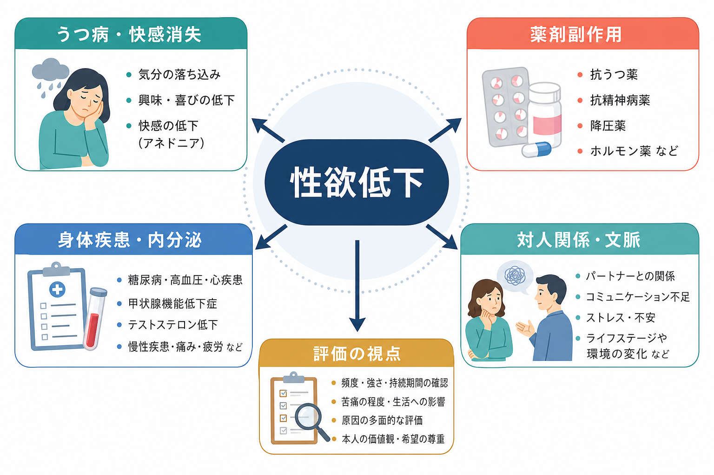
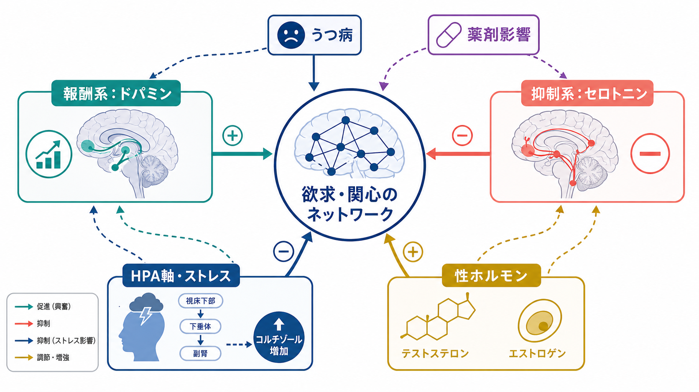
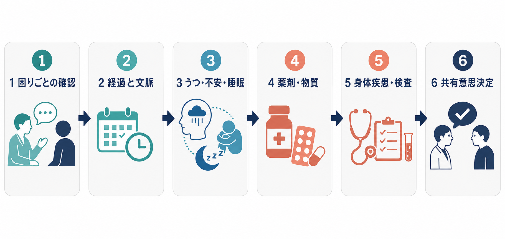

# 性欲低下とは何か

## 要点

- 性欲低下は、単に「性的活動の頻度が少ない」ことではなく、性的関心、性的思考、性的刺激への反応、性的活動を始めたい気持ちが本人の以前の状態や希望に比べて低下している状態を指す。
- 評価では、本人の苦痛、生活・関係への影響、発症時期、持続期間、状況依存性を確認する。ICD-11 では、性機能障害は数か月以上持続し、臨床的に意味のある苦痛を伴う場合に問題化される[1]。
- うつ病、抗うつ薬などの薬剤、内分泌・慢性疾患、痛み・疲労、睡眠、物質使用、対人関係、文化的背景が重なりやすい[2][3]。
- 精神科では、[[抑うつ気分とは何か]]、[[快感消失とは何か]]、[[意欲低下とは何か]]、[[睡眠障害とは何か]]、薬剤歴、身体合併症、関係の文脈を分けて聴く。
- 本ノートは教育・研究目的の整理であり、個別の診断や治療指示ではない。

## この記事で答える問い

1. 性欲低下は、精神症候学のなかでどのように位置づけられるか。
2. うつ病、薬剤副作用、身体疾患、対人関係要因はどのように見分けるか。
3. 面接では、何を、どの順序で、どの程度まで確認するか。

## まず結論

性欲低下は「性格」「年齢」「関係の冷え込み」だけで説明する症状ではない。性的欲求は、報酬系、気分、睡眠、疲労、ホルモン、痛み、薬剤、過去の体験、現在の関係性、文化的規範の影響を受ける。したがって臨床的には、[[生物心理社会モデルとは何か]]に沿って、身体・薬剤・精神症状・関係文脈を同時に見る必要がある[3]。

一方で、性欲の強さには個人差が大きい。本人が困っていない、関係上の強制や苦痛がない、生活機能に影響していない場合、それ自体を病理化しない。問題になるのは、本人にとって望ましくない変化であり、苦痛、対人関係上の困難、生活機能の低下を伴う場合である[1][4]。

## 背景

DSM-5-TR や ICD-11 では、性機能障害は「心理的か身体的か」を単純に二分するより、性反応のどの側面が困難か、どの程度持続し、本人の苦痛や対人関係に影響しているかを重視する[1][4]。女性では DSM-5 以降、欲求と興奮の重なりを反映して「女性の性関心・興奮障害」として扱われることがある。ICD-11 では「性欲低下機能障害」が、自然な性的思考・空想、性的刺激への反応、いったん始まった活動への関心維持の低下として記述される[1][4]。

精神科面接では、性欲低下はしばしば主訴として語られない。恥ずかしさ、医療者が尋ねないこと、治療上の優先度が低く見積もられることが理由になる[3][5]。しかし、性機能の変化はうつ病の症状、薬剤副作用、内分泌疾患、関係ストレス、治療アドヒアランスの低下を示す手がかりになる。

## 基本概念

### 欲求・興奮・快感を分ける

性欲低下を評価するときは、少なくとも次の三つを分ける。

| 観点 | 何を見るか | 関連する症候・評価 |
|---|---|---|
| 欲求 | 性的関心、性的思考、開始したい気持ち | うつ、疲労、薬剤、ホルモン、関係性 |
| 興奮 | 身体反応、刺激への反応、集中の維持 | 痛み、不安、薬剤、身体疾患 |
| 快感 | 喜び、満足、オーガズム、終わった後の感情 | [[快感消失とは何か]]、副作用、トラウマ、関係葛藤 |

この区別をしないと、「性欲がない」と言われたときに、実際には性的痛み、勃起・潤滑の問題、オーガズム困難、関係上の回避、抑うつ性の快感消失、疲労による余力低下が混ざってしまう。

### 症候として見る

性欲低下は、単独の診断名として扱う前に、[[精神症候学とは何か]]の観点から症候として記述する。記録では、次の情報が重要になる。

- 発症: 生涯続いているのか、以前は違ったのか。
- 経過: 急に始まったのか、徐々に進んだのか。
- 状況: すべての状況か、特定の相手・場面・刺激だけか。
- 苦痛: 本人が困っているのか、相手だけが困っているのか。
- 併存: 抑うつ、不安、睡眠障害、疼痛、疲労、物質使用があるか。
- 介入との関係: 薬剤開始・増量、身体疾患の悪化、関係変化と時間的に一致するか。

## 仕組み

### うつ病との関係

うつ病では、性欲低下は「興味・喜びの低下」「疲労」「睡眠障害」「自己評価の低下」「不安」と結びつきやすい。Merck Manual は、うつ病の症状として、集中困難、疲労、性的欲求の低下、以前楽しめていた活動への関心・喜びの低下、睡眠障害を挙げている[2]。この場合、性欲低下は単独の性機能障害というより、[[抑うつ気分とは何か]]、[[快感消失とは何か]]、[[精神運動制止とは何か]]と同じエピソード内で生じることがある。

ただし、うつ病が改善しても性欲低下が残る場合がある。背景には、抗うつ薬の副作用、関係の再調整、身体疾患、長期の回避行動などがありうる。したがって「うつのせい」と早く決めず、時間経過と治療歴を確認する。

### 薬剤副作用

性欲低下で特に重要なのは、薬剤開始・増量・変更との時間的関係である。抗うつ薬、とくに SSRI/SNRI などのセロトニン作動性薬剤では、性欲低下、興奮低下、オーガズム遅延などが問題になることがある。抗うつ薬関連性機能障害は自発的に報告されにくく、治療中断や服薬不遵守の理由にもなりうるため、医療者側から定期的に確認する必要がある[5]。これは[[薬剤性精神症状とは何か]]や[[アドヒアランスとは何か]]とも接続する。

抗精神病薬では高プロラクチン血症、鎮静、体重増加、陰性症状との鑑別が問題になる。降圧薬、抗アンドロゲン薬、5α還元酵素阻害薬、オピオイド、ホルモン療法なども候補になる。男性の性機能に関する Merck Manual は、性欲がテストステロン、全身状態、栄養、薬剤の影響を受けること、慢性腎臓病、糖尿病、ストレス、うつ、関係問題、さまざまな薬剤が性欲低下と関連しうることを整理している[6]。

### 身体疾患・内分泌

身体疾患では、内分泌疾患、糖尿病、慢性腎臓病、心血管疾患、慢性疼痛、がん治療後、神経疾患、睡眠障害、疲労が候補になる[3][6]。男性の性欲低下で低テストステロンが疑われる場合でも、Endocrine Society は、症状・徴候と一貫して低い血中テストステロン値の両方がある場合に診断し、早朝空腹時の測定を反復して確認することを推奨している[7]。値だけ、年齢だけ、広告的な「低 T」概念だけで治療適応を決めない。

女性では、月経、妊娠・産後、更年期、疼痛、性交痛、婦人科疾患、体像、トラウマ歴、関係性が重なりやすい。性機能や月経歴は精神科でも重要であり、[[性機能や月経歴はなぜ精神科で重要なのか]]、[[身体合併症は精神科診療でなぜ重要なのか]]と合わせて評価する。

### 対人関係・文脈

性欲は個人内の「量」だけでなく、関係のなかで経験される。関係の安全感、葛藤、コミュニケーション、性的同意、相手の性機能、妊娠や感染への不安、家事・育児・介護負担、文化的規範、身体イメージが影響する[3][8]。このため、本人の同意を前提に、関係の文脈、希望、境界、安心感を聞くことが重要である。

ここで注意したいのは、性欲の差そのものを病気としないことである。問題は、本人が望まない低下、苦痛、関係上の困難、強制や圧力、回避の固定化があるかどうかである。必要に応じて、[[治療関係とは何か]]、[[共同意思決定とは何か]]の枠組みで、本人の価値観と安全を中心に扱う。

## 図解

図のように、臨床評価では「困っている内容」を最初に具体化し、次に時間経過と状況依存性を確認する。そのうえで、うつ・不安・睡眠、薬剤・物質、身体疾患・検査を整理し、治療方針は共有意思決定で検討する。

## 臨床・研究との接続

### 面接での聞き方

性欲低下は聞き方によって語られやすさが大きく変わる。評価では、羞恥や責めを減らす導入が役立つ。

> 気分や薬の影響で、性欲や性的満足が変わることがあります。困っている変化があれば、差し支えない範囲で確認してもよいですか。

確認項目は、[[精神状態診察MSEとは何か]]の一部としてだけでなく、生活機能、身体合併症、服薬継続、関係性の評価として扱う。

| 評価領域 | 具体的に聞くこと |
|---|---|
| 本人の困りごと | 性的関心、思考、開始、興奮、快感、痛みのどれが困っているか |
| 時間経過 | いつから、何をきっかけに、持続か変動か |
| 気分・睡眠 | 抑うつ、快感消失、疲労、不安、睡眠、希死念慮 |
| 薬剤・物質 | 抗うつ薬、抗精神病薬、降圧薬、ホルモン薬、オピオイド、アルコールなど |
| 身体疾患 | 内分泌、糖尿病、慢性腎臓病、痛み、更年期、神経疾患、がん治療後 |
| 関係文脈 | 安全感、葛藤、同意、パートナーの問題、妊娠・感染への不安 |

### フォーミュレーション

性欲低下は、単一原因を探すより、[[5Pモデルとは何か]]や[[ケースフォーミュレーションとは何か]]で整理しやすい。

| 5P | 例 |
|---|---|
| Predisposing 素因 | 抑うつの既往、トラウマ歴、身体疾患、性に関する否定的学習 |
| Precipitating 誘因 | うつ病エピソード、薬剤開始、出産、更年期、関係葛藤、疾患発症 |
| Perpetuating 維持 | 回避、失敗予期、睡眠不足、痛み、コミュニケーション不足、副作用の放置 |
| Protective 保護 | 安全な関係、相談できる医療者、症状への理解、治療選択肢 |
| Presenting 現在像 | 苦痛の程度、状況依存性、生活・関係への影響 |

## よくある誤解

### 「性欲低下は年齢のせいで説明できる」

加齢とともに性欲や性反応が変化することはあるが、年齢だけで説明しない。急な変化、苦痛、生活機能低下、薬剤開始、身体疾患の悪化があれば評価対象になる。

### 「性欲が低い人は治療意欲も低い」

性欲低下は、抑うつ、疲労、薬剤、痛み、関係不安の結果であることがある。本人の意志や愛情の有無に短絡しない。

### 「抗うつ薬で性機能が変わっても我慢するしかない」

抗うつ薬関連性機能障害は珍しい話題ではなく、治療継続にも関わる[5]。ただし、自己判断で中止すると再燃や離脱症状のリスクがあるため、医療者と相談して選択肢を検討する。

### 「低テストステロンならすぐ補充すればよい」

男性低ゴナド症の診断は、症状・徴候と、反復確認された低テストステロン値の両方に基づく[7]。補充療法には禁忌や不妊への影響もあり、検査値だけで単純化しない。

## 関連ノート

- [[精神症候学とは何か]]
- [[抑うつ気分とは何か]]
- [[快感消失とは何か]]
- [[意欲低下とは何か]]
- [[睡眠障害とは何か]]
- [[薬剤性精神症状とは何か]]
- [[性機能や月経歴はなぜ精神科で重要なのか]]
- [[身体合併症は精神科診療でなぜ重要なのか]]
- [[生物心理社会モデルとは何か]]
- [[ケースフォーミュレーションとは何か]]
- [[共同意思決定とは何か]]
- [[精神科診断における除外診断とは何か]]

## 理解チェック

1. 性欲低下を評価するとき、性的活動の頻度だけで判断してはいけない理由は何か。
2. うつ病による性欲低下と、抗うつ薬関連性機能障害を区別するために確認すべき時間経過は何か。
3. 低テストステロンが疑われる場合、検査値だけで診断しない理由は何か。
4. 対人関係要因を聞くとき、本人の安全と同意を中心にする必要があるのはなぜか。

## 関連ノート候補

- 性欲亢進とは何か
- 抗うつ薬関連性機能障害とは何か
- 高プロラクチン血症と精神科薬物療法
- 性的同意と精神科面接
- 更年期と精神症状

## MOC更新候補

- `content/00_MOC/MOC｜症候学.md`
- `content/00_MOC/MOC｜総論・診断・面接.md`

※並列ジョブとの競合を避けるため、本タスクでは MOC 本体は更新していない。

## 未解決問題

- 性欲低下の神経基盤は、報酬系、ストレス系、性ホルモン、身体感覚、対人文脈が重なり、単一のバイオマーカーでは説明しにくい。
- DSM と ICD の分類は臨床上の整理に役立つが、文化差、関係性、ジェンダー、性的指向、無性愛スペクトラムをどのように尊重して評価するかは慎重な検討を要する。
- 薬剤副作用への対応は、症状改善、再発予防、本人の性生活上の価値、パートナー関係を含む共有意思決定が必要である。

## 参考文献

[1] World Health Organization. ICD-11 MMS: Sexual dysfunctions / Hypoactive sexual desire dysfunction. https://icd.who.int/browse/2025-01/mms/en

[2] Merck Manual Professional Edition. Depressive Disorders. Reviewed/Revised 2025. https://www.merckmanuals.com/professional/psychiatric-disorders/mood-disorders/depressive-disorders

[3] Pettigrew J, Novick AM. An Overview of Hypoactive Sexual Desire Disorder: Physiology, Assessment, Diagnosis, and Treatment. *Journal of Midwifery & Women's Health*. 2021;66(6):740-748. https://pmc.ncbi.nlm.nih.gov/articles/PMC8673442/

[4] Merck Manual Professional Edition. Sexual Interest/Arousal Disorder. Reviewed/Revised 2023. https://www.merckmanuals.com/professional/gynecology-and-obstetrics/female-sexual-function-and-dysfunction/sexual-interest-arousal-disorder

[5] Montejo AL, Montejo L, Navarro-Cremades F. Management Strategies for Antidepressant-Related Sexual Dysfunction: A Clinical Approach. *Journal of Clinical Medicine*. 2019;8(10):1640. https://pmc.ncbi.nlm.nih.gov/articles/PMC6832699/

[6] Merck Manual Professional Edition. Overview of Male Sexual Function and Dysfunction. Reviewed/Revised 2024. https://www.merckmanuals.com/professional/genitourinary-disorders/male-sexual-function-and-dysfunction/overview-of-male-sexual-function-and-dysfunction

[7] Bhasin S, Brito JP, Cunningham GR, et al. Testosterone Therapy in Men With Hypogonadism: An Endocrine Society Clinical Practice Guideline. *Journal of Clinical Endocrinology & Metabolism*. 2018;103(5):1715-1744. https://doi.org/10.1210/jc.2018-00229

[8] Tabatabaie A, et al. Biopsychosocial Determinants of Hypoactive Sexual Desire in Women: A Narrative Review. *Materia Socio Medica*. 2015;27(6):383-389. https://pmc.ncbi.nlm.nih.gov/articles/PMC4733555/
