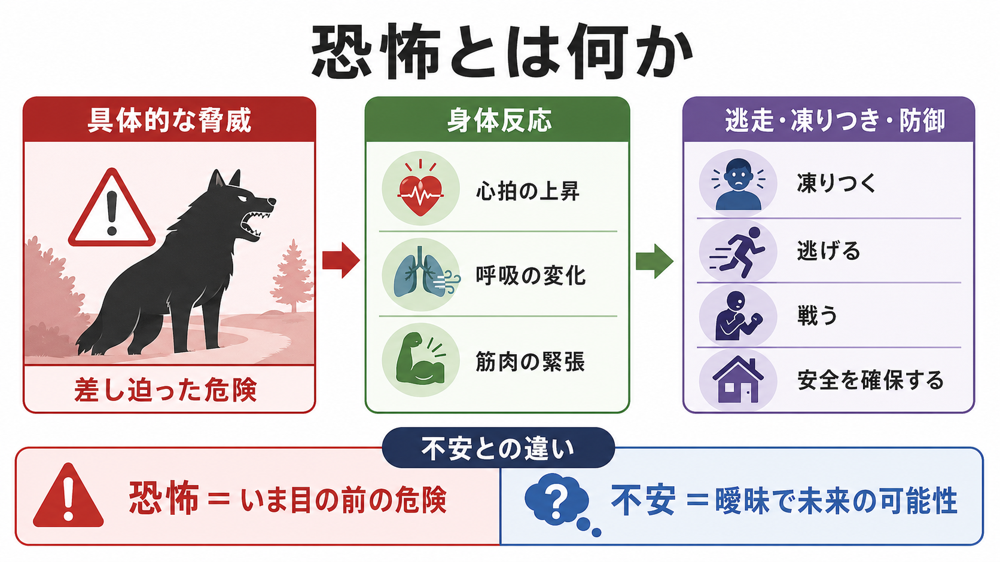
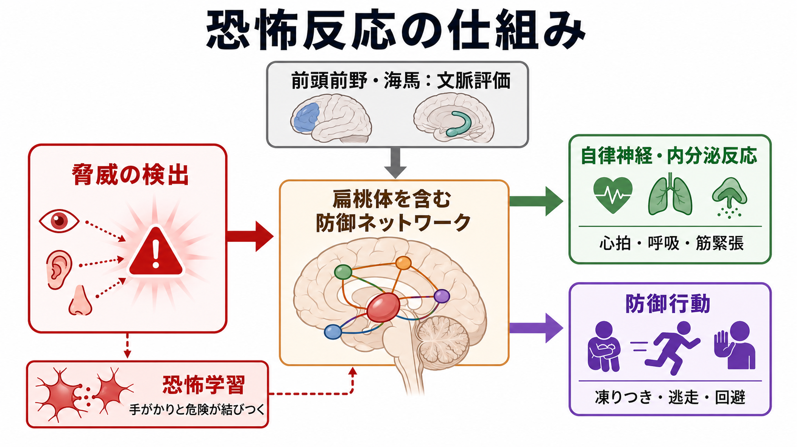

# 恐怖とは何か

## 要点

- 恐怖は、**いま目の前にある、または数秒から数分以内に迫る具体的な脅威**に対して、防御行動を準備する反応である。NIMH の RDoC では、恐怖は「急性脅威」、不安は「潜在的脅威」として区別される[1]。
- 不安は、危険が曖昧、未来的、不確実、または低確率であるときに、警戒やリスク評価が持続する状態として理解しやすい[1][2]。
- 恐怖反応には、主観的体験、注意の脅威への偏り、心拍・呼吸・筋緊張などの身体反応、凍りつき・逃走・防御・回避などの行動が含まれる[2][3]。
- 扁桃体を含む防御ネットワークは重要だが、「扁桃体だけが恐怖を作る」と考えるのは単純化しすぎである。前頭前野、海馬、視床下部、中脳水道周囲灰白質、自律神経系などが、文脈と行動を含む回路として働く[3][4]。
- 臨床では、正常な恐怖、限局性恐怖症、パニック、トラウマ関連反応を区別する。この記事は教育・研究目的の整理であり、個別診断や治療指示ではない。

## この記事で答える問い

1. 恐怖は、不安、心配、パニックと何が違うのか。
2. 恐怖は身体と行動にどのように現れるのか。
3. 扁桃体、前頭前野、海馬などの回路は恐怖反応にどう関わるのか。
4. 臨床・研究では、恐怖をどのように評価し、恐怖症や PTSD と接続して考えるのか。

## まず結論

恐怖とは、**「危険がここにある」と判断されたとき、身体と行動をすばやく防御モードへ切り替える反応**である。たとえば、車が急に近づく、犬が歯をむいて走ってくる、注射針を目の前にする、暗い道で背後から足音が迫る、といった場面では、注意が脅威に固定され、心拍が上がり、筋肉が緊張し、逃げる・固まる・防御する準備が起こる。

一方、不安は「危険が起こるかもしれないが、まだ具体的でない」状態で持続しやすい。明日の発表で失敗するかもしれない、検査結果が悪いかもしれない、また発作が起きるかもしれない、というように、未来・不確実性・予測困難性が中心になる。恐怖と不安は重なるが、区別の軸は「対象が具体的か」「危険が差し迫っているか」「反応が急速か持続的か」である[1][2]。

## 背景

日常語では、恐怖、不安、心配、パニックはしばしば混同される。しかし精神医学・神経科学では、これらを同じ「こわさ」として扱うだけでは不十分である。恐怖は、防御行動をすばやく選ぶための反応であり、不安は不確実な危険を探索し続ける反応として整理できる。

RDoC の Negative Valence Systems では、恐怖は Acute Threat、つまり急性脅威への反応として位置づけられる。ここでの恐怖は、条件づけられた脅威刺激または無条件の脅威刺激に対する適応的反応であり、恐怖条件づけ、驚愕反応、皮膚電気反応、心拍、回避、凍りつきなどで測定される[1]。この見方は、[[恐怖条件づけとは何か]]や動物研究と、人間の主観的体験を接続する入口になる。

ただし、恐怖研究には概念上の論争もある。LeDoux と Pine は、防御行動や自律神経反応を支える回路と、本人が「怖い」と報告する意識体験の回路を区別する二システム枠組みを提案した[5]。これに対して、Fanselow らは恐怖を統合的な防御反応として捉える立場から批判している[6]。したがって本記事では、「恐怖」を単なる扁桃体反応にも、単なる主観的感情にも還元せず、**脅威評価、身体反応、防御行動、主観的体験が結びついた多層的な反応**として扱う。

## 基本概念

### 恐怖、不安、心配、パニック

恐怖と不安の区別は、完全な二分法ではなく、臨床的な整理軸である。

| 用語 | 中心になるもの | 時間 | 典型的な反応 |
|---|---|---|---|
| 恐怖 | 具体的で差し迫った脅威 | 急速・短時間 | 凍りつき、逃走、防御、身体反応 |
| 不安 | 曖昧で未来的な危険可能性 | 持続しやすい | 警戒、リスク評価、回避、反すう |
| 心配 | 言語的・思考的な予測 | 持続しやすい | 「もし〜なら」という思考の反復 |
| パニック | 急激な身体感覚と破局的解釈 | 数分単位で急上昇 | 動悸、息苦しさ、死ぬかもしれない感覚 |

恐怖は「危険が近い」ときに行動を狭める。不安は「危険があるかもしれない」ときに探索を広げる。パニックは[[パニック発作とは何か]]と重なるが、必ずしも外的脅威が明確とは限らず、身体感覚そのものが脅威として解釈されることがある。

### 正常な恐怖と病的な恐怖

恐怖は本来、危険から身を守るために必要な反応である。高所で足がすくむ、車道に飛び出しそうになって身を引く、火や刃物を慎重に扱う、といった恐怖は安全行動に役立つ。

問題になるのは、恐怖が実際の危険に比べて過剰で、避ける必要のない場面まで避け、生活や学業・仕事・対人関係を狭めるときである。限局性恐怖症では、特定の対象や状況に対して強い恐怖または不安が起こり、ほぼ常に即時の恐怖反応を引き起こし、回避や強い苦痛を伴う。DSM-5-TR の診断基準では、恐怖・不安・回避が実際の危険や文化的文脈に比べて不釣り合いで、通常 6 か月以上持続し、臨床的苦痛や機能障害をもたらすことが重視される[7]。

## 仕組み

恐怖反応は、単一のスイッチではなく、脅威の検出、文脈評価、身体反応、防御行動、記憶学習が連動する過程である。

### 1. 脅威の検出

視覚、聴覚、嗅覚、身体感覚などの入力から、危険を示す手がかりが検出される。突然の大きな音、怒った顔、鋭い痛み、息苦しさ、近づいてくる物体などは、注意を強く引きつける。ここでは「本当に危険か」を細かく吟味する前に、身体を守る準備が始まることがある。

### 2. 防御ネットワークの起動

扁桃体は、脅威手がかりと防御反応の結びつきに重要である。とくに[[扁桃体回路は情動をどう処理するのか]]で扱われるように、扁桃体は感覚入力、文脈情報、身体反応、学習を結びつける結節点として働く。ただし、恐怖反応は扁桃体単独では完結しない。海馬は文脈、前頭前野は評価や制御、中脳水道周囲灰白質は防御行動、視床下部や脳幹は自律神経・内分泌反応に関与する[3][4]。

このため、[[前頭前野は情動制御にどう関わるのか]]や[[扁桃体過活動は不安症やPTSDにどう関わるのか]]のようなノートと接続して読むと、「恐怖＝扁桃体」という単純な図式を避けやすい。

### 3. 身体反応

恐怖では、心拍の上昇、呼吸の変化、発汗、筋緊張、瞳孔反応、胃腸の違和感などが起こりうる。これらは本人にとって「怖い感じ」の一部になることもあれば、身体感覚そのものがさらに脅威として解釈されることもある。ここは[[身体と感情はどのようにつながるのか]]や[[ノルアドレナリン系は不安と覚醒にどう関わるのか]]とも関係する。

### 4. 防御行動

恐怖時の行動は、必ずしも「逃げる」だけではない。脅威との距離、逃げ道の有無、制御可能性、過去の学習によって、凍りつき、逃走、回避、接近して確認する、防御姿勢をとる、助けを求める、といった行動が選ばれる。Mobbs らは、脅威との距離や切迫性に応じて防御行動が変化する生態学的なモデルを提案している[4]。

### 5. 恐怖学習と消去

恐怖は学習される。たとえば、犬に噛まれた経験の後に犬の姿や吠え声が恐怖を呼ぶように、手がかりと危険が結びつく。恐怖条件づけでは、中立刺激が嫌悪刺激と結びつき、後にその刺激だけで防御反応が起こるようになる。消去学習では、恐怖手がかりが安全に経験されることで「危険ではない」という新しい学習が形成される。曝露療法の現代的理解では、単に恐怖が下がることより、脅威予測が更新され、安全学習が複数の文脈で取り出せることが重要とされる[8]。

## 図解

1枚目は、恐怖を「具体的な脅威」「身体反応」「防御行動」「不安との違い」に分ける概念地図である。恐怖は危険への即時反応として、心拍・呼吸・筋緊張を伴い、凍りつき・逃走・防御につながる。

2枚目は、脅威検出から防御ネットワーク、自律神経・内分泌反応、防御行動へ進む流れを示している。前頭前野と海馬による文脈評価も入れることで、恐怖反応が単純な反射ではなく、状況評価と学習に影響されることを示している。

3枚目は、恐怖と不安の見分け方を、対象、時間、反応、行動の軸で比較している。臨床では、恐怖と不安を完全に切り離すより、どちらが前景か、どの程度重なっているかを見る。

## 臨床・研究との接続

### 精神状態診察で見るポイント

精神状態診察では、恐怖を「本人が怖いと言っているか」だけでなく、表情、視線、姿勢、声、回避、動作、身体反応、思考内容から観察する。ここは[[精神症候学とは何か]]や[[MSEで外観と行動から何を観察するか]]とつながる。

確認したいのは、少なくとも次の点である。

| 観察軸 | 確認すること |
|---|---|
| 脅威の対象 | 何を怖がっているのか。対象は具体的か、曖昧か |
| 切迫性 | いま目の前の危険か、未来の可能性か |
| 身体反応 | 動悸、息苦しさ、発汗、筋緊張、震え |
| 行動 | 回避、逃走、凍りつき、安全確認、助けを求める行動 |
| 文脈 | トラウマ想起、身体疾患、物質、薬剤、睡眠不足 |
| 機能障害 | 学校、仕事、家庭、対人関係、移動範囲への影響 |

### 限局性恐怖症

限局性恐怖症では、動物、高所、血液・注射・外傷、飛行機、閉所など、特定の対象や状況が強い恐怖を引き起こす。恐怖の対象が具体的で、曝露時にほぼ即時に反応が起こる点は、恐怖の臨床像として分かりやすい。ただし診断では、恐怖が実際の危険に比べて不釣り合いで、持続し、生活上の支障をもたらすかを確認する必要がある[7]。

### パニックと恐怖

パニック発作では、動悸、息苦しさ、めまい、震え、胸部不快感などが急に高まり、「死ぬのではないか」「気が変になるのではないか」といった破局的解釈が起こることがある。ここでは、外界の危険というより、身体感覚や発作そのものが脅威として評価される。恐怖と不安の境界があいまいになりやすい領域である。

### PTSD と恐怖記憶

トラウマ関連反応では、過去の危険が現在に侵入するように感じられ、手がかりが急性脅威として体験されることがある。[[PTSDでは恐怖記憶ネットワークに何が起きているのか]]では、恐怖記憶、文脈、回避、過覚醒のつながりを扱う。ここでも、現在の安全と過去の危険がどのように混線しているかを丁寧に見る必要がある。

### 研究での測定

研究では、恐怖は自己報告だけでなく、皮膚電気反応、心拍、驚愕反応、瞳孔、表情筋、回避行動、反応時間、脳画像などで測定される[1][3]。動物研究では防御行動や条件づけ、人間研究では主観報告や生理指標を組み合わせる。ただし、LeDoux と Pine の議論が示すように、防御行動の指標をそのまま「主観的な怖さ」と同一視することには注意が必要である[5]。

## よくある誤解

### 誤解1: 恐怖は弱さである

恐怖は危険から身を守るための基本的な反応であり、弱さではない。問題は、恐怖が現実の危険に比べて過剰になり、生活を過度に狭めるときである。

### 誤解2: 恐怖と不安は同じである

重なりは大きいが、恐怖は具体的・差し迫った脅威、不安は曖昧・未来的・不確実な脅威と結びつきやすい[1][2]。この区別は、評価、研究デザイン、心理教育で役立つ。

### 誤解3: 扁桃体が反応すれば恐怖である

扁桃体は重要だが、恐怖体験や防御行動は分散した回路から生じる。前頭前野、海馬、視床下部、脳幹、自律神経系、身体感覚のフィードバックを含めて見る必要がある[3][4]。

### 誤解4: 曝露は「怖さに慣れる」だけである

曝露で重要なのは、単に怖さが下がることだけではない。恐怖手がかりに対して「予想した危険が起きない」「別の安全な意味づけが可能である」という抑制学習が形成され、複数の文脈で取り出せることが重要である[8]。

## 関連ノート

- [[精神症候学とは何か]]
- [[MSEで外観と行動から何を観察するか]]
- [[恐怖条件づけとは何か]]
- [[扁桃体回路は情動をどう処理するのか]]
- [[扁桃体過活動は不安症やPTSDにどう関わるのか]]
- [[前頭前野は情動制御にどう関わるのか]]
- [[身体と感情はどのようにつながるのか]]
- [[ノルアドレナリン系は不安と覚醒にどう関わるのか]]
- [[パニック発作とは何か]]
- [[PTSDでは恐怖記憶ネットワークに何が起きているのか]]

## MOC更新候補

- `content/00_MOC/MOC｜精神医学.md` の「症候学」または「不安・恐怖関連症状」周辺に追加候補。
- `content/00_MOC/MOC｜脳・神経科学.md` があれば、「情動・防御行動」周辺に追加候補。
- 並列ジョブとの衝突を避けるため、このタスクでは MOC 本体は更新しない。

## 理解チェック

1. 恐怖と不安を区別するとき、対象の具体性、時間的切迫性、反応の持続性はどのように違うか。
2. 「扁桃体だけが恐怖を作る」という説明には、どのような限界があるか。
3. 限局性恐怖症を考えるとき、正常な恐怖との違いとして何を確認する必要があるか。
4. 曝露療法を「恐怖が下がるまで我慢する」とだけ説明すると、どの点が不足するか。

## 未解決問題

- 防御行動を支える神経回路と、本人が報告する主観的な恐怖体験をどの程度同じ枠組みで扱えるか。
- 急性脅威、潜在的脅威、持続的脅威の区別が、診断分類や治療選択にどこまで直接役立つか。
- 恐怖条件づけ、消去学習、曝露療法の知見を、個人ごとのトラウマ歴、発達、身体疾患、文化的文脈にどう統合するか。

## 参考文献

[1] National Institute of Mental Health. *RDoC Domain and Construct Definitions: Negative Valence Systems*. https://www.nimh.nih.gov/research/research-funded-by-nimh/rdoc/definitions-of-the-rdoc-domains-and-constructs

[2] Davis, M., Walker, D. L., Miles, L., & Grillon, C. (2010). Phasic vs sustained fear in rats and humans: Role of the extended amygdala in fear vs anxiety. *Neuropsychopharmacology*, 35, 105-135. https://doi.org/10.1038/npp.2009.109

[3] Tovote, P., Fadok, J. P., & Lüthi, A. (2015). Neuronal circuits for fear and anxiety. *Nature Reviews Neuroscience*, 16(6), 317-331. https://doi.org/10.1038/nrn3945

[4] Mobbs, D., Hagan, C. C., Dalgleish, T., Silston, B., & Prévost, C. (2015). The ecology of human fear: Survival optimization and the nervous system. *Frontiers in Neuroscience*, 9, 55. https://doi.org/10.3389/fnins.2015.00055

[5] LeDoux, J. E., & Pine, D. S. (2016). Using neuroscience to help understand fear and anxiety: A two-system framework. *American Journal of Psychiatry*, 173(11), 1083-1093. https://doi.org/10.1176/appi.ajp.2016.16030353

[6] Fanselow, M. S., & Pennington, Z. T. (2018). A return to the psychiatric dark ages with a two-system framework for fear. *Behaviour Research and Therapy*, 100, 24-29. https://pmc.ncbi.nlm.nih.gov/articles/PMC5794606/

[7] Samra, C. K., Torrico, T. J., & Abdijadid, S. (2024). Specific Phobia. *StatPearls*. NCBI Bookshelf. https://www.ncbi.nlm.nih.gov/books/NBK499923/

[8] Craske, M. G., Treanor, M., Conway, C. C., Zbozinek, T., & Vervliet, B. (2014). Maximizing exposure therapy: An inhibitory learning approach. *Behaviour Research and Therapy*, 58, 10-23. https://doi.org/10.1016/j.brat.2014.04.006
