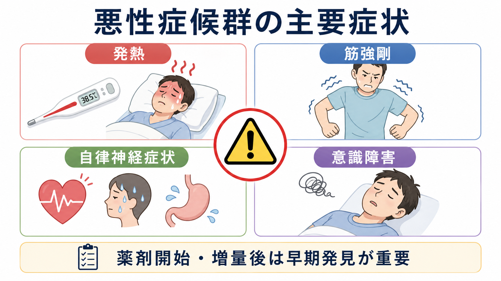
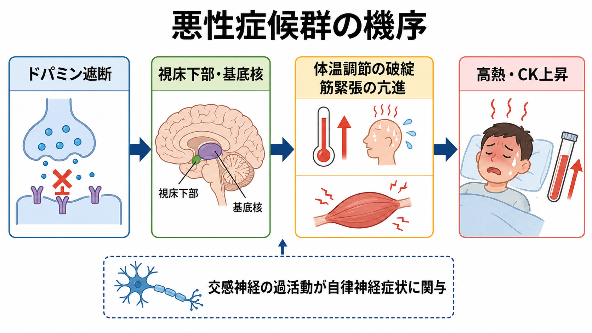
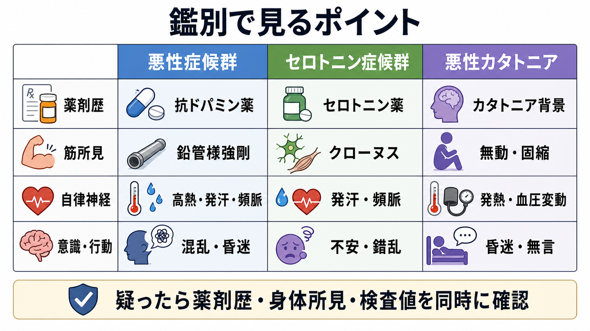

---
title: "悪性症候群ではどのような症状が出るのか"
description: "悪性症候群の主要症状、発症機序、鑑別の見方を、発熱・筋強剛・自律神経症状・意識障害を中心に整理する。"
aliases:
  - "悪性症候群ではどのような症状が出るのか"
  - "悪性症候群"
  - "neuroleptic malignant syndrome"
  - "NMS"
tags:
  - 精神医学/症候学
  - 精神医学/薬剤性症候群
  - 臨床神経学
  - obsidian
created: "2026-04-28"
updated: "2026-04-28"
draft: true
publish: false
status: draft
enableToc: true
---

# 悪性症候群ではどのような症状が出るのか

## 要点

- 悪性症候群 neuroleptic malignant syndrome; NMS は、ドパミン遮断作用をもつ薬剤の開始・増量、またはドパミン作動薬の急な中断のあとに起こりうる、まれだが重篤な薬剤性症候群である [1][2]。
- 中心になる症状は、発熱、筋強剛、自律神経症状、意識障害である [1][2][3]。
- 検査では CK 上昇、白血球増多、腎機能障害、ミオグロビン尿などが診断を支える所見になる [1][2]。
- [[せん妄とは何か]]、[[意識障害とは何か]]、[[カタトニアとは何か]]、セロトニン症候群、感染症、熱中症などと重なって見えるため、薬剤歴と身体所見を同時に読む必要がある [2][4][5]。
- 本記事は教育・研究目的の整理であり、個別の診断や治療指示ではない。疑われる場合は緊急性の高い医学的評価が必要である。

## この記事で答える問い

悪性症候群を「発熱を伴う副作用」とだけ覚えると、早期の意識変容や筋緊張、自律神経の変動を見落としやすい。この記事では、どの症状が中核で、なぜそれらが一つの症候群としてまとまって出現するのかを整理する。

## まず結論

悪性症候群は、発熱、鉛管様と表現される全身性の筋強剛、頻脈・血圧変動・発汗などの自律神経症状、混乱から昏迷までの意識障害が、薬剤歴と結びついて現れる病態である [1][2][3]。典型例では数日かけて悪化し、筋強剛による横紋筋融解、CK 上昇、腎障害へ進むことがある [2][6]。

ただし、すべての症状が同時にそろうとは限らない。非定型抗精神病薬、身体疾患、脱水、興奮、拘束、感染などが重なると、発熱や筋強剛の見え方は変わる。したがって「薬剤歴、体温、筋緊張、意識状態、自律神経所見、CK」をセットで見ることが重要になる [1][4]。

## 背景

悪性症候群は、抗精神病薬などのドパミン D2 受容体遮断薬に関連して記載されてきた。現在では、制吐薬などの抗ドパミン作用をもつ薬剤や、パーキンソン病治療薬などドパミン作動薬の急な減量・中止でも起こりうると理解されている [1][2]。

発生頻度は高くないが、見逃すと横紋筋融解、急性腎障害、呼吸不全、不整脈などにつながる。厚生労働省の重篤副作用疾患別対応マニュアルでも、早期発見と早期対応が強調されている [1]。

## 基本概念

悪性症候群の症状は、次の四つに分けると理解しやすい。

| 領域 | 代表的な症状・所見 | 読み方 |
|---|---|---|
| 発熱 | 38度以上の発熱、しばしば高熱 | 感染症だけでなく薬剤性の体温調節破綻を考える |
| 筋症状 | 全身性筋強剛、振戦、嚥下困難、無動 | 筋強剛が強いほど CK 上昇や横紋筋融解に注意する |
| 自律神経症状 | 頻脈、血圧上昇・変動、頻呼吸、発汗、尿失禁 | 体温・循環・発汗の不安定さとして現れる |
| 意識・精神状態 | 不穏、混乱、せん妄、昏迷、無言 | [[せん妄とは何か]]や[[意識障害とは何か]]との接点で見る |

診断基準には複数の形式があり、DSM 系の整理では、ドパミン遮断薬への曝露、強い筋強剛、発熱を主要条件とし、発汗、嚥下困難、振戦、意識水準変化、頻脈、血圧変動、白血球増多、CK 上昇などを補助所見として扱う [2]。国際 Delphi 法によるコンセンサス研究でも、薬剤曝露、発熱、筋強剛、精神状態変化、CK 上昇、交感神経不安定性などが重視されている [3][7]。

## 仕組み

代表的な説明は、中枢ドパミン機能の急な低下である。D2 受容体遮断、またはドパミン作動薬の急な中断により、視床下部、基底核、皮質・辺縁系の調節が乱れ、体温調節、筋緊張、意識状態、自律神経活動に影響が及ぶと考えられている [2][4][8]。これは[[ドパミン仮説は統合失調症をどこまで説明できるのか]]で扱うドパミン系とは異なり、薬理作用と急性身体症状の関係として読む必要がある。

筋強剛が続くと、筋活動の増大と筋障害により CK が上昇し、ミオグロビン尿や腎機能障害につながることがある [1][2]。一方で、悪性症候群のすべてをドパミン遮断だけで説明できるわけではなく、交感神経系の過活動、骨格筋カルシウム調節、個体側の脆弱性も関与すると考えられている [2][4]。

## 図解

症状の読み方は「一つの決め手」ではなく、複数所見の束として考える。

| 確認する軸 | 悪性症候群で重要な問い |
|---|---|
| 時間経過 | 抗精神病薬などの開始、増量、注射剤、併用、ドパミン作動薬中断のあとか |
| 運動所見 | 鉛管様筋強剛、無動、振戦、嚥下困難があるか |
| 体温・自律神経 | 高熱、頻脈、頻呼吸、発汗、血圧変動があるか |
| 意識状態 | 不穏、混乱、せん妄、昏迷、無言があるか |
| 検査 | CK、白血球、腎機能、電解質、尿ミオグロビンはどうか |
| 鑑別 | 感染症、セロトニン症候群、悪性カタトニア、熱中症、中枢神経疾患を除外できるか |

## 臨床・研究との接続

臨床的には、悪性症候群は「抗精神病薬の副作用」という狭い枠だけでは足りない。制吐薬などの抗ドパミン薬、複数薬剤併用、脱水、身体拘束、興奮、感染、電解質異常、パーキンソン病治療薬の中断などが、発症や重症化の背景になりうる [1][2][4]。

研究上は、悪性症候群は薬理学、運動制御、自律神経、体温調節、[[カタトニアとは何か]]との境界問題が交差する症候群である。セロトニン症候群との比較では、セロトニン症候群はセロトニン作動薬変更後により急速に出現し、クローヌスや腱反射亢進などの過反射性の神経筋所見が目立つ。一方、悪性症候群では筋強剛と反応低下が中心になりやすい [5]。セロトニン系の基礎は[[セロトニンは気分だけに関わるのか]]とも接続できる。

悪性カタトニアとの関係も難しい。両者は発熱、自律神経不安定性、意識・行動変化、筋緊張異常を共有しうるが、悪性症候群ではドパミン遮断薬への曝露が強い手がかりになる [6]。

## よくある誤解

### 「高熱がなければ悪性症候群ではない」

典型例では発熱が重要だが、発症初期や非典型例では症状がそろわないことがある。薬剤歴、筋強剛、意識変化、CK 上昇、自律神経不安定性を合わせて判断する [2][7]。

### 「抗精神病薬だけが原因である」

抗精神病薬が代表的だが、メトクロプラミドなど抗ドパミン作用をもつ薬剤、またドパミン作動薬の急な中断でも起こりうる [1][2]。

### 「せん妄やカタトニアと完全に別物である」

実際には、[[せん妄とは何か]]、[[意識障害とは何か]]、[[カタトニアとは何か]]と臨床像が重なる。鑑別は、薬剤歴、神経筋所見、検査値、時間経過を組み合わせる作業になる [5][6]。

### 「CK が高ければ必ず悪性症候群である」

CK 上昇は重要な支持所見だが、けいれん、筋損傷、拘束、激しい興奮、横紋筋融解症などでも上昇する。CK は診断の一部であり、単独の決め手ではない [1][2]。

## 関連ノート

- [[カタトニアとは何か]]
- [[せん妄とは何か]]
- [[意識障害とは何か]]
- [[ドパミン仮説は統合失調症をどこまで説明できるのか]]
- [[セロトニンは気分だけに関わるのか]]

## 関連ノート候補

- 抗精神病薬の副作用
- セロトニン症候群とは何か
- 横紋筋融解症とは何か
- 薬剤性パーキンソニズムとは何か
- 自律神経症状とは何か

## MOC更新候補

- `content/00_MOC/` 配下の精神医学・症候学・薬剤性副作用関連 MOC に、本記事へのリンクを追加する候補。
- 並列ジョブとの競合を避けるため、本タスクでは MOC ファイルは更新しない。

## 理解チェック

1. 悪性症候群の四つの中核症状は何か。
2. 悪性症候群で CK が上昇する理由を、筋強剛と関連づけて説明できるか。
3. セロトニン症候群との鑑別で、神経筋所見はどのように違いやすいか。
4. 悪性カタトニアとの鑑別で、薬剤歴がなぜ重要になるか。

## 未解決問題

- 非定型抗精神病薬関連の悪性症候群では、古典的な「発熱・筋強剛」がどの程度そろわないのか。
- 悪性カタトニアと悪性症候群は、別個の病態なのか、連続したカタトニア・ドパミン調節異常スペクトラムなのか。
- 個体側の遺伝的脆弱性、脱水、炎症、身体的ストレスがどのように閾値を下げるのか。

## 参考文献

[1] 厚生労働省. 重篤副作用疾患別対応マニュアル 悪性症候群. 令和4年2月時点修正. https://www.mhlw.go.jp/topics/2006/11/dl/tp1122-1j25.pdf

[2] Simon LV, Hashmi MF, Callahan AL. Neuroleptic Malignant Syndrome. *StatPearls*. Last Update: 2023 Apr 24. https://www.ncbi.nlm.nih.gov/books/NBK482282/

[3] Gurrera RJ, Caroff SN, Cohen A, et al. An International Consensus Study of Neuroleptic Malignant Syndrome Diagnostic Criteria Using the Delphi Method. *Journal of Clinical Psychiatry*. 2011;72(9):1222-1228. https://doi.org/10.4088/JCP.10m06438

[4] Berman BD. Neuroleptic Malignant Syndrome: A Review for Neurohospitalists. *The Neurohospitalist*. 2011;1(1):41-47. https://doi.org/10.1177/1941875210386491

[5] Simon LV, Torrico TJ, Keenaghan M. Serotonin Syndrome. *StatPearls*. Last Update: 2024 Mar 2. https://www.ncbi.nlm.nih.gov/books/NBK482377/

[6] Iyer V, Spurling BC, Rizvi A. Catatonia. *StatPearls*. Last Update: 2025 Dec 13. https://www.ncbi.nlm.nih.gov/books/NBK430842/

[7] Gurrera RJ, Mortillaro G, Velamoor V, Caroff SN. A Validation Study of the International Consensus Diagnostic Criteria for Neuroleptic Malignant Syndrome. *Journal of Clinical Psychopharmacology*. 2017;37(1):67-71. https://doi.org/10.1097/JCP.0000000000000640

[8] Wijdicks EFM, Ropper AH. Neuroleptic Malignant Syndrome. *New England Journal of Medicine*. 2024;391(12):1130-1138. https://doi.org/10.1056/NEJMra2404606

