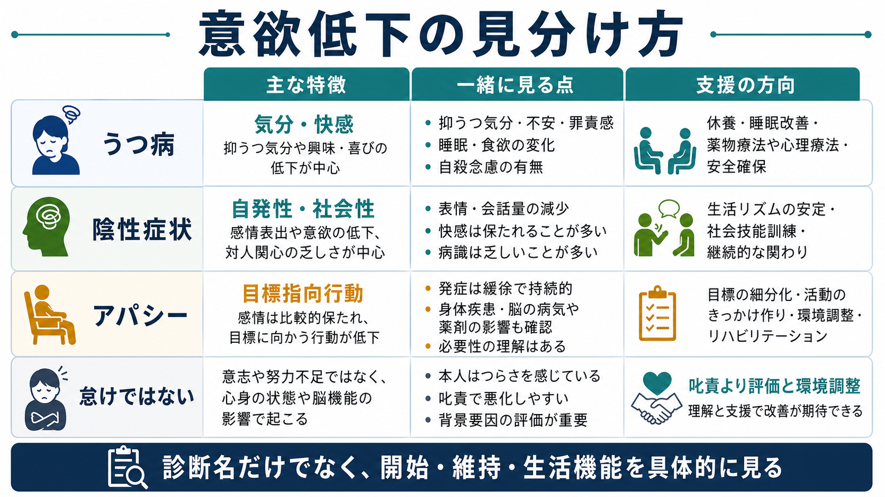

# 意欲低下とは何か

## 要点

- 意欲低下とは、単に「やる気がない」ことではなく、行動を開始し、目的に向けて維持し、必要に応じて調整する力が低下した状態である。
- うつ病では、抑うつ気分、興味・喜びの低下、疲労感、睡眠や食欲の変化などと結びつきやすい[1][2]。
- 統合失調症では、陰性症状のうち「意欲・快楽・社会性」の領域、とくに自発的で目標指向的な活動の低下として問題になる[3][4]。
- アパシーは、神経疾患や精神疾患を横断してみられる「目標指向行動の量的低下」として整理され、抑うつや疲労とは区別して評価する必要がある[5][6]。
- 臨床では、本人の訴えだけでなく、生活機能、行動開始、行動維持、環境、薬剤、身体疾患、認知機能を合わせて評価する。

## この記事で答える問い

1. 意欲低下は、怠けや性格の問題と何が違うのか。
2. うつ病の意欲低下と、統合失調症の陰性症状としての意欲低下はどう違うのか。
3. 報酬、努力コスト、予測、実行機能は、意欲低下をどう説明するのか。
4. 臨床や研究では、意欲低下をどのように観察し、支援につなげるのか。

## まず結論

意欲低下は、「本人が十分に努力していない」という道徳的評価ではなく、行動を生み出す仕組みのどこかに負荷がかかっている状態である。行動は、目標の価値を見積もる、必要な努力や時間を見積もる、成功の見込みを予測する、段取りを組む、行動を始めて維持する、結果に応じて修正する、という複数の過程から成り立つ。意欲低下は、この連鎖のどこか、あるいは複数箇所が弱くなったときに現れる。

うつ病では、興味・喜びの低下、疲労、自己評価の低下、睡眠障害などが、行動を始める力を下げる。統合失調症の陰性症状では、快感の予測、努力に見合う価値の保持、社会的活動への自発性などが低下し、生活機能に強く影響することがある[3][4]。アパシーでは、気分の落ち込みが目立たなくても、目標指向行動そのものが減ることがある[5][6]。

## 背景

精神科面接では、「何もする気が起きない」「寝てばかりいる」「仕事や家事に取りかかれない」「好きだったことにも手が伸びない」といった訴えがよく出てくる。これらは似て見えるが、背景は同じではない。抑うつ気分が中心のこともあれば、睡眠不足、疼痛、貧血、甲状腺機能異常、薬剤の鎮静、物質使用、認知機能障害、孤立した環境、慢性ストレスが主因になっていることもある。

診断分類上も、意欲低下は単独の診断名ではない。ICD-11 CDDR は、うつ病エピソードや統合失調症を臨床的に同定するための記述を与えるが、個々の症状は診断名に閉じ込められない[1]。NICE の成人うつ病ガイドラインも、うつ病を、低い気分だけでなく、興味・喜びの喪失、疲労、身体・認知・行動症状を含む広い症候群として扱っている[2]。したがって意欲低下は、[[精神症候学とは何か]]や[[精神状態診察MSEとは何か]]の文脈で、具体的な行動として記述する必要がある。

## 基本概念

### 意欲低下を行動の言葉で見る

意欲低下を評価するときは、「やる気」という内面語だけで止めず、次の問いに分ける。

| 観点 | 見ること | 例 |
|---|---|---|
| 行動開始 | 最初の一歩を出せるか | 起床、着替え、食事、外出、連絡 |
| 行動維持 | 始めた行動を続けられるか | 作業を途中でやめる、予定を完了できない |
| 目標設定 | 何をしたいか、何が必要かを思い描けるか | 将来の予定、治療参加、学業・仕事の目標 |
| 快感・興味 | 活動に価値や楽しみを感じるか | 趣味、対人交流、達成感 |
| 努力コスト | 行動がどれほど重く感じられるか | 簡単な作業が過大に感じられる |
| 生活機能 | 実生活への影響 | 家事、セルフケア、通院、就労、学業 |

この整理は、[[認知機能障害とは何か]]や[[実行機能障害とは何か]]とも関係する。意欲低下に見えても、実際には計画、注意、記憶、切り替え、処理速度の低下が前面にあることがある。

### うつ病との関係

うつ病では、意欲低下は「興味・喜びの低下」「疲労感」「精神運動制止」「集中困難」と重なりやすい。NICE は成人うつ病を、肯定的感情の乏しさ、通常の活動への興味や楽しみの喪失、低い気分、感情・認知・身体・行動症状のまとまりとして記述している[2]。そのため、うつ病の意欲低下では、単に活動量が減るだけでなく、「やっても意味がない」「楽しめない」「疲れきっている」「失敗する気がする」といった認知や気分が行動開始を妨げる。

ただし、意欲低下があるからうつ病とは限らない。気分の落ち込みが弱い、罪責感や希死念慮が乏しい、身体疾患や薬剤の影響が強い、認知症やパーキンソン病など神経疾患の文脈がある場合には、アパシーや身体・神経学的要因も検討する。

### 陰性症状との関係

統合失調症の陰性症状は、通常あるはずの表出、発話、社会性、快感、目標指向行動が減る症状群である。レビューでは、陰性症状は「動機づけ・興味」と「言語/情動表出」の二つの大きな領域に分けられることが多く、意欲低下は前者に深く関わる[3][4]。代表的には、アボリション、アンヘドニア、アソーシャリティ、感情鈍麻、アロギアが挙げられる[3]。

重要なのは、陰性症状には一次性と二次性がある点である。一次性の陰性症状は疾患過程とより直接に関係すると考えられる。一方、二次性の陰性症状は、幻覚妄想への反応、抑うつ、不安、薬剤の鎮静や錐体外路症状、環境刺激の乏しさ、社会的孤立、身体疾患などから生じうる[3]。支援可能性を見逃さないためには、[[鑑別診断とは何か]]の視点が不可欠である。

### アパシーとの関係

アパシーは、神経精神医学では「動機づけの低下」と「目標指向行動の低下」を中心に定義される。脳機構のレビューでは、アパシーは目標指向行動の障害として整理され、価値、コスト、行動選択、前頭葉-基底核回路などが関与すると考えられている[5]。神経認知障害における診断基準のコンセンサスでは、少なくとも4週間持続または反復し、以前の行動から低下し、主導性、興味、情動表出/反応性の低下のいずれかを含み、機能障害をもたらすことが重視される[6]。

アパシーは抑うつと重なることがあるが、同じではない。抑うつでは苦痛、悲哀、罪責感、絶望感が前面に出やすい。アパシーでは、本人が強い悲しみを訴えないまま、開始、興味、反応性が落ちることがある。ここを混同すると、「気分は落ち込んでいないから問題ない」または「うつ病としてだけ扱えばよい」という誤りにつながる。

## 仕組み

意欲低下の仕組みを一つの脳部位や一つの神経伝達物質に還元することはできない。より実用的には、行動までの連鎖をいくつかの計算過程として見る。

1. 報酬価値を見積もる  
その行動で何が得られるか、どの程度意味があるかを評価する。NIMH RDoC の報酬価値構成概念では、将来の結果の確率や利益を、過去経験や社会的文脈などと照合して計算する過程が重視される[7]。

2. 努力コストを見積もる  
行動に必要な体力、時間、認知的負荷、社会的負荷を評価する。うつ病研究では、快感そのものだけでなく、報酬を得るために努力する意思決定の障害が「動機づけ性アンヘドニア」として注目されている[8]。

3. 期待を保持する  
今すぐ快感がなくても、後で意味があると見込めるかが重要である。統合失調症の動機づけ・快楽領域では、目の前の快感だけでなく、予期的快感、報酬表象、行動計画の維持が問題になると整理されている[4]。

4. 実行機能で行動に変換する  
価値があっても、段取りを組み、開始し、途中で修正できなければ行動にはならない。ここでは[[実行機能障害とは何か]]、注意、作業記憶、処理速度、環境の手がかりが関わる。

この観点から見ると、「やりたい気持ちはあるが動けない」「やる意味が感じられない」「始めればできるが始められない」「始めても続かない」は、同じ意欲低下でも別の場所に問題がある。臨床的には、この違いが支援方針を左右する。

## 図解

上の1枚目は、意欲低下を「行動開始・行動維持」「疾患横断的な症状」「評価と鑑別」の三つの入口から整理している。2枚目は、報酬価値、努力コスト、予測、実行機能が、行動開始と維持に変換される流れを示している。

3枚目は、うつ病、陰性症状、アパシー、怠けという誤解を分けるための比較図である。実際の面接では、診断名だけでなく、「いつから」「どの生活場面で」「本人はどう感じているか」「周囲からはどう見えるか」「薬剤や身体疾患はないか」を具体的に聞く。

## 臨床・研究との接続

### 評価では生活機能を中心に置く

意欲低下の評価は、「気持ち」を尋ねるだけでは不十分である。睡眠、食事、入浴、服薬、通院、金銭管理、家事、学業、就労、対人交流、余暇活動など、生活機能のどこが変化したかを確認する。本人が低下を自覚しにくい場合もあるため、同意を得たうえで家族や支援者から情報を得ることもある。

評価の軸は、[[精神科診断面接で尺度をどう使うか]]にも関係する。うつ病尺度、陰性症状尺度、アパシー尺度、認知機能評価、生活機能評価は、それぞれ測っているものが違う。尺度は診断を自動化する道具ではなく、観察を構造化する補助線である。

### 鑑別では二次的要因を外さない

意欲低下を見たとき、少なくとも次を確認する。

| 領域 | 確認すること |
|---|---|
| 気分症状 | 抑うつ気分、興味・喜びの低下、罪責感、希死念慮 |
| 精神病症状 | 幻覚妄想、被害的解釈、混乱、緊張病症状 |
| 薬剤 | 鎮静、錐体外路症状、抗コリン作用、過量服薬 |
| 身体疾患 | 貧血、内分泌疾患、感染、慢性疼痛、神経疾患 |
| 睡眠・疲労 | 不眠、過眠、睡眠時無呼吸、過労 |
| 認知機能 | 注意、実行機能、記憶、処理速度 |
| 環境 | 孤立、刺激の乏しさ、役割喪失、過剰な叱責 |

特に統合失調症では、一次性の陰性症状だけでなく、抑うつ、陽性症状、薬剤副作用、社会的孤立による二次性の意欲低下を分けて考えることが、支援可能性を広げる[3]。

### 支援は「気合い」ではなく行動設計にする

意欲低下への支援では、叱責や説得だけでは効果が乏しいことが多い。行動開始の手がかりを外部化する、活動を小さく分ける、時間帯を固定する、環境を整える、成功しやすい課題から始める、報酬や意味づけを見える化する、疲労や睡眠を調整する、といった行動設計が重要になる。

うつ病では、心理教育、活動記録、行動活性化、睡眠調整、薬物療法や心理療法の検討が関係する。陰性症状では、薬剤副作用や二次性要因を見直しつつ、認知機能、社会機能、生活支援、家族支援を含めた長期的な介入が必要になる。ここでは[[心理教育とは何か]]や[[生物心理社会モデルとは何か]]の視点が役立つ。

## よくある誤解

### 誤解1: 意欲低下は怠けである

怠けという言葉は、本人の選択や道徳性を評価する言葉であり、臨床的な観察としては粗すぎる。意欲低下では、本人が困っていても開始できない、必要性を理解していても維持できない、価値を感じにくい、努力コストが過大に感じられる、段取りが組めない、ということが起こる。

### 誤解2: 気分が落ち込んでいなければ問題ではない

抑うつ気分が目立たなくても、アパシー、陰性症状、認知機能障害、身体疾患、薬剤の影響で行動量が低下することがある。逆に、気分の落ち込みが強くても、行動量が保たれる人もいる。気分と行動は関連するが、同じものではない。

### 誤解3: 好きなことだけできるなら病的ではない

一部の活動だけできることは、意欲低下を否定しない。活動ごとに、報酬価値、努力コスト、失敗予測、対人負荷、環境手がかりが違うためである。むしろ「どの活動なら始められるか」は、支援設計の重要な情報になる。

### 誤解4: 診断名が決まれば意欲低下の意味も決まる

同じうつ病でも、疲労、罪責感、精神運動制止、不眠、痛み、社会的孤立のどれが前面かで支援は変わる。同じ統合失調症でも、一次性陰性症状、抑うつ、薬剤副作用、陽性症状による回避では対応が異なる。診断名は入口であり、症候の記述は別に必要である。

## 関連ノート

- [[精神症候学とは何か]]
- [[精神状態診察MSEとは何か]]
- [[認知機能障害とは何か]]
- [[実行機能障害とは何か]]
- [[鑑別診断とは何か]]
- [[精神科診断面接で尺度をどう使うか]]
- [[心理教育とは何か]]
- [[生物心理社会モデルとは何か]]

## MOC更新候補

- [[MOC・精神医学]] または症候学系MOCに、「意欲低下」をうつ病、陰性症状、アパシー、生活機能評価をつなぐ入口ノートとして追加候補。
- 統合失調症、うつ病、認知機能障害、精神状態診察の各MOCがある場合は、相互参照候補。

## 理解チェック

1. 意欲低下を「行動開始」「行動維持」「報酬価値」「努力コスト」に分けると、何が見えやすくなるか。
2. うつ病の意欲低下と、統合失調症の陰性症状としての意欲低下で、評価上とくに異なる点は何か。
3. アパシーと抑うつを区別するとき、気分、苦痛、興味、行動、情動反応をどのように見るか。
4. 薬剤、身体疾患、睡眠、認知機能、環境は、意欲低下をどのように二次的に悪化させるか。
5. 「怠け」と決めつけずに支援するには、どのような行動設計が考えられるか。

## 未解決問題

- 意欲低下を、本人の主観、観察される行動、デジタル指標、神経認知課題の間でどう対応づけるか。
- うつ病、統合失調症、神経認知障害、神経疾患にまたがる意欲低下を、共通機構と疾患固有機構にどう分けるか。
- 一次性陰性症状と二次性陰性症状を、臨床現場で再現性高く区別する方法をどう改善するか。
- 報酬価値、努力コスト、予測、実行機能のどこを標的にすると、生活機能の改善につながりやすいか。

## 参考文献

[1] World Health Organization. (2024). *Clinical descriptions and diagnostic requirements for ICD-11 mental, behavioural and neurodevelopmental disorders*. WHO. https://www.who.int/publications/i/item/9789240077263

[2] National Institute for Health and Care Excellence. (2022). *Depression in adults: treatment and management* (NICE Guideline NG222). https://www.ncbi.nlm.nih.gov/books/NBK583074/

[3] Correll, C. U., & Schooler, N. R. (2020). Negative symptoms in schizophrenia: A review and clinical guide for recognition, assessment, and treatment. *Neuropsychiatric Disease and Treatment, 16*, 519-534. https://pmc.ncbi.nlm.nih.gov/articles/PMC7041437/

[4] Kring, A. M., & Barch, D. M. (2014). The motivation and pleasure dimension of negative symptoms: Neural substrates and behavioral outputs. *European Neuropsychopharmacology, 24*(5), 725-736. https://pmc.ncbi.nlm.nih.gov/articles/PMC4020953/

[5] Husain, M., & Roiser, J. P. (2018). Neuroscience of apathy and anhedonia: A transdiagnostic approach. *Nature Reviews Neuroscience, 19*, 470-484. https://pmc.ncbi.nlm.nih.gov/articles/PMC6518466/

[6] Miller, D. S., Robert, P., Ereshefsky, L., Adler, L., Bateman, D., Cummings, J., DeKosky, S. T., et al. (2021). Diagnostic criteria for apathy in neurocognitive disorders. *Alzheimer's & Dementia, 17*(12), 1892-1904. https://pmc.ncbi.nlm.nih.gov/articles/PMC8835377/

[7] National Institute of Mental Health. (n.d.). *Reward Valuation: RDoC construct*. https://www.nimh.nih.gov/research/research-funded-by-nimh/rdoc/constructs/reward-valuation

[8] Treadway, M. T., Bossaller, N. A., Shelton, R. C., & Zald, D. H. (2012). Effort-based decision-making in major depressive disorder: A translational model of motivational anhedonia. *Journal of Abnormal Psychology, 121*(3), 553-558. https://pmc.ncbi.nlm.nih.gov/articles/PMC3730492/
