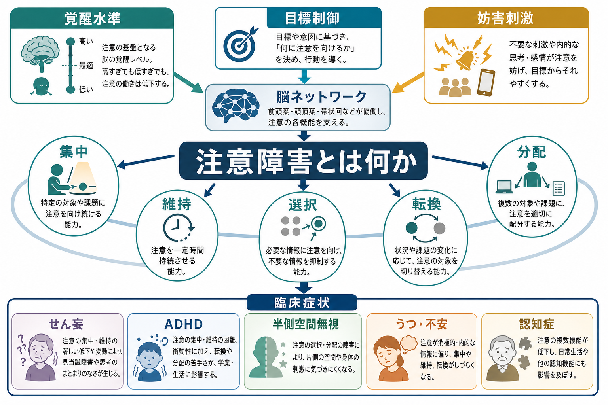

# 意識障害とは何か

## 要点

- 意識障害とは、単に「眠そう」な状態ではなく、**覚醒水準**、**外界への応答性**、**注意・見当識**、**意識内容へのアクセス**が急性または持続的に障害された状態を指す。
- 神経内科では、昏睡、植物状態/無反応覚醒症候群、最小意識状態などを、覚醒と意識内容の2軸で整理することが多い[1][2]。
- 精神科では、せん妄のように注意と意識の変動が中心になる病態が重要であり、幻覚・妄想・興奮だけを見て一次性精神疾患と決めつけないことが必要である[5][6]。
- 急性の意識障害では、診断名より先に低酸素、低血糖、感染、脳卒中、頭部外傷、てんかん、薬物・アルコール、代謝異常などの可逆的または緊急性の高い原因を考える。
- 本稿は教育・研究目的の整理であり、個別症例の診断や治療指示ではない。

## この記事で答える問い

1. 「意識が悪い」とは、覚醒・注意・応答性・意識内容のどの低下を指すのか。
2. 昏睡、傾眠、昏迷、せん妄、遷延性意識障害はどこが違うのか。
3. 精神科面接で見える意識障害と、神経内科・救急で評価する意識障害はどう接続するのか。
4. 意識障害を見たとき、どのような誤解を避けるべきか。

## まず結論

意識障害は、**覚醒しているか**と**意味のある応答・体験が保たれているか**を分けて考えると理解しやすい。たとえば昏睡では覚醒そのものが大きく低下し、開眼や目的的応答が乏しい。一方、植物状態/無反応覚醒症候群では睡眠覚醒周期や開眼が見られることがあるが、持続的・再現性のある意識的応答は確認しにくい。最小意識状態では、追視、命令への反応、意味のある発声など、限られていても意識の証拠が反復して観察される[1][2][4]。

精神科で重要なのは、せん妄のように「覚醒が完全に失われていないのに、注意・見当識・認知が急性に変動する」状態である。せん妄は幻覚、妄想、不穏、抑うつ、無気力のように見えることがあり、[[精神状態診察MSEとは何か]]だけで一次性精神疾患と判断すると、感染、薬物、代謝異常、低酸素、脳疾患を見逃す危険がある[5][6]。

したがって意識障害を見たときの実践的な問いは、「これは精神か身体か」ではなく、**覚醒水準はどの程度か、注意は保てるか、応答は再現するか、急性変化か、身体・薬物・神経学的原因はないか**である。この問いは、[[器質性精神障害を見逃さないためには何を見るべきか]]や[[精神科救急では何を優先するべきか]]と直結する。

## 背景

日常語の「意識がある」は、医学的にはいくつかの意味を含んでいる。目が開いている、呼びかけに反応する、自分がどこにいるかわかる、会話が成り立つ、痛みを避ける、本人らしい判断ができる。これらは重なり合うが同一ではない。

神経科学では、意識を大まかに「覚醒水準」と「意識内容/気づき」に分ける整理が広く用いられる。覚醒水準には脳幹、視床、基底前脳、視床皮質系が関わり、意識内容には前頭頭頂ネットワーク、注意ネットワーク、デフォルトモードネットワークなどの大規模皮質ネットワークが関わると考えられている[1][8]。この2軸を分けると、開眼していても気づきが乏しい状態や、睡眠のように覚醒が低いが可逆的な状態を区別しやすくなる。

臨床では、意識障害は救急、神経内科、精神科、老年医学、集中治療、リハビリテーションで共通して扱われる。急性期には生命に関わる原因検索が優先され、慢性期・回復期には残存する応答性、コミュニケーション可能性、予後、意思決定支援、家族支援が問題になる[2]。

## 基本概念

### 覚醒水準

覚醒水準は、外界刺激に対してどれだけ目覚めた状態を維持できるかを指す。臨床では、清明、傾眠、昏迷、昏睡のような連続的な表現が使われる。傾眠では刺激で覚醒するが放置すると眠り込む。昏迷では強い刺激で一時的に反応するが、持続的な会話は困難である。昏睡では開眼や目的的応答が乏しく、強い刺激にも適切な反応がない。

Glasgow Coma Scaleは、開眼、言語反応、運動反応を分けて記録するために提案された尺度であり、外傷や救急の場面で意識水準の共有に役立つ[3]。ただし、挿管中の言語評価や脳幹反射の把握には限界があるため、FOUR scoreのように眼、運動、脳幹反射、呼吸を評価する尺度も用いられる[7]。

### 応答性と意識内容

応答性は、刺激に対する反応が単なる反射か、目的的・再現的な行動かを見る。たとえば痛みで手足が動いても、それが逃避なのか、反射的な伸展なのかで意味が異なる。命令に従う、視線で追う、対象に手を伸ばす、はい/いいえで一貫した応答を示す場合、意識内容へのアクセスが示唆される[1][4]。

Coma Recovery Scale-Revisedは、聴覚、視覚、運動、口腔運動/言語、コミュニケーション、覚醒を評価し、植物状態/無反応覚醒症候群と最小意識状態の鑑別に使われる代表的な尺度である[4]。

### 注意と見当識

精神科・老年医学で特に重要なのは、注意を向け、保ち、切り替える能力である。せん妄では、注意と意識の障害が短期間に出現し、日内で変動し、記憶、見当識、言語、知覚などの認知障害を伴う[5][6]。このため、せん妄は「意識が完全になくなる病態」ではなく、「覚醒と注意の制御が不安定になり、外界との接続が揺らぐ病態」と理解するとよい。

見当識は、時間、場所、人物、状況がわかるかをみる。[[ミニ精神状態検査MMSEとは何か]]のような認知スクリーニングでも見当識は評価されるが、急性の意識障害では検査得点よりも、発症時期、変動性、バイタル、薬物、身体所見と合わせて読む必要がある。

### 関連する用語

| 用語 | 中心となる特徴 | 注意点 |
|---|---|---|
| 傾眠 | 刺激で覚醒するが持続しにくい | 睡眠不足、薬物、代謝異常でも起こる |
| 昏迷 | 強い刺激で一時的に反応する | 緊張病性昏迷や解離と鑑別が必要な場合がある |
| 昏睡 | 開眼・目的的応答が著しく低下 | 救急・神経学的評価が最優先 |
| せん妄 | 注意・意識・認知の急性変動 | 幻覚や不穏が目立つと精神病と誤認されやすい |
| 植物状態/無反応覚醒症候群 | 覚醒周期はあるが意識的応答が乏しい | 行動観察だけでは誤診リスクがある |
| 最小意識状態 | 意識の証拠が限られても反復して見られる | CRS-Rなど構造化評価が重要 |

## 仕組み

意識を支える仕組みは、単一の「意識中枢」ではなく、覚醒系と広域ネットワークの相互作用として理解される。脳幹の上行性覚醒系は、視床、視床下部、基底前脳、大脳皮質へ広く投射し、睡眠覚醒、注意、皮質活動の基盤を作る[8]。この系が両側性または広範に障害されると、覚醒水準が下がり、昏睡に近づく。

一方、覚醒しているだけでは、意味のある意識内容が保たれているとは限らない。外界や身体内状態を統合し、注意を向け、記憶や言語と接続するには、視床皮質系と前頭頭頂ネットワークの協調が必要になる[1][8]。そのため、びまん性脳損傷、低酸素脳症、代謝性脳症、薬物中毒、てんかん後状態、脳炎などでは、局在病変が目立たなくても意識が障害される。

精神科的に見える意識障害では、神経伝達物質、炎症、代謝、睡眠覚醒リズム、感覚遮断、薬物負荷が重なって注意ネットワークが不安定になることが多い。せん妄では高齢、認知症、重症身体疾患、感染、手術、疼痛、睡眠障害、多剤併用などの脆弱性と誘発因子が相互作用し、急性の注意・認知変動として現れる[5]。

## 図解

この記事では、意識障害を次の3層で図解している。

1. 全体像: 覚醒水準、応答性、注意・見当識、原因評価を同時に見る。
2. メカニズム: 脳幹の上行性覚醒系、視床、皮質ネットワークを分けて考える。
3. 臨床整理: GCS、瞳孔・眼球運動、せん妄、低酸素・低血糖、脳卒中・感染・薬物を同時に点検する。

## 臨床・研究との接続

### 精神科での接続

精神科では、意識障害は「精神症状に見える身体・神経疾患」を見逃さないための入口である。せん妄では幻視、不穏、まとまりのない発話、睡眠覚醒リズムの乱れが目立つことがあり、[[MSEで知覚異常をどう聞くか]]や[[MSEで思考過程をどう評価するか]]だけで評価を閉じると危うい。発症が急性か、日内変動があるか、注意が保てるか、見当識が揺れるか、薬物や身体疾患が関与するかを見る。

昏迷も精神科でよく問題になる。緊張病性昏迷、重度うつ病、解離、選択的無言、精神病性症状、神経疾患、薬物、てんかん後状態は、外見上似ることがある。したがって、昏迷を「話さない心理状態」とだけ解釈せず、意識水準、神経所見、バイタル、筋緊張、経過、薬物、検査所見を合わせる必要がある。

### 神経内科・救急での接続

神経内科・救急では、意識障害は時間依存性の高い症候である。低酸素、低血糖、脳卒中、頭蓋内出血、髄膜炎・脳炎、てんかん重積、頭部外傷、中毒は、早期に見つけなければ生命や機能予後に直結する。GCSやFOUR scoreは、状態を共有し、悪化や改善を追跡するための共通言語になる[3][7]。

慢性期・回復期では、行動観察だけでは意識の証拠を過小評価するリスクがある。AAN/ACRM/NIDILRRのガイドラインは、遷延性意識障害の評価に、標準化された反復評価、診断の再検討、家族への情報提供、予後と倫理的意思決定への配慮を求めている[2]。

### 研究での接続

研究では、意識障害は「意識とは何か」を考える自然実験でもある。機能的MRI、EEG、PET、脳刺激、脳損傷マッピングは、行動で見えない残存認知やネットワーク機能を検出する可能性を示してきた[1]。ただし、研究的検査で反応が見えることと、日常的コミュニケーション能力や意思決定能力が十分にあることは同じではない。臨床応用には、再現性、患者負担、解釈の慎重さ、家族への説明が必要である。

## よくある誤解

### 「目が開いていれば意識は保たれている」

目が開くことは覚醒の手がかりだが、意識内容の証拠ではない。植物状態/無反応覚醒症候群では開眼や睡眠覚醒周期が見られることがあり、最小意識状態との鑑別には目的的・再現的応答の確認が重要である[1][4]。

### 「幻覚や不穏があるなら精神疾患である」

幻覚、不穏、まとまりのない発話は、せん妄でも起こる。特に急性発症、日内変動、注意障害、身体疾患、薬物変更、感染、脱水、低酸素がある場合、一次性精神疾患よりも先に器質的原因を考える[5][6]。

### 「GCSの合計点だけ見ればよい」

GCSは有用だが、合計点だけでは開眼・言語・運動のどこが変化したのかが見えない。挿管、失語、鎮静、麻痺、言語背景も影響する。成分ごとの記録、瞳孔・眼球運動、脳幹反射、呼吸、経時変化を合わせて読む必要がある[3][7]。

### 「精神科では意識障害は専門外である」

精神科診療では、せん妄、薬物中毒、離脱、認知症、緊張病、昏迷、自殺企図後の意識変容など、意識障害に近い状態を頻繁に扱う。むしろ精神科では、[[精神科診断における除外診断とは何か]]の一部として、意識障害を見逃さない姿勢が不可欠である。

## 関連ノート

既存ノートとして、次のノートと接続しやすい。

- [[精神状態診察MSEとは何か]]
- [[MSEで認知機能をどう評価するか]]
- [[ミニ精神状態検査MMSEとは何か]]
- [[器質性精神障害を見逃さないためには何を見るべきか]]
- [[精神科救急では何を優先するべきか]]
- [[精神科診断における除外診断とは何か]]
- [[DSMとICDは何が違うのか]]

今後の作成候補:

- せん妄とは何か
- 昏迷とは何か
- Glasgow Coma Scaleとは何か
- 遷延性意識障害とは何か
- 緊張病性昏迷とは何か

MOC更新候補:

- `content/00_MOC/MOC精神医学.md`
- `content/00_MOC/MOC神経科学.md`
- `content/00_MOC/MOC臨床評価.md`

## 理解チェック

1. 意識障害を「覚醒水準」と「意識内容/気づき」に分けると、どのような臨床状態を区別しやすくなるか。
2. せん妄が一次性精神疾患と誤認されやすいのはなぜか。
3. GCSの合計点だけでなく、成分ごとの記録が重要な理由は何か。
4. 開眼している患者で、最小意識状態を疑う行動所見にはどのようなものがあるか。
5. 急性意識障害で、精神科的説明の前に確認すべき身体・神経学的要因を5つ挙げよ。

## 未解決問題

- 行動観察で反応が乏しい患者に、どの程度の内的意識や痛み体験が残っているかをどう推定するか。
- fMRIやEEGで検出される潜在的認知反応を、臨床上の意思決定能力やコミュニケーション可能性にどう結びつけるか。
- せん妄、認知症、うつ、緊張病、薬物影響が重なる症例で、注意・覚醒・意識内容をどのように分解して評価するか。
- 文化、言語、感覚障害、発達特性が、意識評価の誤判定にどう影響するか。

## 参考文献

[1] Giacino, J. T., Fins, J. J., Laureys, S., & Schiff, N. D. (2014). Disorders of consciousness after acquired brain injury: the state of the science. *Nature Reviews Neurology, 10*, 99-114. https://doi.org/10.1038/nrneurol.2013.279

[2] Giacino, J. T., Katz, D. I., Schiff, N. D., et al. (2018). Practice guideline update recommendations summary: Disorders of consciousness. *Neurology, 91*(10), 450-460. https://doi.org/10.1212/WNL.0000000000005926

[3] Teasdale, G., & Jennett, B. (1974). Assessment of coma and impaired consciousness: A practical scale. *The Lancet, 304*(7872), 81-84. https://doi.org/10.1016/S0140-6736(74)91639-0

[4] Giacino, J. T., Kalmar, K., & Whyte, J. (2004). The JFK Coma Recovery Scale-Revised: Measurement characteristics and diagnostic utility. *Archives of Physical Medicine and Rehabilitation, 85*(12), 2020-2029. https://doi.org/10.1016/j.apmr.2004.02.033

[5] Inouye, S. K., Westendorp, R. G. J., & Saczynski, J. S. (2014). Delirium in elderly people. *The Lancet, 383*(9920), 911-922. https://doi.org/10.1016/S0140-6736(13)60688-1

[6] Meagher, D. J., Morandi, A., Inouye, S. K., et al. (2014). The DSM-5 criteria, level of arousal and delirium diagnosis: inclusiveness is safer. *BMC Medicine, 12*, 141. https://doi.org/10.1186/s12916-014-0141-2

[7] Wijdicks, E. F. M., Bamlet, W. R., Maramattom, B. V., Manno, E. M., & McClelland, R. L. (2005). Validation of a new coma scale: The FOUR score. *Annals of Neurology, 58*(4), 585-593. https://doi.org/10.1002/ana.20611

[8] Parvizi, J., & Damasio, A. (2001). Consciousness and the brainstem. *Cognition, 79*(1-2), 135-160. https://doi.org/10.1016/S0010-0277(00)00127-X
