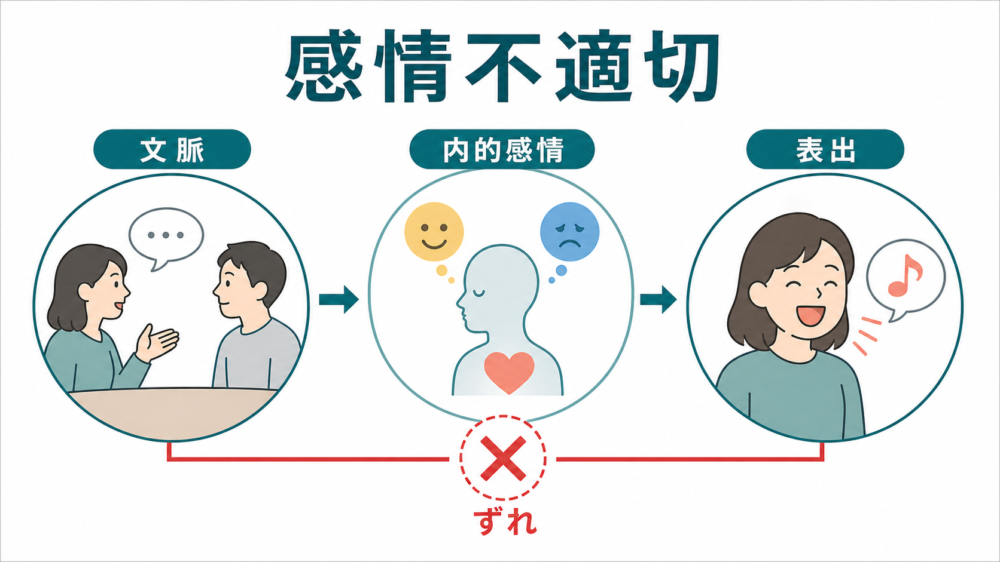
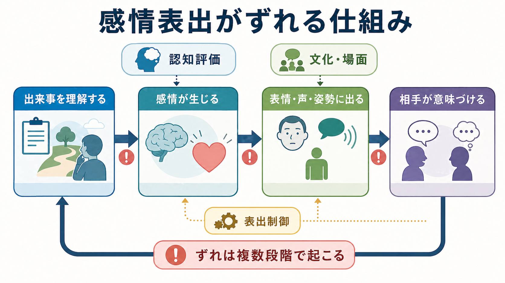
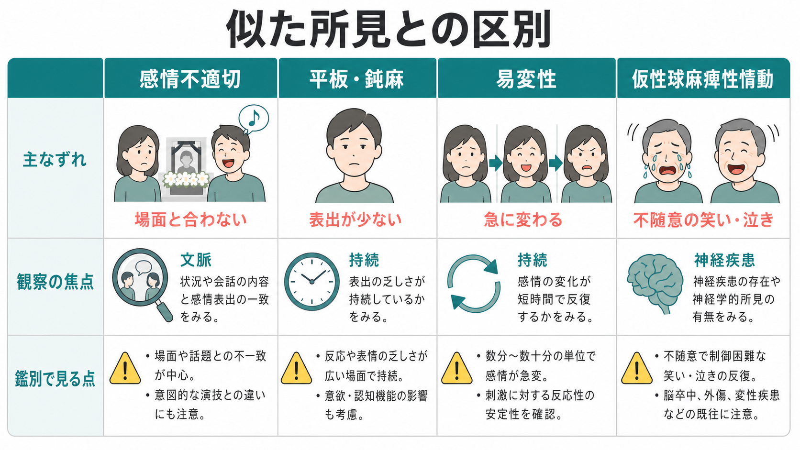

# 感情不適切とは何か

## 要点

- 感情不適切とは、話題・場面・対人文脈から期待される感情表出と、実際に観察される表情・声・姿勢・笑い・泣きなどが大きくずれて見える所見である。
- これは診断名ではなく、[[精神症候学とは何か]]や精神状態診察で記述する観察所見である。
- 典型例は、悲しい話題で笑う、深刻な状況で軽い調子になる、本人の語る内容と表情や声の調子がかみ合わない、などである。
- ただし、文化差、緊張、羞恥、神経疾患、薬剤、意図的な冗談、発達特性、認知機能の問題でも似た印象が生じる。
- 教育・研究目的の整理であり、個別の診断や治療指示ではない。

## この記事で答える問い

1. 感情不適切は、[[気分とは何か]]や通常の情動反応と何が違うのか。
2. どのような仕組みで「場面と表出が合わない」ように見えるのか。
3. 平板化、感情鈍麻、[[気分不安定性とは何か]]、仮性球麻痺性情動とどう区別して考えるのか。
4. 臨床・研究では、どのように記述し、どのような注意点を置くべきか。

## まず結論

感情不適切は、「どの感情を本人が内側で経験しているか」だけでなく、「その場面で、周囲からどのような表出として観察されるか」を扱う概念である。たとえば、本人は不安や混乱を感じているのに、外からは笑っているように見える場合がある。あるいは、本人の語る内容は悲痛でも、声の抑揚や表情がその内容と一致しないことがある。精神状態診察では、患者本人の主観的な気分と、観察される感情表出を分けて記述することが推奨される[1]。

したがって、感情不適切を見たときにすぐ診断名へ短絡するのは危険である。統合失調症スペクトラムの文脈で古典的に論じられてきたが、ICD-11 や DSM 系の診断枠組みで重視されるのは、症状の組み合わせ、持続、機能低下、除外診断、文化的文脈である[2][3]。感情不適切は「入口の所見」であって、「結論」ではない。

## 背景

精神科診察では、話の内容だけでなく、顔つき、視線、声量、抑揚、姿勢、間の取り方、笑い方、泣き方、対人反応を観察する。[[MSEで気分と感情をどう区別するか]]で扱うように、気分は比較的持続する主観的状態として聞き取り、感情表出は面接中に観察される反応として記述されることが多い[1]。

感情不適切が問題になるのは、表出の「強さ」そのものではなく、文脈との対応である。表情が少ないなら平板化や感情鈍麻、急に泣いたり怒ったりするなら感情易変性、快の経験や動機づけが落ちるなら[[快感消失とは何か]]や陰性症状、といった近接概念も検討する。感情不適切は、それらと重なることがあるが、中心は「場面・話題・対人文脈との不一致」である。

## 基本概念

### 感情不適切

感情不適切とは、会話内容や状況から自然に期待される反応と、観察される感情表出が合わない所見である。古典的な精神病理学では統合失調症に関連づけられてきたが、現在の臨床では単独で診断を決める所見ではない。評価では、発話内容、表情、声の調子、身体動作、場面、文化的規範、本人の説明を合わせて見る。

例として、「家族の死を語りながら笑う」「深刻な不利益を説明されても場違いに陽気に見える」「恐怖を語るが声や表情が平板で、話題との対応がつかみにくい」などがある。ただし、笑いは緊張、恥ずかしさ、照れ、解離的距離づけ、対人調整としても起こる。観察者側の文化的期待も混ざるため、表出だけで本人の内面を決めつけない。

### 関連するが同じではない所見

平板化・感情鈍麻は、感情表出の量や強度が乏しい状態を指す。統合失調症の陰性症状研究では、感情表出の低下、意欲低下、快感消失などが区別して扱われてきた[4]。一方、感情不適切では、表出が多いか少ないかよりも「文脈と合っているか」が焦点になる。

[[気分不安定性とは何か]]や[[易怒性とは何か]]は、感情や気分が短時間で変動しやすいことを扱う。仮性球麻痺性情動では、本人の感情体験と必ずしも一致しない笑い・泣きの発作が不随意に反復し、脳卒中、外傷、神経変性疾患など神経疾患との関連が重視される[7]。

## 仕組み

感情表出は、単純に「内面が外に出る」だけではない。少なくとも、出来事の理解、内的な情動生成、身体反応、表出制御、社会的解釈が関わる。Gross の情動制御モデルでは、状況選択、注意、評価、反応調整などの段階で情動反応が変わりうると整理される[5]。感情不適切も、これらのどこか一か所の故障というより、複数段階のずれとして理解すると臨床的に扱いやすい。

たとえば、状況理解が不十分なら、何が深刻なのかをつかみにくくなる。認知評価が変化すれば、同じ出来事でも脅威・冗談・他人事として処理される。表出制御がうまく働かないと、内的感情と表情や声の調整がずれる。さらに、観察者側がその人の文化、発達歴、会話スタイルを知らなければ、自然な表出を「不適切」と読み間違えることがある。

## 図解

上の 2 枚は、感情不適切を「文脈・内的感情・表出」の関係として見る図と、「状況理解、感情生成、表出制御、社会的解釈」の流れとして見る図である。次の比較図は、似た所見との違いを整理するための補助図である。

## 臨床・研究との接続

臨床記録では、「不適切」とだけ書くよりも、観察された事実を具体化する方がよい。たとえば、「母の死について語る場面で笑みが持続し、声の調子も軽かった」「本人は悲しいと述べるが、表情変化は乏しく、話題との対応が乏しいように見えた」と書く。主観的気分、観察された表出、面接者の解釈を分けると、後から再評価しやすい。

統合失調症の診断枠組みでは、幻覚、妄想、思考のまとまりの障害、陰性症状、機能低下、持続、除外診断が総合される[2][3]。感情不適切があるだけで統合失調症と判断しない。一方で、感情表出の低下や社会認知の問題は、機能予後や対人関係に関係しうるため、研究では顔表情認知、韻律理解、社会的手がかりの処理などと合わせて検討されてきた[6]。

鑑別では、[[せん妄とは何か]]、[[認知機能障害とは何か]]、物質・薬剤、神経疾患、てんかん、前頭葉病変、気分症状、発達特性、文化的背景を確認する。とくに笑い・泣きが発作的で不随意に反復する場合、仮性球麻痺性情動など神経学的評価が必要になることがある[7][8]。

## よくある誤解

### 誤解1: 場面に合わない笑いは、本人が悲しくない証拠である

笑いは、喜びだけでなく、緊張、恐怖、羞恥、対人調整、混乱、解離的な距離づけでも起こる。本人の内的感情と観察される表出は一致しないことがある。したがって、本人の語り、身体反応、経過、場面、周囲の情報を合わせて考える。

### 誤解2: 感情不適切があれば統合失調症である

感情不適切は診断名ではない。統合失調症の文脈で見られることはあるが、診断には複数の症状、持続、機能低下、除外診断が必要である[2][3]。単一の面接場面だけで判断すると、文化差や緊張反応を病的に読み違える危険がある。

### 誤解3: 感情不適切は演技か、性格の問題である

感情表出は、認知評価、身体状態、神経系、薬剤、疲労、文化的学習、対人状況の影響を受ける。意図的な冗談や演技が鑑別に入る場合もあるが、最初から「わざと」と断定しない。診察では、困りごと、持続、再現性、生活機能への影響を確かめる。

## 関連ノート

- [[精神症候学とは何か]]
- [[MSEで気分と感情をどう区別するか]]
- [[気分とは何か]]
- [[気分不安定性とは何か]]
- [[快感消失とは何か]]
- [[易怒性とは何か]]
- [[せん妄とは何か]]
- [[認知機能障害とは何か]]
- [[鑑別診断とは何か]]

MOC更新候補: `content/00_MOC/` 配下の精神医学・症候学関連 MOC に、バッチ統合時 `[[感情不適切とは何か]]` を追加する。

## 理解チェック

1. 感情不適切を「本人の内面」だけでなく「文脈と観察される表出の関係」として記述する理由は何か。
2. 平板化・感情鈍麻と、感情不適切の違いを一文で説明できるか。
3. 場違いな笑いを見たとき、緊張、文化差、神経疾患、薬剤、認知機能を確認する理由は何か。
4. 診療録に「感情不適切」と書く前に、どの観察事実を具体化すべきか。

## 参考文献

[1] Martin, D. C. (1990). The Mental Status Examination. In H. K. Walker, W. D. Hall, & J. W. Hurst (Eds.), *Clinical Methods: The History, Physical, and Laboratory Examinations* (3rd ed.). NCBI Bookshelf. https://www.ncbi.nlm.nih.gov/books/NBK320/

[2] American Psychiatric Association. (2022). *Diagnostic and Statistical Manual of Mental Disorders, Fifth Edition, Text Revision: DSM-5-TR*. American Psychiatric Association Publishing. https://doi.org/10.1176/appi.books.9780890425787

[3] World Health Organization. (2024). *Clinical descriptions and diagnostic requirements for ICD-11 mental, behavioural and neurodevelopmental disorders*. WHO. https://iris.who.int/bitstream/handle/10665/375767/9789240077263-eng.pdf

[4] Kirkpatrick, B., Fenton, W. S., Carpenter, W. T., & Marder, S. R. (2006). The NIMH-MATRICS consensus statement on negative symptoms. *Schizophrenia Bulletin, 32*(2), 214-219. https://doi.org/10.1093/schbul/sbj053

[5] Gross, J. J. (1998). The emerging field of emotion regulation: An integrative review. *Review of General Psychology, 2*(3), 271-299. https://doi.org/10.1037/1089-2680.2.3.271

[6] Kohler, C. G., Walker, J. B., Martin, E. A., Healey, K. M., & Moberg, P. J. (2010). Facial emotion perception in schizophrenia: A meta-analytic review. *Schizophrenia Bulletin, 36*(5), 1009-1019. https://doi.org/10.1093/schbul/sbn192

[7] Ahmed, A., & Simmons, Z. (2013). Pseudobulbar affect: Prevalence and management. *Therapeutics and Clinical Risk Management, 9*, 483-489. https://doi.org/10.2147/TCRM.S53906

[8] StatPearls. (2024). Pseudobulbar Affect. NCBI Bookshelf. https://www.ncbi.nlm.nih.gov/books/NBK562220/

## 未解決問題

- 感情不適切を、主観報告、面接観察、表情解析、音声解析、生理指標でどのように統合的に測定するか。
- 文化差や神経発達特性を考慮しながら、過剰な病理化を避ける評価手順をどう標準化するか。
- 感情不適切が生活機能、対人関係、治療同盟に与える影響を、どの指標で追跡するか。
