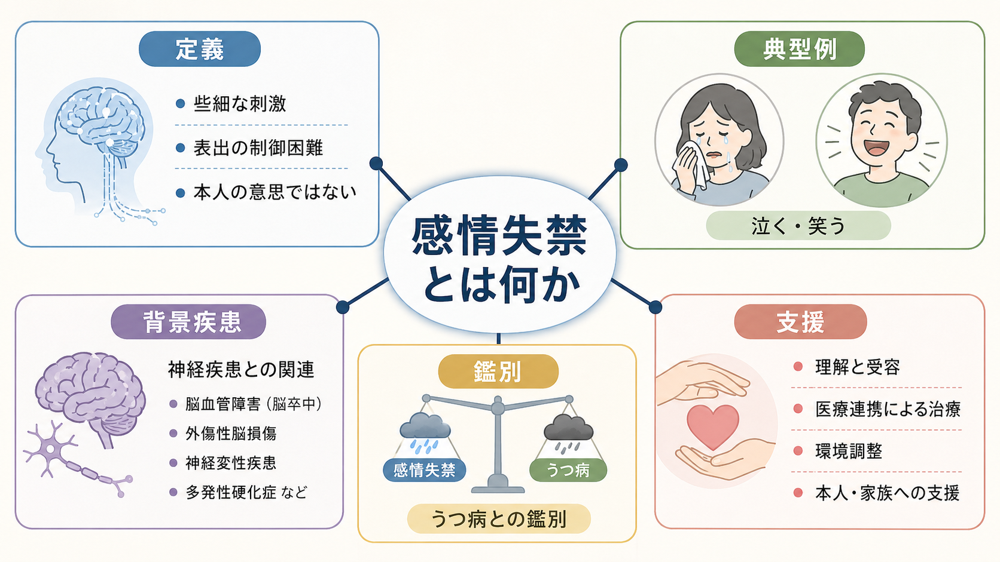
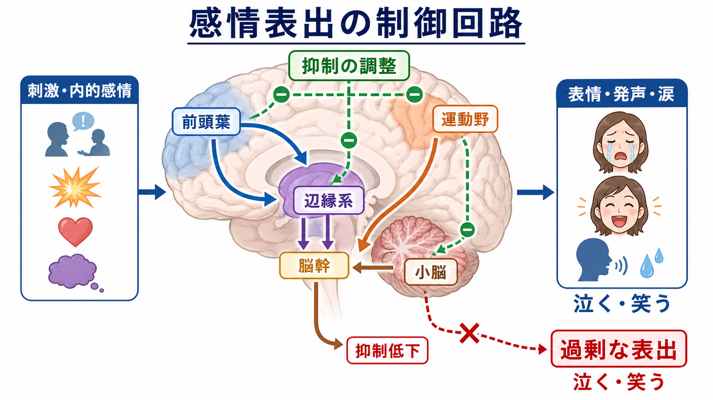
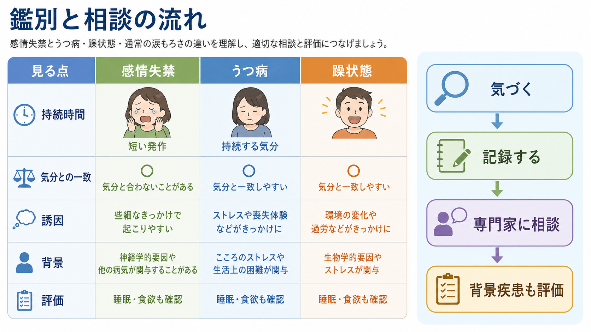

# 感情失禁とは何か

## 要点

- 感情失禁は、本人の意思やその場の気分に対して、泣く・笑うなどの感情表出が急に強く出て、止めにくくなる状態を指す。
- 英語圏では pseudobulbar affect（PBA）、pathological laughing and crying、emotional lability などの近接概念があり、用語は完全には統一されていない[1]。
- 重要なのは「悲しいから泣く」「楽しいから笑う」という通常の感情反応ではなく、表出の制御が外れやすい症候として理解すること。
- 脳卒中、外傷性脳損傷、多発性硬化症、ALS、認知症、パーキンソン病などの神経疾患・脳損傷に伴ってみられることがある[2]。
- [[抑うつ気分とは何か]]や躁状態、認知症に伴う行動症状と誤認されやすいため、持続する気分、睡眠・食欲、思考内容、発作の短さ、気分との一致度を分けてみる。

## この記事で答える問い

1. 感情失禁とは、どのような症候なのか。
2. なぜ「感情そのもの」ではなく「感情表出の制御」の問題として考えるのか。
3. うつ病、躁状態、通常の涙もろさとは何が違うのか。
4. 臨床・研究では、どのように評価し、どのような限界があるのか。

## まず結論

感情失禁とは、些細な刺激や文脈に合わないきっかけで、泣く・笑う・声が出るなどの表出が急に起こり、本人が抑えようとしても止まりにくい状態である。中核は「感情が過剰に深い」ことではなく、「表情・発声・涙などを出す神経系の制御が不安定になる」ことにある。

臨床的には、PBA として議論されることが多い。PBA は、気分に比べて不釣り合い、または気分と無関係な泣き笑いの発作が、神経疾患や脳損傷の文脈で生じる状態として説明される[1][2]。ただし日本語の「感情失禁」は、PBA より広く、脳器質性疾患、認知症、せん妄、精神疾患、薬剤、心理社会的ストレスに伴う情動調整困難を含めて使われることがあるため、用語の射程を確認する必要がある。

## 背景

泣く・笑うという反応は、主観的な気分だけで決まるわけではない。表情筋、呼吸、発声、涙、姿勢、社会的文脈の読み取りが連動する、かなり複雑な運動・自律神経・情動系のプログラムである。感情失禁では、このプログラムが「出るか出ないか」を調整する仕組みが弱まり、反応が急に出たり、場面に比べて大きくなったりする。

このため、本人が「悲しくないのに涙が出る」「笑いたくないのに笑ってしまう」と説明することがある。周囲からは、わざとらしい、情緒不安定、うつ病、性格の問題のように見えることがあるが、神経疾患・脳損傷に伴う表出制御の症候としてみると、本人の責任に還元しない理解が可能になる[2][3]。

## 基本概念

### 感情と感情表出を分ける

感情失禁を理解する第一歩は、「内側で感じている感情」と「外に出る表情・声・涙」を分けることである。通常は両者がかなり一致する。しかし感情失禁では、内的な悲しみや楽しさの強さに比べて、泣く・笑うという出力が大きくなったり、急に出たり、短時間で終わったりする。

PBA では、発作が突然で不随意的であり、気分状態や社会的文脈に比べて不釣り合い、しばしば反復的・定型的であることが強調される[4]。評価では、本人の主観だけでなく、家族や介護者の観察、背景疾患、発作の頻度、持続時間、誘因、生活への影響を合わせてみる。

### 症候名であって、単独の人格評価ではない

「失禁」という語は強い響きをもつが、ここでは道徳的な意味ではなく、制御のしにくさを示す臨床用語である。本人の弱さ、甘え、努力不足を意味しない。特に脳血管障害、神経変性疾患、外傷性脳損傷のあとに新しく出てきた泣き笑いは、性格変化として片づけず、神経学的・精神医学的に評価する価値がある。

## 仕組み

感情表出は、前頭葉、前部帯状皮質、辺縁系、基底核、脳幹、小脳などの広いネットワークで調整される。古典的には、皮質から脳幹への下行性制御が弱まることで、泣く・笑う運動プログラムが脱抑制されるという考え方がある。より近年の説明では、前頭葉から橋・小脳へ至る経路や、辺縁系から脳幹へ至る情動経路のバランスが崩れ、小脳が文脈に合わせて表出を調整する機能が損なわれると考えられている[1][3]。

この説明は、単一の「感情失禁中枢」が壊れるという意味ではない。脳卒中なら病変部位、ALS や多発性硬化症なら白質路や運動系、認知症なら前頭側頭系や広範なネットワーク変化など、背景疾患によって障害の入り口は異なる。共通して問題になるのは、感情を表に出す回路が、状況に応じて絞られにくくなる点である。

神経伝達物質としては、セロトニン、グルタミン酸、ノルアドレナリンなどが関与候補として議論されてきた。治療研究では、抗うつ薬の小規模研究や、デキストロメトルファン/キニジン配合薬の臨床試験がある[1][4]。ただし、薬物療法の適応や安全性は背景疾患、併用薬、心疾患リスク、地域の承認状況によって異なるため、記事としては個別の治療指示ではなく、研究上の知見として扱う。

## 図解

感情失禁を観察するときは、次の3層に分けると整理しやすい。

| 層 | 見る点 | 例 |
|---|---|---|
| 表出 | 泣く、笑う、声が出る、涙が出る | 会話中に急に涙が出る |
| 主観 | そのとき本当に悲しい・楽しいか | 「悲しくないのに泣いてしまう」 |
| 文脈 | 誘因、場面、背景疾患、生活への影響 | 脳卒中後に短い発作が増えた |

この3層を分けることで、感情失禁を、[[抑うつ気分とは何か]]、不安、躁状態、認知症に伴う行動症状、薬剤性の変化、通常の涙もろさと区別しやすくなる。

## 臨床・研究との接続

研究では、Center for Neurologic Study-Lability Scale（CNS-LS）がよく使われる。CNS-LS は、泣きやすさに関する3項目と笑いに関する4項目からなる自己評価尺度で、ALS や多発性硬化症の集団で検証されている[5]。ただし、尺度は診断を自動化するものではなく、臨床面接、神経学的評価、抑うつ・躁状態・認知症・せん妄・薬剤の確認と組み合わせて使う。

臨床研究では、デキストロメトルファン/キニジン配合薬が PBA の発作頻度や CNS-LS スコアを改善することが示されている[1][4]。一方で、実臨床の処方データでは、認知症やパーキンソン病を含む高齢者に広く使用される傾向、QT 延長リスクのある薬剤併用、抗精神病薬・抗うつ薬などの併用が問題になる可能性も報告されている[6]。したがって「感情失禁らしいから薬」という単純な流れではなく、背景疾患、併存症、本人・家族の困りごと、非薬物的支援、安全性を含めて考える必要がある。

支援では、本人と周囲への説明が重要である。「本人の意思ではないことがある」「短い発作として起こることがある」と共有するだけで、恥ずかしさや対人回避が減る場合がある。会話中に発作が起きたときは、責めたり笑ったりせず、少し待つ、刺激を減らす、話題を急に変えすぎない、本人が望む対処を事前に確認する、といった環境調整が役立つことがある。

## よくある誤解

### 誤解1: 泣いているなら、必ず深く悲しんでいる

感情失禁では、涙の量や表情の強さが、内的な悲しみの強さと一致しないことがある。本人が「悲しくない」と言う場合も、否認と決めつけず、表出と気分を分けて聞く。

### 誤解2: うつ病と同じである

うつ病では、抑うつ気分、興味・喜びの低下、睡眠・食欲、罪責感、希死念慮、思考・運動の変化などが、一定期間持続するかをみる。感情失禁では、泣き笑いの発作が短く、気分と不一致で、背景に神経疾患や脳損傷がある場合がある。両者は併存しうるため、どちらか一方だけに決めつけない。

### 誤解3: 本人が努力すれば止められる

感情失禁の特徴は、本人が抑えようとしても制御しにくい点にある。本人の努力を評価するより、発作の条件、生活への影響、周囲の反応、背景疾患の変化を記録する方が臨床的には有用である。

### 誤解4: 感情失禁は精神疾患だけの症状である

感情失禁は精神医学の症候として扱われることがあるが、PBA の文脈では神経疾患・脳損傷と強く結びつく。[[前頭側頭型認知症はなぜ人格や行動を変えるのか]]や[[実行機能障害とは何か]]のような前頭側頭系・制御系の問題とも接点がある。

## 関連ノート

- [[抑うつ気分とは何か]]
- [[実行機能障害とは何か]]
- [[前頭側頭型認知症はなぜ人格や行動を変えるのか]]
- [[セロトニン仮説はうつ病をどこまで説明できるのか]]

### 関連ノート候補

- 脳卒中後情動障害とは何か
- pseudobulbar affect とは何か
- ALS と情動調整
- 多発性硬化症と感情表出
- 認知症に伴う行動・心理症状

### MOC更新候補

- `content/00_MOC/` 配下の精神医学・症候学系 MOC
- 神経心理学、神経疾患と精神症状、臨床神経学に関する MOC

## 理解チェック

1. 感情失禁で分けて考えるべき「内側の気分」と「外側の表出」は何か。
2. 感情失禁とうつ病を鑑別するとき、持続時間、気分との一致、背景疾患以外に何を確認するか。
3. PBA の説明で、前頭葉、脳幹、小脳はそれぞれどのような役割として理解できるか。
4. 本人や家族に説明するとき、「本人の意思ではないことがある」と伝える意義は何か。

## 未解決問題

- 「感情失禁」「情動失禁」「PBA」「emotional lability」「pathological laughing and crying」の境界は、研究領域や診療科によって完全には一致しない。
- 背景疾患ごとに、同じ症候名でまとめてよい範囲と、別の機序として扱うべき範囲はまだ整理が必要である。
- 薬物療法のエビデンスはあるが、高齢者、多剤併用、認知症、心疾患リスクを含む実臨床での適用には慎重な評価が必要である。

## 参考文献

[1] Pioro, E. P. (2014). Review of dextromethorphan 20 mg/quinidine 10 mg (NUEDEXTA®) for pseudobulbar affect. *Neurology and Therapy*, 3, 15-28. https://doi.org/10.1007/s40120-014-0018-5

[2] Ahmed, A., & Simmons, Z. (2013). Pseudobulbar affect: prevalence and management. *Therapeutics and Clinical Risk Management*, 9, 483-489. https://doi.org/10.2147/TCRM.S53906

[3] Parvizi, J., Arciniegas, D. B., Bernardini, G. L., Hoffmann, M. W., Mohr, J. P., Rapoport, M. J., Schmahmann, J. D., Silver, J. M., & Tuhrim, S. (2006). Diagnosis and management of pathological laughter and crying. *Mayo Clinic Proceedings*, 81(11), 1482-1486. https://doi.org/10.4065/81.11.1482

[4] Hammond, F. M., Alexander, D. N., Cutler, A. J., D'Amico, S., Doody, R. S., Sauve, W., Zorowitz, R. D., Davis, C. S., Shin, P., Ledon, F., Yonan, C., Formella, A. E., & Siffert, J. (2016). PRISM II: an open-label study to assess effectiveness of dextromethorphan/quinidine for pseudobulbar affect in patients with dementia, stroke or traumatic brain injury. *BMC Neurology*, 16, 89. https://doi.org/10.1186/s12883-016-0609-0

[5] Moore, S. R., Gresham, L. S., Bromberg, M. B., Kasarkis, E. J., & Smith, R. A. (1997). A self report measure of affective lability. *Journal of Neurology, Neurosurgery & Psychiatry*, 63(1), 89-93. https://doi.org/10.1136/jnnp.63.1.89

[6] Maust, D. T., Kim, H. M., Chiang, C., & Kales, H. C. (2019). Assessment of use of combined dextromethorphan and quinidine in patients with dementia or Parkinson disease after US Food and Drug Administration approval for pseudobulbar affect. *JAMA Internal Medicine*, 179(2), 224-230. https://doi.org/10.1001/jamainternmed.2018.5433
