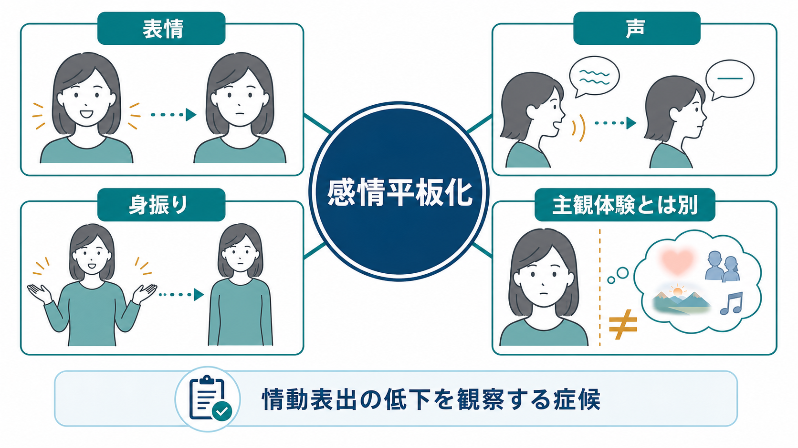
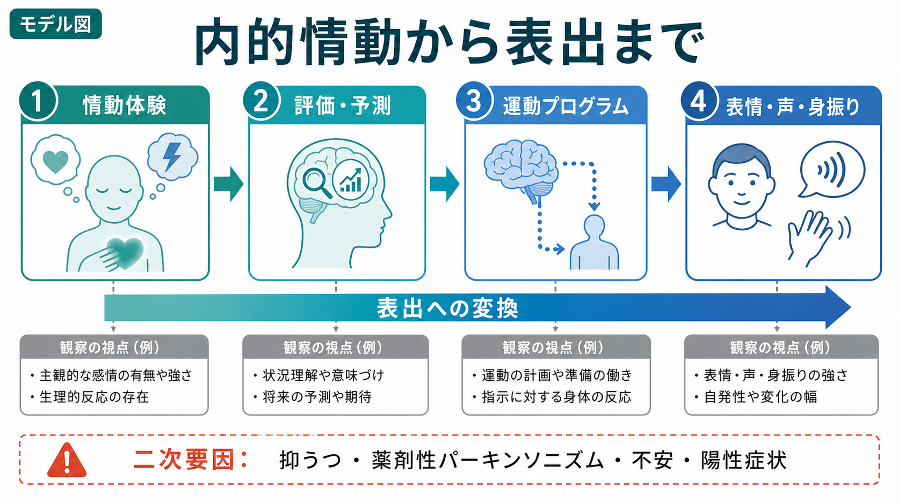
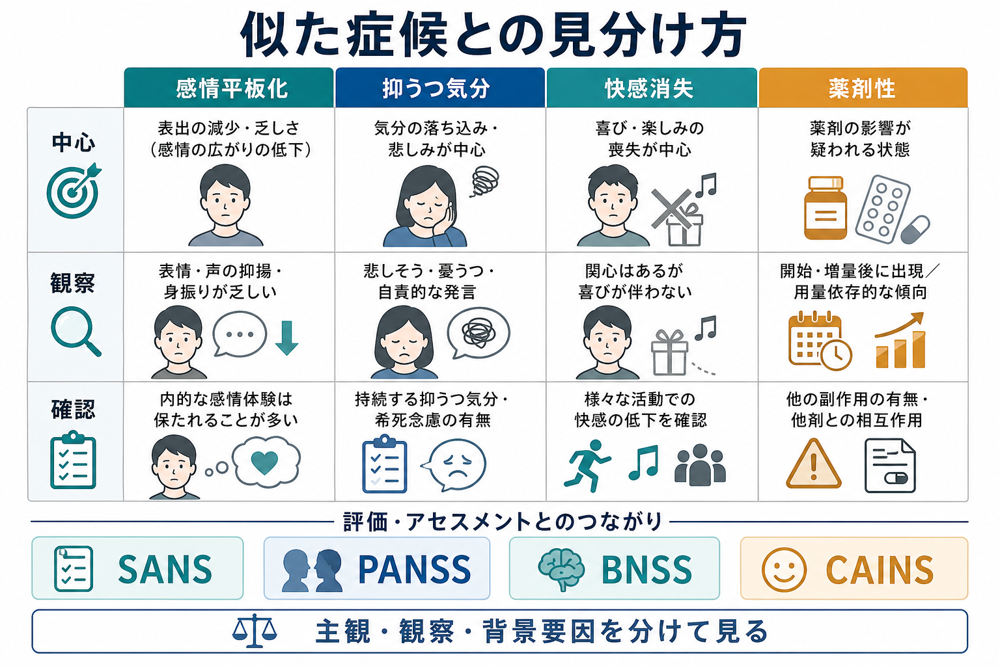

# 感情平板化とは何か

## 要点

- 感情平板化とは、表情、声の抑揚、視線、身振り、反応の豊かさなど、外から観察できる情動表出が乏しくなる症候である。
- 「感情がない」ことではない。統合失調症研究では、外に見える表出が低くても、本人の主観的な情動体験は比較的保たれる場合があることが繰り返し示されている[1][2]。
- 陰性症状のうち「表出低下」側の代表であり、意欲低下、快感消失、社会的引きこもり、会話量低下とは重なりながらも同じではない[3][4]。
- 臨床では、一次性の陰性症状だけでなく、抑うつ、薬剤性パーキンソニズム、不安、陽性症状、認知機能障害、文化的背景による二次的な表出低下を分けて考える。
- 評価では、本人の語り、面接者の観察、家族・支援者からの情報、標準化尺度を組み合わせる。単独の表情だけで診断や治療方針を決めるものではない。

## この記事で答える問い

1. 感情平板化とは、何が低下している状態なのか。
2. 本人の内的な感情体験と、外から見える感情表出はどう違うのか。
3. 陰性症状、抑うつ気分、快感消失、薬剤性の表情低下とはどう区別するのか。
4. 臨床・研究ではどのように観察し、尺度化するのか。

## まず結論

感情平板化は、情動そのものの消失ではなく、情動が「表情・声・身振り・対人反応」として外に出る経路の低下として理解するとよい。[[気分とは何か]]で扱う気分は、本人が持続的に経験する内的状態に近い。一方、[[MSEで気分と感情をどう区別するか]]でいう感情 affect は、面接中に観察される情動表出である。感情平板化はこの affect の範囲・強度・変動性が狭く見える状態を指す。

統合失調症の陰性症状研究では、陰性症状は大きく「動機づけ・快感」領域と「表出低下」領域に分けられることが多い。感情平板化は、会話量低下とともに表出低下の中核に置かれる[3][4]。ただし、外に出る表情が乏しいからといって、本人の悲しみ、喜び、不安、怒りが存在しないとはいえない。Kring と Moran の総説は、統合失調症では情動喚起刺激への主観的体験が保たれる一方、表情などの外的表出が低いという乖離を整理している[1]。

したがって、臨床的には「冷たい」「無関心」「反省がない」といった人格評価に短絡せず、観察可能な表出の乏しさ、本人の内的体験、二次要因、生活機能への影響を分けて記述することが重要である。

## 背景

感情平板化は、古典的には統合失調症の陰性症状として重視されてきた。SANS は陰性症状を評価するために作られ、感情平板化、貧困な発話、意欲低下、快感消失・非社会性、注意障害を主要領域として扱った[5]。PANSS も統合失調症症状を陽性症状・陰性症状・一般精神病理として評価する尺度であり、陰性尺度の中に「情動的引きこもり」「乏しいラポール」「受動的/無関心な社会的引きこもり」と並んで、鈍麻した感情を含める[6]。

近年の整理では、陰性症状は単一のかたまりではなく、少なくとも「表出低下」と「動機づけ・快感低下」という二つの次元に分けて考えることが多い[3][4]。前者には感情平板化や発話の乏しさが入り、後者には[[快感消失とは何か]]、[[意欲低下とは何か]]、社会的関心の低下が入る。この記事で扱う感情平板化は、主に表出低下の側に位置づく。

## 基本概念

### 観察されるもの

感情平板化で観察するのは、感情の「存在」ではなく、感情が外に現れる様式である。代表的には次の要素を見る。

| 観察領域 | 具体例 | 記述のポイント |
|---|---|---|
| 表情 | 笑顔、驚き、困惑、悲しみなどの表情変化が少ない | 「無表情」とだけ書かず、どの場面でどの程度乏しいかを書く |
| 声 | 抑揚、声量、間、テンポの変化が乏しい | 単調な声、情動的話題でも声色が変わりにくい |
| 視線・姿勢 | 視線のやりとり、うなずき、身体の向きが少ない | 不安、緊張、文化的作法、対人場面の負荷も考える |
| 身振り | 手振り、顔・頭の動き、相づちが乏しい | 動作緩慢や薬剤性錐体外路症状との鑑別が必要 |
| 情動反応性 | 嬉しい話題や悲しい話題への変化が乏しい | 話題に対する内的意味づけを本人に確認する |

### 平板・鈍麻・制限

臨床用語では、flat affect、blunted affect、restricted/constricted affect が区別されることがある。厳密な使い分けは文献や教育体系によって揺れるが、実用上は「どの程度表出が狭いか」を段階として記述すると理解しやすい。

- 制限された感情: 表出の幅が狭いが、状況に応じた変化はある。
- 鈍麻した感情: 表情・声・身振りの変化が明らかに乏しい。
- 平板な感情: ほとんど変化が見られず、情動的話題への反応もかなり乏しい。

ただし、これらは観察記述であり、本人の人格や道徳性を評価する言葉ではない。[[精神状態診察MSEとは何か]]では、こうした所見を「見えた行動」として具体的に記録することが重要になる。

## 仕組み

### 内的情動と表出の分離

感情平板化を理解するうえで最も重要なのは、内的な情動体験と外的な情動表出を分けることだ。情動体験は、身体感覚、価値づけ、記憶、予測、意味づけを含む。一方、情動表出は、顔面筋の動き、声の韻律、視線、姿勢、身振り、対人場面での応答として実行される。

統合失調症の情動研究では、情動刺激に対する主観的報告が比較的保たれるにもかかわらず、表情などの外的表出が減ることがある[1][2]。これは、本人の心の中に何も起きていないという意味ではなく、内的情動を社会的に読み取れる表出へ変換する過程、またはその表出を状況に合わせて調整する過程に障害がある可能性を示す。

### 陰性症状の二次元モデル

Marder と Galderisi は、陰性症状の現代的概念化として、表出低下と動機づけ・快感低下を分けて整理している[3]。Correll と Schooler も、陰性症状を認識・評価・治療するうえで、一次性の陰性症状と二次性の陰性症状を区別する重要性を強調している[4]。

感情平板化は表出低下の代表だが、[[陰性症状は報酬系や認知制御の障害と関係するのか]]で扱うような報酬予測や認知制御の問題と完全に無関係ではない。情動表出には、情動を感じるだけでなく、状況を読み取り、どの表情・声・身振りを出すかを選び、身体運動として実行する過程が含まれる。そのため、感情平板化は、情動処理、社会認知、運動表出、薬剤影響、対人環境の相互作用として現れる。

### 二次要因を見落とさない

感情平板化に見える所見は、統合失調症の一次性陰性症状だけで生じるわけではない。臨床では次のような二次要因を確認する。

- 抑うつ: [[抑うつ気分とは何か]]に伴い、反応性や声量が落ちる。
- 薬剤性パーキンソニズム: 抗精神病薬などにより、表情筋や身振りが乏しく見える。
- 陽性症状: [[幻聴とは何か]]や[[妄想とは何か]]への没頭により、対人反応が乏しく見える。
- 不安・過覚醒: 緊張により表情や視線が固くなる。
- 認知機能障害: [[認知機能障害とは何か]]により、話題理解や応答のタイミングが遅れる。
- 文化・発達・対人文脈: 目線、表情、感情表現の規範が異なる。

この区別は治療的にも重要である。二次性の表出低下は、抑うつ、錐体外路症状、睡眠、陽性症状、環境調整などの改善に伴って変わる可能性がある。一方、一次性陰性症状は薬物療法だけでは改善しにくく、心理社会的支援、リハビリテーション、生活機能への支援を含む長期的な見立てが必要になる[4]。

## 図解

図1は、感情平板化を「表情・声・身振りの低下」として整理し、主観体験とは別に見ることを示している。図2は、内的情動から表出までの変換過程を、あくまで説明モデルとして示した。図3は、抑うつ気分、快感消失、薬剤性の表情低下との見分け方と、評価尺度との接続をまとめたものである。

## 臨床・研究との接続

### 面接での見方

面接では、感情平板化を「表情がない」と一語で済ませず、状況と反応をセットで記録する。

- 情動的な話題で、表情・声・身振りがどの程度変わるか。
- 本人はその話題について、どのような感情を言語化するか。
- 家族や支援者は、以前と比べた変化をどう見ているか。
- 薬剤変更、抑うつ、睡眠、身体疾患、ストレス、社会的孤立がないか。
- 生活機能、対人関係、就労・学業、セルフケアにどの程度影響しているか。

記録例としては、「感情平板化あり」よりも、「母の入院について心配と述べるが、声の抑揚は乏しく、表情変化は少ない。質問には内容的に一貫して答える。本人は『心配しているが顔に出ないと言われる』と述べる」のように、発言と観察を分けて書く方が臨床的に有用である。

### 評価尺度

研究や臨床試験では、標準化尺度によって感情平板化を評価する。SANS は感情平板化を陰性症状の主要領域として扱い、顔面表情、声の抑揚、身振り、情動反応性などの観察を重視した[5]。PANSS は統合失調症症状を広く評価する尺度で、陰性尺度に鈍麻した感情を含める[6]。

より新しい尺度として、BNSS と CAINS がある。BNSS は NIMH-MATRICS の陰性症状コンセンサスを背景に、鈍麻した感情、会話量低下、非社会性、快感消失、意欲低下を測る13項目尺度として開発され、臨床試験で使いやすい簡潔な尺度として妥当性が検討された[7]。CAINS は陰性症状を動機づけ・快感と表出の二領域に整理し、面接によって評価する尺度として開発された[8]。

### 研究上の意義

感情平板化は、単に「重症そうに見える」所見ではなく、社会機能、対人コミュニケーション、支援関係に影響する。表情や声の手がかりが乏しいと、周囲は本人の関心や苦痛を読み取りにくくなり、「やる気がない」「関わる気がない」と誤解しやすい。これはスティグマや孤立を強める可能性がある。

一方で、感情平板化を本人の内的体験の乏しさと同一視しないことは、支援上の重要な出発点になる。本人の中には不安、悲しみ、喜び、緊張、疲労が存在していても、それが外に出にくいことがある。面接者は、表出の乏しさを見たうえで、本人の語り、身体状態、生活文脈、周囲からの情報を組み合わせて理解する必要がある。

## よくある誤解

### 誤解1: 感情平板化は「感情がない」ことである

感情平板化は、感情体験の消失ではなく、外に見える表出の低下である。統合失調症研究では、外的表出の乏しさと主観的情動体験が乖離することが報告されている[1][2]。

### 誤解2: 表情が乏しい人は無関心である

表情が乏しく見えても、本人が関心や苦痛を持っていないとは限らない。不安、薬剤影響、疲労、社会的緊張、文化的背景、認知負荷などでも表情や身振りは変わる。

### 誤解3: 快感消失や抑うつ気分と同じである

[[快感消失とは何か]]は、喜び・楽しみ・期待の低下を中心にした症候である。[[抑うつ気分とは何か]]は、落ち込みや悲しみなどの主観的な気分状態に近い。感情平板化は、これらと併存しうるが、中心は観察される表出の低下である。

### 誤解4: 診断名が決まれば原因も決まる

同じ統合失調症スペクトラムでも、感情平板化の背景は一様ではない。一次性陰性症状、抑うつ、薬剤性錐体外路症状、陽性症状への没頭、認知機能障害、環境要因を分けて評価する必要がある[4]。

## 関連ノート

既存ノート:

- [[精神症候学とは何か]]
- [[症状と徴候は何が違うのか]]
- [[精神状態診察MSEとは何か]]
- [[MSEで気分と感情をどう区別するか]]
- [[気分とは何か]]
- [[快感消失とは何か]]
- [[意欲低下とは何か]]
- [[抑うつ気分とは何か]]
- [[認知機能障害とは何か]]
- [[陰性症状は報酬系や認知制御の障害と関係するのか]]

今後の作成候補:

- 陰性症状とは何か
- 感情鈍麻と感情平板化は何が違うのか
- BNSSとCAINSは陰性症状をどう評価するのか
- 薬剤性パーキンソニズムとは何か

MOC更新候補:

- `content/00_MOC/` 配下の精神医学、症候学、統合失調症、精神状態診察MSE関連MOCにリンク追加候補とする。並列ジョブとの競合を避けるため、今回はMOC本体を更新しない。

## 理解チェック

1. 感情平板化を「感情がない」と説明すると不正確になる理由は何か。
2. 感情平板化を観察するとき、表情以外に見るべき要素を3つ挙げられるか。
3. 抑うつ気分、快感消失、薬剤性パーキンソニズムと感情平板化をどう分けて考えるか。
4. 一次性陰性症状と二次性の表出低下を区別する臨床的理由は何か。
5. SANS、PANSS、BNSS、CAINS はそれぞれ感情平板化の評価とどう関係するか。

## 参考文献

[1] Kring, A. M., & Moran, E. K. (2008). Emotional response deficits in schizophrenia: Insights from affective science. *Schizophrenia Bulletin, 34*(5), 819-834. https://doi.org/10.1093/schbul/sbn071

[2] Gur, R. E., Kohler, C. G., Ragland, J. D., Siegel, S. J., Lesko, K., Bilker, W. B., & Gur, R. C. (2006). Flat affect in schizophrenia: Relation to emotion processing and neurocognitive measures. *Schizophrenia Bulletin, 32*(2), 279-287. https://doi.org/10.1093/schbul/sbj041

[3] Marder, S. R., & Galderisi, S. (2017). The current conceptualization of negative symptoms in schizophrenia. *World Psychiatry, 16*(1), 14-24. https://doi.org/10.1002/wps.20385

[4] Correll, C. U., & Schooler, N. R. (2020). Negative symptoms in schizophrenia: A review and clinical guide for recognition, assessment, and treatment. *Neuropsychiatric Disease and Treatment, 16*, 519-534. https://doi.org/10.2147/NDT.S225643

[5] Andreasen, N. C. (1989). The Scale for the Assessment of Negative Symptoms (SANS): Conceptual and theoretical foundations. *The British Journal of Psychiatry, 155*(S7), 49-52. https://doi.org/10.1192/S0007125000291496

[6] Kay, S. R., Fiszbein, A., & Opler, L. A. (1987). The Positive and Negative Syndrome Scale (PANSS) for schizophrenia. *Schizophrenia Bulletin, 13*(2), 261-276. https://doi.org/10.1093/schbul/13.2.261

[7] Kirkpatrick, B., Strauss, G. P., Nguyen, L., Fischer, B. A., Daniel, D. G., Cienfuegos, A., & Marder, S. R. (2011). The Brief Negative Symptom Scale: Psychometric properties. *Schizophrenia Bulletin, 37*(2), 300-305. https://doi.org/10.1093/schbul/sbq059

[8] Horan, W. P., Kring, A. M., Gur, R. E., Reise, S. P., & Blanchard, J. J. (2011). Development and psychometric validation of the Clinical Assessment Interview for Negative Symptoms (CAINS). *Schizophrenia Research, 132*(2-3), 140-145. https://doi.org/10.1016/j.schres.2011.06.030

## 未解決問題

- 感情平板化のうち、顔面表情、声の韻律、身振り、視線がどの程度共通機序を持つのかはまだ十分に分かっていない。
- 主観的情動体験が保たれる場合と、快感消失や抑うつが強く併存する場合を、日常生活データでどこまで分けられるかは今後の課題である。
- 薬剤性・抑うつ性・環境性の二次的な表出低下を除いた一次性の感情平板化に対し、どの心理社会的介入が最も有効かは、さらに検証が必要である。
