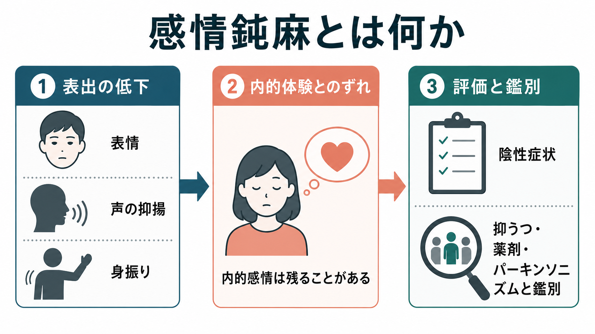
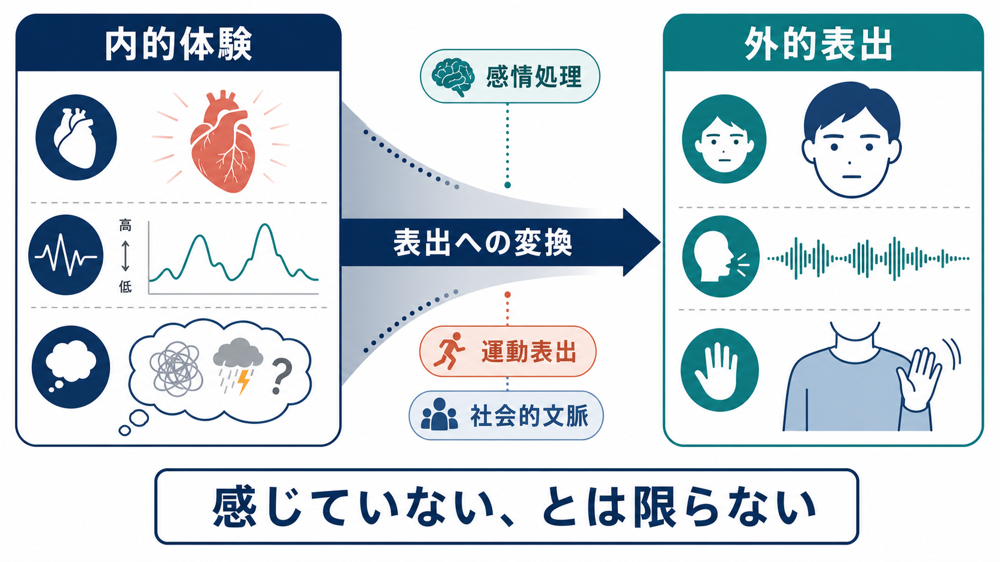
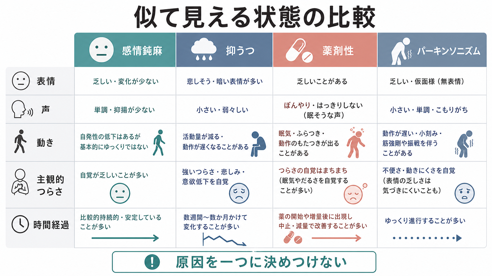

# 感情鈍麻とは何か

## 要点

- 感情鈍麻とは、表情、視線、声の抑揚、身振り、姿勢などを通じた感情表出が乏しくなり、外から見える反応が平板に見える状態である[1][2]。
- 感情鈍麻は「感情がない」という意味ではない。統合失調症研究では、外的な表出が乏しくても、主観的な感情体験や生理反応が残ることが示されている[3]。
- 精神医学では、感情鈍麻は陰性症状の一部、とくに「表出の低下」次元に位置づけられる。意欲低下、快感消失、社会的引きこもりとは関連するが、同じ症状ではない[1][4]。
- 評価では、本人の自己申告だけでなく、面接中の表情、声、会話の自然さ、身振り、場面への反応、時間経過を合わせて見る[2][5]。
- 抑うつ、薬剤性の鎮静や錐体外路症状、パーキンソニズム、認知機能障害、文化的な表出様式の違いなどと区別して考える必要がある[1][2][6]。

## この記事で答える問い

1. 感情鈍麻は、日常語の「冷たい」「無感情」と何が違うのか。
2. 感情鈍麻は、気分、感情、意欲、快感消失とどのように区別されるのか。
3. なぜ外からは反応が乏しく見えるのに、内側の感情体験が残ることがあるのか。
4. 臨床・研究では、感情鈍麻をどのように評価し、どのような誤解を避けるのか。

## まず結論

感情鈍麻は、内側の感情そのものが消える現象というより、感情を外に表す経路が弱く見える症状である。典型的には、笑顔が少ない、声が単調で抑揚に乏しい、視線や身振りが少ない、喜怒哀楽を誘う話題でも表情の変化が乏しい、といった形で観察される[1][2]。

ただし、これは本人が何も感じていないことを意味しない。感情研究では、統合失調症の人が感情喚起刺激に対して、観察可能な表情は少ない一方で、主観的体験や自律神経反応を示すことが報告されてきた[3]。したがって、[[精神症候学とは何か]]の観点では、感情鈍麻を「人格」や「態度」ではなく、観察可能な表出の症状として記述することが重要である。

## 背景

精神医学でいう「感情」や「気分」は、日常語より細かく分けられる。[[気分とは何か]]は持続的な情動の背景を指し、面接場面で外から観察される表情や声の調子は「感情表出」または affect として扱われる。感情鈍麻は、この外的な表出が乏しくなる症候である。

統合失調症の陰性症状研究では、陰性症状は大きく「表出の低下」と「意欲・快感・社会性の低下」に分けて理解されることが多い[1][7]。前者には感情鈍麻や発話量・発話表現の低下が含まれ、後者には[[意欲低下とは何か]]、[[快感消失とは何か]]、社会的関心の低下が含まれる。これらは同時に現れることもあるが、評価上は分けて記述した方が、何が困りごとを生んでいるのかを見失いにくい。

## 基本概念

### 感情鈍麻で観察されるもの

感情鈍麻は、次のような観察所見として記述される。

| 観察する領域 | 典型的に見られる変化 |
|---|---|
| 表情 | 笑顔、驚き、悲しみ、怒りなどの表情変化が乏しい |
| 視線 | 情緒的な話題でも視線や目の表情の変化が少ない |
| 声 | 声量や抑揚が乏しく、単調に聞こえる |
| 身振り | 手振り、うなずき、姿勢変化などが少ない |
| 相互作用 | 相手の冗談、喜び、悲しみに対する反応が薄く見える |

尺度研究では、感情鈍麻を測る項目はおおむね、顔の表情、声の表現、身振りの三領域を含む[2]。SANS は陰性症状を、感情鈍麻、思考・発話の貧困、意欲低下、快感消失・非社会性、注意障害に分けて評価する代表的な尺度として発展した[5]。BNSS は、MATRICS の合意を踏まえ、感情鈍麻、発話貧困、非社会性、快感消失、意欲低下を測るよう設計された[4]。

### 「感情がない」とは限らない

感情鈍麻を理解するときの中心は、外から見える反応と内側の体験を分けることである。表情や声の変化が乏しくても、本人が悲しみ、緊張、喜び、恥ずかしさを体験していないとは限らない[3]。このずれを見落とすと、本人のつらさや対人場面での誤解を過小評価しやすい。

### 気分・意欲・快感消失との違い

感情鈍麻は、[[抑うつ気分とは何か]]や[[快感消失とは何か]]と重なって見えることがある。しかし、焦点は異なる。

| 概念 | 中心にある問い | 感情鈍麻との違い |
|---|---|---|
| 感情鈍麻 | 感情が外にどう表れているか | 表情、声、身振りなどの表出に焦点がある |
| 抑うつ気分 | 持続的に悲しい、空虚、絶望的か | 主観的な気分の質と持続に焦点がある |
| 快感消失 | 楽しみや喜びを感じにくいか | 報酬体験や予期される喜びに焦点がある |
| 意欲低下 | 目的に向けて始める力が低いか | 行動の開始・持続に焦点がある |
| 精神運動制止 | 動作や思考の速度が遅いか | 速度や制止に焦点がある |

この区別は、単なる用語整理ではない。たとえば、顔の表情が乏しい人が、内側では強い[[抑うつ気分とは何か|抑うつ気分]]を抱えている場合もあれば、薬剤性の鎮静やパーキンソニズムで表情や動作が乏しく見える場合もある[1][2][6]。

## 仕組み

### 表出は複数の過程から成る

感情表出は、単純な「感情があるかないか」ではなく、少なくとも次の過程に分けられる。

1. 刺激や文脈を感情的に評価する。
2. 身体反応や主観的体験が生じる。
3. 顔、声、姿勢、身振りとして表出する。
4. 相手の反応を読み取り、表出を調整する。

感情鈍麻では、このうち表出への変換、運動表出、社会的文脈に応じた調整が弱く見える可能性がある。Kring と Moran の総説は、統合失調症の感情反応を、主観的体験、表情表出、生理反応に分けて検討する必要を示している[3]。

### 陰性症状としての位置づけ

陰性症状は、通常あるはずの機能が乏しくなる症状群である。近年の整理では、感情鈍麻と発話表現の低下は「表出の低下」、意欲低下・快感消失・非社会性は「意欲・快感の低下」に近い次元として扱われる[1][7]。この二因子構造は、臨床評価と研究デザインの両方で有用である。

ICD-11 関連の症状評価では、陰性症状を評価するとき、抑うつ、刺激の乏しい環境、陽性症状の直接的結果、薬剤や物質の影響に完全に帰せられるものではないかを確認することが強調される[6]。これは、感情鈍麻を見たときに「統合失調症の一次性陰性症状」と急いで決めつけないための重要な視点である。

## 図解

感情鈍麻は、似て見える状態との区別がとくに重要である。下の図は鑑別の入口として、表情、声、動き、主観的つらさ、時間経過を並べたものである。実際の評価では、この表だけで判断せず、本人の言葉、生活史、薬剤、身体疾患、周囲からの情報を合わせて検討する。

## 臨床・研究との接続

### 面接で確認すること

面接では、感情鈍麻を本人の態度として評価するのではなく、観察可能な所見として分けて記述する。たとえば「悲しみを語るが表情変化が少ない」「声は単調だが、内容としては強い不安を訴える」「冗談への笑顔は乏しいが、言葉では面白かったと述べる」といった書き方が有用である。

確認すべき点は次の通りである。

- いつから表出が乏しくなったのか。
- 場面によって変わるのか、ほぼ一貫しているのか。
- 本人の主観的な感情体験はどうか。
- [[抑うつ気分とは何か|抑うつ気分]]、不安、疲労、睡眠、身体疾患、薬剤変更は関係していないか。
- [[精神運動制止とは何か]]、パーキンソニズム、認知機能障害、聴覚や発話の問題はないか。
- 家族や支援者から見た変化はどうか。

### 研究での評価

研究では、感情鈍麻は観察者評価尺度で測られることが多い。SANS、PANSS の陰性症状項目、BNSS、CAINS などは、それぞれ異なる理論的背景と測定範囲をもつ[2][4][5][8]。感情鈍麻は自己報告だけでは捉えにくい場合があるため、表情解析、音声特徴、行動観察、経験サンプリング、生理指標などを組み合わせる研究も重要になる[2][3][8]。

### 教育・支援での意味

感情鈍麻がある人は、周囲から「興味がない」「冷たい」「反省していない」と誤解されることがある。しかし、表出の乏しさは、内的な関心や苦痛の乏しさと同一ではない。支援では、表情だけで判断せず、本人が言葉にできる範囲、生活上の困りごと、対人関係で生じる誤解を丁寧に確認することが重要である。

## よくある誤解

### 誤解1: 感情鈍麻は「感情がない」ことである

感情鈍麻は、感情表出の乏しさを指す。内的な感情体験が乏しい場合もあるが、常にそうとは限らない[3]。外から見える表情と、本人の体験を分けて考える必要がある。

### 誤解2: 感情鈍麻があれば統合失調症である

感情鈍麻は統合失調症の陰性症状として重要だが、単独で診断名を決めるものではない。抑うつ、薬剤性の鎮静、錐体外路症状、パーキンソン病、認知症、神経疾患、強いストレス、文化的表出様式の違いでも似た所見が生じうる[1][2][6]。

### 誤解3: 感情鈍麻は本人の努力不足である

感情鈍麻は、感情処理、運動表出、社会的相互作用、認知機能などが関わる症候である。努力や性格だけで説明すると、本人の困難を見落としやすい[1][3]。

### 誤解4: 表情が乏しければ、つらくない

表情が乏しくても、本人が強い不安、抑うつ、孤立感、身体的苦痛を抱えていることがある。面接では、表情だけでなく、言葉、生活機能、睡眠、食欲、安全性、支援環境を合わせて確認する。

## 関連ノート

- [[精神症候学とは何か]]
- [[症状と徴候は何が違うのか]]
- [[気分とは何か]]
- [[抑うつ気分とは何か]]
- [[快感消失とは何か]]
- [[意欲低下とは何か]]
- [[精神運動制止とは何か]]
- [[認知機能障害とは何か]]

## MOC更新候補

- `content/00_MOC/` 配下の精神医学、症候学、統合失調症、臨床評価に関する MOC に `[[感情鈍麻とは何か]]` を追加する候補。
- 並列ジョブとの競合を避けるため、このタスクでは MOC ファイルの直接更新は行わない。

## 理解チェック

1. 感情鈍麻を「感情がない」と言い切れない理由を説明できるか。
2. 感情鈍麻、抑うつ気分、快感消失、意欲低下の焦点の違いを説明できるか。
3. 面接で、表情・声・身振りの観察と本人の主観的体験を分けて記述できるか。
4. 薬剤性、抑うつ、パーキンソニズム、環境要因との鑑別が必要な理由を説明できるか。
5. 感情鈍麻がある人への支援で、周囲が避けるべき誤解を一つ挙げられるか。

## 未解決問題

- 感情鈍麻のうち、表情、音声、身振り、視線のどの側面が社会機能に最も強く関わるのか。
- 主観的感情体験が保たれている人と、体験そのものも低下している人を、どの評価法で安定して区別できるのか。
- 一次性陰性症状と、抑うつ・薬剤・環境要因による二次性の表出低下を、短時間の臨床面接でどこまで区別できるのか。
- 文化や対人規範の違いが、感情鈍麻の評価にどの程度影響するのか。

## 参考文献

[1] Correll, C. U., & Schooler, N. R. (2020). Negative Symptoms in Schizophrenia: A Review and Clinical Guide for Recognition, Assessment, and Treatment. *Neuropsychiatric Disease and Treatment, 16*, 519-534. https://pmc.ncbi.nlm.nih.gov/articles/PMC7041437/

[2] Kilian, S., Asmal, L., Goosen, A., Chiliza, B., Phahladira, L., & Emsley, R. (2015). Instruments Measuring Blunted Affect in Schizophrenia: A Systematic Review. *PLOS ONE, 10*(6), e0127740. https://doi.org/10.1371/journal.pone.0127740

[3] Kring, A. M., & Moran, E. K. (2008). Emotional Response Deficits in Schizophrenia: Insights From Affective Science. *Schizophrenia Bulletin, 34*(5), 819-834. https://doi.org/10.1093/schbul/sbn071

[4] Kirkpatrick, B., Strauss, G. P., Nguyen, L., Fischer, B. A., Daniel, D. G., Cienfuegos, A., & Marder, S. R. (2011). The Brief Negative Symptom Scale: Psychometric Properties. *Schizophrenia Bulletin, 37*(2), 300-305. https://doi.org/10.1093/schbul/sbq059

[5] Andreasen, N. C. (1989). The Scale for the Assessment of Negative Symptoms (SANS): Conceptual and Theoretical Foundations. *The British Journal of Psychiatry, 155*(S7), 49-52. https://www.cambridge.org/core/journals/the-british-journal-of-psychiatry/article/scale-for-the-assessment-of-negative-symptoms-sans-conceptual-and-theoretical-foundations/18566559C72FE6F9F39EF33D11BDB284

[6] Keeley, J. W., & Gaebel, W. (2018). Symptom rating scales for schizophrenia and other primary psychotic disorders in ICD-11. *Epidemiology and Psychiatric Sciences, 27*(3), 219-224. https://pmc.ncbi.nlm.nih.gov/articles/PMC6998858/

[7] Foussias, G., & Remington, G. (2010). Negative Symptoms in Schizophrenia: Avolition and Occam's Razor. *Schizophrenia Bulletin, 36*(2), 359-369. https://doi.org/10.1093/schbul/sbn094

[8] Blanchard, J. J., Kring, A. M., Horan, W. P., & Gur, R. (2011). Toward the Next Generation of Negative Symptom Assessments: The Collaboration to Advance Negative Symptom Assessment in Schizophrenia. *Schizophrenia Bulletin, 37*(2), 291-299. https://doi.org/10.1093/schbul/sbq104
