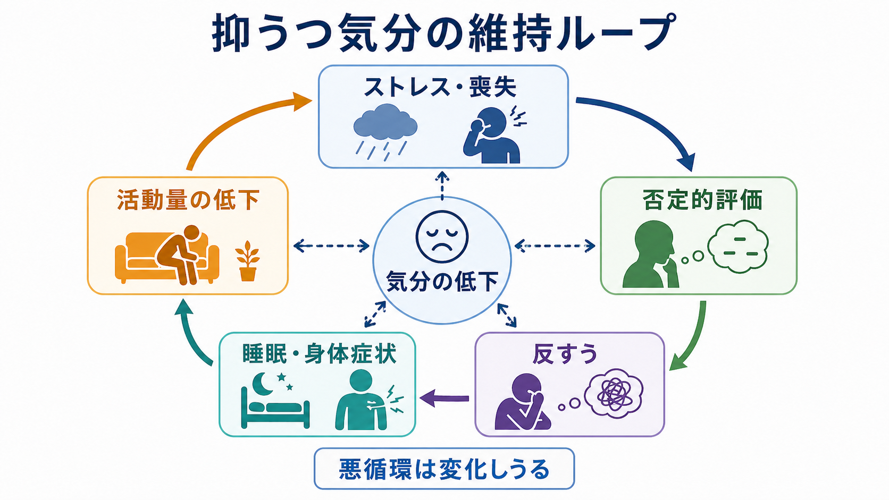
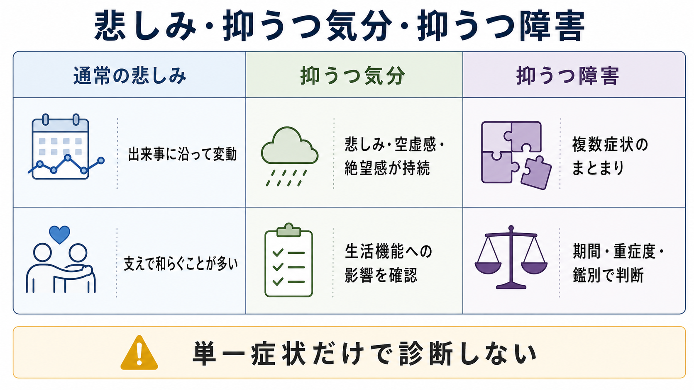

# 抑うつ気分とは何か

## 要点

- 抑うつ気分とは、悲しみ、空虚感、絶望感、気分の落ち込み、場合によってはいらだちとして経験される、持続的な陰性感情の状態である[1][2]。
- 臨床では「落ち込んでいるか」だけでなく、持続時間、日内変動、随伴症状、生活機能への影響、身体疾患・薬剤・喪失体験・双極性障害との鑑別を確認する[1][2]。
- 抑うつ気分は、抑うつ障害の重要な症状だが、それ単独で診断名を意味しない。複数症状のまとまり、期間、重症度、除外条件を合わせて判断する[2]。
- 仕組みは単一原因ではなく、ストレス、否定的認知、反すう、睡眠・身体症状、活動量低下、報酬機会の減少が相互に強め合う過程として理解するとよい[1][5][6][7]。
- 本稿は教育・研究目的の整理であり、個別の診断や治療指示ではない。自傷・自殺の危険がある場合は、地域の救急・危機介入資源につなぐ判断が優先される。

## この記事で答える問い

1. 抑うつ気分は、通常の悲しみや一時的な気分変動と何が違うのか。
2. DSM や ICD では、抑うつ気分はどのような症状として扱われるのか。
3. なぜ抑うつ気分は長引き、生活機能を落としうるのか。
4. 臨床面接や研究では、どのような情報と結びつけて評価するのか。

## まず結論

抑うつ気分は、「気分が暗い」という日常語を少し専門的に言い換えただけの概念ではない。臨床症状としては、本人が悲しみ・空虚感・絶望感・希望のなさを経験し、それが多くの時間にわたり持続し、思考、身体、活動、対人関係、学業・仕事などに影響する状態を指す[1][2]。

ただし、抑うつ気分は診断名ではない。たとえば、喪失後の悲しみ、慢性疼痛、睡眠不足、甲状腺機能異常、薬剤や物質の影響、双極性障害の抑うつエピソードなどでも、抑うつ気分は生じうる。したがって臨床では、[[症状と徴候は何が違うのか|症状]]としての抑うつ気分を丁寧に記述し、[[DSMとICDは何が違うのか|DSM・ICD]] の診断枠組みや鑑別診断へ急ぎすぎず接続することが重要になる。

## 背景

WHO は、抑うつエピソードでは「抑うつ気分」と「興味・喜びの低下」が中心的に現れ、通常の気分変動とは異なって、ほぼ毎日・一日の大部分にわたり少なくとも2週間持続すると説明している[1][4]。NIMH も、うつ病は一時的な悲しみとは異なり、感情、思考、睡眠、食事、仕事などの日常活動に影響しうる疾患で、遺伝、生物学、環境、心理的要因が関与すると整理している[3]。

DSM-5 系の大うつ病エピソード基準では、抑うつ気分は「本人の報告または他者の観察」によって把握される中核症状であり、小児・青年ではいらだちとして表れることもある[2]。同じ基準では、睡眠、食欲、疲労、罪責感、集中困難、精神運動変化、死についての反復思考などの症状、生活機能障害、身体疾患や物質による説明の除外も確認される[2]。

ここから分かるのは、抑うつ気分を「悲しいかどうか」の一点で見ないことの重要性である。臨床的には、気分の内容、持続、強度、変動、随伴症状、生活上の意味、リスク、文脈を合わせて評価する。

## 基本概念

### 抑うつ気分

抑うつ気分とは、悲しみ、空虚感、絶望感、希望のなさ、涙もろさ、重苦しさ、世界が色あせて感じられることなどを含む気分状態である。気分は [[MSEで気分と感情をどう区別するか|MSEでいう気分]] として、比較的持続する内的な感情調を指す。短い表情変化や一瞬の感情反応だけでなく、その人が時間を通じてどのような感情的背景の中にいるかを問う。

### 通常の悲しみとの違い

通常の悲しみは、喪失、失敗、対人葛藤などの出来事に沿って生じ、時間経過や支援、休息、状況の変化によって揺れ動くことが多い。抑うつ気分では、悲しみや空虚感が広い場面に広がり、本人が「理由があって悲しい」というより「何をしても重い」「未来が閉じている」と感じることがある[1][6]。

ただし、悲しみと抑うつ気分は機械的に分けられない。悲嘆の中でも臨床的支援が必要になることはあり、逆に抑うつ気分があっても必ず抑うつ障害と診断されるわけではない。判断には文化、生活史、喪失の文脈、機能障害、リスク評価が必要である[2]。

### 抑うつ気分と抑うつ障害

抑うつ気分は症状であり、抑うつ障害は症状群と期間・重症度・除外条件を合わせた診断カテゴリである。DSM-5 系の基準では、抑うつ気分または興味・喜びの低下の少なくとも一方を含み、複数症状が2週間以上続き、臨床的に意味のある苦痛または機能障害を伴うことが求められる[2]。WHO の説明でも、抑うつエピソードは症状数、重症度、機能への影響によって軽症・中等症・重症に区分される[1]。

## 仕組み

### 単一の原因ではなく、維持ループとして見る

抑うつ気分は「セロトニンが少ないから起きる」といった単純な一因モデルでは説明しにくい。WHO は、うつ病が社会的、心理的、生物学的要因の複雑な相互作用から生じると述べている[1]。神経科学的にも、[[セロトニン仮説はうつ病をどこまで説明できるのか|セロトニン]]、[[報酬系の異常はうつ病をどう説明するのか|報酬系]]、[[炎症仮説はうつ病をどう説明するのか|炎症]]、ストレスと [[海馬萎縮はストレスやうつ病と関係するのか|海馬]]、睡眠、身体疾患などが重なって現れる。

### 認知モデル

Beck の認知モデルに基づくレビューでは、うつ病では否定的スキーマ、注意・記憶・解釈のバイアス、反すうが症状の発生と維持に関与すると整理されている[5]。抑うつ気分が強いと、「自分はだめだ」「世界は助けにならない」「未来は変わらない」という評価が生じやすく、その評価がさらに気分を低下させる。

ここで重要なのは、否定的思考を「本人の性格の弱さ」と見ないことである。抑うつ気分の中では、注意、記憶、身体感覚、疲労、睡眠の乱れが、世界の見え方そのものを変える。[[内受容感覚は感情にどう関わるのか|内受容感覚]]や [[身体と感情はどのようにつながるのか|身体と感情]] の関係を考えると、気分は頭の中だけでなく身体状態と結びついた現象として理解できる。

### 反すうと活動低下

反すうは、つらさの原因や意味を繰り返し考え続ける思考様式であり、抑うつ気分を悪化させ、否定的思考、問題解決の低下、行動の妨げ、社会的支援の摩耗と結びつくことが報告されている[6]。一方、活動量が低下すると、達成感、楽しさ、対人接触、生活リズムなどの報酬機会が減り、気分を持ち上げる経験がさらに減る。行動活性化の文献では、環境内の正の強化との再接続が抑うつへの介入原理として整理されている[7]。

この維持ループは、抑うつ気分を本人の「意志の問題」と見ないためにも役立つ。気分低下、睡眠不良、疲労、反すう、活動低下は互いに影響し、どれか一つだけを切り出すと全体像を見誤りやすい。

## 図解

上の1枚目は、抑うつ気分がストレス・喪失、否定的評価、反すう、睡眠・身体症状、活動量低下と相互に関わる「維持ループ」として描いたものである。これは原因を一つに固定する図ではなく、臨床評価で確認すべき経路を整理するための図である。

2枚目は、通常の悲しみ、抑うつ気分、抑うつ障害を比較した図である。抑うつ気分は重要な症状だが、単一症状だけで診断しないという点を強調している。

### 図解案

今回、記事全体の概念地図も生成対象にしたが、生成結果に別テーマの語が混入したため本文には挿入しなかった。再生成する場合のプロンプト案は次の通り。

> 「抑うつ気分とは何か」というタイトルの日本語インフォグラフィック。中心に「抑うつ気分」、周囲に「悲しみ・空虚感・絶望感」「持続性」「随伴症状」「生活機能」「鑑別」「研究との接続」を配置する。自殺、躁状態、意欲低下、焦燥という語は使わない。診断や治療指示ではなく、臨床症状の教育図として、読みやすい日本語ラベルだけで構成する。

## 臨床・研究との接続

### 面接で確認すること

抑うつ気分を評価するときは、まず本人の言葉をそのまま聞く。「悲しい」「空っぽ」「何も感じない」「朝がつらい」「先が見えない」など、同じ抑うつ気分でも表現は異なる。次に、いつから、どのくらいの時間、どの場面で、何によって強まったり弱まったりするかを確認する。

MSE では、主観的な気分と、面接者が観察する感情表出を分けて記述する。たとえば本人は「つらい」と述べるが表情は平板である、あるいは「大丈夫」と言うが涙ぐむ、というように、主観報告と観察所見がずれることがある。これは矛盾として切り捨てるのではなく、[[精神症候学とは何か|精神症候学]] 的に意味のある情報として扱う。

### 鑑別

鑑別では、少なくとも次を確認する。

| 観点 | 確認する内容 |
|---|---|
| 身体疾患 | 甲状腺疾患、貧血、慢性疼痛、神経疾患、感染症、睡眠障害など |
| 薬剤・物質 | アルコール、鎮静薬、ステロイド、その他の薬剤や物質使用 |
| 喪失・ストレス | 死別、離職、対人関係、介護、トラウマ、経済問題 |
| 双極性障害 | 過去の躁状態・軽躁状態、活動性増加、睡眠欲求低下、衝動性 |
| リスク | 希死念慮、自傷、自殺企図、保護因子、支援資源 |

特にリスクについては、抑うつ気分が強い場合でも「聞くと悪化する」と決めつけず、文脈に応じて [[自殺リスク評価では何を聞くべきか|自殺リスク評価]] を行う必要がある。これは本文の主題である抑うつ気分の説明とは別に、安全確保のための臨床判断である。

### 研究での扱い

研究では、抑うつ気分は自己記入式尺度、面接尺度、生態学的瞬間評価、睡眠・活動量データ、神経画像、炎症指標などと結びつけて測定される。どの測定法も、気分そのものを完全に測るわけではない。何を測っているのか、主観報告か観察か、生理指標か、時間幅はどのくらいかを明確にする必要がある。

## よくある誤解

### 誤解1: 抑うつ気分は「悲しい出来事があったから当然」で終わる

悲しい出来事に伴う気分低下は自然な反応であることが多い。しかし、持続性、広がり、生活機能への影響、身体症状、リスクが強い場合には、出来事の有無だけで軽視しない。文脈を尊重しつつ、現在の苦痛と機能障害を評価する。

### 誤解2: 抑うつ気分があれば、すぐ抑うつ障害である

抑うつ気分は重要な症状だが、診断名ではない。DSM-5 系の基準でも、複数症状、2週間以上の持続、苦痛または機能障害、身体疾患・物質・他の精神疾患による説明の検討が必要である[2]。

### 誤解3: 抑うつ気分は心だけの問題である

抑うつ気分は、睡眠、食欲、疲労、痛み、活動量、対人関係、身体疾患と深く関わる[1][3]。心と身体を分けすぎると、本人の苦痛の全体像を見落としやすい。

### 誤解4: 本人が努力すればすぐ変えられる

活動量低下や反すうは、抑うつ気分の維持ループの一部である[6][7]。本人の努力不足とみなすより、どの要因がどの順序で強まり、どこに支援可能な入口があるかを整理する方が臨床的である。

## 関連ノート

- [[症状と徴候は何が違うのか]]
- [[精神症候学とは何か]]
- [[MSEで気分と感情をどう区別するか]]
- [[DSMとICDは何が違うのか]]
- [[自殺リスク評価では何を聞くべきか]]
- [[セロトニン仮説はうつ病をどこまで説明できるのか]]
- [[報酬系の異常はうつ病をどう説明するのか]]
- [[炎症仮説はうつ病をどう説明するのか]]
- [[海馬萎縮はストレスやうつ病と関係するのか]]
- [[身体と感情はどのようにつながるのか]]

## MOC更新候補

- `content/00_MOC/` 配下の精神医学・症候学・診断面接関連 MOC に、`[[抑うつ気分とは何か]]` を追加候補とする。
- 並列生成ジョブとの競合を避けるため、本タスクでは MOC ファイルを直接更新しない。

## 理解チェック

1. 抑うつ気分と通常の悲しみを区別するとき、期間以外に何を確認する必要があるか。
2. 抑うつ気分は、なぜ単独では診断名にならないのか。
3. 抑うつ気分の維持ループに、反すうと活動量低下はどのように関わるか。
4. MSE で「気分」と「感情表出」を分ける意義は何か。
5. 抑うつ気分があるとき、身体疾患・薬剤・双極性障害・自殺リスクを確認する理由は何か。

## 未解決問題

- 抑うつ気分を、自己報告、行動指標、生理指標、神経画像のどの水準で統合的に定義できるか。
- 反すう、睡眠、活動量、身体症状のどれが個々の症例で主要な維持因子になるかを、短時間の臨床評価でどう見分けるか。
- 文化差や言語差が、抑うつ気分の訴え方、観察される感情表出、診断閾値にどの程度影響するか。
- 抑うつ気分を次元的に測定する研究枠組みと、DSM・ICD のカテゴリ診断をどのように接続するか。

## 参考文献

[1] World Health Organization. (2025). *Depressive disorder (depression)*. WHO Fact Sheet. https://www.who.int/news-room/fact-sheets/detail/depression

[2] Substance Abuse and Mental Health Services Administration. (2016). *DSM-5 Changes: Implications for Child Serious Emotional Disturbance*. Table 9, DSM-IV to DSM-5 Major Depressive Episode/Disorder Comparison. NCBI Bookshelf. https://www.ncbi.nlm.nih.gov/books/NBK519712/table/ch3.t5/

[3] National Institute of Mental Health. (2024). *Depression*. https://www.nimh.nih.gov/health/topics/depression

[4] World Health Organization. (2024). *Clinical descriptions and diagnostic requirements for ICD-11 mental, behavioural and neurodevelopmental disorders*. WHO. https://www.who.int/publications/i/item/9789240077263

[5] Disner, S. G., Beevers, C. G., Haigh, E. A. P., & Beck, A. T. (2011). Neural mechanisms of the cognitive model of depression. *Nature Reviews Neuroscience, 12*, 467-477. https://doi.org/10.1038/nrn3027

[6] Nolen-Hoeksema, S., Wisco, B. E., & Lyubomirsky, S. (2008). Rethinking rumination. *Perspectives on Psychological Science, 3*(5), 400-424. https://doi.org/10.1111/j.1745-6924.2008.00088.x

[7] Ekers, D., Webster, L., Van Straten, A., Cuijpers, P., Richards, D., & Gilbody, S. (2014). Behavioural activation for depression; an update of meta-analysis of effectiveness and sub group analysis. *PLoS ONE, 9*(6), e100100. https://pmc.ncbi.nlm.nih.gov/articles/PMC4061095/
