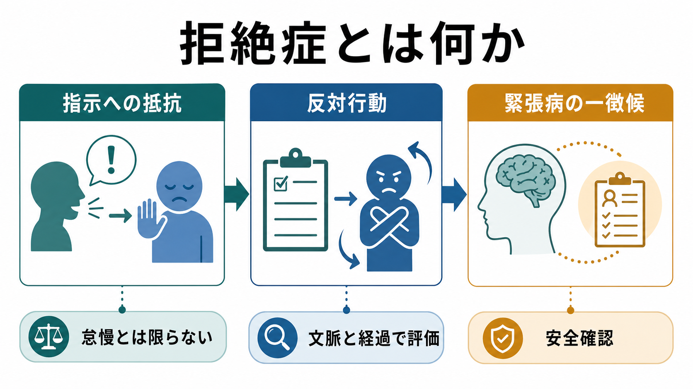
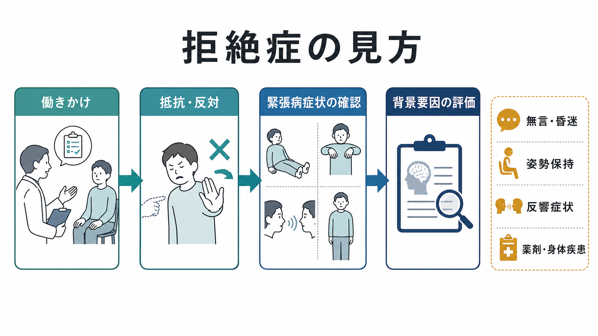

# 拒絶症とは何か

## 要点

- 拒絶症は、指示・働きかけ・診察場面に対して、理由が明確でない抵抗、反対、無反応として観察される症候である。現代の診断体系では、主に緊張病 catatonia の徴候である negativism として扱われる[1][2]。
- 「嫌がっている」「わざと反抗している」と即断するより、[[精神症候学とは何か|精神症候学]]上の観察所見として、他の緊張病徴候、意識水準、身体疾患、薬剤、発達特性、対人文脈と合わせて評価する必要がある[3][4]。
- 拒絶症だけで診断名が決まるわけではない。DSM-5-TR や ICD-11 では、緊張病は複数の徴候の組み合わせとして評価され、拒絶症はそのうちの一要素である[1][2]。
- 本記事は教育・研究目的の概説であり、個別の診断や治療指示ではない。

## この記事で答える問い

1. 拒絶症とは、臨床的にどのような行動を指すのか。
2. 単なる拒否・反抗・不安・強迫行為と何が違うのか。
3. 緊張病、MSE、身体医学的評価とどのようにつながるのか。

## まず結論

拒絶症とは、外からの指示や働きかけに対して、自動的・動機不明に抵抗したり、求められたことと反対の行動を示したりする症候である。英語圏の精神医学では negativism と呼ばれ、DSM-5-TR の緊張病徴候の一つに含まれる[1]。ICD-11 でも、緊張病の特徴として「求めに反対する、または求めと反対に振る舞う」行動が扱われる[2][8]。

重要なのは、拒絶症を人格・態度・協力度の問題として短絡しないことである。本人が意図的に「拒んでいる」ように見えても、緊張病では運動開始、運動停止、模倣、姿勢保持、発語、摂食などの調整が広く乱れることがある[3][7]。したがって、拒絶症は単独のラベルではなく、「どの場面で、どの働きかけに対して、どの程度一貫して、他のどの徴候と一緒に出ているか」を観察するための入口になる。

## 背景

歴史的に緊張病は統合失調症の一型として理解される時期が長かった。しかし現在は、気分障害、精神病性障害、自閉スペクトラム症、神経疾患、自己免疫性脳炎、代謝異常、薬剤・離脱、身体疾患など、多様な背景で生じうる神経精神症候群として扱われる[3][6]。この変化は、[[DSMとICDは何が違うのか|DSMとICD]]においても反映されており、緊張病は単一疾患ではなく、複数の病態にまたがる症候群として位置づけられている[1][2]。

拒絶症は、その緊張病のなかで「外界からの働きかけにどう反応するか」を示す徴候である。たとえば、手を出すよう求めても動かない、診察者が腕を動かそうとすると抵抗する、座るよう促すと立ち続ける、逆方向に動く、といった形で現れる。ただし、これらは痛み、恐怖、被害妄想、失語、せん妄、強迫、文化的背景、対人関係の安全感でも似た見え方をする。拒絶症という語を使うときほど、背景の鑑別が必要になる。

## 基本概念

### 「拒絶」と「拒絶症」は同じではない

日常語の拒絶は、本人が理由をもって断る行為を含む。たとえば、説明に納得できない、侵襲的な処置を避けたい、過去のトラウマから警戒している、といった拒否は、それ自体が症候とは限らない。

一方、精神症候としての拒絶症は、理由や目的が外から見えにくく、場面に不釣り合いで、自動的・反射的にみえる抵抗として記述される。UCL の緊張病診断資料では、DSM-5 の緊張病徴候の一つとして negativism を「指示への自動的で動機不明の抵抗」と説明している[4]。したがって臨床記述では、「拒否した」という結論よりも、「どの指示に、どのように、どのくらい抵抗したか」を書くほうが情報量が多い。

### 緊張病徴候の一部として見る

DSM-5-TR では、緊張病は昏迷、カタレプシー、蝋屈症、無言、拒絶症、姿勢保持、常同症、興奮、しかめ面、反響言語、反響動作などの徴候から構成される[1]。ICD-11 でも、低活動、高活動、異常な精神運動活動を含む広い徴候群として整理され、拒絶症は低活動側の特徴の一つとして比較されている[2][8]。

このため拒絶症を観察したら、[[MSEで外観と行動から何を観察するか|MSEで外観と行動を観察する]]視点で、発語、視線、姿勢、筋緊張、模倣、摂食・水分摂取、バイタルサイン、安全リスクを合わせて見る。緊張病の評価では、観察だけでなく、標準化された診察手順や Bush-Francis Catatonia Rating Scale のような尺度が用いられることがある[4][5]。

## 仕組み

拒絶症の仕組みは、単純な「反抗心」では説明しにくい。緊張病全体では、運動の開始と停止、行為の選択、外界刺激への応答、情動・自律神経反応がまとまって変化する。近年のレビューでは、前頭葉-皮質下回路、GABA、グルタミン酸、ドパミン系などの調整不全が関与する可能性が論じられているが、単一の回路障害に還元できる段階ではない[7]。

臨床的には、次のように考えると理解しやすい。

| 観察される反応 | ありうる意味 | 確認したい周辺情報 |
|---|---|---|
| 指示しても動かない | 運動開始の障害、恐怖、理解困難、意識障害 | 発語、視線、注意、意識水準、痛み |
| 診察者の動きに抵抗する | 拒絶症、筋緊張異常、パラトニア、疼痛 | 筋緊張、左右差、神経学的所見 |
| 指示と反対の動きをする | negativism、両価性、混乱、対人警戒 | 文脈、反復性、他の緊張病徴候 |
| 食べない・飲まない | 拒絶症、昏迷、妄想、抑うつ、嚥下困難 | 脱水、栄養、身体疾患、安全性 |

## 図解

上の2枚の図は、拒絶症を「指示への抵抗」という単一行動としてではなく、緊張病評価のなかの入口として読むためのものである。

1枚目は、拒絶症が「指示への抵抗」「反対行動」「緊張病の一徴候」という三つの面をもつことを示している。2枚目は、働きかけへの抵抗を見たあと、無言・昏迷・姿勢保持・反響症状などの併存徴候と、薬剤・身体疾患などの背景を確認する流れを示している。

## 臨床・研究との接続

### 評価では「拒んだ理由」を決めつけない

拒絶症らしい行動があると、臨床者や周囲は「協力的でない」「治療を拒んでいる」と解釈しやすい。しかし緊張病では、本人の意思表示能力や運動出力が障害されている可能性がある。BAP ガイドラインは、緊張病の診断を臨床観察、面接、身体診察、周辺情報に基づいて行い、背景疾患や緊張病に似た状態を評価する必要を強調している[3]。

実際の評価では、[[精神状態診察MSEとは何か|精神状態診察MSE]]に加えて、意識障害、薬剤性精神症状、神経疾患、脱水、感染、疼痛、自己免疫性脳炎などを考える。とくに[[せん妄とは何か|せん妄]]や低活動性せん妄は、無反応・低活動・摂食低下として緊張病と重なることがある。[[薬剤性精神症状とは何か|薬剤性精神症状]]や離脱も、緊張病様の状態に関わりうる[3][6]。

### 研究では「測定できる徴候」として扱う

拒絶症は主観的体験というより、観察・誘発される徴候として測定される。Bush-Francis Catatonia Rating Scale は、緊張病徴候を標準化して観察する代表的尺度であり、臨床研究や評価の足場として用いられてきた[5][6]。ただし、拒絶症の出現は診察者の指示の出し方、文化的背景、言語理解、身体機能、場面の安全感に影響される。研究で比較するには、評価手順と文脈をそろえる必要がある。

## よくある誤解

### 誤解1: 拒絶症は「わがまま」や「反抗」である

拒絶症は、本人の性格や態度だけで説明するべきではない。緊張病では、運動・発語・行為選択・外界刺激への応答がまとまって障害されることがある[3][7]。臨床記述では、価値判断ではなく観察可能な行動を記録する。

### 誤解2: 拒絶症があれば緊張病と診断できる

拒絶症は緊張病徴候の一つだが、それ単独で緊張病を確定するわけではない。DSM-5-TR と ICD-11 は、複数の徴候の組み合わせとして緊張病を評価する[1][2]。他の徴候、時間経過、身体状態、薬剤、精神疾患の背景を合わせて判断する必要がある。

### 誤解3: 拒絶症と強迫行為は同じである

[[強迫行為とは何か|強迫行為]]は、不安や違和感を下げるため、または恐れている出来事を防ぐために繰り返される行為として理解されることが多い。一方、拒絶症は、外からの指示や働きかけへの抵抗・反対として観察される。どちらも外からは「やめられない」「従えない」ように見えることがあるが、評価すべき駆動因が異なる。

## 関連ノート

既存ノート:

- [[精神症候学とは何か]]
- [[精神状態診察MSEとは何か]]
- [[MSEで外観と行動から何を観察するか]]
- [[DSMとICDは何が違うのか]]
- [[薬剤性精神症状とは何か]]
- [[せん妄とは何か]]
- [[強迫行為とは何か]]

関連ノート候補:

- 緊張病とは何か
- 昏迷とは何か
- 無言症とは何か
- 姿勢保持とは何か
- 反響言語と反響動作とは何か
- 自閉スペクトラム症と緊張病はどう関係するのか

MOC更新候補:

- `content/00_MOC/MOC・精神医学.md`
- `content/00_MOC/MOC・症候学.md`
- `content/00_MOC/MOC・精神状態診察MSE.md`

並列記事生成ジョブとの競合を避けるため、本記事では MOC 本体を更新していない。

## 理解チェック

1. 拒絶症を「単なる反抗」と即断すると、どのような臨床情報を見落としうるか。
2. 拒絶症を見たとき、同時に確認したい緊張病徴候を三つ挙げると何か。
3. 拒絶症と強迫行為を区別するために、本人の体験や行動の目的について何を聞くべきか。
4. 拒絶症がある場合、身体疾患・薬剤・せん妄を考える必要があるのはなぜか。

## 未解決問題

- 拒絶症が、運動制御、恐怖・防衛反応、対人文脈、意思決定のどの成分にどの程度由来するのかは、個人差が大きく、単一モデルでは説明しにくい。
- 緊張病尺度で測定される拒絶症が、文化・言語・診察者の働きかけ方にどの程度影響されるかは、より精密な研究が必要である。
- せん妄、自閉スペクトラム症、重度抑うつ、精神病性障害、神経疾患にまたがる拒絶症様行動を、臨床的にどこまで共通の神経機構として扱えるかは未解決である。

## 参考文献

[1] American Psychiatric Association. (2022). *Diagnostic and Statistical Manual of Mental Disorders, Fifth Edition, Text Revision (DSM-5-TR)*. American Psychiatric Association Publishing. https://doi.org/10.1176/appi.books.9780890425787

[2] World Health Organization. (2024). *Clinical descriptions and diagnostic requirements for ICD-11 mental, behavioural and neurodevelopmental disorders*. World Health Organization. https://www.who.int/publications/i/item/9789240077263

[3] Rogers, J. P., Oldham, M. A., Fricchione, G., Northoff, G., Wilson, J. E., Mann, S. C., et al. (2023). Evidence-based consensus guidelines for the management of catatonia: Recommendations from the British Association for Psychopharmacology. *Journal of Psychopharmacology, 37*(4), 327-369. https://doi.org/10.1177/02698811231158232

[4] University College London, Faculty of Brain Sciences. (n.d.). *Catatonia: Diagnosis*. https://www.ucl.ac.uk/brain-sciences/psychiatry/our-research/catatonia/diagnosis

[5] Bush, G., Fink, M., Petrides, G., Dowling, F., & Francis, A. (1996). Catatonia. I. Rating scale and standardized examination. *Acta Psychiatrica Scandinavica, 93*(2), 129-136. https://doi.org/10.1111/j.1600-0447.1996.tb09814.x

[6] Sienaert, P., Dhossche, D. M., Vancampfort, D., De Hert, M., & Gazdag, G. (2014). A clinical review of the treatment of catatonia. *Frontiers in Psychiatry, 5*, 181. https://doi.org/10.3389/fpsyt.2014.00181

[7] Walther, S., Stegmayer, K., Wilson, J. E., & Heckers, S. (2019). Structure and neural mechanisms of catatonia. *The Lancet Psychiatry, 6*(7), 610-619. https://doi.org/10.1016/S2215-0366(18)30474-7

[8] Rogers, J. P., Wilson, J. E., & Oldham, M. A. (2025). Catatonia in ICD-11. *BMC Psychiatry, 25*, 405. https://doi.org/10.1186/s12888-025-06857-6
