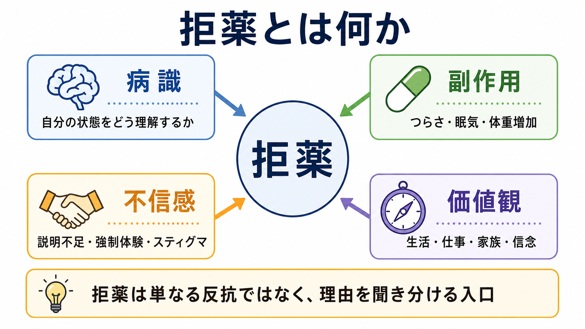
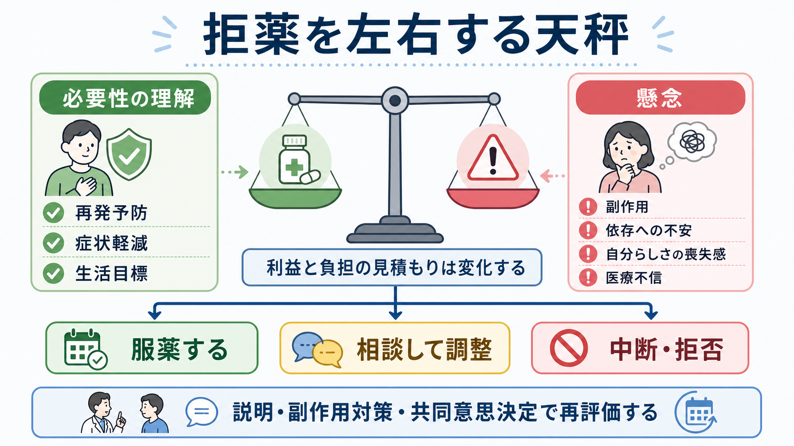
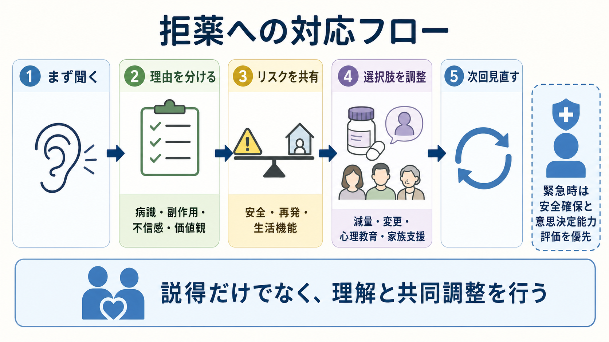

# 拒薬とは何か

## 要点

- 拒薬とは、処方薬を飲むこと、開始すること、継続すること、増量すること、または注射・持効性注射などの薬物療法を受けることを本人が拒む状態である。
- 拒薬は「反抗」「わがまま」「病識がない」の一語で片づけられない。背景には、[[病識とは何か|病識]]、副作用体験、医療者への不信、強制体験、スティグマ、生活上の負担、価値観、認知機能、意思決定能力が重なる[1][2]。
- 精神科では、拒薬が再発、入院、自傷他害リスク、身体合併症の悪化につながることがある一方、本人にとっては「自分を守るための選択」として経験されることもある[3][4]。
- 支援の出発点は説得ではなく、拒む理由を聞き分け、リスクを共有し、本人が受け入れられる選択肢を共同で調整することである[2][7]。
- 本記事は教育・研究目的の整理であり、個別の診断や治療指示ではない。実際の対応では、症状、身体状態、意思決定能力、緊急性、法制度、地域資源を総合して判断する。

## この記事で答える問い

1. 拒薬とは、単なる服薬アドヒアランス低下と何が違うのか。
2. 拒薬の背景には、どのような心理・身体・対人・価値観の要因があるのか。
3. 病識、副作用、不信感、価値観は、どのように服薬判断に影響するのか。
4. 臨床では、拒薬をどのように評価し、支援に接続すればよいのか。

## まず結論

拒薬は、薬を「飲むか飲まないか」という単純な行動ではなく、本人が治療の必要性、薬への懸念、医療者への信頼、生活上の優先順位をどう見積もっているかが表れた臨床的サインである。WHOは長期治療のアドヒアランスを、医療者と合意された推奨に本人の行動がどの程度一致するかとして整理している[1]。この定義で重要なのは、服薬継続が一方的な命令への服従ではなく、合意、理解、実行可能性に依存する点である。

精神科で拒薬が問題になるのは、症状そのものが病識、危険の見積もり、治療者への信頼、判断力に影響しうるからである。たとえば、被害的な確信が強い人にとって薬は「治療」ではなく「操作」や「毒」として経験されることがある。一方で、病識が保たれていても、眠気、体重増加、性機能低下、アカシジア、感情の鈍さ、仕事への影響を理由に拒薬することもある[3][8]。

## 背景

薬を継続できないことは、精神科に限らず慢性疾患医療の中心的課題である。NICEの服薬アドヒアランス指針は、長期疾患で処方された薬の相当数が推奨どおりには使われていないとし、患者を処方薬に関する意思決定へ関与させること、個別の懸念や実行困難を確認することを推奨している[2]。

精神科では、拒薬はさらに複雑になる。統合失調症を対象としたレビューでは、非アドヒアランスに関わる要因として、病識の乏しさ、薬に関する信念、物質使用、治療関係、薬の利益の認識などが整理されている[3]。また、主要な精神疾患を対象にした系統的レビュー・メタ分析では、向精神薬の非アドヒアランスは患者側、臨床・治療側、疾患側、保健医療システム側の多層的要因に影響されると報告されている[4]。

このため拒薬を評価するときは、本人の「飲まない」という行動だけでなく、拒む理由の構造を確認する必要がある。これは[[アドヒアランスとは何か]]、[[インフォームドコンセントは精神科でどう行うのか]]、[[共同意思決定とは何か]]と連続する問題である。

## 基本概念

### 拒薬

拒薬は、処方薬の開始・継続・増量・剤形変更を本人が拒否する状態を指す。入院中に内服を拒む場面だけでなく、外来で処方箋を受け取らない、薬局に行かない、自己判断で減量・中断する、注射薬を拒む、家族や支援者の前では飲んだように見せる、といった形も含まれる。

ただし、拒薬と非アドヒアランスは完全には同じではない。非アドヒアランスには、飲み忘れ、費用、複雑な服薬スケジュール、認知機能低下、薬局へのアクセス困難など、本人が明確に拒んでいない場合も含まれる[1][2]。拒薬はその中でも、本人が「飲まない」「受けたくない」と表明する、または行動として明確に示す状態に焦点を当てる。

### 病識

病識は、自分の体験や困りごとを症状としてどう理解し、治療や支援の必要性をどう捉えるかに関わる。病識が低い場合、薬は「不要なもの」と見えやすい。とくに[[妄想とは何か|妄想]]や[[被害妄想とは何か|被害妄想]]が強い場合、薬が害意の一部として意味づけられることがある。

しかし、病識だけで拒薬を説明するのは粗い。本人が病気や再発リスクを理解していても、副作用や生活上の損失が大きければ拒薬は起こりうる。したがって、[[MSEで病識と判断力をどう評価するか|病識と判断力]]の評価では、「病名を認めるか」だけでなく、治療の利益と負担を自分の生活に結びつけて考えられるかを確認する。

### 副作用

副作用は拒薬のもっとも具体的で、しばしば見落とされる理由である。抗精神病薬では、眠気、体重増加、錐体外路症状、アカシジア、性機能障害、月経異常、代謝異常、感情の平板化として感じられる体験が、服薬への懸念を強める[8]。

重要なのは、医療者が「軽い副作用」と判断しても、本人の生活では重大な意味をもつことがある点である。眠気は仕事や学業に、体重増加は自己像やスティグマに、アカシジアは強い焦燥や希死念慮の悪化に結びつくことがある。副作用を丁寧に聞くことは、単なる安全確認ではなく、治療関係の修復でもある。

### 不信感

不信感は、説明不足、過去の強制入院や身体拘束、家族との対立、医療者の態度、差別経験、文化的背景、薬害や依存への恐れから生じる。治療者が拒薬をただ「問題行動」と扱うと、不信感はさらに強まる。

治療同盟とコミュニケーションは、精神保健領域の治療アドヒアランスと関連することが系統的レビューで示されている[6]。これは「優しくすれば飲む」という単純な話ではなく、治療の目的、役割、選択肢、副作用対策について合意を作る対話が、服薬を検討できる条件を整えるという意味である。ここでは[[治療関係とは何か]]が中心になる。

### 価値観

拒薬は、本人の価値観と衝突しているサインでもある。薬で症状が軽くなっても、「自分らしさが失われる」「創造性が落ちる」「仕事で眠くなる」「家族に薬を知られたくない」「自然な方法を優先したい」と感じる人がいる。これらは医学的に正しいか誤りかだけで扱うより、本人が何を守ろうとしているのかを聞く必要がある。

価値観の確認は、治療を諦めることではない。薬の種類、用量、服薬時間、目標症状、副作用モニタリング、心理教育、家族支援、危機時プランを調整することで、本人にとって受け入れ可能な治療に近づける場合がある[2][7]。

## 仕組み

拒薬を理解する一つの枠組みは、薬の「必要性の理解」と「懸念」の天秤である。必要性-懸念モデルのメタ分析では、薬が必要だという信念が強いほどアドヒアランスは高く、薬への懸念が強いほどアドヒアランスは低い傾向が示されている[5]。

この天秤は固定されない。急性期には本人が必要性を感じにくく、家族や医療者が再発リスクを強く見積もることがある。回復期には副作用や復職への影響が前面に出る。長期維持期には「もう治ったのではないか」「いつまで飲むのか」という問いが強くなる。したがって、拒薬への対応は一度の説明で終わらず、病相、生活状況、副作用、本人の目標に合わせて再評価する必要がある。

拒薬の背景は、次のように分けて考えると面接で扱いやすい。

| 背景 | 具体例 | 面接で確認すること |
|---|---|---|
| 病識・症状理解 | 病気ではない、薬は不要、薬は害だと感じる | 本人は何が起きていると考えているか |
| 副作用・身体感覚 | 眠気、体重増加、アカシジア、性機能、月経、便秘 | 開始・増量との時間関係、生活への影響 |
| 不信感・関係性 | 説明不足、強制体験、医療者への怒り、家族との対立 | 何が信頼を損ねたか、修復可能な点は何か |
| 価値観・生活 | 仕事、学業、育児、宗教・文化、自己像、費用 | 本人が守りたいもの、受け入れ可能な妥協点 |
| 実行困難 | 飲み忘れ、薬局に行けない、複雑な処方、認知機能低下 | 拒否なのか、実行上の障壁なのか |
| リスク・能力 | 自傷他害、セルフネグレクト、せん妄、重い精神病症状 | 緊急性と[[意思決定能力とは何か|意思決定能力]] |

## 図解

図1は、拒薬を病識、副作用、不信感、価値観の4領域から整理している。初回面接では、この4領域をすべて聞く必要はないが、「どこから拒薬が強まっているのか」を見立てると、説得だけに偏りにくくなる。

図2は、必要性と懸念の天秤を示している。本人が薬の利益を理解していても、懸念が大きければ拒薬は起こる。逆に、懸念を言語化できるようになると、薬の変更、副作用対策、心理教育、家族支援、服薬時間の調整など具体的な選択肢を検討しやすくなる。

図3は、拒薬への対応を臨床フローとして整理している。緊急時には安全確保と意思決定能力評価が優先されるが、緊急性が低い場合は、拒薬を対話の失敗ではなく再評価の入口として扱う。

## 臨床・研究との接続

臨床では、拒薬を見たときに三つの問いを分けるとよい。

第一に、安全性である。服薬中断によって、急性精神病症状、躁状態、重いうつ状態、自殺リスク、他害リスク、セルフネグレクト、離脱症状、身体疾患の悪化が切迫していないかを確認する。切迫した危険がある場合は、[[精神科救急では何を優先するべきか|精神科救急]]、法制度、意思決定能力評価、家族・地域支援を含めて対応する。

第二に、拒薬の理由である。「飲みたくないのですね」で終わらせず、「何が一番困るか」「薬で失いたくないものは何か」「前に薬でつらかったことは何か」「どの説明なら納得しやすいか」を聞く。NICEの服薬アドヒアランス指針は、患者が薬を飲まない選択をする可能性も含めて、意思決定への関与、リスクと利益の説明、個別の支援を重視している[2]。

第三に、調整可能性である。薬剤変更、減量、服薬時間の変更、副作用対策、血液検査や身体モニタリング、心理教育、家族同席、訪問支援、長期作用型注射の検討、再発サインの共有などを組み合わせる。NICEの精神病・統合失調症ガイドラインは、抗精神病薬の選択において、副作用、本人の希望、身体モニタリング、アドヒアランスを含めた継続的評価を求めている[8]。

研究では、拒薬は単一のアウトカムではなく、服薬行動、再発、入院、生活機能、治療満足度、治療同盟、意思決定参加感など複数の指標と結びつけて扱う必要がある。共同意思決定介入のCochraneレビューでは、精神健康領域で本人の意思決定参加感を高める可能性はあるが、症状や入院などの長期アウトカムについては不確実性が残ると整理されている[7]。したがって、「拒薬を減らす」だけでなく、本人の理解、納得、生活機能、安全性を同時に評価する設計が重要である。

## よくある誤解

### 誤解1: 拒薬は病識がない証拠である

病識低下は拒薬の重要な要因になりうるが、拒薬のすべてを説明しない。副作用、費用、スティグマ、家族関係、過去の強制体験、仕事への影響、価値観でも拒薬は起こる[3][4]。病識の評価と同時に、本人が何を恐れ、何を守ろうとしているかを確認する。

### 誤解2: 副作用を我慢してもらえばよい

副作用は、服薬継続の「小さな代償」とは限らない。本人の生活機能、身体健康、自己像、対人関係に強く影響する。副作用の訴えを軽視すると、拒薬だけでなく治療者への不信も強まる。副作用は[[薬物療法は神経回路にどう作用するのか|薬物療法]]の一部として、効果と同じ重さで評価する。

### 誤解3: 説明を増やせば拒薬は解決する

情報提供は必要だが、それだけでは不十分なことが多い。本人の懸念、生活条件、価値観、実行可能性を扱わなければ、説明は説得や圧力として受け取られることがある[2][6]。

### 誤解4: 共同意思決定は、治療者が責任を放棄することである

共同意思決定は、医療者が医学的判断を放棄することではない。治療者は、再発リスク、薬の利益と害、代替案、緊急時対応を明確に伝える責任をもつ。そのうえで、本人の価値観と生活条件に照らして、現実的な治療計画を一緒に作る。

## 関連ノート

- [[アドヒアランスとは何か]]
- [[病識とは何か]]
- [[MSEで病識と判断力をどう評価するか]]
- [[共同意思決定とは何か]]
- [[インフォームドコンセントは精神科でどう行うのか]]
- [[意思決定能力とは何か]]
- [[治療関係とは何か]]
- [[精神科治療計画はどのように立てるのか]]
- [[精神科救急では何を優先するべきか]]
- [[妄想とは何か]]
- [[被害妄想とは何か]]
- [[薬物療法は神経回路にどう作用するのか]]

MOC更新候補: `content/00_MOC/` 配下の精神医学、精神科面接、臨床実践・治療、症候学に関するMOC。並列ジョブとの競合を避けるため、本タスクではMOC本体は更新しない。

## 理解チェック

1. 拒薬を「病識がないから」とだけ説明すると、どのような要因を見落としやすいか。
2. 必要性-懸念モデルでは、服薬判断にどの二つの評価が関わるか。
3. 副作用の訴えを軽視すると、拒薬以外にどのような臨床的問題が起こりうるか。
4. 拒薬があるとき、緊急性と意思決定能力を確認すべき場面はどのような場合か。
5. 共同意思決定は、治療者の責任放棄ではなく、どのような責任を含むか。

## 参考文献

[1] World Health Organization. (2003). *Adherence to Long-Term Therapies: Evidence for Action*. https://apps.who.int/iris/handle/10665/42682

[2] National Institute for Health and Care Excellence. (2009). *Medicines adherence: involving patients in decisions about prescribed medicines and supporting adherence (CG76)*. https://www.nice.org.uk/guidance/cg76

[3] Higashi, K., Medic, G., Littlewood, K. J., Diez, T., Granström, O., & De Hert, M. (2013). Medication adherence in schizophrenia: Factors influencing adherence and consequences of nonadherence, a systematic literature review. *Therapeutic Advances in Psychopharmacology, 3*(4), 200-218. https://doi.org/10.1177/2045125312474019

[4] Semahegn, A., Torpey, K., Manu, A., Assefa, N., Tesfaye, G., & Ankomah, A. (2020). Psychotropic medication non-adherence and its associated factors among patients with major psychiatric disorders: A systematic review and meta-analysis. *Systematic Reviews, 9*, 17. https://doi.org/10.1186/s13643-020-1274-3

[5] Horne, R., Chapman, S. C. E., Parham, R., Freemantle, N., Forbes, A., & Cooper, V. (2013). Understanding patients' adherence-related beliefs about medicines prescribed for long-term conditions: A meta-analytic review. *PLOS ONE, 8*(12), e80633. https://doi.org/10.1371/journal.pone.0080633

[6] Thompson, L., & McCabe, R. (2012). The effect of clinician-patient alliance and communication on treatment adherence in mental health care: A systematic review. *BMC Psychiatry, 12*, 87. https://doi.org/10.1186/1471-244X-12-87

[7] Aoki, Y., Yaju, Y., Utsumi, T., Sanyaolu, L., Storm, M., Takaesu, Y., Watanabe, K., Watanabe, N., Duncan, E., & Edwards, A. G. K. (2022). Shared decision-making interventions for people with mental health conditions. *Cochrane Database of Systematic Reviews, 2022*(11), CD007297. https://doi.org/10.1002/14651858.CD007297.pub3

[8] National Institute for Health and Care Excellence. (2014, last reviewed 2025). *Psychosis and schizophrenia in adults: Prevention and management (CG178)*. https://www.nice.org.uk/guidance/cg178

## 未解決問題

- 拒薬への支援介入を、症状改善、再発予防、本人の納得感、治療同盟、生活機能のどの指標で評価するのがよいか。
- 共同意思決定を重視しながら、急性期の安全確保や意思決定能力低下にどう対応するか。
- 副作用対策、心理教育、家族支援、ピアサポート、デジタル支援を、どの順序と組み合わせで提供すると拒薬の背景に届きやすいか。
