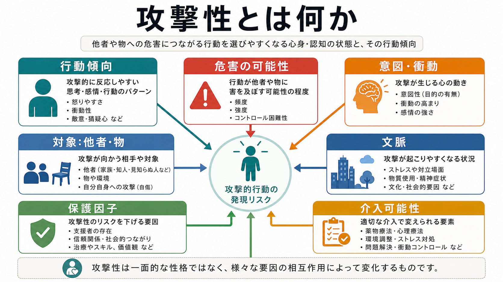
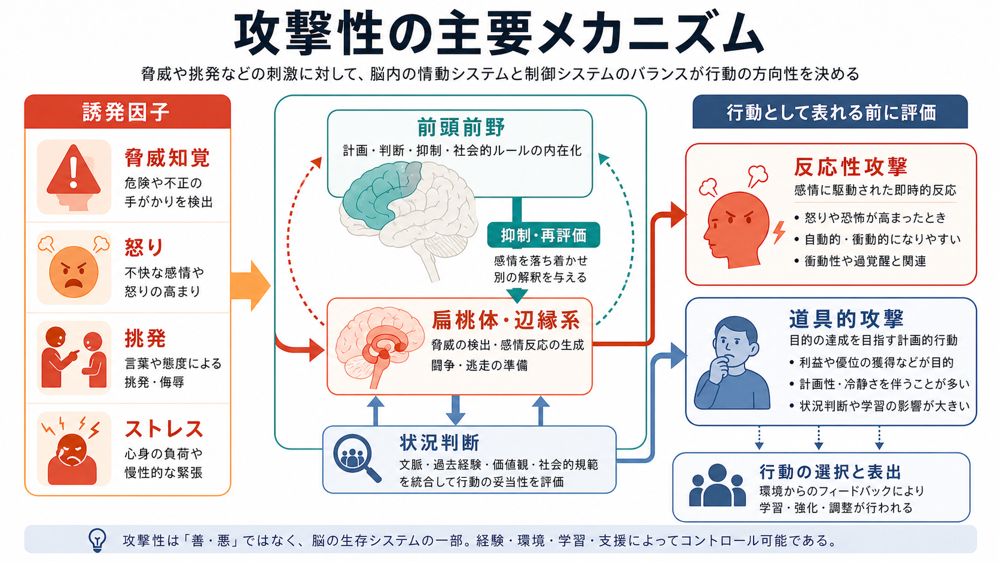

# 攻撃性とは何か

## 要点

- 攻撃性とは、他者・自己・物への危害、威嚇、支配、損壊につながりうる行動傾向であり、単なる「怒りっぽさ」や「悪い性格」と同一ではない。
- 評価では、攻撃的な発言や感情だけでなく、過去の行動、意図、計画性、衝動性、対象、手段へのアクセス、物質使用、妄想的恐怖、保護因子を統合する。
- 攻撃性には、脅威や挑発への急性反応として生じやすい反応性攻撃と、目的達成のために使われる道具的攻撃がある[1][2]。
- リスク評価は「誰が危険か」を固定的に決める作業ではなく、「どの条件で危害が起こりやすく、何を変えると下げられるか」を構造化して考える作業である[7][8]。

## この記事で答える問い

1. 攻撃性は怒り、易怒性、暴力とどのように違うのか。
2. 反応性攻撃と道具的攻撃は、リスク評価でなぜ分けて考えるのか。
3. 神経心理学的には、どのような仕組みが攻撃的行動の起こりやすさに関わるのか。
4. 臨床・研究では、どのように安全確保と支援計画へつなげるのか。

## まず結論

攻撃性は、感情そのものではなく、危害につながりうる行動傾向である。怒りや[[易怒性とは何か|易怒性]]は攻撃性を高めることがあるが、怒っていても攻撃しない人は多く、逆に冷静な計画のもとで攻撃が行われることもある。したがって、攻撃性の評価では「怒っているか」だけでなく、「何を対象に、どの程度の意図・計画・衝動性・手段・文脈があるか」を見る必要がある[1][3]。

リスク評価の観点では、攻撃性を個人の本質として断定しない。過去の暴力、物質使用、急性の恐怖や被害的確信、睡眠不足、支援の乏しさなどが重なるとリスクは上がり、治療同盟、支援者、安全な環境、問題解決スキル、再評価の仕組みがあると下がりうる[7][8]。

## 背景

WHOは暴力を、身体的力や権力の意図的使用が、傷害、死亡、心理的危害、発達阻害、剥奪につながる、またはその可能性が高いものとして定義している[1]。この定義は、暴力を身体的損傷だけに狭めず、威嚇、支配、心理的危害も含めて考える点で、攻撃性のリスク評価に重要である。

心理学では、攻撃性は典型的に「他者に危害を与えることを意図した行動」と定義される[2]。ただし臨床では、意図が曖昧な場合、認知症やせん妄、精神病症状、物質中毒、強い恐怖のもとで結果として危害に至る場合もある。そのため、研究上の定義と臨床上の安全評価を区別しつつ、行動、意図、能力、文脈を一緒に見る必要がある。

## 基本概念

### 怒り・易怒性・攻撃性・暴力

| 概念 | 中心 | 評価で見ること |
|---|---|---|
| 怒り | 不公平、脅威、妨害への情動反応 | 強さ、持続、誘因、調整可能性 |
| [[易怒性とは何か|易怒性]] | 小さな刺激で怒り反応が起こりやすい状態 | 閾値、頻度、場面横断性、機能障害 |
| 攻撃性 | 危害につながりうる行動傾向 | 対象、意図、衝動性、計画性、手段、保護因子 |
| 暴力 | 実際の危害、または危害可能性の高い力・権力の使用 | 被害の程度、反復性、法的・安全上の対応 |

攻撃性は、[[焦燥とは何か|焦燥]]、[[過覚醒とは何か|過覚醒]]、[[恐怖とは何か|恐怖]]、[[不安とは何か|不安]]、[[被害妄想とは何か|被害妄想]]、[[躁状態とは何か|躁状態]]、物質使用など、複数の状態と結びつく。ここで重要なのは、症状名から危険を機械的に推定しないことである。リスクは診断名ではなく、状態、行動歴、環境、保護因子の組み合わせとして評価する。

### 反応性攻撃と道具的攻撃

反応性攻撃は、脅威、挑発、羞恥、恐怖、怒りに対する急性反応として生じやすい。衝動的で、後から本人が後悔することもある。道具的攻撃は、金銭、支配、回避、報復、地位確保などの目的を達成する手段として使われる攻撃で、計画性が高い場合がある[3]。

この区別はリスク管理に直結する。反応性攻撃では、刺激の低減、睡眠、物質使用への介入、恐怖や[[妄想とは何か|妄想]]の評価、感情調整支援が重要になる。道具的攻撃では、標的、利益、計画、手段、監督、環境調整、法的・組織的対応をより明確に検討する。

## 仕組み

攻撃的行動は単一の脳部位で決まるわけではない。大まかには、脅威を検出する扁桃体・辺縁系、報酬や習慣に関わる線条体、衝動抑制や再評価に関わる前頭前野、身体覚醒、自律神経、社会的学習が相互作用する[5][6]。

神経心理学的には、危険信号が強く、前頭前野による抑制や再評価が弱く、報酬予測や習慣が攻撃的反応を強化すると、攻撃性は高まりやすい。たとえば「相手が自分を攻撃するつもりだ」という解釈、アルコールや薬物による抑制低下、睡眠不足、慢性的ストレス、過去の暴力経験は、状況判断を狭めることがある[5][6]。

ただし、この説明は「脳がそうだから避けられない」という意味ではない。攻撃性は発達、学習、環境、関係性、治療、支援によって変わりうる。リスク評価で静的因子と動的因子を分ける理由もここにある。

## 図解

## 臨床・研究との接続

### リスク評価は予言ではない

攻撃性のリスク評価は、「この人は危険な人だ」と固定的に決める作業ではない。HCR-20に代表される構造化専門家判断では、過去の暴力や早期問題などの歴史的因子、現在変化しうる臨床因子、将来の管理因子を組み合わせ、リスクシナリオと管理計画を立てる[7]。

研究上も、暴力リスク評価ツールは完全な予測装置ではなく、情報収集と意思決定を構造化する道具として理解する必要がある。系統的レビューでは、多くのツールに一定の予測妥当性はあるが、個人単位の断定には限界があり、介入可能な因子と継続的な再評価が重要である[8]。

### 見るべき軸

| 軸 | 具体例 | 意味 |
|---|---|---|
| 過去の行動 | 暴力、威嚇、物損、ストーキング、自傷他害 | 最も重要な静的情報の一つ |
| 現在の状態 | 怒り、恐怖、[[被害妄想とは何か|被害妄想]]、混乱、[[意識障害とは何か|意識障害]] | 急性リスクを左右する |
| 衝動性・計画性 | 突発的か、標的・手段・時期があるか | 管理方法が変わる |
| 手段へのアクセス | 武器、車、薬物、対象者への接近可能性 | 危害の実行可能性 |
| 物質・睡眠 | アルコール、薬物、離脱、睡眠不足 | 抑制低下と誤判断に関わる |
| 保護因子 | 支援者、治療同盟、安全な住環境、問題解決力 | リスクを下げる資源 |

### 医療・支援場面での注意

医療・精神医学の文脈では、攻撃性を教育・研究目的で理解することと、個別事例に診断や危険性を断定することは別である。実際の危険が差し迫る場合は、本人と周囲の安全確保を優先し、地域の緊急支援、医療機関、危機対応、法的制度を含めた適切な支援につなげる必要がある。

## よくある誤解

### 「怒っている人は攻撃する」

怒りは攻撃性の一因になりうるが、同義ではない。怒りを感じても、言語化、距離を取る、支援を求める、再評価するなどの調整ができれば、危害には至らない。

### 「精神疾患があれば暴力リスクが高い」

診断名だけでリスクを判断してはいけない。実際の評価では、過去の暴力、物質使用、急性症状、環境、支援、治療継続、手段へのアクセスを総合する。精神疾患をもつ人全体を危険視する理解は、スティグマを強め、支援へのアクセスを妨げる。

### 「リスク評価は当たるか外れるかの占いである」

リスク評価の目的は、未来を一回で言い当てることではない。起こりうるシナリオを整理し、危険を下げる具体策を立て、状況が変われば再評価することである[7][8]。

## 関連ノート

- [[精神症候学とは何か]]
- [[易怒性とは何か]]
- [[焦燥とは何か]]
- [[過覚醒とは何か]]
- [[恐怖とは何か]]
- [[不安とは何か]]
- [[被害妄想とは何か]]
- [[躁状態とは何か]]
- [[意識障害とは何か]]
- [[認知機能障害とは何か]]

MOC更新候補: バッチ統合時に、精神医学・症候学または臨床リスク評価関連のMOCへ追加する。

## 理解チェック

1. 攻撃性と怒り・易怒性・暴力の違いを、それぞれ一文で説明できるか。
2. 反応性攻撃と道具的攻撃では、評価すべき情報がどのように違うか。
3. リスク評価で、静的因子・動的因子・保護因子を分ける理由は何か。
4. 診断名だけで暴力リスクを判断してはいけない理由は何か。

## 未解決問題

- 攻撃性の神経回路モデルを、個別支援の選択にどこまで直接使えるかはまだ限定的である。
- リスク評価ツールは有用だが、個人単位の予測には限界があり、文化、制度、支援資源の違いをどう扱うかが課題である。
- スティグマを避けながら、安全確保に必要な情報を共有する実践的枠組みは、臨床・福祉・司法の連携の中でさらに整備が必要である。

## 参考文献

[1] World Health Organization. (2002). *World report on violence and health*. WHO. https://www.who.int/publications/i/item/9241545615

[2] Anderson, C. A., & Bushman, B. J. (2002). Human aggression. *Annual Review of Psychology*, 53, 27-51. https://doi.org/10.1146/annurev.psych.53.100901.135231

[3] Dodge, K. A., & Coie, J. D. (1987). Social-information-processing factors in reactive and proactive aggression in children's peer groups. *Journal of Personality and Social Psychology*, 53(6), 1146-1158. https://doi.org/10.1037/0022-3514.53.6.1146

[4] Buss, A. H., & Perry, M. (1992). The Aggression Questionnaire. *Journal of Personality and Social Psychology*, 63(3), 452-459. https://doi.org/10.1037/0022-3514.63.3.452

[5] Davidson, R. J., Putnam, K. M., & Larson, C. L. (2000). Dysfunction in the neural circuitry of emotion regulation: a possible prelude to violence. *Science*, 289(5479), 591-594. https://doi.org/10.1126/science.289.5479.591

[6] Blair, R. J. R. (2016). The neurobiology of impulsive aggression. *Journal of Child and Adolescent Psychopharmacology*, 26(1), 4-9. https://doi.org/10.1089/cap.2015.0088

[7] Douglas, K. S., Hart, S. D., Webster, C. D., Belfrage, H., Guy, L. S., & Wilson, C. M. (2014). Historical-Clinical-Risk Management-20, Version 3 (HCR-20V3): development and overview. *International Journal of Forensic Mental Health*, 13(2), 93-108. https://doi.org/10.1080/14999013.2014.906519

[8] Singh, J. P., Grann, M., & Fazel, S. (2011). A comparative study of violence risk assessment tools: a systematic review and metaregression analysis of 68 studies involving 25,980 participants. *Clinical Psychology Review*, 31(3), 499-513. https://doi.org/10.1016/j.cpr.2010.11.009
