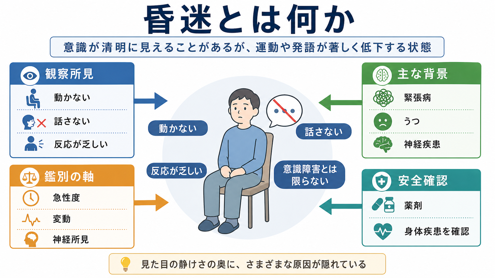
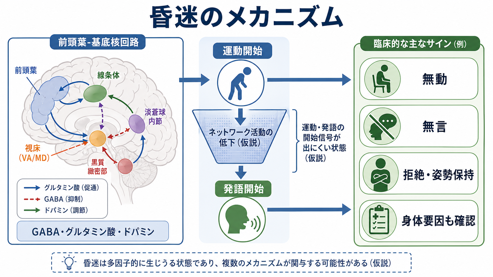
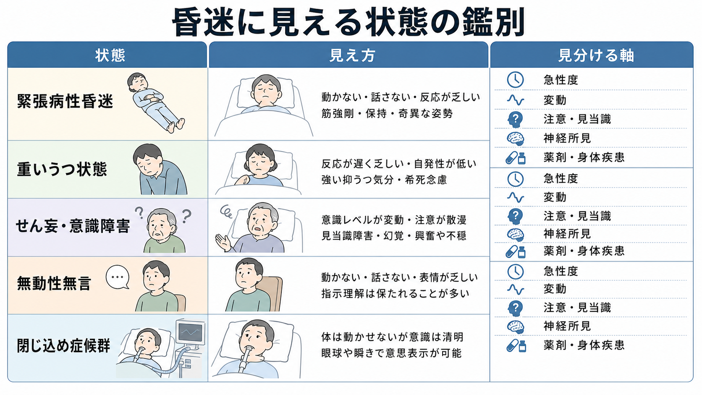

# 昏迷とは何か

## 要点

- 昏迷は、外から見ると「起きているように見えるのに、動かない・話さない・反応が乏しい」状態を指す症候である。
- 重要なのは、昏迷をただちに[[意識障害とは何か|意識障害]]や「本人の拒否」とみなさないことである。意識や理解が保たれていても、運動や発語の開始が著しく障害されることがある。
- 精神医学では、昏迷は[[精神症候学とは何か|症候学]]上の記述であり、特に緊張病の中核的徴候の一つとして扱われる。DSM-5-TR や ICD-11 の緊張病基準でも、昏迷、無言、拒絶、姿勢保持などが重視される[1][2]。
- 一方で、重いうつ状態、せん妄、薬剤性鎮静、無動性無言、閉じ込め症候群、てんかん、脳血管障害、代謝異常なども似た見え方をとりうる[1][6][7]。
- 本稿は教育・研究目的の整理であり、個別の診断や治療指示ではない。急性発症、発熱、自律神経症状、脱水、摂食・飲水不能、神経局在症状、薬剤変更、物質使用がある場合は、臨床的な緊急評価が必要になる。

## この記事で答える問い

1. 昏迷は「意識がない状態」と何が違うのか。
2. 緊張病性昏迷では、どのような運動・発語・行動の変化が見られるのか。
3. 似て見えるうつ状態、せん妄、無動性無言、閉じ込め症候群をどの軸で分けて考えるのか。
4. 臨床・研究では、昏迷をどのように観察し、記述するのがよいのか。

## まず結論

昏迷は、診断名ではなく「反応性、運動、発語が著しく低下している」という観察所見である。ポイントは、反応が乏しい理由を一つに決めつけず、少なくとも三つの層に分けて見ることである。第一に、覚醒や注意の水準が低下しているのか。第二に、覚醒していても運動や発語を開始できないのか。第三に、恐怖、抑うつ、精神病症状、薬剤、神経疾患、身体疾患が行動出力を抑えているのかである。

緊張病の文脈では、昏迷は「精神運動活動がほとんどない、または外界に能動的に関わらない」状態として理解される。DSM-5-TR では緊張病の特徴として、昏迷、無言、カタレプシー、蝋屈症、拒絶、姿勢保持、常同症、反響言語、反響動作などが挙げられ、一定数以上の徴候の組み合わせで判断される[2][8]。ただし、昏迷だけで緊張病と決まるわけではない。

## 背景

日常語では「ぼんやりしている」「反応がない」「固まっている」と表現される状態が、臨床ではかなり異なる意味を持つ。眠気や意識混濁で反応が落ちている場合もあれば、強い抑うつで動けない場合もある。さらに、本人は理解しているのに身体を動かせない、または発語できない神経疾患もある。

精神医学史では、昏迷は緊張病と深く結びついてきた。かつて緊張病は統合失調症の一型とみなされやすかったが、現在の DSM-5-TR や ICD-11 では、気分症、精神病性障害、神経疾患、自己免疫性脳炎、薬剤・物質、代謝異常など多様な背景で起こる症候群として整理されている[1][5]。この変化は、昏迷を「精神科だけの症状」と狭く扱わないために重要である。

## 基本概念

### 昏迷は観察所見である

昏迷は、患者の内的体験を直接示す言葉ではない。外から見えるのは、動作の著しい減少、発語の乏しさ、表情変化の少なさ、視線の固定、刺激への反応低下である。したがって、[[MSEで外観と行動から何を観察するか|外観と行動]]、[[MSEで話し方から何がわかるのか|話し方]]、[[MSEで認知機能をどう評価するか|認知機能]]、身体診察を合わせて記述する必要がある。

たとえば「昏迷」とだけ書くより、「開眼して座位を保つが自発運動はほぼなく、声かけに視線を向けるのみで発語なし。痛み刺激への逃避はあり、拒絶的な筋緊張を伴う」のように、反応の種類を分けて書く方が後から検討しやすい。

### 緊張病性昏迷

緊張病は、運動、発語、姿勢、反応性、反復行動、自律神経症状などがまとまって変化する精神運動症候群である。BAP ガイドラインは、緊張病を運動、発語、複雑行動、自律神経活動にまたがる重い神経精神症候群として整理し、昏迷、無言、摂食低下のような「活動開始の失敗」と、姿勢保持や常同症のような「活動停止の失敗」の両方を含むと説明している[1]。

この意味で、緊張病性昏迷は単なる「静かさ」ではない。無言、拒絶、凝視、姿勢保持、蝋屈症、反響症状、興奮との交代、摂食・飲水低下、自律神経不安定などを伴うかどうかが問題になる。

### 意識障害との違い

昏迷という言葉は、神経学では意識水準の低下を指す文脈でも使われる。そのため混乱が起きやすい。精神医学的な昏迷では、見かけ上反応が乏しくても、意識や理解が保たれている場合がある。一方、[[せん妄とは何か|せん妄]]や[[意識障害とは何か|意識障害]]では、注意、覚醒、見当識が急性に変動し、環境への気づきが不安定になりやすい。

したがって、昏迷を見たときは「意識が清明か否か」を一回の印象で決めず、覚醒、注意、見当識、指示理解、痛み刺激への反応、眼球運動、随意運動、自律神経、時間経過を分けて評価する。

## 仕組み

昏迷の仕組みは一つではない。緊張病性昏迷では、前頭葉、基底核、視床、辺縁系、運動開始に関わる回路、GABA・グルタミン酸・ドパミンなどの神経伝達系の変化が関与する可能性が論じられている[1]。ただし、現時点では単一の神経機構で説明できる状態ではなく、複数の病態が似た行動表現に収束していると考える方がよい。

無動性無言では、前部帯状皮質や前頭葉-皮質下回路の障害により、覚醒しているように見えても自発運動と発語が著しく低下することがある[6]。閉じ込め症候群では、意識や認知が保たれていても、橋腹側などの障害により四肢麻痺と構音不能が生じ、垂直眼球運動や瞬目で意思表示することがある[7]。この二つは、昏迷に見えるが精神運動症候群だけでは説明できない代表例である。

## 図解

昏迷を読むときは、次の三段階で考えると整理しやすい。

| 観察軸 | 見ること | 代表的に考える背景 |
|---|---|---|
| 覚醒・注意 | 開眼、呼名反応、注意持続、見当識、日内変動 | せん妄、薬剤性鎮静、代謝異常、感染、神経疾患 |
| 運動・発語の開始 | 自発運動、発語、指示への反応、拒絶、姿勢保持 | 緊張病、無動性無言、重いうつ状態、精神病症状 |
| 神経・身体所見 | 眼球運動、麻痺、筋緊張、けいれん、発熱、自律神経、脱水 | 脳血管障害、てんかん、脳炎、悪性緊張病、薬剤・物質 |

## 臨床・研究との接続

臨床では、昏迷は安全性の評価と直結する。動かない、食べない、飲まない、話さない状態では、脱水、栄養不良、誤嚥、褥瘡、静脈血栓、感染、外傷、自傷他害リスクの見落としが問題になる。悪性緊張病や神経弛緩薬悪性症候群のように、発熱、筋強剛、自律神経不安定を伴う状態では緊急度が高い[1]。

評価では、[[精神状態診察MSEとは何か|MSE]]だけでなく、バイタル、身体診察、薬剤歴、物質使用歴、神経学的所見、検査、家族・支援者からの経過情報を統合する。[[器質性精神障害を見逃さないためには何を見るべきか]]、[[薬剤性精神症状とは何か]]、[[物質使用歴はどのように聞くべきか]]とも接続する。

研究では、緊張病の評価に Bush-Francis Catatonia Rating Scale（BFCRS）が広く使われる。Bush らは、緊張病徴候を標準化して記述するために 23 項目の評価尺度と 14 項目のスクリーニング尺度を提案した[3]。その後のシステマティックレビューでも、BFCRS は臨床で使いやすく信頼性のある尺度として位置づけられている[4]。ただし、尺度は診断名を自動的に出す装置ではなく、観察所見を漏れなく拾うための道具である。

## よくある誤解

### 「反応しないなら意識がない」

誤りである。閉じ込め症候群では意識が保たれていても発語や四肢運動ができないことがある[7]。緊張病や無動性無言でも、外から見える反応の乏しさと内的な理解・経験は一致しない場合がある。反応の乏しさを「意識なし」と短絡しないことが重要である。

### 「昏迷は統合失調症だけの症状である」

誤りである。緊張病は統合失調症だけでなく、気分症、神経疾患、自己免疫性脳炎、代謝異常、薬剤・物質、発達症、身体疾患など多様な背景で生じうる[1][5]。診断名よりも、発症時期、経過、身体所見、薬剤歴、神経所見を確認する。

### 「動かないのは拒否や怠けである」

危険な誤解である。拒絶のように見える行動も、緊張病の徴候、恐怖、妄想、解離、抑うつ、神経疾患、疼痛、鎮静、せん妄で起こりうる。本人の意図の問題として片づける前に、医学的・心理社会的背景を確認する必要がある。

### 「ロラゼパム反応があれば必ず緊張病、なければ緊張病ではない」

単純化しすぎである。BAP ガイドラインでは、ベンゾジアゼピンや ECT が緊張病治療の重要な選択肢として扱われるが、反応性だけで診断全体を決めるのではなく、病歴、身体所見、鑑別、合併症、背景疾患を含めて考える必要がある[1]。

## 関連ノート

- [[精神症候学とは何か]]
- [[精神運動制止とは何か]]
- [[意識障害とは何か]]
- [[せん妄とは何か]]
- [[MSEで外観と行動から何を観察するか]]
- [[MSEで話し方から何がわかるのか]]
- [[MSEで認知機能をどう評価するか]]
- [[器質性精神障害を見逃さないためには何を見るべきか]]
- [[薬剤性精神症状とは何か]]
- [[精神科救急では何を優先するべきか]]

## MOC更新候補

- `content/00_MOC/MOC｜症候学.md` に [[昏迷とは何か]] を追加する候補。
- `content/00_MOC/MOC｜意識・自己・身体性.md` に、意識障害・行動反応の限界に関する関連ノートとして追加する候補。

## 理解チェック

1. 昏迷を「意識がない」と即断してはいけない理由は何か。
2. 緊張病性昏迷で、昏迷以外に観察したい徴候を三つ挙げると何か。
3. せん妄と昏迷を分けるとき、急性度・変動・注意・見当識はどのように役立つか。
4. 無動性無言や閉じ込め症候群が、精神医学的な昏迷と紛らわしい理由は何か。
5. 「拒否しているだけ」と解釈する前に確認すべき医学的背景は何か。

## 参考文献

[1] Rogers, J. P., Oldham, M. A., Fricchione, G., et al. (2023). Evidence-based consensus guidelines for the management of catatonia: Recommendations from the British Association for Psychopharmacology. *Journal of Psychopharmacology, 37*(4), 327-369. https://doi.org/10.1177/02698811231158232

[2] UCL Faculty of Brain Sciences. Diagnosis: Catatonia. https://www.ucl.ac.uk/brain-sciences/psychiatry/our-research/catatonia/diagnosis

[3] Bush, G., Fink, M., Petrides, G., Dowling, F., & Francis, A. (1996). Catatonia. I. Rating scale and standardized examination. *Acta Psychiatrica Scandinavica, 93*(2), 129-136. https://pubmed.ncbi.nlm.nih.gov/8686483/

[4] Sienaert, P., Rooseleer, J., & De Fruyt, J. (2011). Measuring catatonia: A systematic review of rating scales. *Journal of Affective Disorders, 135*(1-3), 1-9. https://doi.org/10.1016/j.jad.2011.02.012

[5] Rogers, J. P., Wilson, J. E., & Oldham, M. A. (2025). Catatonia in ICD-11. *BMC Psychiatry, 25*, 405. https://doi.org/10.1186/s12888-025-06857-6

[6] Mega, M. S., & Cohenour, R. C. (1997). Akinetic mutism: Disconnection of frontal-subcortical circuits. *Neuropsychiatry, Neuropsychology, and Behavioral Neurology, 10*(4), 254-259. https://pubmed.ncbi.nlm.nih.gov/9359123/

[7] Smith, E., & Delargy, M. (2005). Locked-in syndrome. *BMJ, 330*(7488), 406-409. https://pmc.ncbi.nlm.nih.gov/articles/PMC549115/

[8] American Psychiatric Association. (2022). *Diagnostic and Statistical Manual of Mental Disorders, Fifth Edition, Text Revision*. https://doi.org/10.1176/appi.books.9780890425787

## 未解決問題

- 昏迷に見える低活動状態のうち、緊張病、重いうつ状態、無動性無言、せん妄をどこまで客観的指標で区別できるか。
- 緊張病の神経機構を、GABA・グルタミン酸・ドパミン、前頭葉-基底核回路、情動・恐怖回路のどの階層で統合して説明するのがよいか。
- 内的経験が保たれているが外からは反応が乏しい状態を、臨床現場でどう尊重し、意思疎通支援に接続するか。
