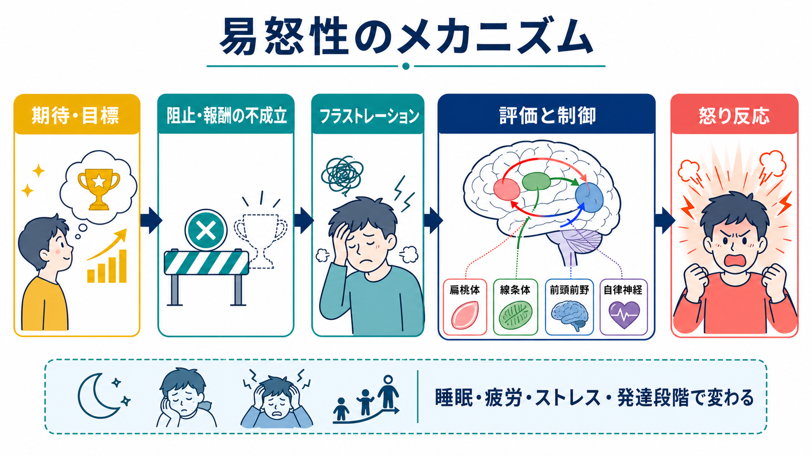
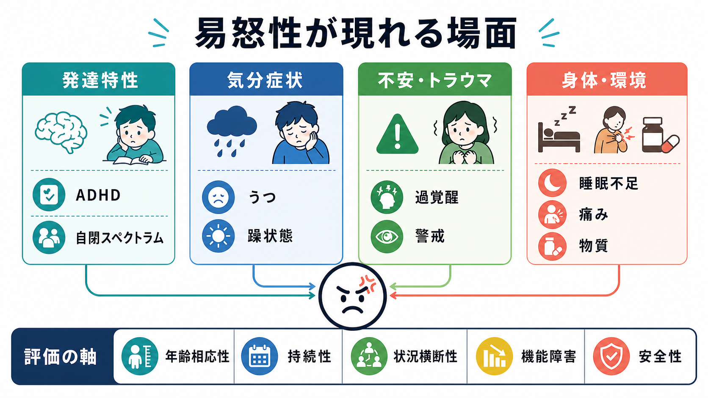
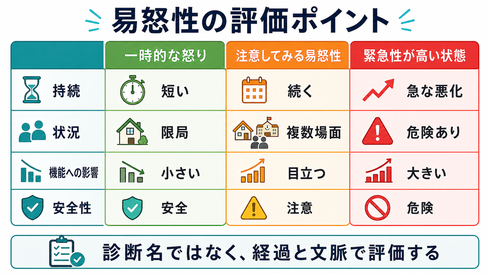

# 易怒性とは何か

## 要点

- 易怒性とは、些細な刺激や欲求不満に対して怒り・いらだち・爆発的反応が起こりやすい状態である。
- 診断名ではなく、[[精神症候学とは何か]]で扱う横断的な症状・次元として理解する。
- 評価では「怒ったかどうか」だけでなく、閾値、頻度、持続、強さ、状況横断性、生活機能への影響、安全性を確認する。
- 小児では発達水準との比較が重要で、成人でもうつ病、不安、トラウマ反応、物質、睡眠不足、疼痛などの背景で目立つことがある。

## この記事で答える問い

1. 易怒性は、普通の怒りや不機嫌と何が違うのか。
2. どのような精神医学的・身体的・環境的背景で現れやすいのか。
3. 臨床や研究では、どの軸で評価すると整理しやすいのか。

## まず結論

易怒性は「怒りっぽい性格」と同義ではない。より正確には、怒り反応が起こる閾値が低い、怒りの強さが大きい、収まりにくい、複数の場面で繰り返される、本人や周囲の生活機能を損なう、という症候の組み合わせとして評価する。近年のレビューでは、易怒性は特定の診断に閉じず、発達精神病理、気分症状、外在化症状、内在化症状を横断する重要な構成概念として扱われている[1]。

## 背景

怒りは本来、障害物、不公平、脅威、侵害に反応して行動を準備する適応的な感情である。しかし、反応が年齢や文脈に比べて強すぎる、頻回すぎる、長引きすぎる、または安全や対人関係を損なう場合、臨床的な易怒性として扱う必要が出てくる。

小児・青年では、重度の慢性的な易怒性と激しいかんしゃくが破壊的気分調節症の中核症状として位置づけられている。NIMH は、DMDD では持続するいらだちや怒り、頻回で強いかんしゃくが家庭・学校・友人関係など複数場面の機能障害につながると説明している[2]。ただし、易怒性そのものは DMDD だけの症状ではなく、ADHD、不安症、気分症状、トラウマ反応などでも重要になる。

成人では、易怒性はうつ病の周辺的な訴えとして見落とされやすい。全国疫学調査に基づく研究では、大うつ病エピソードに易怒性を伴う群は、より重い症状、併存症、自殺関連リスク、機能障害と関連していた[5]。したがって「怒りっぽいから性格の問題」と早合点すると、背景にある抑うつ、不安、睡眠障害、疼痛、物質使用、トラウマ反応を見逃すことがある。

## 基本概念

易怒性を整理するときは、[[気分とは何か]]でいう持続的な気分状態と、瞬間的な怒り反応を分けて考えるとよい。

| 観点 | 見ること | 例 |
|---|---|---|
| 閾値 | どれくらい小さな刺激で怒りが出るか | 些細な注意で激しく反応する |
| 頻度 | どれくらい繰り返すか | 週に何度も爆発する |
| 持続 | どれくらい長引くか | 数分で戻るか、数時間続くか |
| 強さ | 言語・行動・身体反応の程度 | 叫ぶ、物に当たる、攻撃的になる |
| 状況横断性 | 場面が限局しているか | 家庭だけか、学校・職場にも及ぶか |
| 機能障害 | 生活にどの程度影響するか | 対人関係、学業、仕事、安全 |

測定研究では、Affective Reactivity Index（ARI）が、怒り反応の閾値、頻度、持続、障害度を短く評価する尺度として提案されている[3]。この発想は、易怒性を「ある・なし」だけでなく、連続量として見るうえで有用である。

## 仕組み

易怒性の中心には、しばしば「期待や目標が妨げられたときのフラストレーション」がある。報酬が得られない、思い通りに進まない、不公平に扱われたと感じる、感覚刺激が過負荷になる、といった状況で、脅威評価や報酬処理、情動制御が強く動員される。

神経科学的には、扁桃体、線条体、前頭前野、自律神経系を含むネットワークが関与すると考えられている。小児・青年のレビューでは、易怒性を、報酬の不成立やフラストレーションへの反応、脅威処理、認知制御の相互作用として理解するモデルが提案されている[4]。ただし、脳部位を一対一で症状に対応させるのではなく、状況評価、身体覚醒、行動選択が連鎖する過程として見る方が実用的である。

## 図解

## 臨床・研究との接続

易怒性が目立つとき、まず確認するのは安全性である。自傷他害、物を壊す、運転や物質使用などの危険行動、家庭内暴力、虐待や被害のリスクがある場合は、症候の理解より先に安全確保が優先される。

次に、症候学的には「反応性」と「持続性」を分ける。刺激があると爆発するが普段は落ち着いているのか、刺激がなくても慢性的にいらだっているのかで、背景の見立ては変わる。これは[[症状と徴候は何が違うのか]]でいう、本人の主観的訴えと周囲から観察される行動の両方を集める作業でもある。

発達特性では、注意の切り替え困難、衝動性、感覚過敏、予定変更への弱さが易怒性として見えることがある。ここでは[[注意障害とは何か]]のような認知機能の評価も役立つ。トラウマ反応では、過覚醒や警戒が高い状態で、些細な刺激が脅威として処理され、怒りや攻撃的反応につながることがある。VA National Center for PTSD は、PTSD では脅威反応が「固着」し、通常のストレスにも強い怒りやいらだちとして反応しうると説明している[7]。

研究では、易怒性は外在化症状だけでなく、うつ・不安などの内在化症状とも結びつく。小児不安症の研究でも、易怒性は不安症群で重要な症状として扱われ、気分症状や健康な対照群との比較が行われている[6]。そのため、怒りを「攻撃性」だけに回収せず、内的苦痛、予測困難性、警戒、疲労、睡眠、感覚負荷も含めて評価する必要がある。

## よくある誤解

### 「易怒性は攻撃性と同じ」

同じではない。易怒性は怒りが起こりやすい状態を指し、攻撃性は行動として他者や物に向かう反応を指す。易怒性が高くても、本人が内側で強い怒りや苦痛を抱え込み、外からは不機嫌、回避、涙、沈黙として見える場合もある。

### 「子どものかんしゃくは全部病的」

違う。発達過程では、欲求不満への怒りや泣きは珍しくない。臨床的に問題となるかは、年齢相応性、頻度、持続、強さ、複数場面での一貫性、機能障害で判断する[2]。

### 「怒りっぽいなら双極性障害である」

これも短絡である。重度で慢性的な易怒性は、古典的な躁・軽躁エピソードとは区別して評価する必要がある。気分の高揚、睡眠欲求の低下、活動性増加、誇大性など、エピソード性の気分変化があるかを確認する。

### 「本人が我慢すればよい」

易怒性は、睡眠不足、疲労、痛み、薬物・アルコール、感覚過敏、認知負荷、トラウマ手がかり、対人環境によって増幅される。本人の努力だけに還元すると、調整可能な背景要因を見落とす。

## 関連ノート

- [[精神症候学とは何か]]
- [[症状と徴候は何が違うのか]]
- [[気分とは何か]]
- [[注意障害とは何か]]
- [[意識障害とは何か]]

関連ノート候補: ADHD と易怒性、ASD と感覚過敏、PTSD と過覚醒、うつ病における易怒性、双極性障害と易怒性、怒りと攻撃性の区別。

MOC 更新候補: `content/00_MOC/` 配下の精神医学・症候学関連 MOC に、本記事へのリンクを追加する。

## 理解チェック

1. 易怒性を評価するとき、怒りの「有無」以外にどの軸を見るべきか。
2. 易怒性と攻撃性はどのように違うか。
3. 小児の易怒性を評価するとき、なぜ年齢相応性と複数場面での機能障害が重要なのか。
4. トラウマ反応や睡眠不足は、どのように易怒性を強めうるか。

## 未解決問題

- 易怒性の神経回路モデルは進展しているが、個人ごとの治療選択を直接導くバイオマーカーとしてはまだ限定的である。
- 小児期の慢性的易怒性が成人期のうつ、不安、攻撃性、機能障害へつながる経路は、発達段階や環境要因を含めてさらに整理が必要である。
- 成人の易怒性は研究・臨床で見落とされやすく、うつ病、不安症、トラウマ関連症状、身体疾患との関係を系統的に評価する必要がある。

## 参考文献

[1] Leibenluft, E., Allen, L. E., Althoff, R. R., Brotman, M. A., et al. (2024). Irritability in Youths: A Critical Integrative Review. *American Journal of Psychiatry*, 181(4), 275-290. https://doi.org/10.1176/appi.ajp.20230256

[2] National Institute of Mental Health. (2023). *Disruptive Mood Dysregulation Disorder: The Basics*. https://www.nimh.nih.gov/health/publications/disruptive-mood-dysregulation-disorder

[3] Stringaris, A., Goodman, R., Ferdinando, S., Razdan, V., et al. (2012). The Affective Reactivity Index: a concise irritability scale for clinical and research settings. *Journal of Child Psychology and Psychiatry*, 53(11), 1109-1117. https://doi.org/10.1111/j.1469-7610.2012.02561.x

[4] Brotman, M. A., Kircanski, K., & Leibenluft, E. (2017). Irritability in Children and Adolescents. *Annual Review of Clinical Psychology*, 13, 317-341. https://doi.org/10.1146/annurev-clinpsy-032816-044941

[5] Fava, M., Hwang, I., Rush, A. J., Sampson, N., et al. (2010). The Importance of Irritability as a Symptom of Major Depressive Disorder: Results from the National Comorbidity Survey Replication. *Molecular Psychiatry*, 15(8), 856-867. https://doi.org/10.1038/mp.2009.20

[6] Stoddard, J., Stringaris, A., Brotman, M. A., Montville, D., Pine, D. S., & Leibenluft, E. (2014). Irritability in child and adolescent anxiety disorders. *Depression and Anxiety*, 31(7), 566-573. https://doi.org/10.1002/da.22151

[7] VA National Center for PTSD. (2025). *Anger and Trauma*. https://www.ptsd.va.gov/understand/related/anger.asp
