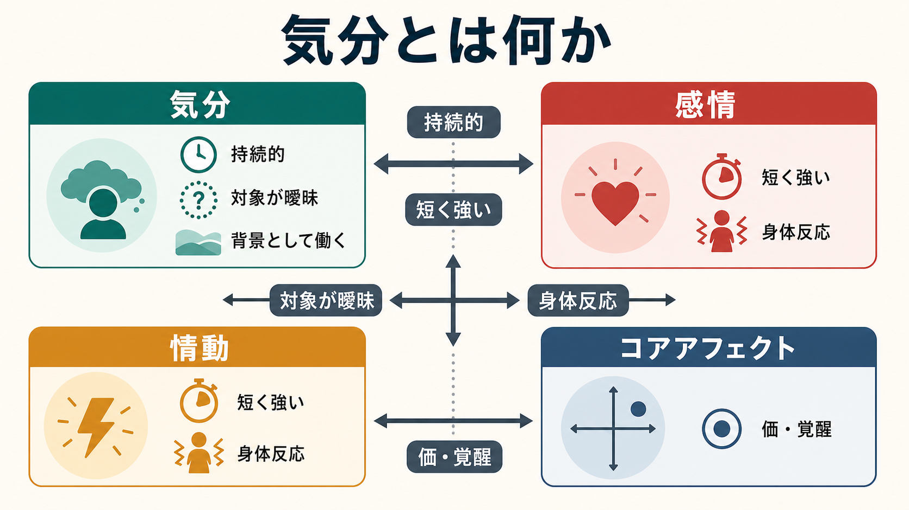
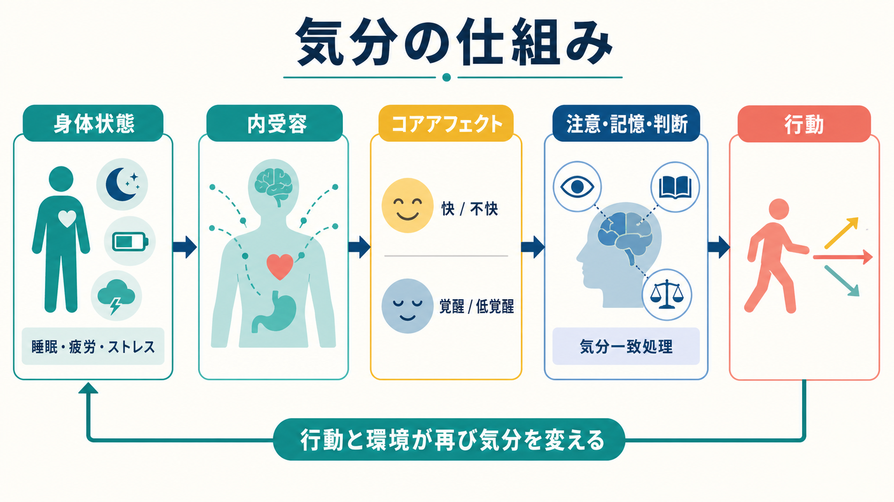
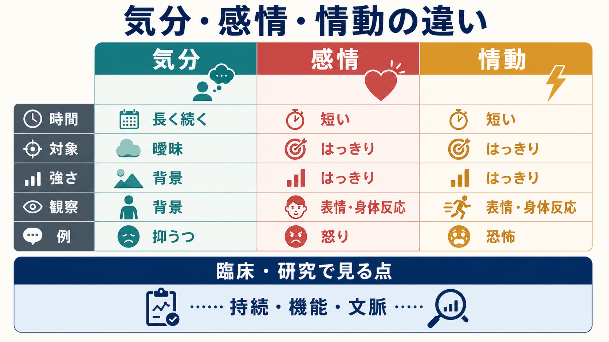

# 気分とは何か

## 要点

- 気分とは、短い反応ではなく、比較的持続する感情的な背景状態である。
- 感情は「何に対する怒り・悲しみ・喜びか」が比較的はっきりしやすいのに対し、気分は対象が曖昧で、世界や自己の見え方全体を染める。
- 情動は、表情・自律神経反応・行動準備などを含む短く強い反応として扱われることが多い。
- 臨床では、気分は本人の言葉として聞き、感情は観察される表出として記述する。この区別は [[MSEで気分と感情をどう区別するか]] と [[精神状態診察MSEとは何か]] の基礎になる。
- 気分は、内受容、睡眠、疲労、ストレス、記憶、注意、判断、対人文脈に支えられるため、単なる「気持ちの問題」ではない。

## この記事で答える問い

1. 気分は、感情・情動・感覚・性格と何が違うのか。
2. なぜ気分は、思考や判断や行動を広く変えるのか。
3. 臨床で「気分」を評価するとき、何を聞き、何を観察すればよいのか。

## まず結論

気分は、**世界に向かう心身の構え**である。たとえば「気分が沈む」とき、人は単に悲しい出来事を思い出しているだけではない。身体は重く、未来は狭く見え、注意は否定的な情報へ向きやすくなり、行動の選択肢も減る。このように、気分は経験の一部ではなく、経験全体の背景条件として働く。

精神医学では、気分は「本人が内的に経験し、比較的持続する感情状態」として扱われる。一方、感情または感情表出は、面接者が表情・声・姿勢・反応の変化として観察する側面を含む。古典的な精神状態診察では、気分は患者の主観的報告、感情は観察される表出として区別される[1]。この区別を保つことで、「本人は落ち込んでいると言うが、表情は場面にそぐわず高揚している」「明るく振る舞うが、持続的な抑うつ気分を訴える」といった臨床的に重要なずれを記述できる。

## 背景

日本語では「気分」「感情」「情動」「気持ち」が日常的に重なって使われる。しかし、[[精神症候学とは何か]] の文脈では、これらをある程度分けて記述する必要がある。理由は、診断名を急いで付けるためではなく、経験の時間幅、対象の明確さ、身体反応、機能障害、文脈を整理するためである。

心理学では、Russell のコアアフェクト論がこの整理に有用である。コアアフェクトとは、快-不快と覚醒-低覚醒のような次元で表せる基礎的な感情状態であり、気分・感情・情動の土台にあると考えられる[2]。コアアフェクトが特定の対象や原因へ帰属されると、「あの人に怒っている」「試験が不安だ」のような感情エピソードになりやすい。一方、原因が曖昧なまま持続すると、「なんとなく気が重い」「理由はないが落ち着かない」という気分として経験されやすい[2]。

## 基本概念

### 気分

気分は、数分で消える反射的反応というより、時間的に広がった感情状態である。典型的には、対象が曖昧で、強度は中等度から低めでも、認知・行動・身体感覚へ広く影響する。臨床では「この数日から数週間、全体としてどのような気分で過ごしているか」を聞く。

たとえば、抑うつ気分は「悲しい」だけではない。興味の低下、疲労、睡眠、食欲、集中困難、自己評価、将来予測、活動量の変化と結びつく。WHO の ICD-11 でも、抑うつエピソードは抑うつ気分または興味・喜びの低下を中心に、認知・行動・身体症状と機能障害を合わせて記述される[5]。

### 感情

感情は、気分よりも対象や意味づけが明確なことが多い。「批判されたから怒った」「別れを思い出して悲しい」「合格してうれしい」のように、何に対して生じたのかを比較的説明しやすい。もちろん感情も身体反応や行動傾向を伴うため、気分と完全には切り離せない。

### 情動

情動は、恐怖、怒り、驚きのように、短く強い反応として扱われることが多い。表情、自律神経反応、行動準備、注意の急速な変化を含むため、[[扁桃体回路は情動をどう処理するのか]] や [[前頭前野は情動制御にどう関わるのか]] と接続しやすい。ただし、現代の感情科学では、情動を固定された「専用回路の出力」とだけ見るより、身体状態、概念、記憶、状況解釈が組み合わさって構成される過程として見る立場も強い[2][4]。

| 観点 | 気分 | 感情 | 情動 |
|---|---|---|---|
| 時間幅 | 比較的長い | 短いことが多い | 短く急速 |
| 対象 | 曖昧なことが多い | 比較的明確 | 刺激や状況に結びつきやすい |
| 強度 | 低-中等度でも持続 | 中等度から強い | 強く身体的 |
| 役割 | 認知と行動の背景 | 意味づけられた経験 | 行動準備と身体反応 |
| 例 | 抑うつ気分、苛立った気分 | 怒り、悲しみ、喜び | 恐怖反応、驚愕、怒りの爆発 |

## 仕組み

気分は、身体の内部状態、脳の予測、記憶、注意、行動の循環から成り立つ。[[内受容感覚とは何か]] は、心拍、呼吸、胃腸、疲労、痛み、炎症、ホルモン、自律神経状態などの身体内部情報をまとめる働きである。Barrett と Simmons は、内受容経験を単なる身体信号の読み取りではなく、脳が身体状態を予測し、その予測が上行性の身体信号によって制約される過程として整理している[4]。この見方では、気分は「身体から上がってきた感じ」だけでなく、「脳が身体をどう予測し、何に備えているか」でもある。

気分が認知へ影響することも重要である。Forgas の affect infusion model は、気分が社会的判断や情報処理へ入り込む程度は、課題の性質や処理方略によって変わると説明する[3]。単純な既知の判断では気分の影響は小さくても、曖昧で複雑な判断、記憶検索、対人評価では、気分に一致した情報が選ばれやすい。気分が沈むと、過去の失敗、拒絶、将来の損失が目に入りやすくなる。気分が高揚すると、リスクや疲労を軽く見積もりやすくなることがある。

この循環は、[[身体と感情はどのようにつながるのか]]、[[内受容感覚は感情にどう関わるのか]]、[[感情は身体感覚の予測なのか]] と深くつながる。睡眠不足、慢性疼痛、炎症、ストレス、薬剤、物質使用、生活リズムの乱れは、身体状態を変え、コアアフェクトを変え、結果として気分を変える。気分は脳内物質だけで説明できる単純な量ではないが、[[セロトニンは気分だけに関わるのか]] のように、神経調節系が気分・衝動・睡眠・食欲・柔軟性に広く関わることも無視できない。

## 図解

次の図は、気分・感情・情動を臨床と研究の視点から比較したものである。図中の区別は便宜的な整理であり、実際の経験では互いに重なる。

## 臨床・研究との接続

臨床では、気分を「よい・悪い」で終わらせず、少なくとも次の軸で聞く。

1. 持続: いつから、どれくらい続いているか。
2. 強度: 生活をどの程度支配しているか。
3. 変動: 日内変動、周期性、誘因、改善する場面はあるか。
4. 機能: 睡眠、食欲、学業、仕事、対人関係、セルフケアへの影響はあるか。
5. 文脈: 喪失、ストレス、身体疾患、薬剤、物質使用、発達史、文化的意味づけはどうか。
6. 表出: 本人の言う気分と、面接中に観察される感情表出は一致しているか。

NIMH は気分障害を、持続的な感情状態、すなわち mood が主に影響を受ける精神疾患群として説明している[6]。また双極性障害では、気分だけでなく、エネルギー、活動性、睡眠、集中、行動の明らかな変化がエピソードとして現れる[7]。このため、気分の評価は、うつ病、躁状態、軽躁状態、双極性障害関連ノートへ接続する。

研究では、気分は質問紙、経験サンプリング、行動課題、睡眠・活動量、神経画像、生理指標などで扱われる。しかし、測定法によって見ているものは異なる。自己報告は主観的経験に強く、行動指標は選択や反応時間に強く、生理指標は身体状態に強い。したがって「気分を測る」と言うときは、どの層の気分を測っているのかを明確にする必要がある。

## よくある誤解

### 誤解1: 気分は弱い感情である

気分は単に弱い感情ではない。強度が低くても、持続し、注意、記憶、判断、行動の背景として働く点が重要である。短い怒りよりも、数週間続く抑うつ気分のほうが生活機能へ大きく影響することがある。

### 誤解2: 気分は原因がわかれば消える

原因を理解することは有用だが、気分は身体状態、睡眠、対人関係、ストレス、記憶、行動習慣の循環で維持される。原因らしき出来事を言語化しても、身体と生活の循環が変わらなければ気分は続くことがある。

### 誤解3: 気分は本人の内面なので観察できない

気分そのものは本人の主観的経験だが、発話、表情、活動量、睡眠、食欲、対人反応、意思決定、記録された経過から間接的に評価できる。[[情動と認知は分けられるのか]] でも問題になるように、主観と観察を対立させるのではなく、別々の情報源として統合することが大切である。

### 誤解4: 気分の問題はすぐ診断名に変換すべきである

気分は診断に関わるが、気分の変化だけで診断が決まるわけではない。持続、重症度、機能障害、躁・軽躁の既往、身体疾患、薬剤、物質、喪失体験、文化的文脈を合わせて考える必要がある。この記事は教育・研究目的の整理であり、個別の診断や治療指示を行うものではない。

## 関連ノート

- [[精神症候学とは何か]]
- [[精神状態診察MSEとは何か]]
- [[MSEで気分と感情をどう区別するか]]
- [[内受容感覚とは何か]]
- [[内受容感覚は感情にどう関わるのか]]
- [[感情は身体感覚の予測なのか]]
- [[身体と感情はどのようにつながるのか]]
- [[情動と認知は分けられるのか]]
- [[前頭前野は情動制御にどう関わるのか]]
- [[扁桃体回路は情動をどう処理するのか]]
- [[セロトニンは気分だけに関わるのか]]

今後の作成候補: `うつ病とは何か`, `躁状態とは何か`, `軽躁状態とは何か`。

## MOC更新候補

- `content/00_MOC/` 配下の精神医学・症候学・感情科学関連MOCに、バッチ統合時に `[[気分とは何か]]` を追加する候補。
- 並列ジョブとの競合を避けるため、この作業ではMOCファイルを直接更新していない。

## 理解チェック

1. 気分と感情の違いを、「時間幅」と「対象の明確さ」から説明できるか。
2. 気分が注意・記憶・判断に影響する例を1つ挙げられるか。
3. MSEで、本人が語る気分と観察される感情表出を分けて記述する理由は何か。
4. 抑うつ気分を評価するとき、睡眠・食欲・疲労・活動量・機能障害を確認する理由は何か。
5. 気分を「脳内物質だけ」または「気の持ちようだけ」で説明すると、何を見落とすか。

## 未解決問題

- 気分を、自己報告・行動・生理・神経画像のどの階層で統合的に測るべきか。
- 気分の「持続性」を、臨床面接・経験サンプリング・ウェアラブルデータでどう対応づけるか。
- 文化や言語によって「気分」「感情」「情動」の境界がどのように変わるか。
- 気分への介入が、内受容、行動活性化、睡眠、対人文脈、認知スタイルのどこを介して効くのか。

## 参考文献

[1] Martin, D. C. (1990). The Mental Status Examination. In H. K. Walker, W. D. Hall, & J. W. Hurst (Eds.), *Clinical Methods: The History, Physical, and Laboratory Examinations* (3rd ed.). NCBI Bookshelf. https://www.ncbi.nlm.nih.gov/books/NBK320/

[2] Russell, J. A. (2003). Core affect and the psychological construction of emotion. *Psychological Review, 110*(1), 145-172. https://doi.org/10.1037/0033-295X.110.1.145

[3] Forgas, J. P. (1995). Mood and judgment: The affect infusion model (AIM). *Psychological Bulletin, 117*(1), 39-66. https://doi.org/10.1037/0033-2909.117.1.39

[4] Barrett, L. F., & Simmons, W. K. (2015). Interoceptive predictions in the brain. *Nature Reviews Neuroscience, 16*, 419-429. https://doi.org/10.1038/nrn3950

[5] World Health Organization. (2024). *Clinical descriptions and diagnostic requirements for ICD-11 mental, behavioural and neurodevelopmental disorders*. WHO. https://iris.who.int/bitstream/handle/10665/375767/9789240077263-eng.pdf

[6] National Institute of Mental Health. (n.d.). Any mood disorder. https://www.nimh.nih.gov/health/statistics/any-mood-disorder

[7] National Institute of Mental Health. (2025). *Bipolar disorder*. NIH Publication No. 25-MH-8088. https://www.nimh.nih.gov/health/publications/bipolar-disorder
