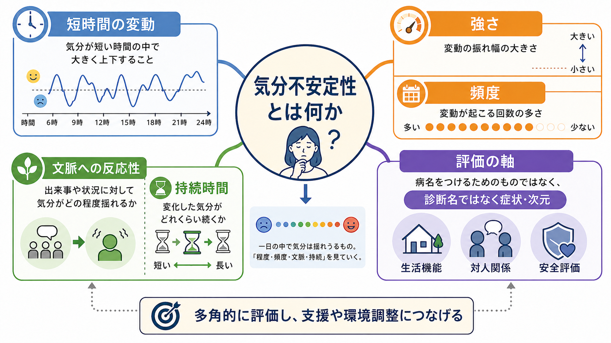
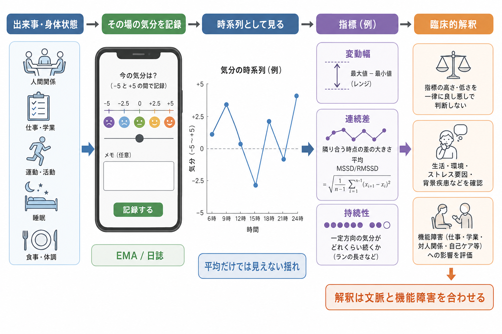

# 気分不安定性とは何か

## 要点

- 気分不安定性とは、気分や情動状態が短時間のうちに、または出来事・対人状況・身体状態に応じて大きく変動しやすいことを指す。
- これは単独の診断名ではなく、[[気分とは何か|気分]]、感情表出、行動、対人関係、生活機能、安全性を横断して評価する症状・次元である[1][2]。
- 評価では「平均的に抑うつか」だけでなく、変動幅、頻度、持続時間、文脈への反応性、回復のしやすさ、生活機能への影響を見る。
- retrospective な質問紙だけでは、瞬間ごとの揺れや連続差を取り逃がしやすい。日誌、EMA/ESM、反復尺度は、臨床面接を補助する方法として有用である[3][4]。
- 強い気分不安定性がある場合でも、それだけで双極症、境界性パーソナリティ症、ADHD、PTSD、うつ病などを決めることはできない。経過、エピソード性、誘因、睡眠、物質使用、身体疾患、自傷・自殺リスクを合わせて評価する。

## この記事で答える問い

1. 気分不安定性は、普通の気分の波や気分障害のエピソードと何が違うのか。
2. 評価では、どの時間幅、どの指標、どの生活上の影響を見るべきか。
3. 臨床では、診断・リスク評価・心理教育・研究測定にどう接続できるのか。

## まず結論

気分不安定性を評価するときの最短ルールは、「気分の高さ低さ」ではなく「揺れ方」を記述することである。たとえば「落ち込んでいる」だけでは、低い気分が数週間続くのか、数時間ごとに怒り・不安・空虚感・安心が入れ替わるのか、対人場面で急に強まるのかが分からない。

したがって記録では、次のように分けるとよい。

| 評価軸 | 見ること | 記録例 |
|---|---|---|
| 変動幅 | 気分がどれくらい大きく動くか | 「数時間で穏やかさから強い怒りへ変化」 |
| 頻度 | どれくらい頻繁に起こるか | 「週数回」「1日数回」 |
| 持続時間 | 変化した状態がどれくらい続くか | 「数十分」「半日」「数日」 |
| 文脈 | 何に反応して起こるか | 「拒絶されたと感じた後に増悪」 |
| 回復 | 元に戻るまでの時間と助けになる条件 | 「休息で軽快」「反すうで遷延」 |
| 機能 | 生活・対人・安全への影響 | 「欠勤、衝動的連絡、自傷念慮」 |

この見方は、[[MSEで気分と感情をどう区別するか]]や[[精神状態診察MSEとは何か]]で扱う「いま観察される状態」と、現病歴で扱う「時間経過」をつなぐ。

## 背景

精神医学では、気分症状を「抑うつ」「高揚」「易刺激性」などの質で記述することが多い。しかし実際の困りごとは、気分の質だけでなく、揺れの速さや予測しにくさに由来することがある。短時間で怒りや不安が強まり、対人関係がこじれ、後から強い後悔や疲労が来る場合、平均的な気分得点だけでは臨床像を十分に説明できない。

Broome らは、気分不安定性を重要だが過小評価されてきた横断診断的な標的として整理し、定義と測定の明確化が必要だと論じた[1]。また、成人一般人口調査では気分不安定性の自己報告が一定の割合でみられ、共通精神疾患、希死念慮、医療利用などと関連することが示されている[5]。ここで重要なのは、気分不安定性が「珍しい特殊症状」ではなく、臨床・非臨床の連続体上で扱うべき現象だという点である。

一方で、気分不安定性は診断特異的ではない。双極症、境界性パーソナリティ症、ADHD、PTSD、うつ病、不安症、物質使用、睡眠障害、身体疾患、薬剤性変化など、複数の文脈で現れうる。だからこそ、[[精神科診断は何のためにあるのか|診断]]を急ぐ前に、症状の時間構造と生活機能への影響を丁寧に分ける必要がある。

## 基本概念

### 気分不安定性

気分不安定性 mood instability は、気分や情動が頻繁かつ急速に変動し、変動が強く、調整や回復が難しい傾向を指す。近い用語に affective instability、affective lability、emotional lability がある。研究領域や尺度によって意味は少し異なるが、臨床では「どの感情が、どのくらい速く、どのくらい強く、何に反応して動くか」を明示すれば混乱が少ない[2][6]。

### 気分、感情、情動調整との違い

[[気分とは何か|気分]]は比較的持続する主観的な内的状態であり、感情 affect は面接場面で観察される表情・声・身振りなどの表出を含む。気分不安定性は、そのどちらか一方ではなく、主観的気分、観察される感情、身体反応、行動の変化が時間の中でどう揺れるかを扱う。

情動調整 emotion regulation は、感情が生じた後に注意、解釈、行動、対人支援などを使って変化させる過程である。気分不安定性が強い人では、情動反応が急に立ち上がるだけでなく、反すう、回避、衝動行為、睡眠不足などによって回復が遅れることがある。ただし、気分不安定性をすべて「調整能力不足」と見なすのは単純化である。環境ストレス、身体疾患、薬剤、発達特性、トラウマ関連反応も関わりうる。

### エピソード性との区別

双極症の躁病・軽躁病・抑うつエピソードでは、数日から数週間以上のまとまった気分・活動性・睡眠・認知・行動の変化が問題になる。NICE の双極症ガイドラインも、評価では気分や行動が少なくとも数日単位で続くか、重症度や安全性を確認することを重視している[7]。一方、気分不安定性は、1日の中での急な上下や状況反応性を含みうる。両者は重なりうるが、同じものではない。

## 仕組み

気分不安定性は一つの単純な機序ではなく、複数の階層が重なって生じる。

1. 入力の階層: 対人出来事、評価される場面、睡眠不足、痛み、月経周期、物質使用、薬剤変更などが気分変化の引き金になる。
2. 解釈の階層: 「拒絶された」「危険だ」「失敗した」といった意味づけが、怒り・不安・恥・空虚感を強める。
3. 身体反応の階層: 心拍、呼吸、筋緊張、疲労、内受容感覚が、気分の強さや切迫感に影響する。
4. 行動の階層: 衝動的な連絡、回避、飲酒、自傷、過活動、反すうが、短期的には気分を動かし、長期的には揺れを維持することがある。
5. 環境フィードバックの階層: 周囲の反応、対人摩擦、安心の得られ方、支援の有無が、次の気分変動の起こりやすさを変える。

研究では、情動ダイナミクスとして、変動性 variability、情動不安定性 instability、情動慣性 emotional inertia、情動分化 differentiation などを区別する提案がある[3]。たとえば、気分のばらつきが大きいだけなら変動性の問題だが、隣り合う時点の差が大きいなら不安定性、嫌な気分が長く残るなら慣性の問題として捉えられる。

EMA/ESM や日誌では、1日に複数回、その場の気分を簡単に記録する。そこから、レンジ、標準偏差、MSSD/RMSSD のような連続差、ランの長さ、自己回帰、マルチレベルモデルなどを使って、平均だけでは見えない揺れを定量化できる[4][8]。ただし、2025年の系統的レビューは、気分不安定性の統計的定義や算出法が研究間でかなり多様で、標準化が今後の課題だと整理している[8]。

## 図解

上の 1 枚目は、気分不安定性を「診断名」ではなく、短時間の変動、強さ、頻度、文脈への反応性、持続時間、生活機能・対人関係・安全評価をつなぐ評価軸として示している。

2 枚目は、EMA/日誌による反復評価の考え方である。気分の平均値だけを見ると、「今日は0点付近」と見えるかもしれない。しかし、朝に高揚、昼に強い落ち込み、夕方に怒り、夜に不安があるなら、平均値は同じでも臨床的意味は大きく異なる。

## 臨床・研究との接続

### 面接での聞き方

気分不安定性を聞くときは、「気分の波はありますか」だけでは曖昧である。次のように、時間幅と場面を指定する。

- 「ここ1週間で、気分が急に変わった場面はありましたか」
- 「その変化は、数分、数時間、半日、数日単位のどれに近いですか」
- 「何がきっかけになりやすいですか。対人関係、仕事、睡眠、体調、飲酒、薬の変更などは関係しますか」
- 「変化した後、元に戻るまでに何が役立ちますか」
- 「その気分の変化で、欠勤、衝動的な行動、対人トラブル、自傷念慮は起きますか」

これは[[現病歴はどのように構造化するべきか]]、[[精神科診断面接で尺度をどう使うか]]、[[精神科で生活機能をどう評価するか]]に接続する評価である。

### 尺度と日誌

質問紙としては、Affective Lability Scale や ALS-18 が、抑うつ・不安・怒り・高揚などの揺れを自己報告で測る方法として使われてきた[6]。ただし、質問紙は「普段の傾向」をまとめて尋ねるため、記憶バイアス、現在気分、自己理解、社会的望ましさの影響を受ける。尺度点数は[[心理測定とは何か|心理測定]]上の観察値であり、[[信頼性とは何か|信頼性]]と[[妥当性とは何か|妥当性]]を意識して解釈する必要がある。

日誌や EMA は、実生活に近い場面で短い間隔のデータを集められる利点がある。一方で、入力負担、欠測、測定そのものが気分への注意を強める可能性、プライバシー、解析方法の選択という限界もある。臨床では、研究用の精密測定をそのまま持ち込むより、睡眠、服薬、飲酒、出来事、気分の強さ、自傷衝動を短く記録し、次回面接で一緒に読み解く形が使いやすい。

### 鑑別診断と安全評価

気分不安定性は、境界性パーソナリティ症の文脈では対人関係、自己像、気分、衝動性の不安定さとして記述されることがある。ただし、同じ「気分が急に変わる」という訴えでも、双極症、ADHD、PTSD、物質使用、せん妄、甲状腺疾患、薬剤性精神症状などでも起こりうる。

安全評価では、気分変動のピーク時に何が起こるかが重要である。強い怒りや絶望が数十分で収まる場合でも、その短い時間に自傷、自殺企図、暴力、危険運転、大量飲酒が起こるなら、[[自殺リスク評価では何を聞くべきか|自殺リスク評価]]やクライシスプランが必要になる。医療・支援の場では、個別の診断や治療指示としてではなく、本人の安全と生活を守るための共同評価として扱う。

## よくある誤解

### 誤解1: 気分不安定性があれば双極症である

双極症では気分・活動性・睡眠・思考・行動のエピソード性変化が重要だが、短時間の気分変動だけで双極症とは言えない。軽躁・躁病の持続時間、睡眠欲求の低下、活動性増加、易刺激性、誇大性、リスク行動、抑うつエピソード、家族歴、薬剤・物質・身体疾患の影響を確認する必要がある[7]。

### 誤解2: 気分が変わるのは性格の問題である

気分不安定性は、神経発達、睡眠、トラウマ、対人環境、身体状態、認知的解釈、情動調整、薬剤などが重なる現象である。性格ラベルで片づけると、評価すべき誘因や支援可能な条件を見落とす。

### 誤解3: 尺度点数が高ければ重症、低ければ問題なし

尺度は有用だが、点数だけでは変動が起こる文脈、ピーク時のリスク、生活機能への影響は分からない。短時間のピークが高い人、平均的に抑うつが続く人、対人場面だけで急変する人では、支援の焦点が異なる。

### 誤解4: 気分不安定性は悪いものとして消すべきである

気分が状況に応じて動くこと自体は正常で適応的である。問題になるのは、変動が本人の苦痛、生活機能低下、対人関係の破綻、安全上のリスクにつながる場合である。目標は「揺れをゼロにする」ことではなく、揺れのパターンを理解し、回復を早め、危険な行動に移る前の選択肢を増やすことである。

## 関連ノート

- [[気分とは何か]]
- [[MSEで気分と感情をどう区別するか]]
- [[精神状態診察MSEとは何か]]
- [[精神科診断面接で尺度をどう使うか]]
- [[心理測定とは何か]]
- [[精神科で生活機能をどう評価するか]]
- [[自殺リスク評価では何を聞くべきか]]
- [[双極性障害は情動ネットワークの異常として説明できるのか]]
- [[前頭前野は情動制御にどう関わるのか]]

## MOC更新候補

- `content/00_MOC/MOC｜精神医学.md`
- `content/00_MOC/MOC｜心理測定・研究法.md`
- 並列生成ジョブとの競合を避けるため、本記事作成時点では MOC 本体は更新していない。

## 理解チェック

1. 気分不安定性を「平均的な気分の低さ」だけで評価すると、何を見落とすか。
2. 変動幅、頻度、持続時間、文脈への反応性は、それぞれどのように質問できるか。
3. 気分不安定性が強い人で、安全評価として確認すべき行動や状況は何か。
4. EMA/日誌は、質問紙や面接と比べて何を補えるか。

## 未解決問題

- 気分不安定性の最適な統計指標は、疾患、年齢、測定間隔、目的によって変わる可能性があり、標準化はまだ発展途上である[8]。
- 臨床現場で、入力負担の少ない日誌をどこまで治療計画に組み込めるかは、支援体制やプライバシー保護と合わせて検討が必要である。
- 気分不安定性を標的にした介入の効果を、症状平均ではなく情動ダイナミクスの変化としてどう評価するかは、今後の研究課題である。

## 参考文献

[1] Broome, M. R., Saunders, K. E. A., Harrison, P. J., & Marwaha, S. (2015). Mood instability: significance, definition and measurement. *The British Journal of Psychiatry, 207*(4), 283-285. https://doi.org/10.1192/bjp.bp.114.158543

[2] Marwaha, S., He, Z., Broome, M., Singh, S. P., Scott, J., Eyden, J., & Wolke, D. (2014). How is affective instability defined and measured? A systematic review. *Psychological Medicine, 44*(9), 1793-1808. https://doi.org/10.1017/S0033291713002407

[3] Trull, T. J., Lane, S. P., Koval, P., & Ebner-Priemer, U. W. (2015). Affective Dynamics in Psychopathology. *Emotion Review, 7*(4), 355-361. https://doi.org/10.1177/1754073915590617

[4] Jahng, S., Wood, P. K., & Trull, T. J. (2008). Analysis of affective instability in ecological momentary assessment: Indices using successive difference and group comparison via multilevel modeling. *Psychological Methods, 13*(4), 354-375. https://doi.org/10.1037/a0014173

[5] Marwaha, S., Parsons, N., Flanagan, S., & Broome, M. (2013). The prevalence and clinical associations of mood instability in adults living in England: results from the Adult Psychiatric Morbidity Survey 2007. *Psychiatry Research, 205*(3), 262-268. https://doi.org/10.1016/j.psychres.2012.09.036

[6] Look, A. E., Flory, J. D., Harvey, P. D., & Siever, L. J. (2010). Psychometric properties of a short form of the Affective Lability Scale (ALS-18). *Personality and Individual Differences, 49*(3), 187-191. https://doi.org/10.1016/j.paid.2010.03.030

[7] National Institute for Health and Care Excellence. (2025). *Bipolar disorder: assessment and management* (NICE Clinical Guideline CG185). https://www.nice.org.uk/guidance/cg185

[8] Cairns, I., Wright, K., Taylor, G., Mehen, B., & Anning, R. (2025). Statistical Conceptualisation of Mood Instability: A Systematic Review. *Brain Sciences, 15*(10), 1059. https://doi.org/10.3390/brainsci15101059

## 更新ログ

- 2026-04-28: 初稿作成。気分不安定性の定義、評価軸、EMA/日誌、臨床鑑別、安全評価、画像2枚、主要参考文献を追加。
