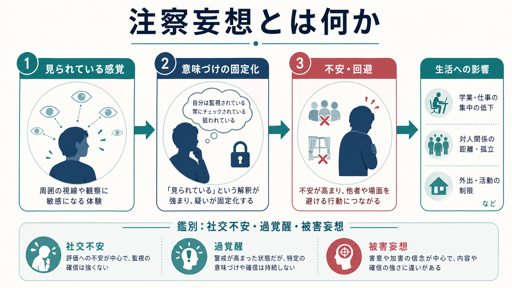
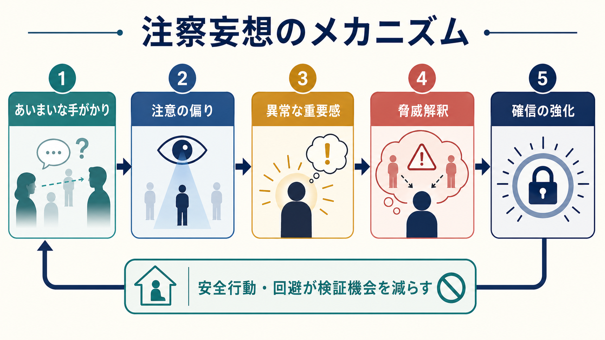

# 注察妄想とは何か

## 要点

- 注察妄想とは、自分が他者から見られている、監視されている、観察対象にされているという確信が、現実的な根拠に比べて過度に強く固定される妄想的体験である。
- 似た体験として「人目が気になる」「緊張して注目されている気がする」「危険を警戒して周囲を確認する」があるが、注察妄想では確信度、訂正困難性、生活への影響、他の精神病症状との結びつきが問題になる。
- 症候学的には、被害妄想、関係妄想、精神病性障害の陽性症状、強い不安・過覚醒、社交不安との境界を丁寧に見る必要がある。
- メカニズムとしては、あいまいな社会的手がかりへの注意の偏り、脅威解釈、異常サリエンス、安全行動による検証機会の減少が互いに強化しうる。
- 本ノートは教育・研究目的の整理であり、個別の診断や治療方針を指示するものではない。

## この記事で答える問い

1. 注察妄想は、通常の「人目が気になる」体験と何が違うのか。
2. 被害妄想、関係妄想、社交不安、[[過覚醒とは何か]]とはどのように重なり、どこで区別されるのか。
3. なぜ「見られている感じ」が確信へと固まり、[[回避行動とは何か]]や生活障害につながるのか。
4. 臨床・研究では、どのような観点でこの体験を扱うのか。

## まず結論

注察妄想は、「誰かに見られている気がする」という一過性の感覚そのものではなく、その感覚に対して「実際に見張られている」「自分だけが観察対象になっている」といった解釈が強く固定され、反証や別解釈を受けつけにくくなる状態として理解できる。妄想一般は、本人にとって強い確信を伴う信念であり、文化的背景や状況に照らしても修正されにくいことが特徴とされる[1]。

したがって、注察妄想を考えるときは、内容の奇異さだけでなく、確信度、苦痛、行動変化、社会機能、他の症状との連関を見る。例えば、電車内で一瞬「見られている気がする」と感じても、すぐに別の説明を考えられ、生活に大きな支障がなければ、それだけで妄想とはいえない。一方で、根拠が乏しいにもかかわらず「近所の人が自分を監視している」と確信し、外出・就労・対人接触が著しく制限される場合には、妄想的体験として評価が必要になる。

## 背景

妄想は精神症候学における中心的な陽性症状の一つであり、統合失調症スペクトラム、妄想性障害、気分障害の精神病症状、物質・身体疾患関連の精神病症状など、複数の文脈で現れうる[2][3][8]。その主題は多様で、被害、関係、誇大、嫉妬、身体、宗教、罪業などがある。注察妄想は、主に「他者から見られている」「見張られている」「自分の行動が観察・記録されている」という主題をもつ。

この体験は、現代的な監視技術やSNSの文脈と結びついて語られることもある。しかし、重要なのは技術の有無ではなく、本人がどのような根拠で、どの程度の確信をもち、どのような生活上の変化を生じているかである。実際に監視・ストーキング・ハラスメントが存在する場合もあるため、臨床的には「妄想だ」と早急に決めつけるのではなく、現実的リスク、本人の安全、証拠、文脈、他の症状を分けて評価する必要がある。

## 基本概念

### 注察妄想の定義

注察妄想は、狭義には「自分が他者から注目・観察・監視されている」という内容の妄想である。英語では一対一の固定訳が必ずしも安定していないが、delusion of being watched、delusion of observation、persecutory delusion with surveillance theme などに近い。内容としては被害妄想の一部として扱われることが多く、場合によっては関係妄想とも重なる。

臨床的に注目するのは、次の4点である。

| 観点 | 見るポイント |
|---|---|
| 確信度 | 「そうかもしれない」ではなく「そうに違いない」に近いか |
| 訂正困難性 | 反証、説明、時間経過によってどの程度ゆらぐか |
| 苦痛 | 恐怖、怒り、羞恥、[[不安とは何か]]がどの程度強いか |
| 行動変化 | 外出回避、確認、遮蔽、対人回避、相談・通報の反復などがあるか |

### 近接概念との違い

| 概念 | 中心となる体験 | 注察妄想との違い |
|---|---|---|
| 人目が気になる | 評価される不安、羞恥、緊張 | 確信よりも不安・可能性として体験されることが多い |
| 社交不安 | 他者から否定的に評価される恐れ | 「監視されている」という外的事実の確信とは限らない |
| [[過覚醒とは何か]] | 危険に備えて警戒水準が上がる | 脅威検出は高まるが、特定の監視者への確信とは限らない |
| 被害妄想 | 危害・迫害・嫌がらせを受ける確信 | 注察妄想は「見られる・監視される」主題を中心にした被害的内容 |
| 関係妄想 | 周囲の出来事が自分に関係しているという確信 | 視線・会話・メディアなどが「自分を見ている証拠」と解釈されると重なる |
| [[侵入思考とは何か]] | 本人の意に反して浮かぶ考え・イメージ | 思考内容への違和感が残りやすく、外部事実の確信とは異なる |

重要なのは、これらが完全に分離した箱ではないことである。同じ人の中で、社交不安、過覚醒、関係づけ、被害的解釈が連続的に重なることがある。したがって、評価では「どの診断名か」だけでなく、「どの心理過程がどの行動を維持しているか」を見る。

## 仕組み

注察妄想は、単純に「間違った考えを信じる」だけでは説明しにくい。近年の心理学的モデルでは、脅威への注意、推論バイアス、感情、過去経験、安全行動、社会的孤立などが組み合わさって、妄想的確信を維持すると考えられている[4][5]。

### 1. あいまいな手がかり

他者の視線、笑い声、スマートフォンの操作、近所の物音、SNS上の反応などは、本来あいまいな手がかりである。疲労、睡眠不足、ストレス、[[気分とは何か]]の変化、過覚醒があると、こうした手がかりが通常より目立って感じられることがある。

### 2. 注意の偏り

「見られているかもしれない」と感じると、周囲の視線や表情に注意が向きやすくなる。注意が向くほど、視線らしきもの、ささやき声らしきもの、偶然の一致が多く拾われる。これは[[注意障害とは何か]]とは別の意味で、注意配分が脅威関連刺激に偏る状態である。

### 3. 異常サリエンス

Kapur は精神病症状を、内的・外的刺激が過剰な重要性を帯びて経験される「異常サリエンス」の観点から説明した[6]。この観点では、普通なら流れていく些細な出来事が「自分に向けられたサイン」のように感じられ、その違和感を説明するために妄想的解釈が形成される。

### 4. 脅威解釈と確信の強化

「あの人がこちらを見た」「会話が止まった」「窓の外に同じ車がある」といった出来事が、「監視されている証拠」として組み合わされると、確信が強まる。被害妄想の研究では、不安、心配、低い自己評価、推論の飛躍、確証バイアスなどが妄想の形成・維持に関与しうるとされる[4][5]。

### 5. 安全行動と検証機会の減少

注察妄想が強まると、外出を避ける、カーテンを閉め続ける、視線を確認する、録音・録画で証拠を探す、特定の場所を避けるなどの安全行動が増えることがある。短期的には不安を下げるが、長期的には「何も起きなかったのは避けたからだ」と解釈され、別の説明を試す機会が減る。これは[[回避行動とは何か]]が症状維持に関わる典型的な経路である。

## 図解

### 図解1：概念地図

1枚目の図は、注察妄想を「見られている感覚」「意味づけの固定化」「不安・回避」「生活への影響」の連鎖として整理している。ここで強調したいのは、注察妄想が単独の思考内容ではなく、感覚、解釈、感情、行動、社会機能の変化を含む体験として現れる点である。

### 図解2：メカニズム

2枚目の図は、あいまいな手がかりから確信の強化までの流れを示している。脅威解釈が強くなると安全行動が増え、安全行動が検証機会を減らすことで、確信がさらに固定される。この循環を理解すると、注察妄想を「本人の性格」や「単なる思い込み」としてではなく、認知・感情・行動の相互作用として扱いやすくなる。

## 臨床・研究との接続

### 臨床評価で見ること

注察妄想が疑われる場合、臨床では次のような点を丁寧に確認する。

- いつ、どの場面で「見られている」と感じるのか。
- 誰が、どのように、何のために見ていると考えているのか。
- その根拠は何で、別の説明をどの程度考えられるのか。
- 確信度はどの程度か。時間や状況でゆらぐか。
- 幻聴、関係づけ、被害的解釈、気分症状、[[せん妄とは何か]]、物質使用、睡眠不足、身体疾患が関係していないか。
- 外出、就労、学業、対人関係、セルフケアにどの程度影響しているか。
- 実際のハラスメント、ストーキング、家庭内暴力、職場トラブルなど、現実の安全リスクがないか。

NICE の精神病・統合失調症ガイドラインは、精神病性体験をもつ人への支援では、薬物療法だけでなく心理社会的介入、家族支援、身体健康、本人の選好を含む包括的な評価とケアを重視している[3]。注察妄想についても、症状内容だけを切り出すのではなく、本人の苦痛、生活上の制約、支援環境を含めて考える必要がある。

### 研究での位置づけ

研究上、注察妄想は被害妄想や関係妄想の一部として扱われることが多い。被害妄想研究では、不安・心配、脅威信念、自己評価、睡眠、トラウマ、社会的逆境、推論スタイルなどが検討されてきた[4][5]。また、認知行動療法を含む心理的介入では、妄想内容を直接否定するよりも、苦痛と生活障害を減らし、別解釈を検討できる余地を広げることが重視される[7]。

計算論的には、注察妄想は「予測」「精度重みづけ」「サリエンス」「信念更新」の問題としても読み替えられる。つまり、視線や物音のようなあいまいな入力に過剰な重要性が付与され、その入力を説明する仮説として「監視されている」という信念が選ばれ、反証よりも確証が強く取り込まれる、という枠組みである。ただし、この説明は有用なモデルであって、個々の体験を一つの神経機構に還元するものではない。

## よくある誤解

### 「見られている気がする」だけで妄想である

これは誤りである。多くの人は、緊張、羞恥、失敗後の反芻、疲労、睡眠不足、過覚醒のときに「見られている感じ」を経験しうる。妄想と呼ぶには、確信度、訂正困難性、現実検討、苦痛、生活障害、他の症状との関係を総合的に見る必要がある。

### 注察妄想は必ず統合失調症を意味する

これも誤りである。妄想は統合失調症スペクトラムで重要な症状だが、気分障害、物質・医薬品、身体疾患、せん妄、認知症、強いストレス状況など複数の背景で現れうる[2]。診断は症状の組み合わせ、時間経過、機能低下、除外要因を含めて行われる。

### 本人を説得すれば解決する

妄想的確信が強いとき、正面から「それは違う」と説得しても、かえって不信や孤立を強めることがある。臨床的には、体験の苦痛を認めつつ、安全、睡眠、生活リズム、社会的支援、ストレス、別解釈の検討可能性などを扱うほうが実用的である。

### 実際の被害を考えなくてよい

これも危険な誤解である。本人の解釈が妄想的に見える場合でも、現実の被害や安全リスクが存在する可能性は残る。評価では、事実確認と症状評価を分け、本人の安全を軽視しない。

## 関連ノート

- [[精神症候学とは何か]]
- [[不安とは何か]]
- [[過覚醒とは何か]]
- [[回避行動とは何か]]
- [[侵入思考とは何か]]
- [[注意障害とは何か]]
- [[せん妄とは何か]]

### 関連ノート候補

- 被害妄想とは何か
- 関係妄想とは何か
- 妄想とは何か
- 精神病症状とは何か
- 社交不安とは何か
- 異常サリエンスとは何か

### MOC更新候補

- `content/00_MOC/` 配下の精神医学・症候学系 MOC に、本記事 `[[注察妄想とは何か]]` を追加する。
- 並列ジョブとの衝突を避けるため、本ジョブでは MOC 本体は更新しない。

## 理解チェック

1. 「人目が気になる」と「注察妄想」を区別するとき、確信度以外にどの観点を見るべきか。
2. 注察妄想が被害妄想や関係妄想と重なるのはどのような場合か。
3. 安全行動や回避は、なぜ短期的には役立っても長期的には確信を維持しうるのか。
4. 実際のハラスメントや安全リスクを、症状評価と分けて確認する必要があるのはなぜか。
5. 異常サリエンスの観点から、なぜ些細な視線や物音が「自分に向けられた証拠」のように感じられるのか。

## 参考文献

[1] American Psychiatric Association. (2022). *Diagnostic and Statistical Manual of Mental Disorders, Fifth Edition, Text Revision (DSM-5-TR).* American Psychiatric Association Publishing. https://doi.org/10.1176/appi.books.9780890425787

[2] World Health Organization. (2024). *ICD-11 for Mortality and Morbidity Statistics: Schizophrenia or other primary psychotic disorders.* https://icd.who.int/browse/2024-01/mms/en#405565289

[3] National Institute for Health and Care Excellence. (2014, updated). *Psychosis and schizophrenia in adults: prevention and management (NICE guideline CG178).* https://www.nice.org.uk/guidance/cg178

[4] Freeman, D., & Garety, P. A. (2014). Advances in understanding and treating persecutory delusions: A review. *Social Psychiatry and Psychiatric Epidemiology, 49*(8), 1179-1189. https://doi.org/10.1007/s00127-014-0928-7

[5] Garety, P. A., Kuipers, E., Fowler, D., Freeman, D., & Bebbington, P. E. (2001). A cognitive model of the positive symptoms of psychosis. *Psychological Medicine, 31*(2), 189-195. https://doi.org/10.1017/S0033291701003312

[6] Kapur, S. (2003). Psychosis as a state of aberrant salience: A framework linking biology, phenomenology, and pharmacology in schizophrenia. *American Journal of Psychiatry, 160*(1), 13-23. https://doi.org/10.1176/appi.ajp.160.1.13

[7] Kuipers, E., Yesufu-Udechuku, A., Taylor, C., & Kendall, T. (2014). Management of psychosis and schizophrenia in adults: summary of updated NICE guidance. *BMJ, 348*, g1173. https://doi.org/10.1136/bmj.g1173

[8] StatPearls. (2024). *Delusional Disorder.* National Center for Biotechnology Information, Bookshelf. https://www.ncbi.nlm.nih.gov/books/NBK539855/
