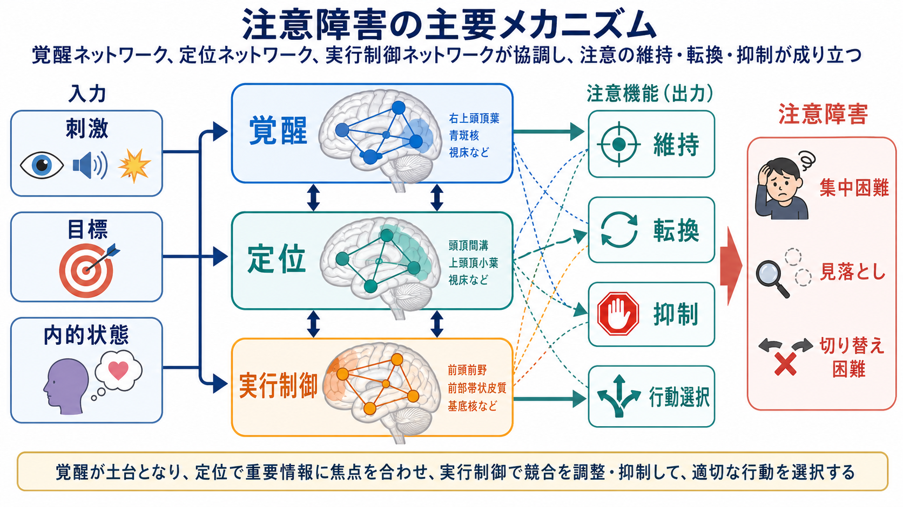
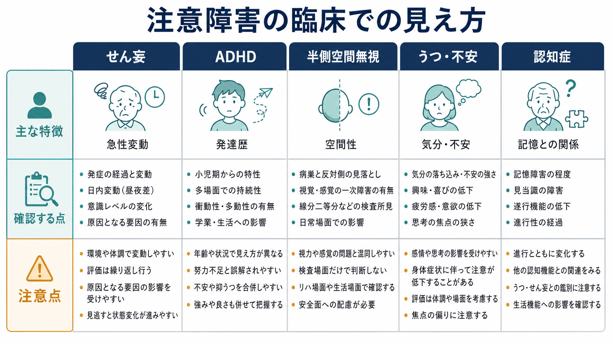

# 注意障害とは何か

## 要点

- 注意障害とは、「注意力がない」という性格評価ではなく、必要な情報へ注意を向け、保ち、切り替え、複数の要求へ配分する働きが状況に応じて破綻する状態である。
- 注意は単一の能力ではなく、覚醒、定位、選択、持続、実行制御、分配などの複数過程から成る。したがって障害の見え方も、ぼんやりする、気が散る、見落とす、切り替えられない、同時処理ができないなどに分かれる[1][2]。
- 臨床では、せん妄、ADHD、脳損傷後の半側空間無視、うつ・不安、認知症、薬剤・睡眠不足・身体疾患などを区別しながら、「どの注意機能が、いつ、どの文脈で低下するか」を見る。
- 注意障害の評価は、検査成績だけでなく、発症時期、変動、覚醒水準、生活場面、発達歴、気分、不安、薬剤、身体状態を合わせて解釈する。

## この記事で答える問い

この記事では、[[注意とは何か]]を臨床症状として見たときに、なぜ「集中できない」「話が入らない」「見落とす」「すぐ別のことに移る」「同時に処理できない」といった訴えになるのかを整理する。特に、[[持続的注意とは何か]]、[[選択的注意はどのように働くのか]]、[[分割注意はどこまで可能なのか]]、[[トップダウン注意とボトムアップ注意は何が違うのか]]との接続を意識する。

## まず結論

注意障害は、入力される刺激の問題だけでも、本人の努力不足だけでもない。脳は、覚醒水準を保ち、目標に沿って重要な情報を選び、不要な刺激を抑制し、状況変化に応じて注意対象を切り替える。この過程のどこかが崩れると、同じ「集中できない」という表現でも、実際には異なる病態を反映しうる[1][2]。

例えば、せん妄では急性に覚醒と注意が変動し、周囲への定位や会話の保持が不安定になる[6]。ADHDでは発達早期から複数場面で不注意や衝動性が持続しやすい[7]。半側空間無視では、視力そのものよりも空間への注意配分が偏り、片側の刺激や身体に気づきにくくなる[5]。うつや不安では、思考の反すう、疲労、内的脅威への偏りによって注意資源が奪われることがある。

## 背景

注意は、知覚、記憶、行動選択、意識の入口である。すべての情報を同じ深さで処理することはできないため、脳は「何を優先するか」を常に決めている。このため、[[注意と意識は同じものなのか]]、[[覚醒と意識内容は何が違うのか]]で扱うように、注意は意識・覚醒・認知制御と強く結びつく。

古典的な注意ネットワーク論では、注意は少なくとも、覚醒を保つ alerting、刺激や空間へ向きを変える orienting、競合する反応を調整する executive control に分けられる[1]。その後の研究では、目標に従う背側前頭頭頂ネットワークと、予期しない重要刺激へ再定位させる腹側前頭頭頂ネットワークの相互作用が重視された[2]。この見方は、[[サリエンスネットワークとは何か]]や[[皮質視床ループは意識や注意にどう関わるのか]]とも接続する。

## 基本概念

臨床で注意障害を見るときは、次の機能に分けると整理しやすい。

| 注意機能 | 何をしているか | 障害されたときの見え方 |
|---|---|---|
| 集中・焦点化 | 特定の対象や課題へ注意を向ける | 話に入れない、指示の最初から抜ける |
| 持続的注意 | 一定時間、注意を保つ | 作業の後半でミスが増える、会話が続かない |
| 選択的注意 | 不要な刺激を抑え、必要な情報を選ぶ | 雑音やスマートフォン通知に強く引かれる |
| 転換性注意 | 状況に応じて注意対象を切り替える | 予定変更に弱い、前の課題から抜けにくい |
| 分配性注意 | 複数の要求を同時または交互に扱う | 会話しながら作業できない、二重課題で崩れる |

Sohlberg と Mateer の注意訓練研究は、脳損傷後の注意を階層的に扱う臨床的枠組みを示した[3]。外傷性脳損傷後にも、持続的注意や反応時間変動の問題が生活機能に影響することが示されている[4]。この分類は、現在でも神経心理学的評価やリハビリテーションの説明で参照しやすい。ただし、実際の生活ではこれらの機能が分離して働くわけではなく、覚醒、記憶、遂行機能、感情、環境負荷が重なって症状として現れる。

## 仕組み

注意障害の中心には、入力、覚醒、目標、抑制、行動選択の連鎖がある。

1. 刺激が入る。音、視覚情報、身体感覚、内的思考が注意候補になる。
2. 覚醒水準が土台になる。眠気、薬剤、感染、代謝異常、睡眠不足があると、注意を保つ前提が崩れる。
3. 目標が優先順位を決める。今すべきことが明確なら、関連刺激が選ばれやすい。
4. 抑制が競合を減らす。不要な刺激や反応を止められないと、注意は散りやすい。
5. 転換と分配が行動を調整する。環境変化に合わせて、注意対象を移す必要がある。

この連鎖は、前頭前野、頭頂葉、帯状回、視床、脳幹覚醒系、基底核、神経伝達物質系の相互作用で支えられる[1][2]。[[アセチルコリンは注意や記憶にどう関わるのか]]で扱うアセチルコリン、[[ノルアドレナリン系は不安と覚醒にどう関わるのか]]で扱うノルアドレナリンも、覚醒と信号検出の調整に関わる。

## 図解

1枚目の図は、注意障害を「覚醒水準」「目標制御」「妨害刺激」「脳ネットワーク」「臨床症状」の関係として示している。注意の集中・維持・選択・転換・分配は、独立した箱ではなく、生活上の同じ困難に重なって現れる。

2枚目の図は、刺激・目標・内的状態が、覚醒、定位、実行制御のネットワークを通って、維持・転換・抑制・行動選択へつながる流れを示す。注意障害は、この出力のどこかが弱まるだけでなく、入力過多や覚醒低下でも起こる。

3枚目の図は、同じ「注意が悪い」でも、せん妄、ADHD、半側空間無視、うつ・不安、認知症で確認点が異なることを示している。

## 臨床・研究との接続

精神医学的面接では、注意は[[MSEで認知機能をどう評価するか]]の一部として観察される。会話の流れを追えるか、質問から外れやすいか、同じ説明を保持できるか、刺激で逸れやすいか、日内変動があるかを見ていく。

せん妄では、注意と意識水準の急性変動が中核的である。DSM-5 系の記述では、注意を向ける・焦点化する・保つ・切り替える能力の障害と、環境への気づきの低下が重視される[6]。このため、急に注意が保てなくなった高齢者や身体疾患患者では、精神症状だけでなく身体要因、薬剤、感染、脱水、低酸素などを考える必要がある。

ADHDでは、不注意、衝動性、多動性が発達早期から持続し、複数場面で生活機能に影響するかが重要である[7]。単に「忙しい時期に集中できない」だけではなく、発達歴、学校・家庭・仕事での一貫性、二次的な不安や抑うつ、睡眠、物質使用を合わせて評価する。

半側空間無視では、眼や一次視覚野の問題だけでは説明できない空間性の注意障害が生じる。右半球の腹側前頭頭頂領域や、背側注意ネットワークとの相互作用が関わり、反対側空間の刺激や身体を見落としやすくなる[5]。Mesulam の古典的な空間注意モデルも、頭頂葉、前頭葉、帯状回などの分散ネットワークとして注意を理解する重要性を示した[8]。これは、注意が単なる「努力」ではなく、空間表象とネットワーク機能に支えられることを示す。

研究では、注意課題、反応時間変動、二重課題、視線計測、脳画像、脳波、計算モデルなどが用いられる。ただし、検査上の「注意低下」は、疲労、理解、動機づけ、運動速度、視聴覚機能、薬剤、睡眠の影響を受けるため、[[認知機能検査は何を測っているのか]]と同じく、検査結果を生活機能と切り離して解釈しないことが重要である。

## よくある誤解

**「注意障害は本人のやる気の問題である」**  
やる気や関心は注意に影響するが、注意障害そのものを努力不足に還元するのは誤りである。覚醒、脳損傷、発達特性、気分、不安、薬剤、身体疾患、環境負荷が注意を左右する。

**「集中できないならADHDである」**  
ADHDは重要な鑑別の一つだが、急性発症ならせん妄、頭部外傷、薬剤、睡眠不足、うつ・不安、認知症なども考える。発症時期と変動は大きな手がかりになる。

**「検査が正常なら注意障害はない」**  
静かな検査室では保てても、騒音、多人数会話、時間制限、疲労、スマートフォン通知がある生活場面では困難が出ることがある。逆に、検査中の低成績だけで生活上の障害を断定することもできない。

**「記憶障害と注意障害は別物である」**  
区別は必要だが、記銘の入口で注意が保てないと「覚えていない」ように見える。記憶の問題を評価するときも、注意と覚醒の状態を確認する必要がある。

## 関連ノート

- [[注意とは何か]]
- [[持続的注意とは何か]]
- [[選択的注意はどのように働くのか]]
- [[分割注意はどこまで可能なのか]]
- [[トップダウン注意とボトムアップ注意は何が違うのか]]
- [[注意と意識は同じものなのか]]
- [[覚醒と意識内容は何が違うのか]]
- [[皮質視床ループは意識や注意にどう関わるのか]]
- [[サリエンスネットワークとは何か]]
- [[MSEで認知機能をどう評価するか]]
- [[認知機能検査は何を測っているのか]]
- [[ADHDは前頭線条体回路の障害として説明できるのか]]

## 理解チェック

1. 「集中できない」という訴えを、集中、維持、選択、転換、分配のどれに分けて聞けるか。
2. 注意障害を評価するとき、覚醒水準と日内変動をなぜ確認する必要があるか。
3. せん妄、ADHD、半側空間無視では、注意障害の時間経過と文脈がどう違うか。
4. 記憶障害のように見える訴えの背後に、注意障害が隠れるのはどのような場合か。

## 参考文献

[1] Petersen, S. E., & Posner, M. I. (2012). The Attention System of the Human Brain: 20 Years After. *Annual Review of Neuroscience*, 35, 73-89. https://doi.org/10.1146/annurev-neuro-062111-150525

[2] Corbetta, M., & Shulman, G. L. (2002). Control of goal-directed and stimulus-driven attention in the brain. *Nature Reviews Neuroscience*, 3, 201-215. https://doi.org/10.1038/nrn755

[3] Sohlberg, M. M., & Mateer, C. A. (1987). Effectiveness of an attention-training program. *Journal of Clinical and Experimental Neuropsychology*, 9(2), 117-130. https://doi.org/10.1080/01688638708405352

[4] Whyte, J., Polansky, M., Fleming, M., Coslett, H. B., & Cavallucci, C. (1995). Sustained arousal and attention after traumatic brain injury. *Neuropsychologia*, 33(7), 797-813. https://doi.org/10.1016/0028-3932(95)00029-3

[5] Corbetta, M., & Shulman, G. L. (2011). Spatial neglect and attention networks. *Annual Review of Neuroscience*, 34, 569-599. https://doi.org/10.1146/annurev-neuro-061010-113731

[6] Wilson, J. E., Mart, M. F., Cunningham, C., Shehabi, Y., Girard, T. D., MacLullich, A. M. J., Slooter, A. J. C., & Ely, E. W. (2020). Delirium. *Nature Reviews Disease Primers*, 6, 90. https://doi.org/10.1038/s41572-020-00223-4

[7] Centers for Disease Control and Prevention. (2024). Diagnosing ADHD. https://www.cdc.gov/adhd/diagnosis/index.html

[8] Mesulam, M. M. (1999). Spatial attention and neglect: parietal, frontal and cingulate contributions to the mental representation and attentional targeting of salient extrapersonal events. *Philosophical Transactions of the Royal Society B*, 354(1387), 1325-1346. https://doi.org/10.1098/rstb.1999.0482

## 未解決問題

- 注意障害を、単一の検査得点ではなく生活場面の負荷と結びつけて測る標準的な方法はまだ十分に確立していない。
- せん妄、認知症、うつ、不安、ADHD、脳損傷が重なる場合、注意障害の寄与をどの程度分離できるかは臨床上難しい。
- 脳ネットワーク研究で得られる注意制御モデルを、個別支援や環境調整へどう翻訳するかは今後の課題である。

## MOC更新候補

- `content/00_MOC/MOC｜認知機能.md`
- 精神医学の症候学または総論系 MOC がある場合は、バッチ統合時に本記事へのリンク追加を検討する。
