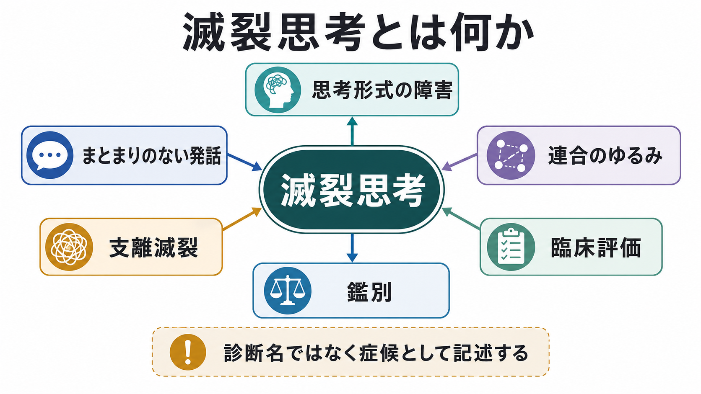
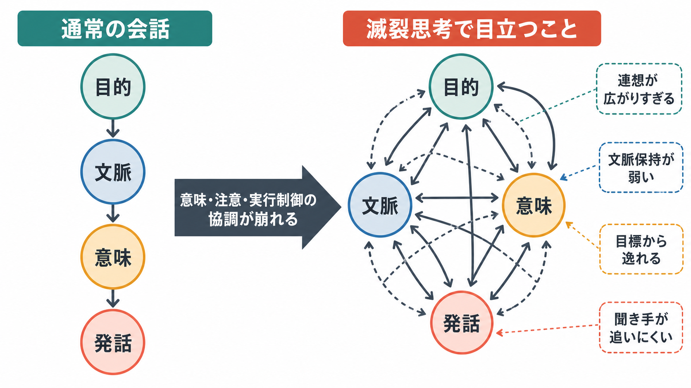
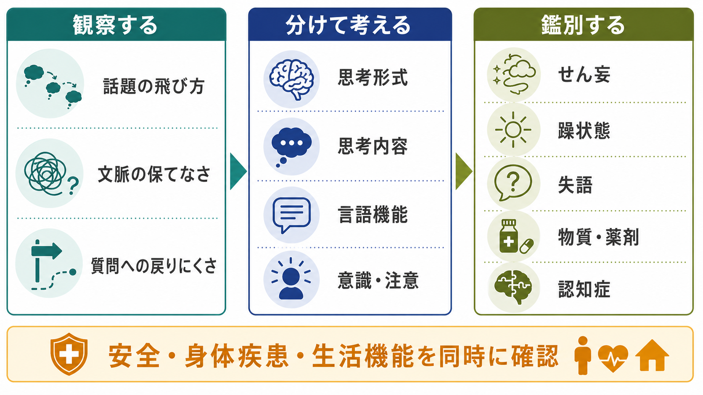

# 滅裂思考とは何か

## 要点

- 滅裂思考は、思考や話題のつながりが大きく崩れ、発話全体として何を言おうとしているのかが追いにくくなる状態である。臨床的には「思考内容」よりも「思考形式」の障害として扱う。
- DSM-5-TR の統合失調症診断基準では、まとまりのない発話は頻繁な脱線や incoherence の例として示されるが、滅裂思考それ自体は診断名ではない[1]。
- 形式的思考障害は統合失調症に限らず、躁状態、せん妄、物質・薬剤、神経疾患、失語、認知機能障害などでも問題になるため、経過・意識・言語機能・気分・薬物・身体疾患を同時に評価する[2][3]。
- 研究上は、意味ネットワーク、言語処理、ワーキングメモリ、目標維持、実行制御、前頭側頭ネットワークの変化などが関連候補として検討されている[4][5][6]。

## この記事で答える問い

1. 滅裂思考は、単に「話がわかりにくい」ことと何が違うのか。
2. 連合弛緩、脱線、観念奔逸、失語、せん妄とはどう区別するのか。
3. 滅裂思考は、どのような認知・言語・神経ネットワークの問題として研究されているのか。
4. 臨床では、どのように観察し、記録し、鑑別につなげるのか。

## まず結論

滅裂思考とは、話の内容が奇妙であるという意味ではなく、言葉・文・話題のつながりが失われ、聞き手が発話の筋道を再構成しにくいほどまとまりが崩れた状態である。したがって、[[妄想とは何か|妄想]]のような「何を信じているか」の問題ではなく、「考えがどのように展開され、発話として組み立てられるか」の問題として見る。

精神科面接では、滅裂思考は[[MSEで思考過程をどう評価するか|MSE の思考過程評価]]に含まれる。たとえば、質問に対する答えが途中で別方向へ飛び、文と文の意味関係が保てず、発話全体から主題や結論が読み取りにくい場合に注目する。ただし、疲労、緊張、教育歴、言語背景、文化差、聴覚障害、失語、せん妄、躁状態、物質使用でも発話はまとまりにくくなるため、滅裂思考という所見だけで特定の診断を決めない。

## 背景

古典的な精神病理学では、統合失調症における「連合の弛緩」や「思考の解体」は重要な所見として記述されてきた。現代の臨床では、これを「形式的思考障害」として、思考、言語、コミュニケーションの障害を複数の観察項目に分けて扱う。Andreasen の Thought, Language, and Communication scale は、脱線、接線性、incoherence、目標喪失、言語新作、保続などを操作的に定義し、評価者間で共有しやすい語彙を与えた[4][7]。

ICD-11 でも、統合失調症および一次性精神症群では、妄想、幻覚、まとまりのない思考、まとまりのない行動、影響体験、陰性症状などが中核的に整理されている[2]。ここで重要なのは、滅裂思考を「統合失調症らしさ」と短絡せず、精神症候学の一所見として記述することである。[[精神症候学とは何か|精神症候学]]では、診断名に急ぐ前に、観察された体験・発話・行動の形をできるだけ具体的に書く。

## 基本概念

### 思考内容と思考形式を分ける

思考内容は、「監視されている」「自分には特別な使命がある」といった信念や主題を指す。思考形式は、話が目的へ向かうか、文脈が保たれるか、発話が論理的につながるか、途中で止まるか、同じ主題に戻り続けるかを指す。滅裂思考は後者の問題であり、内容が現実的でも発話形式が崩れていれば成立しうる。

### 連合弛緩・脱線・滅裂

連合弛緩は、話題どうしの意味的なつながりが弱くなることを指す。脱線は、発話がある話題から別の話題へ滑り、元の話題へ戻りにくくなる状態である。滅裂思考は、これらが重くなり、単語、文、段落、話題の関係が大きく失われ、聞き手が全体の意味をほとんど追えなくなる状態として理解できる[4][7]。

### 観念奔逸との違い

[[躁状態とは何か|躁状態]]でみられる観念奔逸では、話題が速く移るが、語呂、連想、外部刺激、気分の高まりに引かれていることが多く、聞き手が「速すぎるが連想の道筋は見える」と感じる場合がある。滅裂思考では、連想の道筋そのものが見えにくく、文脈や目標の保持がより大きく損なわれる。

### 失語との違い

[[失語とは何か|失語]]では、脳の言語ネットワークの障害により、理解、表出、復唱、呼称、読字、書字が障害される。滅裂思考では、単語を選ぶ能力や文法だけでなく、話題の組み立て、文脈保持、目標維持が問題になる。両者は併存しうるため、簡単な理解課題、復唱、呼称、読字・書字、意識水準を確認して分ける。

## 仕組み

滅裂思考の仕組みは単一の原因で説明できない。現在の研究では、少なくとも三つの水準を分けて考えると整理しやすい。

第一に、意味ネットワークの水準である。通常の会話では、現在の主題に関連する概念が適度に活性化し、不要な連想は抑えられる。滅裂思考では、関連の弱い概念まで広がり、言葉や話題が遠くへ飛びやすくなる可能性がある[5][6]。

第二に、実行制御の水準である。会話では、質問の目的を保ち、相手の反応を見ながら、情報を選び、順番を整え、必要なら修正する。形式的思考障害をもつ統合失調症患者では、実行機能課題での障害が報告され、意味処理だけでなく目標維持やモニタリングの問題も関係すると考えられている[6]。これは[[実行機能障害とは何か|実行機能障害]]や[[ワーキングメモリとは何か|ワーキングメモリ]]の問題と接続する。

第三に、言語・前頭側頭ネットワークの水準である。神経画像研究のレビューでは、形式的思考障害と下前頭回、上側頭回、下頭頂領域、これらを結ぶ白質路の構造・機能変化との関連が検討されている[5]。また、機能的神経画像のメタ解析では、言語処理だけでなく高次認知機能へ広がるネットワークの関与が示唆されている[8]。ただし、これらは集団レベルの研究知見であり、個人の診断を単独で決める指標ではない。

## 図解

図1は、滅裂思考を「思考形式の障害」「まとまりのない発話」「連合のゆるみ」「鑑別」「臨床評価」に分けて読むための概念地図である。図2は、通常の会話では目的、文脈、意味、発話が順に結びつくのに対し、滅裂思考では意味・注意・実行制御の協調が崩れ、連想が広がりすぎる流れを示している。図3は、面接で観察する点、分けて考える軸、鑑別候補をまとめたものである。

## 臨床・研究との接続

臨床では、まず自由な語りを確保し、次に焦点化した質問で発話のまとまりを確認する。たとえば、「ここに来るまでの経過を順番に教えてください」「今いちばん困っていることを一つ選ぶと何ですか」「先ほどの話に戻ると、結論はどこになりますか」と尋ねる。滅裂思考が疑われる場合は、「質問への答えが成立しているか」「話題間の関連があるか」「文脈が保たれるか」「促すと戻れるか」を観察する。

記録では、「滅裂」だけで終わらせず、観察事実を書く。たとえば「睡眠について質問すると、仕事、電車、宗教的主題へ急に移り、促しても元の質問へ戻りにくい。文と文の意味関係が乏しく、全体の主旨を把握しにくい」のように記述する。この書き方は、後から重症度や経過を比較しやすくする。

鑑別では、[[せん妄とは何か|せん妄]]をまず意識する。急性発症、変動性、見当識障害、注意障害、発熱、脱水、薬剤変更、アルコール離脱などがあれば、精神病性障害だけでなく身体疾患を優先して考える。[[認知機能障害とは何か|認知機能障害]]や認知症では、記憶、注意、遂行機能の低下により話がまとまりにくくなる。失語では、言語理解・呼称・復唱・読字書字の障害が前景に出る。物質・薬剤、睡眠不足、極度の不安、躁状態でも、発話の速度やまとまりは変化する。

研究では、形式的思考障害は自然言語処理、発話解析、意味的連結性、脳画像、認知課題をつなぐ対象になっている。近年は、発話の意味的一貫性、語彙の多様性、文法構造、会話ターン、音声特徴を定量化する試みもある。ただし、本人の語りは臨床情報であり、プライバシー、文脈、文化差、ラベル化による不利益を慎重に扱う必要がある。

## よくある誤解

### 誤解1: 滅裂思考は「変なことを言う」ことである

違う。滅裂思考は内容の奇妙さではなく、発話のつながりや文脈保持の障害である。内容が妄想的でなくても滅裂な発話はありうるし、妄想的内容を比較的整った文脈で話す場合もある。

### 誤解2: 滅裂思考があれば統合失調症である

違う。まとまりのない発話は統合失調症スペクトラムで重要な所見だが、躁状態、せん妄、物質・薬剤、神経疾患、失語、認知症、強い不安などでも生じうる[1][2][3]。診断には、経過、機能低下、他症状、除外診断が必要である。

### 誤解3: 聞き手が理解できなければすべて滅裂思考である

違う。専門用語、方言、母語差、文化差、説明の慣れ、緊張、難聴、面接者の質問の曖昧さでも、会話はわかりにくくなる。所見として書く前に、質問を短くし、具体例を求め、言語・聴覚・意識・注意の問題を確認する。

### 誤解4: 画像や尺度で個人診断できる

違う。TLC などの尺度や脳画像研究は、症状を共通言語で測定し、研究仮説を検討するために有用である[4][5][7][8]。しかし、個人の診断や治療方針は、面接、生活機能、経過、身体評価、リスク評価、本人の文脈を総合して判断する。

## 関連ノート

既存ノート:

- [[精神症候学とは何か]]
- [[MSEで思考過程をどう評価するか]]
- [[妄想とは何か]]
- [[せん妄とは何か]]
- [[認知機能障害とは何か]]
- [[実行機能障害とは何か]]
- [[失語とは何か]]
- [[言語産出はどのように行われるのか]]
- [[言語理解はどのように行われるのか]]
- [[躁状態とは何か]]

今後の作成候補:

- 形式的思考障害とは何か
- 連合弛緩とは何か
- 脱線とは何か
- 観念奔逸とは何か
- 思考途絶とは何か
- 精神科面接で発話をどう記録するか

MOC 更新候補:

- `content/00_MOC/MOC｜精神医学.md` の症候学セクションに追加候補。
- `content/00_MOC/MOC｜認知機能.md` の言語・実行機能関連に追加候補。
- 並列ジョブとの競合を避けるため、本稿では MOC 本体は更新しない。

## 理解チェック

1. 滅裂思考を「思考内容」ではなく「思考形式」の障害として見る理由は何か。
2. 脱線、観念奔逸、滅裂思考の違いを、発話の速度・話題の戻りやすさ・意味的つながりから説明できるか。
3. せん妄や失語を見逃さないために、面接で最低限確認したい点は何か。
4. 「滅裂思考あり」とだけ書く記録に比べ、観察事実を添える記録が有用な理由は何か。
5. 形式的思考障害の研究で、意味ネットワークと実行制御の両方を考える必要があるのはなぜか。

## 参考文献

[1] Hany, M., Rizvi, A., & Sharma, S. (2024). *Schizophrenia*. StatPearls. NCBI Bookshelf. https://www.ncbi.nlm.nih.gov/books/NBK539864/

[2] World Health Organization. (2026). *ICD-11 for Mortality and Morbidity Statistics: Schizophrenia or other primary psychotic disorders*. https://icd.who.int/browse/2026-01/mms/en#405565289

[3] National Institute of Mental Health. (2025). *Schizophrenia*. https://www.nimh.nih.gov/health/publications/schizophrenia

[4] Andreasen, N. C. (1979). Thought, language, and communication disorders. I. Clinical assessment, definition of terms, and evaluation of their reliability. *Archives of General Psychiatry, 36*(12), 1315-1321. https://doi.org/10.1001/archpsyc.1979.01780120045006

[5] Cavelti, M., Kircher, T., Nagels, A., Strik, W., & Homan, P. (2018). Is formal thought disorder in schizophrenia related to structural and functional aberrations in the language network? A systematic review of neuroimaging findings. *Schizophrenia Research, 199*, 2-16. https://doi.org/10.1016/j.schres.2018.02.051

[6] Barrera, A., McKenna, P. J., & Berrios, G. E. (2005). Formal thought disorder in schizophrenia: An executive or a semantic deficit? *Psychological Medicine, 35*(1), 121-132. https://doi.org/10.1017/S003329170400279X

[7] Andreasen, N. C. (1986). Scale for the assessment of thought, language, and communication (TLC). *Schizophrenia Bulletin, 12*(3), 473-482. https://doi.org/10.1093/schbul/12.3.473

[8] Wensing, T., Cieslik, E. C., Müller, V. I., Hoffstaedter, F., Eickhoff, S. B., & Nickl-Jockschat, T. (2017). Neural correlates of formal thought disorder: An activation likelihood estimation meta-analysis. *Human Brain Mapping, 38*(10), 4946-4965. https://doi.org/10.1002/hbm.23706

## 未解決問題

- 滅裂思考を、臨床面接で短時間かつ再現性高く評価するには、どの程度の自由発話と構造化質問が必要か。
- 自然言語処理による発話解析を、本人の尊厳とプライバシーを損なわずに臨床研究へ使う条件は何か。
- 形式的思考障害の陽性次元と陰性次元を、意味処理、実行制御、言語ネットワーク、社会認知のどの水準で分けるべきか。
- 文化差、母語差、教育歴、緊張、面接者との関係性を、滅裂思考の評価でどのように補正するか。
