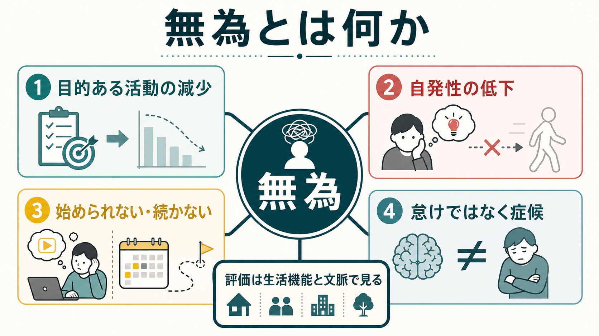
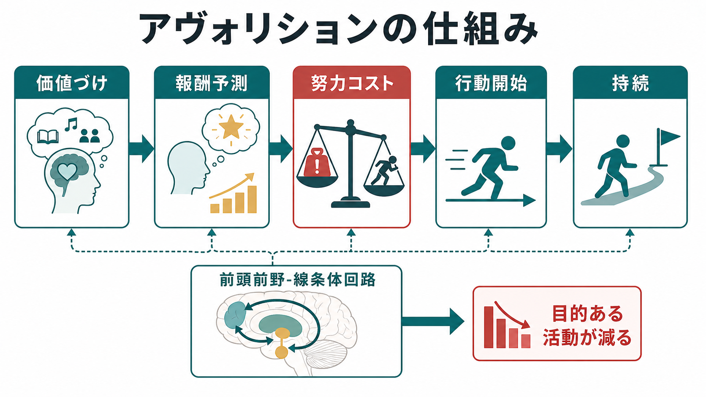
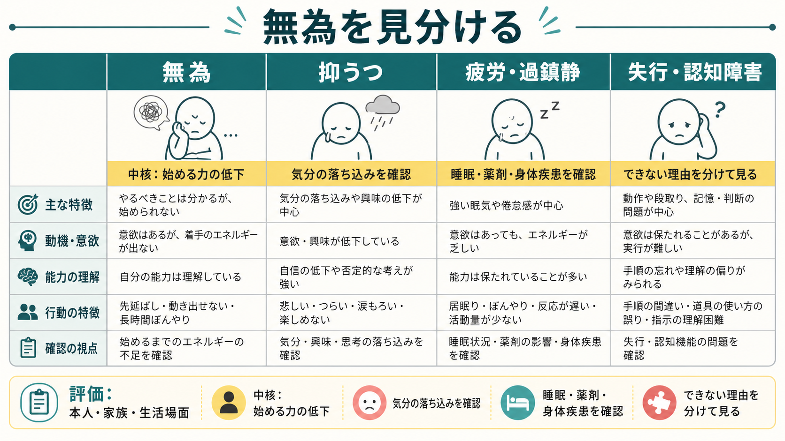

# 無為とは何か

## 要点

- 無為は、目的ある活動を始める、続ける、生活の中で展開する力が著しく低下した状態を指す。単なる「怠け」や性格傾向ではなく、観察可能な行動減少と本人の主観的な意欲低下を合わせて評価する症候である[1][2]。
- 統合失調症の陰性症状では、無為は快感消失、非社交性、感情表出の低下、会話量の低下と並ぶ重要領域であり、機能予後との関連が大きい[1][3]。
- 無為に見える状態には、[[抑うつ気分とは何か|抑うつ気分]]、[[精神運動制止とは何か|精神運動制止]]、薬剤性鎮静、疲労、[[認知機能障害とは何か|認知機能障害]]、[[実行機能障害とは何か|実行機能障害]]、[[失行とは何か|失行]]、[[せん妄とは何か|せん妄]]が混じりうる。
- 評価では「やる気がないか」だけでなく、「何を、どの場面で、どの程度、始められず、続けられないのか」を、本人・家族・生活場面から確かめる。

## この記事で答える問い

1. 無為とはどのような症候か。
2. 無為、意欲低下、アパシー、陰性症状はどう重なるのか。
3. 無為はどのような神経・心理メカニズムで説明されるのか。
4. 臨床では、抑うつ、薬剤性鎮静、認知障害、失行とどう区別するのか。

## まず結論

無為とは、「目的ある活動が少ない」という外から見える行動の問題と、「自分から始める力が弱い」という内側の動機づけの問題が重なった症候である。統合失調症では陰性症状の中核候補として議論され、生活機能、就労、対人関係、セルフケアに強く影響する[1][3]。ただし、同じ「活動しない」でも理由は一つではない。悲しみや罪責感が強くて動けない場合、眠気や錐体外路症状で動きにくい場合、計画や記憶の障害で手順化できない場合、麻痺や失行で行為を組み立てられない場合は、無為そのものとは分けて考える必要がある。

## 背景

精神症候学で無為を扱う意義は、症状の見え方が道徳的評価に置き換えられやすい点にある。周囲からは「やればできるのにしない」「だらしない」「協力的でない」と見えやすい。しかし臨床的には、報酬を見積もる、行動の価値を選ぶ、努力コストを引き受ける、行動を開始する、行動を維持する、という複数の処理のどこかが弱まった結果として理解できる[1][6]。

統合失調症研究では、陰性症状を「動機づけ・快感」領域と「表出」領域に分ける見方が広く使われる。無為は前者に入り、[[快感消失とは何か|快感消失]]や非社交性と近い。一方、[[感情平板化とは何か|感情平板化]]や発話量の低下は、表情・声・身振り・会話の表出低下として評価される[2][5]。

## 基本概念

### 無為と意欲低下

[[意欲低下とは何か|意欲低下]]は、本人の主観的な「したい感じが湧かない」に焦点を当てやすい。無為はそれに加えて、実際の行動開始、持続、生活上の活動量の低下を含む。たとえば「料理をしたい気持ちは少しあるが、材料を出すところから始められない」「約束の前日に行くつもりでも、当日になると準備に入れない」といった形で現れる。

### 無為とアパシー

アパシーは、神経疾患や認知症領域でも使われる広い概念で、目標志向的行動の量的低下として定義されることが多い[6][7]。無為は精神医学、とくに統合失調症の陰性症状の文脈で語られることが多いが、両者は大きく重なる。違いは用語の文脈にあり、無為は「意志・発動性・目的活動の低下」、アパシーは「動機づけ症候群」として整理されやすい。

### 無為と陰性症状

陰性症状は、通常あるはずの感情表出、会話、社会的関心、快感、目的活動が減る症候群である。BNSS は感情鈍麻、会話量低下、非社交性、快感消失、無為を測定する尺度として開発され[4]、CAINS は動機づけ・快感と表出の二領域を重視する尺度として検証された[5]。この流れでは、無為は単独の症状というより、生活機能に直結する陰性症状の核として扱われる。

## 仕組み

無為の仕組みは、一つの「やる気物質」の不足では説明しきれない。少なくとも次の処理が関与する。

| 処理 | 無為で弱まりうる点 | 臨床で見える形 |
|---|---|---|
| 価値づけ | 活動の意味や報酬が立ち上がりにくい | 予定、趣味、身だしなみへの関心が薄い |
| 予測 | 行動後の快・達成感を予想しにくい | やってもよいことがあると思えない |
| 努力コスト | 必要な労力が過大に感じられる | 小さな準備でも負担が大きい |
| 行動開始 | 最初の一歩を自分で起こしにくい | 声かけがあると動けるが一人では始まらない |
| 持続 | 始めても維持できない | 途中で止まり、完了まで届かない |

前頭前野-基底核回路は、価値、選択、行動開始、維持の接続に関わる。Levy と Dubois は、アパシーを情動-価値処理、認知的計画、自動賦活の障害に分け、前頭前野と基底核の機能的連結から説明した[6]。統合失調症の無為研究でも、報酬価値、努力コスト、行動選択の異常が注目されている[1]。

## 図解

無為は「活動しない」という一つの外観から始まるが、評価では原因の分岐を見る。

| 見え方 | まず考えること | 確認する情報 |
|---|---|---|
| 一日中横になっている | 無為、抑うつ、疲労、薬剤性鎮静 | 気分、睡眠、薬剤変更、身体症状 |
| 身だしなみが低下する | 無為、認知障害、生活環境の崩れ | 手順理解、記憶、支援の有無 |
| 会話や外出が減る | 無為、非社交性、不安、被害的解釈 | 対人場面での不安、妄想、興味 |
| 声をかけると動ける | 自発的開始の低下 | 外的手がかりへの反応 |
| 途中で止まる | 持続困難、注意障害、疲労 | 継続時間、注意、疲れやすさ |

## 臨床・研究との接続

### 評価

無為の評価では、本人の語りだけにも、家族の印象だけにも寄せすぎない。本人は「やる気がない」と表現することもあれば、「何も思いつかない」「始め方がわからない」「面倒というより空白」と語ることもある。家族や支援者からは、以前との比較、声かけへの反応、セルフケア、家事、通院、就労・就学、対人交流の変化を聞く。

尺度としては、研究では BNSS や CAINS がよく使われる[4][5]。臨床では尺度だけでなく、[[精神状態診察MSEとは何か|精神状態診察MSE]]、[[精神科で生活機能をどう評価するか|生活機能評価]]、薬剤歴、身体疾患、睡眠、物質使用、家族・地域環境を合わせる。

### 鑑別

抑うつでは、悲哀、罪責感、希死念慮、自己評価の低下、睡眠・食欲変化が前景化しやすい。無為では、気分の落ち込みが目立たなくても、自発的活動の開始と持続が低下することがある。精神運動制止では、思考や動作全体の速度低下が目立つ。

薬剤性鎮静や錐体外路症状では、眠気、筋強剛、動作緩慢、アカシジア、服薬変更との時間関係が重要である。認知障害や実行機能障害では、行動を始める意欲よりも、手順化、記憶、注意、計画、切り替えの困難が中心になることがある。失行では、目的は理解していても運動行為を適切に構成できない。

### 支援

無為への支援は、本人を責めて意志力を求める形では進みにくい。NICE の統合失調症ガイドラインは、薬物療法だけでなく、心理社会的介入、家族支援、身体健康、併存症、長期的回復を含む包括的管理を重視している[8]。実践上は、活動を小さく分ける、外的手がかりを作る、予定を視覚化する、家族や支援者が過度に代行しすぎない、本人にとって意味のある活動を選ぶ、といった環境調整が重要になる。

## よくある誤解

### 誤解1: 無為は怠けである

無為は価値判断ではなく症候である。評価すべきなのは「努力しているか」ではなく、目的活動の開始・持続・生活場面での展開がどう変化したかである。

### 誤解2: 動かないならすべて無為である

活動低下には、抑うつ、疲労、睡眠不足、薬剤性鎮静、身体疾患、疼痛、認知障害、失行、妄想や不安による回避が含まれる。無為は鑑別を通して見える症候であり、観察だけで即断しない。

### 誤解3: 声をかければ動けるなら問題は軽い

外的手がかりがあれば動ける一方で、自分から始める力が弱いことは無為の重要な特徴である。支援では、この差を責めるのではなく、手がかり、構造化、活動の段階化に活かす。

### 誤解4: 無為は統合失調症だけで見られる

統合失調症の陰性症状として重要だが、アパシーは神経疾患、認知症、うつ病、脳損傷などでも見られる[6][7]。診断名よりも、症候の成り立ちと生活機能への影響を分けて考える。

## 関連ノート

- [[精神症候学とは何か]]
- [[症状と徴候は何が違うのか]]
- [[意欲低下とは何か]]
- [[快感消失とは何か]]
- [[精神運動制止とは何か]]
- [[抑うつ気分とは何か]]
- [[感情平板化とは何か]]
- [[認知機能障害とは何か]]
- [[実行機能障害とは何か]]
- [[失行とは何か]]
- [[せん妄とは何か]]
- [[精神科で生活機能をどう評価するか]]

MOC更新候補: `content/00_MOC/` 配下の精神医学、症候学、統合失調症、生活機能評価に関する MOC があれば、バッチ統合時に本記事へのリンクを追加する。

## 理解チェック

1. 無為を「怠け」と区別するために、どのような観察情報が必要か。
2. 無為、抑うつ、精神運動制止、薬剤性鎮静は、どの点で見分けられるか。
3. 前頭前野-基底核回路の観点から、無為ではどの処理が弱まりうるか。
4. 本人は「やりたい」と言うが行動開始できない場合、どのような支援構造が考えられるか。

## 参考文献

[1] Strauss, G. P., Bartolomeo, L. A., & Harvey, P. D. (2021). Avolition as the core negative symptom in schizophrenia: relevance to pharmacological treatment development. *NPJ Schizophrenia*, 7, 16. https://doi.org/10.1038/s41537-021-00145-4

[2] Galderisi, S., Mucci, A., Dollfus, S., et al. (2021). EPA guidance on assessment of negative symptoms in schizophrenia. *European Psychiatry*, 64(1), e23. https://doi.org/10.1192/j.eurpsy.2021.11

[3] Correll, C. U., & Schooler, N. R. (2020). Negative Symptoms in Schizophrenia: A Review and Clinical Guide for Recognition, Assessment, and Treatment. *Neuropsychiatric Disease and Treatment*, 16, 519-534. https://doi.org/10.2147/NDT.S225643

[4] Kirkpatrick, B., Strauss, G. P., Nguyen, L., et al. (2011). The Brief Negative Symptom Scale: Psychometric Properties. *Schizophrenia Bulletin*, 37(2), 300-305. https://doi.org/10.1093/schbul/sbq059

[5] Kring, A. M., Gur, R. E., Blanchard, J. J., Horan, W. P., & Reise, S. P. (2013). The Clinical Assessment Interview for Negative Symptoms (CAINS): final development and validation. *American Journal of Psychiatry*, 170(2), 165-172. https://doi.org/10.1176/appi.ajp.2012.12010109

[6] Levy, R., & Dubois, B. (2006). Apathy and the functional anatomy of the prefrontal cortex-basal ganglia circuits. *Cerebral Cortex*, 16(7), 916-928. https://doi.org/10.1093/cercor/bhj043

[7] Miller, D. S., Robert, P., Ereshefsky, L., et al. (2021). Diagnostic criteria for apathy in neurocognitive disorders. *Alzheimer's & Dementia*, 17(12), 1892-1904. https://doi.org/10.1002/alz.12358

[8] National Institute for Health and Care Excellence. (2014). *Psychosis and schizophrenia in adults: prevention and management* (CG178). https://www.nice.org.uk/guidance/cg178

## 未解決問題

- 無為を「一次性陰性症状」と「抑うつ・薬剤・環境要因による二次性活動低下」に分ける実用的基準は、臨床現場でなお揺れがある。
- 報酬予測、努力コスト、行動開始、社会的文脈のどれを主要標的にすると生活機能が最も改善するかは、さらに検証が必要である。
- 日本語臨床で、無為、アパシー、意欲低下、発動性低下をどのように用語整理するかは、教育・記録・研究の接続上の課題である。

## 更新ログ

- 2026-04-28: 初稿作成。無為の定義、陰性症状・アパシーとの関係、機序、鑑別、臨床評価、関連ノート候補を整理し、生成インフォグラフィック3枚を挿入。
