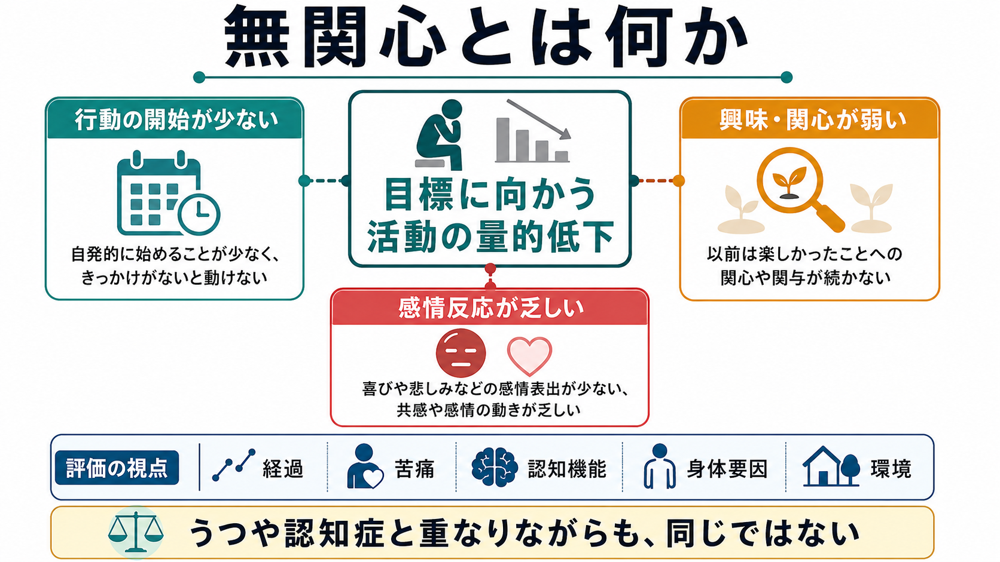
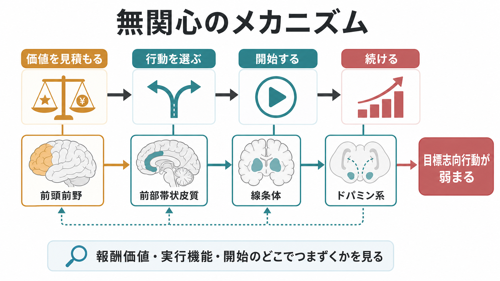
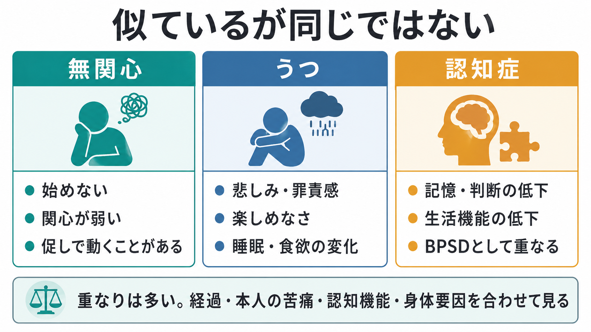

# 無関心とは何か

## 要点

- 無関心とは、単なる「冷たい性格」ではなく、目標に向かう活動、興味、感情的反応が量的に低下した状態である。神経認知障害領域では、行動・認知・情動の少なくとも一部に持続的な低下があり、生活機能に影響することが重視される[1]。
- うつ病では悲しみ、罪責感、絶望感、睡眠・食欲変化などが前面に出やすい。一方、無関心では本人の苦痛が目立たず、周囲から「始めない」「続けない」「反応が薄い」と観察されることがある[2][3]。
- 認知症では、無関心は頻度の高い行動・心理症状の一つであり、記憶障害や実行機能障害とは別に、日常生活機能や介護負担に関わる[1][4]。
- 仕組みとしては、報酬価値を見積もる、行動を選ぶ、開始する、努力を維持するという一連の過程に、前頭前野、前部帯状皮質、線条体、ドパミン系が関わる[5][6]。
- 医療・支援では、本人を責めるより、うつ、せん妄、薬剤、身体疾患、睡眠、環境、認知機能を合わせて評価し、行動を始めやすい設計に変える視点が重要である。

## この記事で答える問い

1. 無関心は、日常語の「興味がない」と何が違うのか。
2. 無関心は、[[意欲低下とは何か]]、[[快感消失とは何か]]、[[感情鈍麻とは何か]]とどう重なるのか。
3. うつ病や認知症では、無関心をどのように見分けるのか。
4. 報酬系、前頭前野、線条体の変化は、無関心をどう説明するのか。
5. 臨床・研究では、無関心をどのように評価し、支援につなげるのか。

## まず結論

無関心は「何も気にしていない人」という性格判断ではなく、行動を始める力、興味を保つ力、情動的に反応する力が落ちている状態として見るべき症候である。とくに認知症、うつ病、統合失調症、パーキンソン病、脳血管障害、頭部外傷などでは、本人の意思や道徳性だけで説明できない形で目標志向行動が低下する。

ただし、無関心は単独で診断名になるとは限らない。実際の評価では、[[抑うつ気分とは何か]]、[[精神運動制止とは何か]]、[[認知機能障害とは何か]]、[[実行機能障害とは何か]]、薬剤性の鎮静、身体疾患、環境刺激の乏しさを切り分ける必要がある。本人が「つらい」と訴えないから問題が軽いとは限らず、生活機能や安全、家族・支援者の負担から見て大きな意味をもつことがある[1][4]。

## 背景

精神科面接では、「意欲がない」「興味がない」「反応が薄い」「一日中ぼんやりしている」という訴えがよく出てくる。これらは似ているが、同じ意味ではない。本人が悲しみや絶望を強く感じている場合もあれば、本人の苦痛表現は少ないのに、活動量だけが大きく下がっている場合もある。

アパシー研究では、無関心を「動機づけの低下」として定義してきた流れがある。Marin は、意識障害、認知障害、情緒的苦痛だけでは説明できない動機づけの低下としてアパシーを扱い、評価尺度の基盤を作った[2]。その後、神経認知障害領域では、行動・認知・情動の領域に分けて、持続性、以前からの変化、機能障害、他の要因では十分説明できないことを確認する診断基準が整備されてきた[1]。

日常語の「無関心」は、しばしば価値判断を含む。しかし臨床では、本人の怠慢と決めつける前に、どの機能が低下しているのかを観察する。たとえば「始めない」のか、「始めても続かない」のか、「楽しみが予測できない」のか、「楽しいはずの場面で表情が動かない」のかでは、考えるべき背景が異なる。

## 基本概念

### 無関心は三つの側面で見る

神経認知障害における診断基準では、無関心はおおむね次の三側面で整理できる[1]。

| 側面 | 具体例 | 関連する見方 |
|---|---|---|
| 行動の低下 | 自発的に始めない、予定を組まない、促されないと動かない | [[意欲低下とは何か]]、[[実行機能障害とは何か]] |
| 認知・興味の低下 | 新しいことに関心を示さない、将来の計画を考えない、選択肢を比較しない | [[認知機能障害とは何か]]、[[報酬系とは何か]] |
| 情動反応の低下 | 喜び・悲しみ・驚きへの反応が乏しい、表情や声の変化が少ない | [[感情鈍麻とは何か]]、[[快感消失とは何か]] |

この三側面は分離できるが、実際には重なって現れる。たとえば、報酬を予測する力が弱くなると、活動を始める理由が感じられにくくなる。実行機能が落ちると、やりたい気持ちがあっても段取りが組めず、結果として「何もしない」ように見える。

### うつとの違い

うつ病では、抑うつ気分、罪責感、悲観、希死念慮、睡眠や食欲の変化、精神運動制止などが重要になる。無関心では、悲しみや罪責感が乏しいまま、活動の開始や関心の維持が落ちることがある[3]。

ただし、両者は排他的ではない。うつ病でも興味や喜びの低下は中核症状であり、無関心に見えることがある。逆に認知症や神経疾患に伴う無関心が、周囲から「うつではないか」と受け取られることもある。鑑別では、本人の内的苦痛、気分の持続性、思考内容、身体症状、認知機能、薬剤、経過を合わせて見る。

### 認知症との関係

認知症では、無関心は行動・心理症状の一部としてよく問題になる。アルツハイマー病、前頭側頭型認知症、レビー小体型認知症などで現れ方は異なるが、共通して「以前ならしていた活動をしなくなる」「促しがないと食事や入浴が進まない」「会話や趣味への反応が乏しい」といった形で見えることがある[1][4]。

重要なのは、無関心を記憶障害だけで説明しないことである。予定を忘れるから活動しない場合もあるが、予定を覚えていても開始しない場合、報酬価値や実行機能、情動反応の低下が関わっている可能性がある。

## 仕組み

無関心の仕組みは、単一の脳部位ではなく、目標志向行動を作る過程として理解しやすい。

1. 何に価値があるかを見積もる。
2. 価値とコストを比べて、行動を選ぶ。
3. 行動を始める。
4. 努力を維持し、結果に応じて修正する。

この流れには、前頭前野、前部帯状皮質、眼窩前頭皮質、線条体、淡蒼球、ドパミン系などが関わる。Levy と Dubois は、無関心を情動・認知・自己賦活の障害として整理し、前頭前野-基底核回路との関係を論じた[5]。Husain と Roiser は、無関心と快感消失を、価値、努力、報酬予測、行動選択の変化として横断的に捉える枠組みを示している[6]。

この観点からは、「やる気がない」という一語を、少なくとも次の問いに分けられる。

| 問い | 低下している可能性がある機能 |
|---|---|
| それをやる価値を感じられるか | 報酬価値、興味、将来予測 |
| 始める手順を組めるか | 実行機能、計画、注意 |
| 努力に見合うと感じられるか | 努力コスト、疲労、身体症状 |
| 途中で調整できるか | 認知制御、フィードバック学習 |
| 感情的な反応が外に出るか | 情動表出、身体反応、対人反応 |

## 図解

次の図は、無関心、うつ、認知症を比較する入口である。実際には重なりが大きいため、図の分類だけで診断を決めるものではない。面接では、経過、本人の苦痛、認知機能、身体疾患、薬剤、環境を合わせて評価する。

## 臨床・研究との接続

### 評価では「行動量」だけでなく文脈を見る

無関心の評価では、本人の言葉、家族・支援者の観察、生活機能、認知機能検査、身体状態を組み合わせる。[[精神状態診察MSEとは何か]]では、表情、声量、反応潜時、自発話、活動量、気分、感情、思考内容、認知機能を分けて観察することが役立つ。

評価尺度としては Apathy Evaluation Scale などがあり、臨床研究では本人評価、介護者評価、観察者評価を使い分ける[2]。神経認知障害では、うつや不安とは別に無関心を測ることで、生活機能や支援ニーズを見落としにくくなる。

### 支援は説得より環境設計に寄せる

無関心がある人に対して、「もっと頑張って」と説得するだけでは、行動は増えにくい。むしろ、開始の手がかりを外部化する、選択肢を少なくする、短い活動に分ける、報酬や意味づけが見えやすい活動を選ぶ、疲労や痛みを減らす、家族・支援者の負担を調整する、といった設計が重要になる。

薬物療法については、認知症に伴う無関心に対してメチルフェニデートを検討したランダム化比較試験があり、一定の有効性が報告されている[7]。ただし、これは個別治療の指示ではない。高齢者、心血管リスク、睡眠、食欲、焦燥、他剤との相互作用を含めて、専門的に判断されるべき問題である。

### 研究では横断的な症候として扱われる

無関心は、特定疾患だけの症状ではない。認知症、うつ病、統合失調症、パーキンソン病、脳損傷などを横断して、報酬、努力、意思決定、実行機能、情動表出の問題として研究されている[6][8]。この横断的な視点は、診断名だけでなく「どの過程が弱っているか」を見る点で、計算論的精神医学や認知神経科学とも接続しやすい。

## よくある誤解

### 誤解1: 無関心は怠けである

無関心は、本人の道徳性や努力不足だけで説明できるものではない。脳疾患、認知機能低下、うつ、薬剤、身体疾患、環境の単調さなどが関わる。責めるより、どの段階で行動が止まっているかを見るほうが実用的である。

### 誤解2: 悲しそうでなければうつではない

うつ病では悲しみが目立つことが多いが、興味や喜びの低下、疲労、精神運動制止が前面に出る場合もある。無関心に見えるからといって、うつ病を除外してよいわけではない。

### 誤解3: 認知症なら仕方がない

認知症に伴う無関心でも、環境調整、活動設計、身体症状の治療、睡眠の改善、介護者支援によって生活機能が変わることがある。認知症の一部として見える症状でも、評価と支援の対象になる。

### 誤解4: 反応が薄い人は感情がない

外から見える感情表出が乏しいことと、内的な感情体験が乏しいことは同じではない。[[感情鈍麻とは何か]]と同様に、表情や声の変化だけで本人の内的体験を決めつけないほうがよい。

## 関連ノート

- [[意欲低下とは何か]]
- [[快感消失とは何か]]
- [[感情鈍麻とは何か]]
- [[抑うつ気分とは何か]]
- [[精神運動制止とは何か]]
- [[認知機能障害とは何か]]
- [[実行機能障害とは何か]]
- [[報酬系とは何か]]
- [[ドパミンは報酬だけの物質なのか]]
- [[精神状態診察MSEとは何か]]

## MOC更新候補

- `content/00_MOC/` 配下の精神医学・症候学・認知症・うつ病関連 MOC に、`[[無関心とは何か]]` を追加候補とする。
- 並列ジョブとの競合を避けるため、このタスクでは MOC 本体は更新しない。

## 理解チェック

1. 無関心を「行動」「興味・認知」「情動反応」に分けると、面接で何を聞きやすくなるか。
2. 無関心とうつ病を見分けるとき、本人の苦痛、罪責感、睡眠・食欲、思考内容はどのように役立つか。
3. 認知症に伴う無関心を、記憶障害だけで説明しないほうがよい理由は何か。
4. 報酬価値、努力コスト、実行機能のどこが弱ると、同じ「動かない」に見えるか。
5. 無関心がある人への支援で、説得より環境設計が重要になる理由は何か。

## 未解決問題

- 無関心、快感消失、精神運動制止、実行機能障害を、臨床面接でどこまで再現性高く分けられるか。
- 認知症の種類ごとに、無関心の神経回路と支援反応性がどの程度異なるか。
- 本人評価、家族評価、行動データ、神経画像、計算論的課題をどのように統合すれば、生活機能の改善に直結する評価になるか。
- 薬物療法、活動設計、介護者支援、デジタル介入を、どの患者群にどう組み合わせるべきか。

## 参考文献

[1] Miller, D. S., Robert, P., Ereshefsky, L., Adler, L., Bateman, D., Cummings, J., DeKosky, S. T., et al. (2021). Diagnostic criteria for apathy in neurocognitive disorders. *Alzheimer's & Dementia, 17*(12), 1892-1904. https://pmc.ncbi.nlm.nih.gov/articles/PMC8835377/

[2] Marin, R. S., Biedrzycki, R. C., & Firinciogullari, S. (1991). Reliability and validity of the Apathy Evaluation Scale. *Psychiatry Research, 38*(2), 143-162. https://doi.org/10.1016/0165-1781(91)90040-V

[3] National Institute of Mental Health. (2024). *Depression*. https://www.nimh.nih.gov/health/topics/depression

[4] Lanctot, K. L., Agüera-Ortiz, L., Brodaty, H., Francis, P. T., Geda, Y. E., Ismail, Z., Marshall, G. A., et al. (2017). Apathy associated with neurocognitive disorders: Recent progress and future directions. *Alzheimer's & Dementia, 13*(1), 84-100. https://doi.org/10.1016/j.jalz.2016.05.008

[5] Levy, R., & Dubois, B. (2006). Apathy and the functional anatomy of the prefrontal cortex-basal ganglia circuits. *Cerebral Cortex, 16*(7), 916-928. https://doi.org/10.1093/cercor/bhj043

[6] Husain, M., & Roiser, J. P. (2018). Neuroscience of apathy and anhedonia: A transdiagnostic approach. *Nature Reviews Neuroscience, 19*, 470-484. https://pmc.ncbi.nlm.nih.gov/articles/PMC6518466/

[7] Mintzer, J., Lanctot, K. L., Scherer, R. W., Rosenberg, P. B., Herrmann, N., van Dyck, C. H., Padala, P. R., et al. (2021). Effect of methylphenidate on apathy in patients with Alzheimer disease: The ADMET 2 randomized clinical trial. *JAMA Neurology, 78*(11), 1324-1332. https://doi.org/10.1001/jamaneurol.2021.3356

[8] Treadway, M. T., & Zald, D. H. (2011). Reconsidering anhedonia in depression: Lessons from translational neuroscience. *Neuroscience & Biobehavioral Reviews, 35*(3), 537-555. https://doi.org/10.1016/j.neubiorev.2010.06.006
