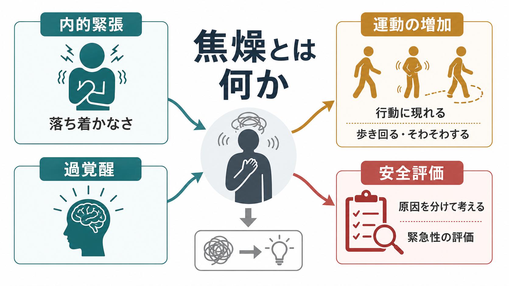
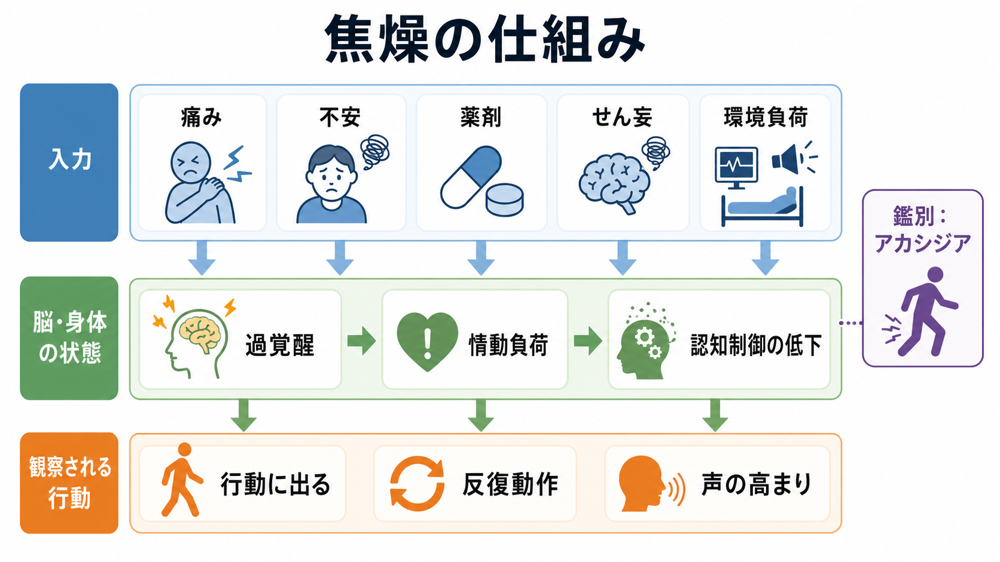
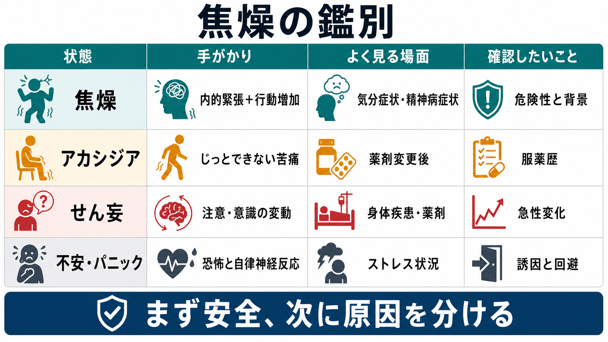

# 焦燥とは何か

## 要点

- 焦燥は、内的な緊張、落ち着かなさ、苦痛が、歩き回る、そわそわする、反復動作、声の高まり、攻撃的言動などの外から見える行動に出た状態である。
- DSM 系の診断基準では、大うつ病エピソードの「精神運動焦燥または制止」は「他者から観察可能」であることが強調される[1]。つまり、本人の「落ち着かない感じ」だけでなく、行動としてどう現れるかを見る必要がある。
- 焦燥は診断名ではなく、気分症状、精神病症状、[[せん妄とは何か|せん妄]]、薬剤、物質使用、疼痛、睡眠不足、環境負荷などで生じうる横断的な症候である[2][3]。
- アカシジアは焦燥と紛らわしいが、薬剤変更後の「じっとしていられない苦痛」と反復的な運動が中心になりやすく、服薬歴の確認が重要である[4]。
- 臨床では、まず安全と緊急性を見て、次に原因を分ける。この記事は教育・研究目的の整理であり、個別診断や治療指示ではない。

## この記事で答える問い

1. 焦燥は、単なる不安や怒りと何が違うのか。
2. なぜ内的緊張が、歩き回る、そわそわする、声が高まるといった行動に現れるのか。
3. アカシジア、せん妄、不安・パニック、精神運動制止とどう見分けるのか。
4. 臨床・研究では、焦燥をどのように安全評価、鑑別、測定につなげるのか。

## まず結論

焦燥とは、**こころと身体が「待てない」「じっとできない」方向へ押し出され、その圧力が行動として観察される状態**である。本人の体験としては、焦り、緊張、苦しさ、いらだち、恐怖、切迫感として語られることがある。外からは、立ったり座ったりする、部屋を歩き回る、手をもむ、足を揺らす、同じ質問を繰り返す、声が大きくなる、制止に反応しにくくなる、といった形で見える。

ただし、焦燥は「性格が短気」「わがまま」「単に怒っている」と同じではない。気分障害、精神病症状、認知機能の変動、薬剤性の運動症状、物質使用や離脱、疼痛、低酸素、感染、睡眠不足、過刺激な環境など、多くの要因が重なる。したがって、[[MSEで外観と行動から何を観察するか|MSEの外観・行動観察]]、現病歴、服薬歴、物質使用歴、身体所見、周囲からの情報を合わせて読む必要がある。

## 背景

焦燥に近い英語としては *agitation*、*psychomotor agitation*、*restlessness* が使われる。精神医学では、焦燥は疾患横断的な症候であり、診断カテゴリーそのものではない。たとえば大うつ病エピソードでは「精神運動焦燥または制止」が診断項目に含まれ、躁病エピソードでは「目標指向性活動の増加または精神運動焦燥」が項目に含まれる[1][5]。

認知症・認知障害領域では、International Psychogeriatric Association の暫定的コンセンサス定義が、agitation を「情動的苦痛と関連し、過剰な運動活動、言語的攻撃、身体的攻撃として現れ、他の精神・身体・物質関連状態だけでは説明されない行動」と整理している[2]。この定義は認知障害を対象にしたものだが、焦燥を「内的苦痛」「行動表出」「機能障害」「他原因の除外」という複数要素で考えるうえで参考になる。

救急・急性期の文脈では、焦燥は安全上の問題にもなる。Project BETA は、焦燥を医学的・精神医学的な多数の原因から生じうる状態として扱い、医学的原因の除外、危機の安定化、強制を最小化する関わり、言語的ディエスカレーション、原因に応じた薬物療法を組み合わせる重要性を述べている[3][6]。

## 基本概念

### 内的緊張と行動表出

焦燥の核は、内側で高まった緊張や苦痛が、行動の増加として外に出ることである。本人は「胸がざわざわする」「座っていられない」「何かしないといけない」「頭がまとまらない」と表現することがある。観察者からは、足踏み、 pacing、反復質問、身振りの増加、声量の増加、退室しようとする動きとして見える。

ここで重要なのは、焦燥が「多動」そのものではない点である。多動は発達特性や注意制御の文脈で使われることもあるが、焦燥では苦痛、切迫感、情動負荷、認知制御の低下、安全リスクとの接続が前景化しやすい。

### 精神運動焦燥

精神運動焦燥は、思考・感情・身体運動が結びついた行動変化である。DSM-5 の大うつ病エピソード項目では、精神運動焦燥または制止は「他者から観察可能」であり、単なる主観的な落ち着かなさや遅さでは足りないとされる[1]。この点は、[[症状と徴候は何が違うのか|症状と徴候]]の区別とも関係する。

### アカシジアとの違い

アカシジアは、抗精神病薬などの薬剤と関連しやすい神経精神医学的な運動症状で、主観的な内的不穏と客観的な精神運動性の落ち着かなさを特徴とする[4]。下肢のむずむず感、立ったり座ったりする、足を組み替える、歩き回るなどが見られやすい。焦燥と誤認されると、原因への対応がずれる可能性があるため、薬剤開始・増量・変更・中止との時間関係を確認する。

## 仕組み

焦燥は単一の脳部位や単一の神経伝達物質で説明できる状態ではない。むしろ、次のような層が重なって現れる。

| 層 | 内容 | 焦燥へのつながり |
|---|---|---|
| 入力 | 痛み、不安、恐怖、睡眠不足、薬剤、物質、身体疾患、環境刺激 | 身体・情動・認知への負荷が増える |
| 覚醒 | 過覚醒、自律神経反応、警戒の高まり | 周囲を脅威的に読みやすくなる |
| 情動 | いらだち、恐怖、絶望感、混乱 | 行動の抑制が難しくなる |
| 認知制御 | 注意の揺らぎ、判断力低下、見通しの低下 | 待つ、説明を聞く、切り替えることが難しくなる |
| 行動 | 歩き回る、反復動作、声の高まり、退室企図 | 観察可能な焦燥として現れる |

このうち、せん妄では注意・意識の変動が中心になる。うつ病では焦燥が「苦痛を伴う落ち着かなさ」として現れることがある。躁状態では活動性や目標指向性の増加と結びつくことがある。薬剤性では、内的不穏と運動衝動が前景に出ることがある。したがって、焦燥を見たときは「どの診断か」より先に、「どの層が強く寄与しているか」を分けると整理しやすい。

## 図解

3枚の図は、焦燥を別々の解像度で整理している。

1枚目は、焦燥を「内的緊張」「過覚醒」「行動に現れる」「安全評価」という概念地図として示している。2枚目は、痛み、不安、薬剤、せん妄、環境負荷が、過覚醒・情動負荷・認知制御低下を経て行動化する流れを示している。3枚目は、焦燥、アカシジア、せん妄、不安・パニックを、手がかりと確認点で比較している。

## 臨床・研究との接続

### 評価の入口

焦燥を評価するときは、まず安全と緊急性を確認する。自傷・他害の切迫、重い混乱、離院・転倒リスク、低酸素や発熱などの身体危険サインがあれば、原因探索と安全確保を並行する。これは[[他害リスク評価では何を見るべきか]]や[[クライシスプランとは何か]]とも接続する。

次に、原因を分ける。現病歴では発症時期、急性か慢性か、日内変動、誘因、睡眠、疼痛、食事、水分、環境変化を確認する。薬剤・物質では、開始、増量、中止、飲み忘れ、アルコール、刺激薬、鎮静薬、離脱を確認する。ここは[[物質使用歴はどのように聞くべきか]]や[[器質性精神障害を見逃さないためには何を見るべきか]]と強く関係する。

### 急性期対応の原則

Project BETA は、焦燥への対応を薬物だけに還元せず、医学的評価、精神医学的評価、言語的ディエスカレーション、薬物療法、隔離・身体拘束の最小化を組み合わせる枠組みとして提示した[3][6]。薬物療法が必要な場合でも、目標は「眠らせる」ことではなく、評価と協働が可能になる程度に落ち着かせることだとされる[6]。本記事では個別の薬剤選択は扱わないが、原因に応じた評価が先行する点は押さえておきたい。

### 測定と研究

研究では、焦燥を「どの対象集団で、どの尺度で、どの期間、どの行動を測るか」によって結果が変わる。認知症領域では Cohen-Mansfield Agitation Inventory が広く使われ、身体的攻撃、身体的非攻撃、言語的焦燥などの行動頻度を評価する尺度として検討されてきた[7]。尺度は研究比較や介入効果の測定に役立つが、臨床では尺度得点だけでなく、背景要因と安全性の評価を合わせる必要がある。

## よくある誤解

### 誤解1: 焦燥は「怒っているだけ」である

怒りが表面に出ることはあるが、焦燥の背景には不安、恐怖、混乱、疼痛、睡眠不足、薬剤性の不穏、せん妄などが隠れることがある。怒りとしてだけ扱うと、身体疾患や薬剤性の原因を見逃しやすい。

### 誤解2: じっとしていられないなら、すべて焦燥である

アカシジア、躁状態、せん妄、不安・パニック、疼痛、離脱、発達特性、環境への反応などが重なりうる。特に薬剤変更後の「じっとしていられない苦痛」はアカシジアとして確認する必要がある[4]。

### 誤解3: 焦燥が強いほど、必ず危険である

焦燥の強さは安全評価の重要な手がかりだが、それだけで自傷・他害を予測できるわけではない。意図、計画、手段へのアクセス、過去の行動、物質使用、せん妄、周囲の保護因子を合わせて見る必要がある。

### 誤解4: 鎮静すれば評価は終わる

急性期に落ち着かせる必要がある場面はある。しかし、焦燥は原因への入口でもある。Project BETA が強調するように、医学的原因や精神医学的原因を評価し、患者が可能な範囲で協働できる状態を目指すことが重要である[3][6]。

## 関連ノート

- [[精神症候学とは何か]]
- [[症状と徴候は何が違うのか]]
- [[MSEで外観と行動から何を観察するか]]
- [[せん妄とは何か]]
- [[注意障害とは何か]]
- [[意識障害とは何か]]
- [[器質性精神障害を見逃さないためには何を見るべきか]]
- [[物質使用歴はどのように聞くべきか]]
- [[他害リスク評価では何を見るべきか]]
- [[クライシスプランとは何か]]
- [[ノルアドレナリン系は不安と覚醒にどう関わるのか]]

## MOC更新候補

- `content/00_MOC/MOC｜精神医学.md` の「症候学」または「精神状態診察」周辺に追加候補。
- 並列ジョブとの衝突を避けるため、このタスクでは MOC 本体は更新しない。

## 理解チェック

1. 焦燥を「主観的な落ち着かなさ」だけでなく「観察可能な行動」として見る理由は何か。
2. 焦燥とアカシジアを区別するとき、服薬歴のどの点を確認するべきか。
3. せん妄による焦燥を疑うとき、注意・意識・日内変動のどこを見るか。
4. 焦燥への急性期対応で、安全確保と原因評価を分けずに進める必要があるのはなぜか。

## 未解決問題

- 焦燥を、診断横断的な神経回路・覚醒制御・情動制御の指標としてどこまで統合的に測定できるか。
- 急性期の観察所見、ウェアラブル指標、音声・行動データを用いた焦燥評価が、過剰な監視やスティグマを生まずに実装できるか。
- 認知症、気分障害、精神病性障害、薬剤性症状で、同じ「焦燥」という行動表現がどの程度共通の機序を持つか。

## 参考文献

[1] Endotext, NCBI Bookshelf. *Table 1. DSM-5 “Major” Depressive Episode*. https://www.ncbi.nlm.nih.gov/books/NBK498652/table/depress-diab.T.dsm5__major_depressive_ep/

[2] Cummings, J., Mintzer, J., Brodaty, H., et al. (2015). Agitation in cognitive disorders: International Psychogeriatric Association provisional consensus clinical and research definition. *International Psychogeriatrics*, 27(1), 7-17. https://doi.org/10.1017/S1041610214001963

[3] Holloman, G. H., Jr., & Zeller, S. L. (2012). Overview of Project BETA: Best practices in Evaluation and Treatment of Agitation. *Western Journal of Emergency Medicine*, 13(1), 1-2. https://pmc.ncbi.nlm.nih.gov/articles/PMC3298232/

[4] Pringsheim, T., Gardner, D., Addington, D., et al. (2018). The assessment and treatment of antipsychotic-induced akathisia. *The Canadian Journal of Psychiatry*, 63(11), 719-729. https://doi.org/10.1177/0706743718760288

[5] NCBI Bookshelf. *DSM-IV to DSM-5 Manic Episode Criteria Comparison*. https://www.ncbi.nlm.nih.gov/books/NBK519712/table/ch3.t7/

[6] Wilson, M. P., Pepper, D., Currier, G. W., Holloman, G. H., Jr., & Feifel, D. (2012). The psychopharmacology of agitation: Consensus statement of the American Association for Emergency Psychiatry Project BETA Psychopharmacology Workgroup. *Western Journal of Emergency Medicine*, 13(1), 26-34. https://doi.org/10.5811/westjem.2011.9.6866

[7] Cohen-Mansfield, J., & Billig, N. (1986). Agitated behaviors in the elderly. I. A conceptual review. *Journal of the American Geriatrics Society*, 34(10), 711-721. https://doi.org/10.1111/j.1532-5415.1986.tb04302.x
