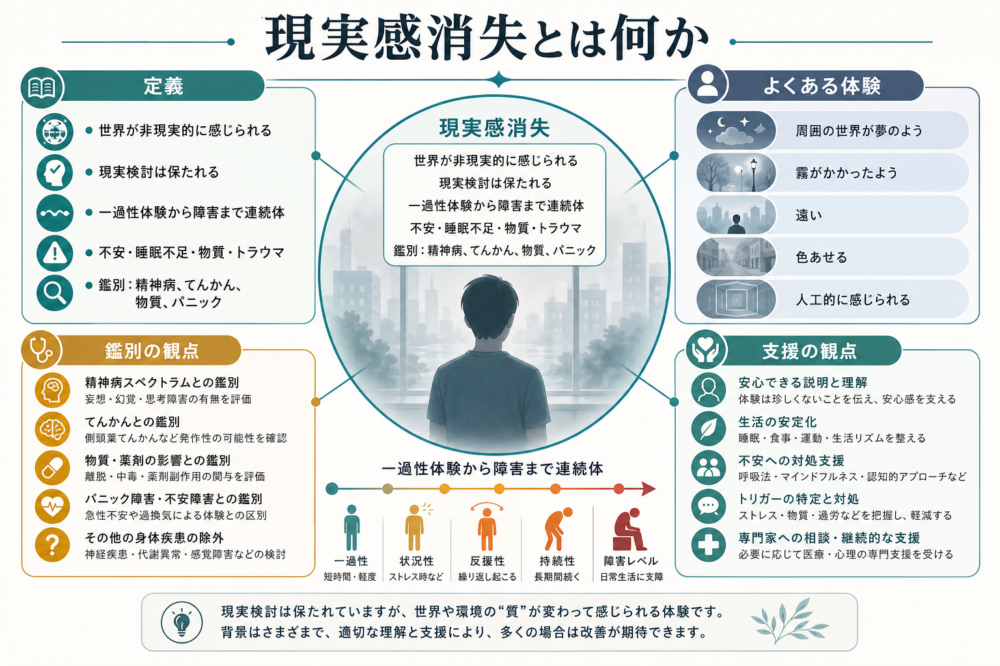
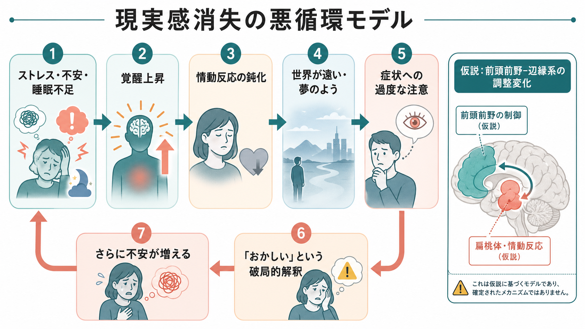
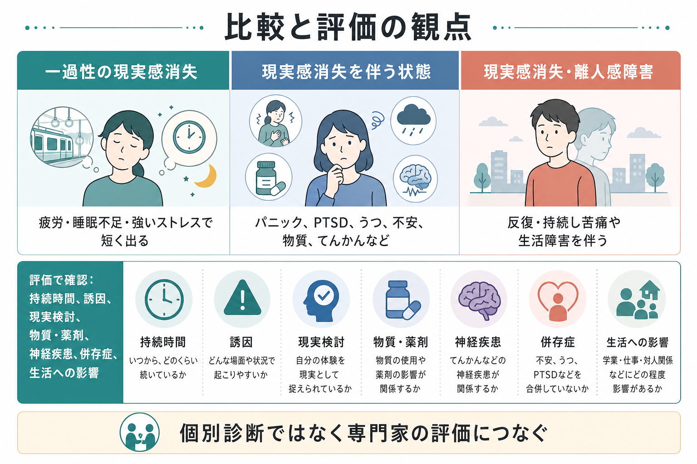

# 現実感消失とは何か

## 要点

- 現実感消失とは、周囲の人・物・世界が「非現実的」「夢のよう」「遠い」「霧がかかったよう」「色あせたよう」に感じられる体験である。本人は多くの場合、「そう感じるだけで、実際に世界が変わったわけではない」と理解しており、この現実検討の保持が重要である[1][2]。
- 一過性の現実感消失は、強い不安、疲労、睡眠不足、物質使用、強いストレスのもとで生じうる。一方、反復・持続し、苦痛や生活障害を伴う場合は、離人感・現実感消失症、または他の精神疾患・神経疾患・物質関連状態の一部として評価される[1][3]。
- 現実感消失は[[パニック発作とは何か|パニック発作]]、[[不安とは何か|不安]]、PTSD、うつ状態、物質・薬剤、てんかんなどと関連して出ることがあるため、症状名だけで診断名を決めない[3][4]。
- 仕組みは単一ではない。情動反応の鈍化、過覚醒、注意の自己監視、破局的解釈が循環する心理モデルと、前頭前野と辺縁系の調整変化を想定する神経生物学的仮説が提案されている[5][6]。
- 本稿は教育・研究目的の整理であり、個別の診断や治療指示ではない。持続する苦痛、生活障害、物質使用、発作性症状、意識変容、希死念慮がある場合は、医療・心理の専門家による評価が必要である。

## この記事で答える問い

1. 現実感消失は、幻覚・妄想・錯覚と何が違うのか。
2. 一過性の体験と、臨床的に問題となる状態はどこで区別されるのか。
3. 不安やストレスは、なぜ世界の「現実らしさ」を変えて感じさせるのか。
4. 臨床・研究では、現実感消失をどのように評価し、どのような限界に注意するのか。

## まず結論

現実感消失は、「世界そのものが変わった」という信念ではなく、「世界が変わったように感じられる」という主観的体験である。たとえば、部屋や街が映画のセットのように見える、目の前の人が遠く感じられる、音や色が薄くなる、時間や距離が不自然に感じられる、といった形で表現される[1][3]。

この体験の中心は、知覚内容そのものの誤りよりも、知覚された世界に伴う「現実らしさ」「近さ」「情動的な手触り」の変化にある。したがって、[[精神症候学とは何か|精神症候学]]では、幻覚、錯覚、妄想、見当識障害、意識障害と区別しながら、本人の言葉、持続時間、誘因、現実検討、苦痛、生活への影響を丁寧に確認する。

## 背景

現実感消失は、離人感と一緒に語られることが多い。離人感が「自分の身体・感情・思考が自分のものではないように感じる」体験であるのに対し、現実感消失は「外界が非現実的に感じられる」体験である。ただし臨床では両者が重なり、DSM-5-TRやICD-11では、離人感・現実感消失症としてまとめて扱われる[1][2]。

一般人口でも一過性の離人感・現実感消失は珍しくない。Merck Manualは、一般人口の25-75%が少なくとも一度は一過性体験を持つとし、2023年のシステマティックレビューでは、標準化診断に基づく離人感・現実感消失症の一般人口有病率は0-1.9%の範囲に整理されている[3][7]。つまり、体験そのものは連続体上にあり、診断上の問題になるのは、反復・持続、苦痛、機能障害、他の原因の除外がそろう場合である。

## 基本概念

### 現実感消失の典型的な表現

現実感消失では、外界が次のように感じられることがある[1][3][4]。

| 体験の型 | 本人の表現例 | 評価上の注意 |
|---|---|---|
| 夢のよう | 「夢の中にいるみたい」 | 意識障害や睡眠関連現象と混同しない |
| 遠い・隔てられる | 「ガラス越しに見ている感じ」 | 対人距離感、抑うつ、不安との関連を見る |
| 霧がかかる | 「景色に膜がかかった感じ」 | 視覚症状、片頭痛、薬剤、疲労も確認する |
| 色あせる・平板 | 「世界の色や奥行きが薄い」 | 情動反応の鈍化や抑うつとの重なりを見る |
| 人工的・作り物 | 「街がセットみたい」 | 妄想的確信の有無を確認する |
| 時間・距離の変化 | 「時間が遅い」「距離が変」 | てんかん、物質、パニックとの関係を見る |

### 幻覚・錯覚・妄想との違い

現実感消失は、外界を「非現実的に感じる」症状であり、外界に存在しない刺激を知覚する幻覚とは異なる。また、実在する刺激を別のものとして取り違える錯覚とも異なる。さらに、「世界は本当に偽物だ」「誰かが仕組んでいる」と強く確信し、反証されにくい場合は、現実感消失だけでなく妄想や精神病症状の評価が必要になる[2][3]。

重要なのは、現実検討である。離人感・現実感消失症では、本人は通常「これは自分の感じ方の変化であって、実際に世界が変化したわけではない」と理解している[1][2]。この点が、[[せん妄とは何か|せん妄]]、[[意識障害とは何か|意識障害]]、精神病性障害、てんかん発作後状態などとの鑑別に関わる。

## 仕組み

現実感消失の仕組みは確定していない。現在の理解では、少なくとも心理的循環と神経生物学的調整の両面から考えるのが妥当である。

### 心理的循環

認知行動モデルでは、強い不安、疲労、睡眠不足、ストレス、物質使用などのもとで一過性の離人感・現実感消失が生じ、その体験を「自分はおかしくなった」「脳が壊れた」「現実が失われた」と破局的に解釈すると、不安と自己監視が高まると考える[6]。すると、身体感覚や知覚の違和感に注意が集まり、さらに現実感消失が強く感じられる。

この循環では、症状そのものだけでなく、「症状をどう意味づけるか」が持続に関わる。実際、CBTのオープン研究では、症状の非脅威的な再解釈、回避・安全行動・症状監視の低減を含む介入が検討されている[6]。ただし、これは個別の治療指示ではなく、研究上の知見として理解する必要がある。

### 情動反応と神経生物学的仮説

現実感消失では、「怖いのに感情が遠い」「周囲は見えているのに実感がない」という形で、情動的な手触りが弱まることがある。レビューでは、前頭前野による情動反応の制御、辺縁系活動の変化、自律神経反応の鈍化などが仮説として論じられてきた[5]。これは、世界の知覚内容そのものが消えるというより、知覚と情動・身体反応の結びつきが弱まり、外界が「自分に関係している」という感覚が薄くなる、という理解に近い。

ただし、神経機序はまだ確定していない。脳画像や生理指標の研究は、現実感消失を「前頭前野だけ」「扁桃体だけ」で説明できる段階にはない。臨床記事では、仮説を確定事実のように書かず、心理・身体・環境・発達歴・併存症を含む多因子的な整理に留めるのが安全である。

## 図解

3枚の図は、本文の理解を助けるための教育用インフォグラフィックである。1枚目は概念地図、2枚目は悪循環モデル、3枚目は比較と評価の観点を示している。

## 臨床・研究との接続

臨床では、現実感消失を聞いた時点で、すぐに離人感・現実感消失症と決めない。少なくとも次を確認する。

| 評価項目 | 確認する理由 |
|---|---|
| 持続時間と経過 | 数秒から数分の一過性か、反復・持続するかで意味が変わる |
| 誘因 | 不安、疲労、睡眠不足、ストレス、トラウマ、物質・薬剤との関係を見る |
| 現実検討 | 「感じる」と「確信している」を区別する |
| 意識・見当識 | [[見当識障害とは何か|見当識障害]]や意識障害の有無を確認する |
| 発作性 | 側頭葉てんかん、片頭痛、発作後状態などの可能性を考える |
| 併存症 | 不安症、パニック、PTSD、うつ、解離症状、物質関連症状を確認する |
| 生活障害 | 学業、仕事、対人関係、外出、睡眠への影響を見る |

研究では、Cambridge Depersonalization Scaleなどの自己記入式尺度が使われ、身体感覚の異常、情動麻痺、主観的記憶の異常、外界からの疎隔といった複数次元が検討されている[8]。ただし、尺度得点は診断そのものではない。症状の頻度・持続・苦痛を定量化する道具であり、臨床面接、身体・神経学的評価、物質・薬剤の確認と組み合わせて解釈する必要がある。

## よくある誤解

### 「現実感消失があるなら精神病である」

そうとは限らない。現実感消失では、本人が「これは感じ方の変化だ」と理解していることが多く、現実検討が保たれる[1][3]。ただし、妄想的確信、幻覚、まとまりにくい思考、強い混乱がある場合は別の評価が必要である。

### 「気のせいなので放っておけばよい」

一過性なら自然に軽快することもあるが、反復・持続し、恐怖や生活障害を伴う場合は臨床的に重要である。特に物質使用、発作性症状、頭部外傷後、40歳以降の新規発症、意識変容を伴う場合は、精神医学的評価だけでなく身体・神経学的評価も検討される[3]。

### 「現実感消失は必ずトラウマの証拠である」

トラウマや強いストレスはリスク因子になりうるが、現実感消失の原因はそれだけではない。パニック、不安、うつ、物質・薬剤、睡眠不足、神経疾患など、複数の経路で起こりうる[3][4]。

### 「治療は薬だけで決まる」

離人感・現実感消失症に特異的な薬物療法の根拠は限定的であり、併存する不安や抑うつへの対応、心理教育、認知行動的理解、生活リズムの安定化、トラウマ関連症状の評価などを含めて考える必要がある[5][6]。ここでも、個別の治療選択は専門家の評価に基づく。

## 関連ノート

- [[精神症候学とは何か]]
- [[パニック発作とは何か]]
- [[不安とは何か]]
- [[恐怖とは何か]]
- [[気分とは何か]]
- [[意識障害とは何か]]
- [[見当識障害とは何か]]
- [[せん妄とは何か]]

### 関連ノート候補

- 離人感とは何か
- 解離とは何か
- PTSDにおける解離症状
- 側頭葉てんかんと精神症状
- 物質誘発性精神症状とは何か

### MOC更新候補

- `content/00_MOC/MOC｜精神医学.md`
- `content/00_MOC/MOC｜精神症候学.md`
- `content/00_MOC/MOC｜解離・トラウマ関連.md`

## 理解チェック

1. 現実感消失と幻覚の違いを、「知覚内容」と「現実らしさ」の観点から説明できるか。
2. 現実感消失で現実検討が保たれるとは、どのような意味か。
3. 一過性体験と、臨床的に問題となる状態を分ける評価項目を3つ挙げられるか。
4. 認知行動モデルでは、なぜ症状への過度な注意が現実感消失を持続させうるのか。
5. 現実感消失を聞いたとき、物質・薬剤、てんかん、パニック、うつ、不安を確認する理由を説明できるか。

## 未解決問題

- 現実感消失の神経機序は、前頭前野・辺縁系・自律神経・身体感覚処理の相互作用として検討されているが、臨床診断に直結するバイオマーカーは確立していない。
- 一過性の現実感消失から慢性化へ移行する条件は、個人差、ストレス、注意、解釈、併存症、発達歴が絡み、単一因子では説明しにくい。
- 心理療法・薬物療法の研究はあるが、大規模で質の高い比較試験は限られており、標準治療の確立にはさらなる研究が必要である。

## 参考文献

[1] World Health Organization. ICD-11 for Mortality and Morbidity Statistics: 6B66 Depersonalization-derealization disorder. https://icd.who.int/browse/2026-01/mms/en#253124068

[2] American Psychiatric Association. (2022). *Diagnostic and Statistical Manual of Mental Disorders, Fifth Edition, Text Revision (DSM-5-TR)*. https://doi.org/10.1176/appi.books.9780890425787

[3] Spiegel, D. (2026). Depersonalization/Derealization Disorder. *Merck Manual Professional Edition*. https://www.merckmanuals.com/en-pr/professional/psychiatric-disorders/dissociative-disorders/depersonalization-derealization-disorder

[4] Mayo Clinic Staff. (2025). Depersonalization-derealization disorder: Symptoms and causes. *Mayo Clinic*. https://www.mayoclinic.org/diseases-conditions/depersonalization-derealization-disorder/symptoms-causes/syc-20352911

[5] Medford, N., Sierra, M., Baker, D., & David, A. S. (2005). Understanding and treating depersonalisation disorder. *Advances in Psychiatric Treatment, 11*(2), 92-100. https://doi.org/10.1192/apt.11.2.92

[6] Hunter, E. C. M., Phillips, M. L., Chalder, T., Sierra, M., & David, A. S. (2003). Depersonalisation disorder: A cognitive-behavioural conceptualisation. *Behaviour Research and Therapy, 41*(12), 1451-1467. https://doi.org/10.1016/S0005-7967(03)00066-4

[7] Yang, J., Millman, L. S. M., David, A. S., & Hunter, E. C. M. (2023). The prevalence of depersonalization-derealization disorder: A systematic review. *Journal of Trauma & Dissociation, 24*(1), 8-41. https://doi.org/10.1080/15299732.2022.2079796

[8] Sierra, M., Baker, D., Medford, N., & David, A. S. (2005). Unpacking the depersonalization syndrome: An exploratory factor analysis on the Cambridge Depersonalization Scale. *Psychological Medicine, 35*(10), 1523-1532. https://doi.org/10.1017/S0033291705005325
