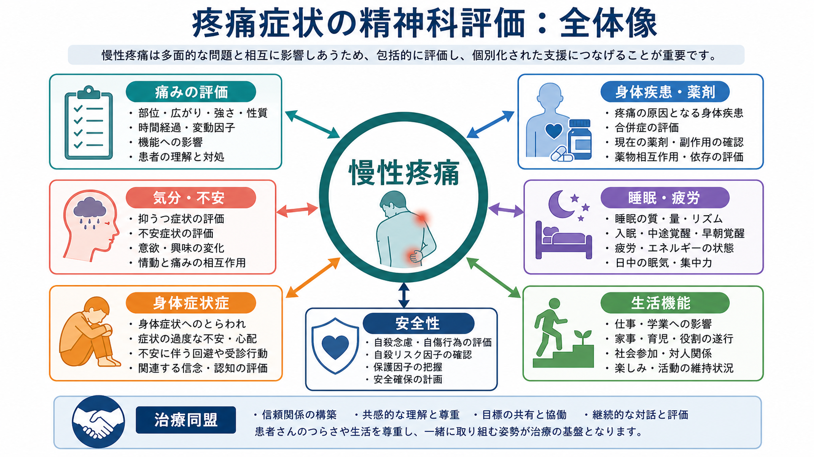
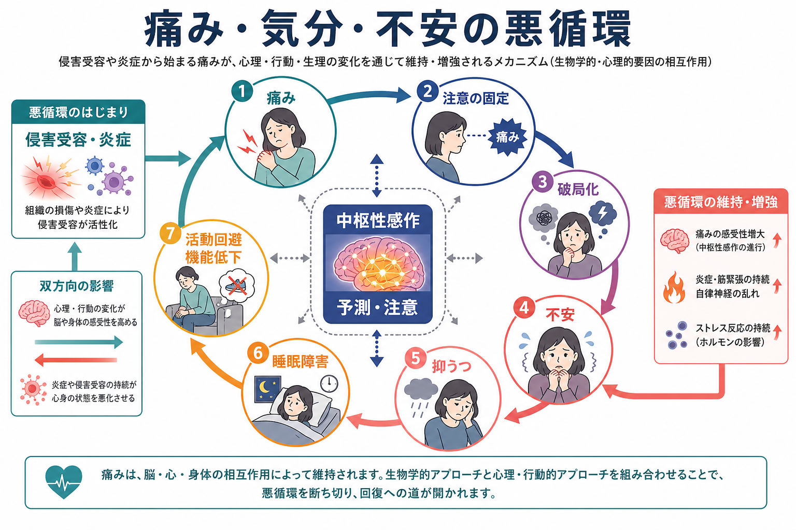
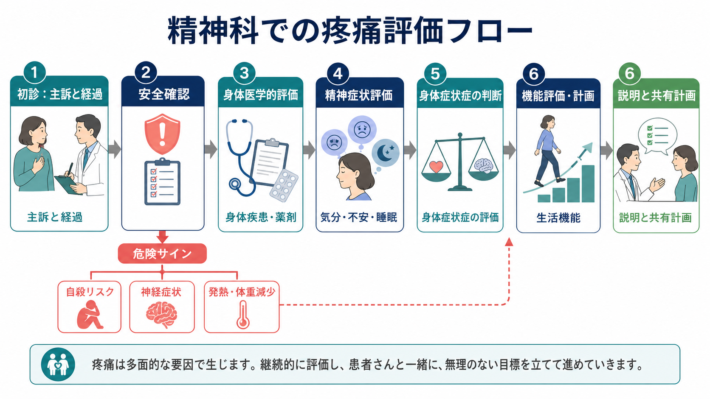

# 疼痛症状は精神科でどう評価するか

## 要点

- 疼痛は「身体か心か」の二分法でなく、感覚・情動・認知・行動・社会的文脈が重なった個人的経験として評価する。
- 精神科では、痛みの部位や強さだけでなく、[[抑うつ気分とは何か]]、[[不安とは何か]]、[[不眠とは何か]]、活動回避、生活機能、安全性を同時に確認する。
- 身体症状症を考える場合も、「医学的説明がない痛み」ではなく、症状に関連する過度な思考・不安・行動と生活障害を評価する。
- 慢性疼痛では希死念慮や自傷リスクが上がることがあるため、[[希死念慮とは何か]]の評価は疼痛評価の一部である。
- 治療目標は「痛みをゼロにする」だけではなく、睡眠、活動、役割、対人関係、自己効力感を回復する方向に置く。

## この記事で答える問い

1. 精神科で疼痛症状を評価するとき、何を聞けばよいか。
2. 慢性疼痛と気分・不安・睡眠・身体症状症はどう関係するか。
3. 「心因性」「気のせい」と誤解されない説明をどう組み立てるか。
4. どのような場合に身体医学的評価や安全確認を優先するか。

## まず結論

精神科での疼痛評価は、身体医学的評価を省略するための作業ではない。むしろ、痛みを「本人が実際に経験している症状」として尊重しながら、身体疾患、薬剤、神経障害、睡眠、気分、不安、トラウマ、生活機能、対処行動を同じ面接の中で並べて見る作業である。

IASP の改訂定義では、痛みは実際または潜在的な組織損傷に関連する、またはそれに似た不快な感覚・情動経験とされ、痛みは常に生物・心理・社会的要因に影響される個人的経験であると整理されている [1]。この定義は、疼痛を「客観的損傷が見つかるかどうか」だけで判断しない姿勢を支える。

## 背景

慢性疼痛は、一般に 3 か月を超えて持続または反復する痛みとして扱われる。ICD-11 では、慢性疼痛を慢性一次性疼痛と慢性二次性疼痛に大きく分け、前者は痛み自体が主要な臨床問題となり、情動的苦痛や機能障害を伴う状態として整理される [2]。NICE NG193 も、慢性一次性疼痛と慢性二次性疼痛が併存しうることを前提に、すべての慢性疼痛で本人中心の包括的評価を推奨している [3]。

精神科で疼痛症状が問題になる場面は多い。抑うつや不安の主訴として痛みが前景化することもあれば、長期の痛みが不眠、活動低下、孤立、怒り、絶望感を通じて精神症状を悪化させることもある。2025 年の大規模メタ解析では、慢性疼痛をもつ成人における臨床的な抑うつ症状は約 39%、不安症状は約 40% と推定されており、疼痛診療の場で精神症状を定期的に評価する必要が示されている [4]。

## 基本概念

### 疼痛は主観的だが、任意ではない

疼痛は本人の報告を中心に評価する症状である。しかし、主観的であることは「作っている」「気の持ちよう」という意味ではない。侵害受容、炎症、神経障害、中枢性感作、注意、予測、情動、記憶、対人関係が重なって、痛みの強さやつらさ、生活への影響が決まる [1], [5]。

### 慢性一次性疼痛と慢性二次性疼痛

慢性二次性疼痛は、がん、術後、神経障害、内臓疾患、筋骨格系疾患など、基礎疾患や損傷が痛みを十分に説明する場合に考える。一方、慢性一次性疼痛は、明確な基礎疾患だけでは痛みや影響を説明しきれず、痛みそのものが主要な臨床問題になっている場合に考える [2]。実際の臨床では、一次性と二次性が混在することがあるため、「どちらか一方」と急いで決めるより、寄与因子を並列に評価する。

### 身体症状症との関係

DSM-5 の身体症状症は、身体症状の有無や医学的説明の有無だけで決まる診断ではない。苦痛や生活障害をもたらす身体症状に加えて、症状に関連する過度な思考、不安、時間・エネルギーの投入が持続することが評価の中心になる [6]。したがって、疼痛患者に身体症状症を考えるときは、「検査で異常がないから精神科」と説明するのではなく、痛みをめぐる不安、確認行動、受診行動、回避、生活機能の変化を具体的に確認する。

## 仕組み

慢性疼痛が精神症状と結びつく代表的な経路は、悪循環として理解するとわかりやすい。痛みが続くと、注意が痛みに固定され、破局的な予測が強まり、[[不安とは何か]]や[[抑うつ気分とは何か]]が増える。すると睡眠が浅くなり、疲労が蓄積し、活動を避けるようになる。[[回避行動とは何か]]が続くと筋力、役割、社会参加、楽しみが減り、痛みの意味づけはさらに脅威的になる。

中枢性感作は、この悪循環を生物学的に説明する重要な概念である。侵害受容入力や炎症、神経障害などを契機として、中枢神経系の痛覚処理が増幅されると、通常なら痛みになりにくい刺激でも痛みとして経験されたり、痛みの範囲や持続が広がったりする [5]。ただし、中枢性感作は「心理的な痛み」という意味ではない。神経系の可塑性、注意、睡眠、ストレス反応、情動調整が相互作用するモデルとして使うのが臨床的である。

## 図解

精神科面接では、以下の順で聞くと、身体医学的リスクと心理社会的寄与因子を取りこぼしにくい。

| 評価領域 | 確認すること | 精神科的な意味 |
|---|---|---|
| 痛みの特徴 | 部位、広がり、性質、強さ、発症時期、変動、増悪・軽快因子 | 身体疾患、神経障害、疼痛機序の手がかり |
| 危険サイン | 発熱、体重減少、神経脱落症状、悪性腫瘍既往、外傷、急激な変化 | 身体医学的再評価や救急対応の必要性 |
| 気分・不安 | 抑うつ、不安、焦燥、破局化、健康不安 | 疼痛の苦痛度、治療同盟、併存症評価 |
| 睡眠・疲労 | 入眠、中途覚醒、早朝覚醒、日中眠気、活動量 | 痛みの増幅因子、回復力の低下 |
| 行動 | 休息過多、活動回避、過剰な確認、受診反復、鎮痛薬使用 | 維持因子、身体症状症、依存リスク |
| 生活機能 | 仕事、家事、学業、育児、対人関係、楽しみ | 目標設定と治療効果判定 |
| 安全性 | [[希死念慮とは何か]]、自傷、過量服薬、アルコール・薬物、孤立 | 緊急度と安全計画 |

## 臨床・研究との接続

疼痛症状の評価では、まず本人の痛みを否定しない言葉を選ぶ。「検査では何もない」ではなく、「痛みが続く背景には、組織、神経、睡眠、ストレス、注意、生活リズムが重なっている可能性がある」と説明する方がよい。これにより、身体医学的評価と精神科的評価を対立させずに並べられる。

治療につなげる評価では、痛みの強さだけでなく、睡眠、活動、役割、対人関係、楽しみ、自己効力感をベースラインとして記録する。NICE は慢性疼痛の評価で本人中心の評価と共同意思決定を重視し、慢性一次性疼痛に対して ACT や疼痛に焦点化した CBT を考慮することを推奨している [3]。Cochrane レビューでも、心理療法は慢性疼痛の痛み、苦痛、障害を軽減する目的で検討され、CBT などの効果は大きくはないが臨床的に意味のある領域があると整理されている [7]。

安全面では、慢性疼痛は希死念慮や自殺行動と関連する。2023 年のレビューは、慢性疼痛患者では自殺念慮や自殺行動の評価が重要であり、痛み、絶望感、睡眠障害、抑うつ、薬剤、社会的孤立を含めて見る必要を強調している [8]。疼痛を訴える患者に希死念慮を尋ねることは、痛みを精神化するためではなく、苦痛の強さを正確に扱うためである。

## よくある誤解

### 「精神科で評価する」ことは「身体疾患ではない」と同義ではない

精神科評価は除外診断の最後に置くものではない。身体疾患の評価と並行して、睡眠、気分、不安、行動、対人関係、安全性を評価する。特に急激な痛みの変化、神経症状、発熱、体重減少、悪性腫瘍や免疫抑制の背景がある場合は、身体医学的評価を優先する。

### 「身体症状症」は「嘘」や「演技」ではない

身体症状症の評価対象は、症状の真偽ではなく、症状に関連した苦痛、認知、情動、行動、生活障害である。疼痛が実在することと、痛みへのとらわれや不安が治療対象になることは両立する。

### 「痛みを受け入れる」は「あきらめる」ではない

ACT や CBT でいう受容は、痛みを放置することではない。痛みが完全に消えるまで生活を止めるのではなく、本人の価値や役割に沿って活動を再構成するための技法である。

## 関連ノート

- [[不安とは何か]]
- [[予期不安とは何か]]
- [[抑うつ気分とは何か]]
- [[不眠とは何か]]
- [[回避行動とは何か]]
- [[希死念慮とは何か]]
- [[心気妄想とは何か]]

MOC 更新候補: `content/00_MOC/` 配下の精神医学・症候学関連 MOC に追加する。

今後の作成候補: 身体症状症とは何か、慢性疼痛とは何か、中枢性感作とは何か、疼痛に対する認知行動療法。

## 理解チェック

1. 慢性疼痛の評価で、痛みの強さ以外に必ず確認したい生活機能は何か。
2. 身体症状症を考えるとき、「医学的説明がない」だけで診断してはいけない理由は何か。
3. 中枢性感作を患者に説明するとき、「心理的な痛み」と誤解されないためにどのような言葉を選ぶか。
4. 疼痛症状を訴える患者に希死念慮を尋ねる臨床的理由は何か。

## 参考文献

[1] Raja, S. N., Carr, D. B., Cohen, M., et al. (2020). The revised International Association for the Study of Pain definition of pain: concepts, challenges, and compromises. *Pain*, 161(9), 1976-1982. https://doi.org/10.1097/j.pain.0000000000001939

[2] Treede, R. D., Rief, W., Barke, A., et al. (2019). Chronic pain as a symptom or a disease: the IASP Classification of Chronic Pain for the International Classification of Diseases (ICD-11). *Pain*, 160(1), 19-27. https://doi.org/10.1097/j.pain.0000000000001384

[3] National Institute for Health and Care Excellence. (2021). *Chronic pain (primary and secondary) in over 16s: assessment of all chronic pain and management of chronic primary pain* (NICE guideline NG193). https://www.nice.org.uk/guidance/ng193

[4] Aaron, R. V., Ravyts, S. G., Carnahan, N. D., et al. (2025). Prevalence of Depression and Anxiety Among Adults With Chronic Pain: A Systematic Review and Meta-Analysis. *JAMA Network Open*, 8(3), e250268. https://doi.org/10.1001/jamanetworkopen.2025.0268

[5] Woolf, C. J. (2011). Central sensitization: implications for the diagnosis and treatment of pain. *Pain*, 152(3 Suppl), S2-S15. https://doi.org/10.1016/j.pain.2010.09.030

[6] Katz, J., Rosenbloom, B. N., & Fashler, S. (2015). Chronic Pain, Psychopathology, and DSM-5 Somatic Symptom Disorder. *Canadian Journal of Psychiatry*, 60(4), 160-167. https://pmc.ncbi.nlm.nih.gov/articles/PMC4459242/

[7] Williams, A. C. de C., Fisher, E., Hearn, L., & Eccleston, C. (2020). Psychological therapies for the management of chronic pain (excluding headache) in adults. *Cochrane Database of Systematic Reviews*, 2020(8), CD007407. https://doi.org/10.1002/14651858.CD007407.pub4

[8] Chincholkar, M., & Blackshaw, S. (2023). Suicidality in chronic pain: assessment and management. *BJA Education*, 23(8), 320-326. https://doi.org/10.1016/j.bjae.2023.05.005

## 未解決問題

- 慢性疼痛と気分・不安症状の因果方向は、疼痛タイプや年齢、性別、社会的要因によって異なる可能性がある。
- 中枢性感作や nociplastic pain の臨床評価は発展途上であり、単一の質問票だけで機械的に判断することは避ける。
- 精神科外来で使いやすい疼痛評価尺度、睡眠評価、薬剤リスク評価をどのように標準化するかは今後の運用課題である。
