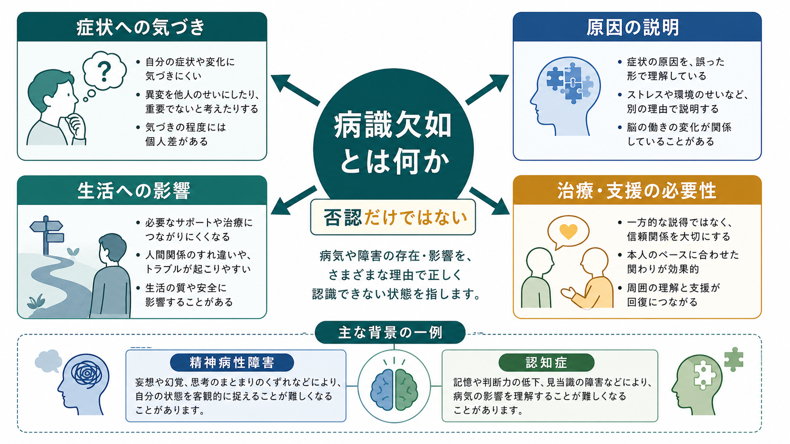
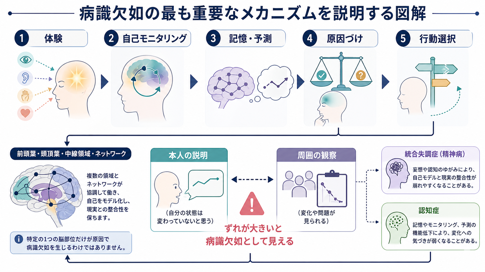
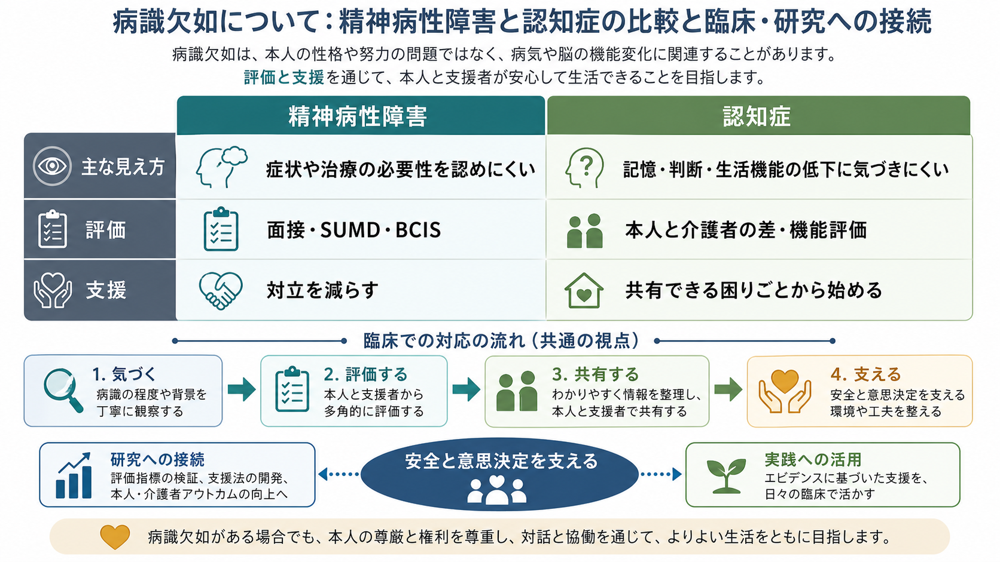

# 病識欠如とは何か

## 要点

- 病識欠如とは、本人が自分の症状、疾患、機能低下、生活への影響、治療・支援の必要性を十分に認識できない状態である。
- 「病気を認めない」という一つの態度ではなく、症状への気づき、原因の理解、治療必要性、生活機能への影響という複数の側面に分かれる[1][2]。
- 精神病性障害では、[[妄想とは何か|妄想]]や[[幻覚とは何か|幻覚]]を病的体験として再評価できないこと、治療や支援の必要性を認めにくいこととして現れやすい[3][4]。
- 認知症では、記憶、判断、日常生活機能の低下に本人が気づきにくく、介護者の観察とのずれとして把握されることが多い[5][6]。
- 病識欠如は「わざと否認している」「性格が頑固である」と同義ではない。自己モニタリング、記憶、予測、メタ認知、脳ネットワーク、心理的防衛、対人関係が重なって生じる[6][7]。

## この記事で答える問い

1. 病識欠如とは何か。
2. 通常の否認や治療拒否とどこが違うのか。
3. 精神病性障害と認知症では、どのように現れ方が違うのか。
4. 臨床や研究では、病識欠如をどう評価し、どう支援に接続するのか。

## まず結論

病識欠如は、本人が「自分に何が起きているか」を更新しにくくなる状態である。周囲からは「症状があるのに認めない」「治療が必要なのに拒む」と見えることがあるが、本人の内側では、体験、記憶、自己評価、原因づけ、対人関係が異なる形で組み合わさっている。

したがって、病識欠如を見たときの最初の問いは「どう説得するか」ではなく、「どの側面が認識され、どの側面が認識されていないのか」である。症状は認めるが病名は認めない、生活上の困りごとは認めるが原因を別に説明する、治療の必要性は認めないが安全上の工夫には同意できる、というように部分的な病識はしばしば残る。

本記事は教育・研究目的の概説であり、個別の診断や治療方針を決めるための指示ではない。

## 背景

病識は、精神医学では古くから [[病識とは何か|病識]]、洞察、insight と呼ばれてきた。David は精神病における病識を、精神疾患であることの認識、治療への協力、妄想や幻覚などの異常体験を病的なものとして再ラベル化する能力という、重なり合う次元として整理した[1]。この見方は、病識を「ある／ない」の二分法で扱うことの粗さを示している。

一方、anosognosia という語は、もともと神経学で、自分の麻痺や視覚障害などを認識できない状態を指す概念として発展した。現在では、脳損傷、認知症、精神病性障害などにまたがる「自己の障害への気づきの障害」として使われる[7]。ただし、精神医学での病識低下と神経学的 anosognosia は完全に同じ概念ではない。前者は診断、症状、原因づけ、治療関係、文化的文脈を含む。後者は、特定の身体・認知機能の障害に対する気づきの障害として扱われることが多い。

このため本記事では、病識欠如を「本人が自分の症状や疾患、機能低下、支援必要性を十分に認識できない状態」と広く捉えたうえで、精神病性障害と認知症に焦点を当てる。

## 基本概念

### 病識欠如は多次元である

病識欠如には、少なくとも次の側面がある。

| 側面 | 何を見ているか | 例 |
|---|---|---|
| 症状への気づき | 変化や困りごとを自覚できるか | 声が聞こえる、物忘れが増えた、家族と衝突する |
| 原因の説明 | その変化を何に帰属するか | 病気、ストレス、加齢、他者の悪意、偶然 |
| 治療・支援の必要性 | 支援を受ける意味を理解できるか | 通院、服薬、心理教育、介護支援、環境調整 |
| 生活への影響 | 学業、仕事、家事、安全、対人関係への影響を見積もれるか | 服薬管理、金銭管理、火の始末、運転、対人トラブル |

精神病性障害の研究では、SUMD のような尺度を用いて、疾患への気づき、症状への気づき、原因づけ、治療効果の認識などを分けて評価してきた[2]。この発想は臨床にも有用である。本人が病名を認めない場合でも、睡眠不足、怖さ、家族との衝突、仕事の失敗などは認めていることがあるからである。

### 否認との違い

否認は、つらい現実や不安から身を守る心理的反応として理解できる場合がある。病識欠如にも心理的防衛が関与することはある。しかし、病識欠如をすべて「認めたくないだけ」と見ると、重要な点を見落とす。

精神病性障害では、体験そのものの確信度、現実検討、メタ認知、治療者への不信、過去の強制的体験が関わる。認知症では、記憶低下や自己評価の更新困難そのものが、自分の変化への気づきを弱める。脳損傷では、障害された機能に対応する自己モニタリングが選択的に損なわれることがある[6][7]。

つまり、病識欠如は「本人が情報を持っているのに認めない」だけではなく、「本人の自己モデルを更新する仕組みがうまく働かない」状態としても理解する必要がある。

## 仕組み

病識欠如を一つの脳部位だけで説明することはできない。むしろ、次のような過程のずれとして考えると理解しやすい。

1. 体験や行動の変化が起こる。
2. 自分の状態をモニタリングする。
3. 記憶や予測と照合する。
4. 変化の原因を説明する。
5. その説明に基づいて行動を選ぶ。

この流れのどこかでずれが大きくなると、本人の説明と周囲の観察が食い違う。たとえば、本人は「問題ない」と感じているが、周囲は服薬忘れ、金銭管理の失敗、被害的な解釈、危険な行動を観察している。臨床では、このずれをただちに「嘘」や「反抗」と見なさず、どの過程が弱いのかを評価する。

### 精神病性障害での仕組み

精神病性障害では、病識欠如はよくみられるが、全員に同じ形で起こるわけではない。Lehrer と Lorenz のレビューは、統合失調症における poor insight を中核的で頻度の高い現象として整理し、治療アドヒアランス、再発、機能、リスク評価と関連しうると論じている[3]。Lincoln らの系統的レビューも、統合失調症の病識低下が症状、抑うつ、治療継続、長期的転帰と複雑に関連することを示している[4]。

ただし、病識欠如を「薬を飲まない理由」とだけ見るのは狭い。薬の副作用、スティグマ、費用、通院困難、治療者への不信、過去の入院体験、家族関係も治療継続に影響する。[[アドヒアランスとは何か|アドヒアランス]]を扱うときは、病識だけでなく、本人が何を困りごととして共有できるかを確認する必要がある。

### 認知症での仕組み

認知症における病識欠如は、記憶障害、遂行機能障害、自己評価の更新困難、日常生活機能の低下と深く関係する。de Ruijter らのレビューは、認知症の anosognosia を評価する方法として、臨床評価、本人と介護者の評価差、本人の予測と実際の成績の差という三つの方法を整理している[5]。

神経画像研究では、軽度認知障害やアルツハイマー病における anosognosia が、前頭葉、皮質中線領域、頭頂側頭領域、デフォルトモードネットワークなどの機能変化と関連する可能性が示されている[6]。これは「特定の一部位が壊れると病識欠如になる」という単純な話ではなく、自己に関する情報、記憶、予測、他者視点を統合するネットワークの問題として読むのがよい。

## 図解

図1は、病識欠如を症状への気づき、原因の説明、生活への影響、治療・支援の必要性という四つの側面から整理している。精神病性障害と認知症は背景疾患として異なるが、どちらも「本人の説明」と「周囲の観察」のずれを丁寧に扱う必要がある。

図2は、体験、自己モニタリング、記憶・予測、原因づけ、行動選択の流れを示している。重要なのは、病識欠如を単なる知識不足ではなく、自己を更新する複数の過程のずれとして見ることである。

図3は、精神病性障害と認知症での評価と支援の違いを示している。精神病性障害では面接や SUMD などの尺度、認知症では本人と介護者の差や機能評価が重要になりやすい。

## 臨床・研究との接続

### 面接での確認

病識欠如を確認するときは、いきなり「病気だと思いますか」と問うより、本人の説明モデルを聞くほうがよい。

1. 「最近、以前と違うと感じることはありますか」
2. 「周りの人は、どんな点を心配していますか」
3. 「その変化は、何が関係していると思いますか」
4. 「生活や安全で困っていることはありますか」
5. 「受け入れられそうな支援はありますか」

この聞き方は、本人を論破するためではなく、共有できる足場を探すためのものである。[[MSEで病識と判断力をどう評価するか|MSEでの病識と判断力評価]]では、病識、判断力、[[同意能力の評価はどのように行うのか|同意能力]]を混同しないことが重要である。病識が乏しくても、特定の治療や生活支援について理解し、選択できる場合がある。

### 精神病性障害での支援

精神病性障害では、本人の確信を正面から否定すると対立が強まることがある。まずは、眠れない、怖い、疲れる、家族と衝突する、仕事に支障が出るといった共有可能な困りごとから始める。治療や支援は「病名を認めさせる」ためではなく、安全、睡眠、苦痛、生活機能、本人の目標に結びつけて説明する。

この観点は、[[共同意思決定とは何か|共同意思決定]]や [[治療関係とは何か|治療関係]] と接続する。NICE の成人の精神病・統合失調症ガイドラインも、本人がケアの議論と意思決定に参加できるよう、情報提供と選択肢の共有を重視している[8]。病識が低いほど、説明を短くし、選択肢を具体化し、本人にとって意味のある目標を確認する必要がある。

### 認知症での支援

認知症では、本人の自己評価だけでなく、家族・介護者の観察、生活機能、服薬管理、金銭管理、火の始末、運転、転倒、迷子、セルフネグレクトを合わせて見る。本人が低下を認めない場合でも、尊厳を保ちながら環境調整を進めることがある。

たとえば「物忘れがあるから介護サービスを使いましょう」と言うより、「買い物や薬の管理を楽にするために、一緒に確認する仕組みを作りましょう」と説明したほうが受け入れられる場合がある。ここでは、[[認知機能障害とは何か|認知機能障害]]、[[実行機能障害とは何か|実行機能障害]]、[[見当識障害とは何か|見当識障害]]の評価が重要になる。

### 研究での評価

研究では、病識欠如を標準化するために尺度や差分指標が使われる。精神病性障害では SUMD のような臨床評価尺度が使われ、認知症では本人評価と介護者評価の差、または本人の予測と実際の課題成績の差が用いられる[2][5]。

ただし、尺度は対話の代替ではない。何を、どの尺度で、どの時点で測っているかによって、病識欠如の意味は変わる。たとえば「記憶低下への気づき」と「治療必要性の理解」は同じではない。研究結果を読むときは、測定している側面を確認する必要がある。

## よくある誤解

### 誤解1: 病識欠如は、本人がわざと認めないことである

病識欠如には、心理的防衛が関わる場合もある。しかし、精神病性障害では異常体験の確信度や現実検討、認知症では記憶や自己評価の更新困難、脳損傷では選択的な自己モニタリング障害が関わる。本人への非難だけでは、評価も支援も進まない。

### 誤解2: 病識がないなら、意思決定能力もない

病識、判断力、意思決定能力は重なるが同じではない。病名を認めない人でも、特定のリスク、選択肢、生活上の目標を理解できることがある。逆に、診断名を知っていても、現在の危険や生活上の影響を見積もれないことがある。

### 誤解3: 病識を高めれば、それだけで治療がうまくいく

病識が高まることは、ときに抑うつ、恥、自己スティグマ、絶望感を強めることがある[4]。支援では、病識だけでなく、希望、回復、本人の価値観、生活資源を同時に扱う必要がある。

### 誤解4: 家族や支援者の観察だけが正しい

本人の自己評価が不十分なことはあるが、家族や支援者の評価にも疲労、不安、関係性、文化的期待が影響する。特に認知症では、本人と介護者の差分評価が有用だが、それはどちらか一方を絶対視するためではなく、生活上のリスクと支援ニーズを立体的に見るために使う。

## 関連ノート

- [[病識とは何か]]
- [[MSEで病識と判断力をどう評価するか]]
- [[妄想とは何か]]
- [[幻覚とは何か]]
- [[認知機能障害とは何か]]
- [[実行機能障害とは何か]]
- [[失認とは何か]]
- [[見当識障害とは何か]]
- [[アドヒアランスとは何か]]
- [[共同意思決定とは何か]]

MOC更新候補: `content/00_MOC/` 配下の精神医学、症候学、精神科面接、認知症・神経心理関連 MOC。並列ジョブとの競合を避けるため、本記事では MOC 本体は更新していない。

## 理解チェック

1. 病識欠如を「ある／ない」ではなく複数の側面に分ける理由は何か。
2. 精神病性障害の病識欠如と、認知症の anosognosia では、評価の焦点がどう違うか。
3. 病識欠如を「本人の反抗」とだけ見ると、どのような臨床上の見落としが起こるか。
4. 病識が乏しい人と共同意思決定を行うとき、共有できる困りごとから始める利点は何か。

## 未解決問題

- 精神病性障害における病識欠如を、神経学的 anosognosia とどこまで同じ枠組みで扱えるかは議論が残る。
- 病識を高める介入が、治療継続を改善しながら抑うつや自己スティグマを強めない条件は十分に整理されていない。
- 認知症における本人・介護者差分、課題成績差、臨床評価が、それぞれ何を測っているのかを比較する研究がさらに必要である。

## 参考文献

[1] David, A. S. (1990). Insight and psychosis. *The British Journal of Psychiatry, 156*, 798-808. https://doi.org/10.1192/bjp.156.6.798

[2] Amador, X. F., Flaum, M., Andreasen, N. C., Strauss, D. H., Yale, S. A., Clark, S. C., & Gorman, J. M. (1994). Awareness of illness in schizophrenia and schizoaffective and mood disorders. *Archives of General Psychiatry, 51*(10), 826-836. https://doi.org/10.1001/archpsyc.1994.03950100074007

[3] Lehrer, D. S., & Lorenz, J. (2014). Anosognosia in schizophrenia: Hidden in plain sight. *Innovations in Clinical Neuroscience, 11*(5-6), 10-17. https://pmc.ncbi.nlm.nih.gov/articles/PMC4140620/

[4] Lincoln, T. M., Lullmann, E., & Rief, W. (2007). Correlates and long-term consequences of poor insight in patients with schizophrenia: A systematic review. *Schizophrenia Bulletin, 33*(6), 1324-1342. https://doi.org/10.1093/schbul/sbm002

[5] de Ruijter, N. S., Schoonbrood, A. M. G., van Twillert, B., & Hoff, E. I. (2020). Anosognosia in dementia: A review of current assessment instruments. *Alzheimer's & Dementia: Diagnosis, Assessment & Disease Monitoring, 12*(1), e12079. https://doi.org/10.1002/dad2.12079

[6] Mondragon, J. D., Maurits, N. M., & De Deyn, P. P. (2019). Functional neural correlates of anosognosia in mild cognitive impairment and Alzheimer's disease: A systematic review. *Neuropsychology Review, 29*(2), 139-165. https://doi.org/10.1007/s11065-019-09410-x

[7] Prigatano, G. P. (2014). Anosognosia and patterns of impaired self-awareness observed in clinical practice. *Cortex, 61*, 81-92. https://doi.org/10.1016/j.cortex.2014.07.014

[8] National Institute for Health and Care Excellence. (2014, last reviewed 2025). *Psychosis and schizophrenia in adults: Prevention and management* (NICE Guideline CG178). https://www.nice.org.uk/guidance/cg178
