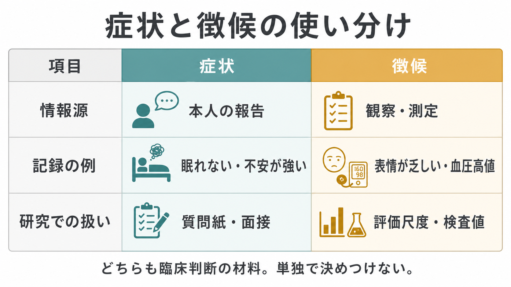
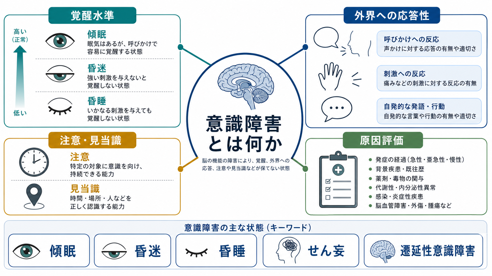

# 症状と徴候は何が違うのか

## 要点

- 症状は、痛み、不安、疲労、眠れなさのように、本人が感じて語る主観的体験である。NCI は症状を、本人だけが報告でき、医療者や検査では直接観察できないものとして定義している[1]。
- 徴候は、発熱、血圧高値、皮疹、表情、行動、発話の変化のように、医療者や他者が観察・測定できる所見である[2]。
- 精神医学では、症状と徴候の境界がとくに重要である。気分は本人の言葉で確認される症状に近く、感情表出、行動、発話、注意、見当識などは [[精神状態診察MSEとは何か|精神状態診察 MSE]] の徴候として記述される[5][6]。
- 臨床判断は、症状か徴候かのどちらか一方ではなく、本人の語り、観察、身体診察、検査、経過、文脈を統合して行う。これは [[精神科診断は何のためにあるのか|精神科診断]] や [[鑑別診断とは何か|鑑別診断]] の基盤になる[3][4]。
- 本記事は教育・研究目的の整理であり、個別の診断や治療方針を指示するものではない。

## この記事で答える問い

1. 症状と徴候は、何を基準に区別されるのか。
2. 「主観的」「客観的」という区別は、どこまで有効で、どこに限界があるのか。
3. 精神医学では、本人の訴えと観察所見をどのように統合するのか。
4. 診療録や研究では、この区別をどう扱うと誤解が少ないのか。

## まず結論

最短で言えば、**症状は本人が経験して訴えるもの、徴候は観察者が確認するもの**である。たとえば「胸が痛い」「不安で落ち着かない」「疲れが抜けない」は、本人の内的体験として語られるため症状である。一方、「体温 38.5 度」「血圧 160/95 mmHg」「発話が速い」「表情の変化が乏しい」は、観察や測定によって第三者が確認できるため徴候である[1][2]。

ただし、この区別は「症状は信用できない、徴候だけが本物」という意味ではない。医療面接は、本人の語りから診断仮説を立て、身体診察や検査を方向づける中核的な方法である。Clinical Methods は、病歴が診断に大きな価値を持ち、面接で得た仮説が身体診察や検査の使い方を導くと説明している[3]。症状は主観的だから弱いのではなく、主観的体験として扱う必要がある情報である。

逆に、徴候も完全に「解釈不要」ではない。発熱や血圧のような測定値でも、測定条件、文脈、基礎疾患、薬剤、経過によって意味が変わる。精神科の観察所見では、表情、沈黙、視線、発話速度、姿勢、注意の保ち方などを、文化、年齢、身体疾患、物質使用、面接状況と照らして読む必要がある[6][7]。

## 背景

医学では、患者の体験、身体所見、検査値を区別して記録する。これは単なる言葉の整理ではなく、情報源を明確にし、臨床推論の誤りを減らすためである。Clinical Methods の「Collecting and Analyzing Data」は、臨床問題を、症状、徴候、症状と徴候のまとまり、仮説上の障害として作業的にリスト化することを説明している[4]。つまり、臨床家は最初から「病名」を見ているのではなく、まず症状と徴候を集め、それらのまとまりから仮説を作る。

精神医学ではこの作業がさらに繊細になる。多くの精神症状は、本人の語りとして現れる。抑うつ気分、不安、幻聴、強迫観念、希死念慮、離人感、疲労感などは、本人が語らなければ外からは分かりにくい。一方で、感情表出、精神運動制止、焦燥、会話のまとまり、注意の散漫さ、見当識障害、身だしなみの変化などは、面接者が観察できる徴候である[5][6]。

このため、[[主訴はどのように聞くべきか|主訴]]、[[精神科面接とは何か|精神科面接]]、MSE、[[診療録は精神科でどう書くべきか|診療録]] は互いに接続している。本人の言葉を尊重しつつ、観察者が見た所見と混ぜずに記録することが、診断、説明、研究、チーム共有の土台になる。

## 基本概念

### 症状

症状とは、本人が感じ、経験し、言葉や行動で表明する苦痛や変化である。NCI の医学用語辞典では、症状は本人が感じたり経験したりするもので、医療者や他者が直接観察できず、検査にもそのまま現れないものとされる[1]。痛み、吐き気、疲労、不安は典型例である。

精神医学では、症状は本人の語りに強く依存する。たとえば「朝がつらい」「何をしても楽しくない」「人に見られている気がする」「声が聞こえる」「確認せずにいられない」という表現は、すぐに診断名へ変換する前に、本人の体験として丁寧に聞く必要がある。ここで重要なのは、本人の言葉をそのまま引用する部分と、臨床家の概念化を分けることである。

### 徴候

徴候とは、診察、観察、測定、検査によって確認される所見である。NCI は徴候を、身体診察、検査、画像検査などで見つかり、医療者や他者が観察できるものと説明している[2]。発熱、腫脹、皮疹、血圧高値、血糖高値などが例である。

精神医学での徴候には、外観、行動、発話、感情表出、注意、見当識、記憶、判断、病識などが含まれる。Clinical Methods の MSE 章は、精神状態診察を、外観、一般行動、意識水準、注意、運動・発話、気分と感情、思考と知覚、態度と病識、高次認知機能を含む構造化された評価として説明している[5]。

### 症候

日本語では「症候」という語もよく使われる。症候は、症状と徴候をまとめて指す上位概念として使われることが多い。したがって「症候学」は、本人の訴えと観察所見を含め、臨床的に意味のある現れ方を整理する領域である。この記事のタイトルは「症状と徴候」だが、扱っている範囲は [[操作的診断とは何か|操作的診断]] や症候学の基礎にも当たる。

## 仕組み

症状と徴候は、次の流れで臨床情報へ変換される。

1. **本人の語りを聞く**  
   いつから、どのように、どの程度、どの場面で困るのかを確認する。Clinical Methods の医療面接章は、症状の時間経過、部位、質、量、誘因、軽減因子、随伴症状を整理する重要性を説明している[3]。

2. **観察・測定する**  
   外観、行動、発話、表情、姿勢、注意、見当識、バイタル、身体所見、検査値などを確認する。精神科では MSE がこの役割を担う[5][6]。

3. **情報源を分けて記録する**  
   「本人は眠れないと述べる」と「面接中に閉眼が多く、反応潜時が長い」は別の種類の情報である。前者は症状、後者は徴候として整理できる。

4. **仮説を作る**  
   症状と徴候のまとまりから、うつ病、不安症、せん妄、物質使用、身体疾患、薬剤性精神症状、神経認知障害などの可能性を比較する。ここで [[身体合併症は精神科診療でなぜ重要なのか|身体合併症]] や [[薬剤性精神症状とは何か|薬剤性精神症状]] の確認が重要になる。

5. **経過で見直す**  
   症状も徴候も時間とともに変化する。Merck Manual は、精神科評価では症状、行動、病歴、MSE を状況に応じて評価し、緊急時には安全や意思決定に必要な情報を優先すると説明している[7]。

## 図解

症状と徴候の使い分けは、診療録や研究データでも重要である。

| 観点 | 症状 | 徴候 |
|---|---|---|
| 情報源 | 本人の主観的体験 | 観察・測定・検査 |
| 例 | 不安、痛み、疲労、眠れない、声が聞こえる | 発熱、血圧高値、表情の乏しさ、発話の圧迫、見当識障害 |
| 記録の形 | 本人の言葉、引用、経過、生活への影響 | 観察可能な所見、測定値、検査値、MSE |
| 注意点 | 「気のせい」と扱わない | 「客観的だから解釈不要」と扱わない |
| 研究での扱い | 質問紙、面接、自己報告尺度 | 評価尺度、行動指標、生理指標、検査値 |

## 臨床・研究との接続

### 診療録

診療録では、症状と徴候を混同しないことが重要である。たとえば「被害妄想あり」とだけ書くより、「本人は『隣人が監視している』と述べる。根拠を尋ねると、壁の物音を理由に挙げる。面接中は周囲を頻回に確認し、声量は小さい」のように、本人の発言、根拠、観察所見を分ける方が読み返しやすい。

これは [[精神科診療でSOAPはどう使うのか|SOAP]] の考え方とも合う。S には本人や家族が述べた主観的情報、O には観察・測定された客観的情報、A には評価、P には計画を置く。精神科では S と O が絡みやすいため、意識して分ける価値がある。

### 精神状態診察

MSE は、精神科における徴候の整理法である。StatPearls は、MSE が外観、行動、運動活動、発話、気分、感情、思考過程、思考内容、知覚、認知、病識、判断を扱うと説明している[6]。ただし、MSE も本人の言葉を含む。たとえば「気分」は本人の主観的説明であり、「感情」は観察者が見た表出である。この区別は、症状と徴候の違いを学ぶうえで特に分かりやすい。

### 研究

研究では、症状と徴候は測定法の違いとして現れる。質問紙や面接で得られる抑うつ、不安、幻聴体験、疲労感は自己報告データである。一方、評価者が採点する尺度、反応時間、睡眠計測、活動量、血液検査、脳画像などは観察・測定データに近い。どちらが上位というより、何を測りたいかによって適切な方法が変わる。

この点は [[心理学研究法とは何か|心理学研究法]] や [[評価者間信頼性とは何か|評価者間信頼性]] ともつながる。観察者が確認する徴候でも、評価者によって判断がずれることがある。そのため、評価基準、訓練、盲検化、複数評価者、信頼性の報告が重要になる。

## よくある誤解

### 誤解1: 症状は主観的だから信頼できない

症状は主観的だが、臨床的に重要でないわけではない。痛み、不安、幻聴、希死念慮、疲労、睡眠困難は、本人が語らなければ分からない。医療面接は、本人の経験を診断仮説へつなげる主要な方法である[3]。

### 誤解2: 徴候は客観的だから意味が一つに決まる

徴候も文脈の中で解釈される。発話が速いことは躁状態、強い不安、物質使用、性格傾向、文化的話し方、聴覚障害への反応など、複数の可能性を持つ。観察所見は「何を見たか」と「そこから何を推論したか」を分けて扱う必要がある。

### 誤解3: 精神医学には客観的所見がない

精神医学にも徴候はある。外観、行動、発話、感情表出、注意、見当識、記憶、判断、病識などは、MSE として構造化して記述できる[5][6]。ただし、血液検査のような単一指標で多くの精神疾患が決まるわけではないため、症状、徴候、経過、機能、身体疾患、物質使用、生活背景を統合する必要がある。

### 誤解4: 症状と徴候を分ければ診断できる

区別は診断の出発点であって、診断そのものではない。診断には、時間経過、重症度、機能障害、除外診断、文化的文脈、リスク、治療反応などを合わせて考える必要がある。これは [[DSMとICDは何が違うのか|DSM と ICD]] のような診断体系を読むときにも重要である。

## 関連ノート

- [[主訴はどのように聞くべきか]]
- [[精神科面接とは何か]]
- [[精神状態診察MSEとは何か]]
- [[診療録は精神科でどう書くべきか]]
- [[精神科診療でSOAPはどう使うのか]]
- [[精神科診断は何のためにあるのか]]
- [[鑑別診断とは何か]]
- [[操作的診断とは何か]]
- [[DSMとICDは何が違うのか]]
- [[精神科で重症度をどう判断するか]]

## MOC更新候補

- `content/00_MOC/` 配下に精神医学、診断・面接、症候学関連の MOC がある場合、本記事 `[[症状と徴候は何が違うのか]]` を追加候補とする。
- 並列ジョブとの競合を避けるため、本記事作成時点では MOC ファイルを直接更新しない。

## 理解チェック

1. 「眠れない」は症状か徴候か。どのように記録するとよいか。
2. 「面接中、発話が速く、話題が次々に移る」は症状か徴候か。
3. 「気分」と「感情」は、MSE ではどのように違うか。
4. 症状が主観的であることは、なぜ臨床的価値の低さを意味しないのか。
5. 徴候を記録するとき、「観察」と「推論」を分ける必要があるのはなぜか。

## 未解決問題

- 精神医学では、自己報告、観察所見、生理指標、デジタル行動指標をどのように統合すれば、本人の体験を損なわずに測定の信頼性を高められるか。
- 文化差、言語差、発達特性、身体疾患、薬剤の影響を、症状と徴候の解釈にどの程度組み込むべきか。
- 臨床現場で短時間に記録でき、かつ研究にも再利用しやすい症候記述の標準化はどこまで可能か。

## 参考文献

[1] National Cancer Institute. "Symptom." *NCI Dictionary of Cancer Terms*. https://www.cancer.gov/publications/dictionaries/cancer-terms/def/symptom

[2] National Cancer Institute. "Sign." *NCI Dictionary of Cancer Terms*. https://www.cancer.gov/publications/dictionaries/cancer-terms/def/sign

[3] Lichstein, P. R. (1990). "The Medical Interview." In Walker, H. K., Hall, W. D., & Hurst, J. W. (Eds.), *Clinical Methods: The History, Physical, and Laboratory Examinations* (3rd ed.). Butterworths. NCBI Bookshelf. https://www.ncbi.nlm.nih.gov/books/NBK349/

[4] Nardone, D. A. (1990). "Collecting and Analyzing Data: Doing and Thinking." In Walker, H. K., Hall, W. D., & Hurst, J. W. (Eds.), *Clinical Methods: The History, Physical, and Laboratory Examinations* (3rd ed.). Butterworths. NCBI Bookshelf. https://www.ncbi.nlm.nih.gov/books/NBK353/

[5] Martin, D. C. (1990). "The Mental Status Examination." In Walker, H. K., Hall, W. D., & Hurst, J. W. (Eds.), *Clinical Methods: The History, Physical, and Laboratory Examinations* (3rd ed.). Butterworths. NCBI Bookshelf. https://www.ncbi.nlm.nih.gov/books/NBK320/

[6] Voss, R. M., & Das, J. M. (2024). "Mental Status Examination." *StatPearls*. NCBI Bookshelf. https://www.ncbi.nlm.nih.gov/books/NBK546682/

[7] First, M. B. (Reviewed/Revised 2024; Modified 2026). "Initial Psychiatric Assessment." *Merck Manual Professional Edition*. https://www.merckmanuals.com/professional/psychiatric-disorders/approach-to-the-patient-with-psychiatric-symptoms/initial-psychiatric-assessment
