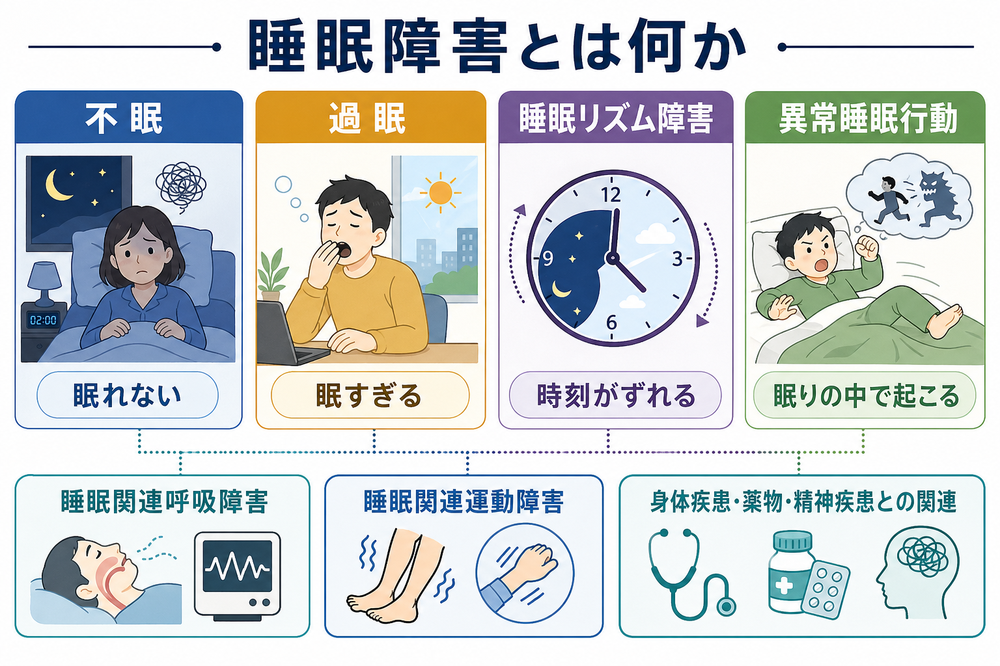
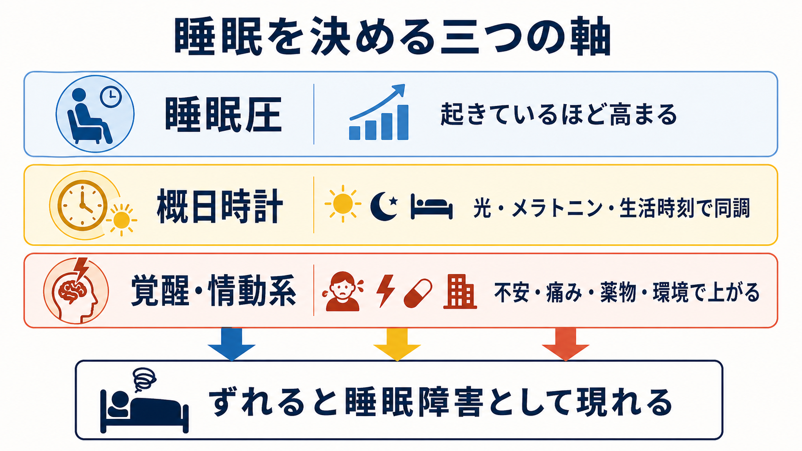
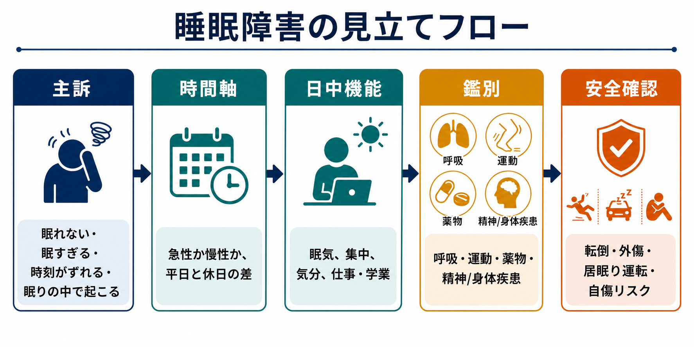

# 睡眠障害とは何か

## 要点

- 睡眠障害とは、睡眠の量、質、タイミング、睡眠中の行動、睡眠に伴う呼吸・運動の異常が、日中の機能や安全を損なう状態の総称である。
- 症候学的には、まず「眠れない」「眠すぎる」「時刻がずれる」「眠りの中で起こる」という四つの入口に分けると整理しやすい。
- ICSD-3-TR では、睡眠障害は不眠障害、睡眠関連呼吸障害、中枢性過眠症、概日リズム睡眠・覚醒障害、パラソムニア、睡眠関連運動障害などに分類される[1]。
- 精神科臨床では、睡眠症状を「精神疾患の付随症状」とだけ見ず、気分、認知、覚醒、生活リズム、薬物、身体疾患、安全リスクをつなぐ横断的な症候として扱う必要がある[2][8]。
- 本稿は教育・研究目的の整理であり、個別の診断や治療指示ではない。

## この記事で答える問い

1. 睡眠障害を、精神症候学ではどのような入口から整理すればよいか。
2. 不眠、過眠、睡眠リズム障害、異常睡眠行動は何が違うのか。
3. 睡眠圧、概日時計、覚醒・情動系は、睡眠症状の理解にどう関わるのか。
4. 睡眠症状を聴取するとき、どのような鑑別と安全確認が必要か。

## まず結論

睡眠障害を理解するときは、「睡眠時間が短いか長いか」だけで判断しない。重要なのは、本人がどのような困りごとを訴えているか、睡眠機会が十分にあるか、睡眠の時刻が社会的要求とずれているか、睡眠中に危険な行動や呼吸・運動の異常があるか、そして日中の機能にどの程度影響しているかである。

たとえば、同じ「眠い」でも、睡眠不足、睡眠時無呼吸、ナルコレプシー、概日リズムの後退、抑うつ、薬物、夜間せん妄後の疲労では意味が違う。同じ「眠れない」でも、入眠困難、中途覚醒、早朝覚醒、睡眠への不安、痛み、躁状態に伴う睡眠欲求の低下、アルコール離脱、夜間の過覚醒では、記述すべき症候が異なる。

したがって、[[精神症候学とは何か]]の文脈では、睡眠障害を診断名の暗記ではなく、主訴、時間軸、日中機能、鑑別、安全確認をつなぐ観察枠として扱うのが実践的である。

## 背景

睡眠医学の分類は、単純な「不眠症」だけを扱うものではない。AASM の ICSD-3-TR は、睡眠障害を、不眠障害、睡眠関連呼吸障害、中枢性過眠症、概日リズム睡眠・覚醒障害、パラソムニア、睡眠関連運動障害などの大きな群に分ける[1]。この分類は、睡眠症状が「眠れない」「眠い」という主観的訴えだけでは尽くせないことを示している。

一方、精神科・心理臨床では、睡眠症状は多くの診断領域を横断する。抑うつでは不眠または過眠がみられ、躁状態では睡眠欲求の低下が重要な手がかりになり、不安・PTSD では夜間の[[過覚醒とは何か]]や悪夢が問題になりうる。せん妄では睡眠覚醒リズムの乱れが目立つことがあり、認知症や神経疾患では概日リズム、夜間行動、REM 睡眠行動障害が臨床上の手がかりになることがある[7][8]。

## 基本概念

### 不眠

不眠は、眠る機会と環境があるにもかかわらず、入眠困難、中途覚醒、早朝覚醒、熟眠感の乏しさがあり、日中機能に影響する状態として整理される。慢性不眠では、症状の持続期間、頻度、日中の困りごとを確認する必要がある[4]。

症候学的には、「何時間眠ったか」よりも、次の点を分けて聞く。

| 観点 | 聴取する内容 |
|---|---|
| 入眠 | 寝床に入ってから眠るまでの時間、寝床での心配、スマートフォン、カフェイン、痛み |
| 維持 | 夜間覚醒の回数、覚醒後に再入眠できるか、尿意、呼吸苦、悪夢 |
| 早朝覚醒 | 予定より早く目が覚めるか、再入眠できるか、気分症状との関係 |
| 日中機能 | 眠気、疲労、集中困難、易怒性、学業・仕事・家事への影響 |
| 背景 | 身体疾患、薬物、物質使用、ストレス、睡眠への恐怖、生活リズム |

不眠は「眠らない意思」ではなく、睡眠圧、概日時計、覚醒系、情動、身体感覚、環境が噛み合わない状態として捉えるとよい。

### 過眠

過眠は、夜間睡眠が長い、または日中に強い眠気・居眠りが起こり、生活機能や安全に影響する状態である。中枢性過眠症にはナルコレプシーや特発性過眠症などが含まれ、AASM のガイドラインでは疾患ごとに治療推奨が整理されている[6]。

ただし症候としての過眠を見た段階では、まず睡眠不足、睡眠時無呼吸、概日リズムの乱れ、薬物、アルコール、抑うつ、神経疾患を区別する。日中の眠気は、[[注意障害とは何か]]や疲労感として訴えられることもあるため、「眠い」「だるい」「集中できない」「気絶するように寝落ちする」を分けて聞く。

### 睡眠リズム障害

睡眠リズム障害は、本人の睡眠覚醒の時刻が、身体の概日時計、生活上の要求、社会的時刻とずれることで生じる。代表例には睡眠相後退、睡眠相前進、非24時間睡眠覚醒リズム、交代勤務関連の問題などがある。AASM の概日リズム睡眠・覚醒障害ガイドラインは、睡眠日誌やアクチグラフィを用いた長期的な睡眠覚醒パターンの把握を重視している[5]。

ここで重要なのは、睡眠の質が「本来の時間帯」では保たれる場合がある点である。たとえば睡眠相後退では、深夜から昼前まで眠ればよく眠れるが、学校や仕事の時刻に合わせると入眠困難と起床困難が目立つ。これは単なる怠惰ではなく、睡眠のタイミングのずれとして記述する。

### 異常睡眠行動

異常睡眠行動は、睡眠中または睡眠覚醒移行期に起こる行動、体験、運動、発声、夢内容の行動化などを含む。パラソムニアには、ノンレム睡眠からの覚醒障害、悪夢障害、REM 睡眠行動障害などが含まれる[1][7]。

症候学的には、本人の主観だけでなく同居者・家族からの情報が重要になる。発生時刻、記憶の有無、夢との関連、暴力的行動、転倒・外傷、てんかん発作との鑑別、アルコールや薬物、神経疾患との関連を確認する。REM 睡眠行動障害では、睡眠中に夢を演じるような行動が外傷につながりうるため、安全確認が特に重要である[7]。

## 仕組み

睡眠は、少なくとも三つの軸の相互作用として理解できる。

1. 睡眠圧: 起きている時間が長いほど高まり、眠ることで下がる。
2. 概日時計: 光、暗さ、メラトニン、食事、活動、社会的時刻によって同調し、眠りやすい時間帯と覚醒しやすい時間帯を作る。
3. 覚醒・情動系: 不安、痛み、ストレス、危険予測、薬物、環境刺激によって覚醒を高める。

二過程モデルでは、睡眠恒常性に対応する Process S と、概日リズムに対応する Process C の相互作用が睡眠覚醒のタイミングを形づくると考えられてきた[3]。ここに臨床的には覚醒・情動系を加えると、不眠、過眠、リズムのずれを直感的に説明しやすい。

たとえば、睡眠圧が十分でも、概日時計が遅れていれば眠る時刻が後ろにずれる。概日時計が合っていても、[[過覚醒とは何か]]が強ければ入眠困難や中途覚醒が起こる。睡眠圧が不足していれば、本人は寝床に入っても眠れない。逆に睡眠圧が慢性的に高い、または睡眠の質が呼吸・運動・神経疾患で妨げられている場合、日中の強い眠気として現れる。

## 図解

上の 1 枚目は、睡眠障害を「不眠」「過眠」「睡眠リズム障害」「異常睡眠行動」に分け、呼吸障害、運動障害、身体疾患・薬物・精神疾患との関連を補助線として示している。

2 枚目は、睡眠を決める三つの軸を示している。睡眠圧、概日時計、覚醒・情動系のどれか一つだけで症状を説明しようとすると、臨床像を狭く見積もりやすい。

3 枚目は、初回評価での見立てフローである。主訴を聞いたあと、時間軸、日中機能、鑑別、安全確認へ進める。

## 臨床・研究との接続

### 主訴を四つの入口に分ける

| 入口 | 代表的な訴え | まず考えること |
|---|---|---|
| 眠れない | 入眠困難、中途覚醒、早朝覚醒、熟眠感のなさ | 不眠、睡眠機会、過覚醒、痛み、薬物、呼吸・運動障害 |
| 眠すぎる | 日中の居眠り、起床困難、長時間睡眠 | 睡眠不足、睡眠時無呼吸、中枢性過眠症、リズムのずれ、抑うつ |
| 時刻がずれる | 深夜まで眠れない、朝起きられない、休日に大きくずれる | 概日リズム、交代勤務、光曝露、生活時刻、発達段階 |
| 眠りの中で起こる | 叫ぶ、歩く、暴れる、悪夢、夢の行動化 | パラソムニア、REM 睡眠行動障害、てんかん、物質、神経疾患 |

この入口は診断名ではない。あくまで、聴取を始めるための症候学的な地図である。

### 日中機能を必ず確認する

睡眠障害では、夜間の出来事だけでなく日中機能が重要である。眠気、疲労、[[注意障害とは何か]]、記憶の低下、易怒性、[[抑うつ気分とは何か]]、仕事・学業・家事・対人関係への影響を確認する。睡眠症状が長引くと、感情調整、認知制御、ストレス反応と相互に悪循環を作りうる[8]。

### 精神症状との関係を見る

睡眠症状は、精神疾患の結果であるだけでなく、精神症状を増幅する条件にもなりうる。抑うつでは不眠・過眠、[[躁状態とは何か]]では睡眠欲求の低下、不安やトラウマ関連症状では過覚醒や悪夢、[[せん妄とは何か]]では睡眠覚醒リズムの乱れが重要になる。睡眠症状を「主診断の付録」として扱うと、症状の維持因子や安全リスクを見落としやすい。

### 安全確認を後回しにしない

睡眠症状では、以下の安全確認が必要になる。

- 居眠り運転、機械操作、通勤・通学時の事故リスク
- 夜間の転倒、外傷、同居者への危険
- REM 睡眠行動障害が疑われる場合の寝室環境
- アルコール、鎮静薬、睡眠薬、刺激薬、カフェイン、違法薬物
- 自傷リスク、希死念慮、夜間の衝動性

これは「危険だからすぐ診断する」という意味ではなく、症候学的聴取の早い段階でリスクの種類を分けるという意味である。

## よくある誤解

### 誤解1: 睡眠障害は「不眠症」のことだけである

不眠は重要だが、睡眠障害はそれだけではない。過眠、概日リズムのずれ、睡眠時無呼吸、睡眠関連運動障害、パラソムニアなども含まれる[1][2]。

### 誤解2: 眠れないなら睡眠時間だけを増やせばよい

睡眠時間を長くするだけでは解決しない場合がある。睡眠圧、概日時計、過覚醒、痛み、呼吸、運動、薬物、生活リズムを分けて見る必要がある。

### 誤解3: 朝起きられないのは意志の弱さである

起床困難は、睡眠不足、概日リズムの後退、過眠症、抑うつ、薬物、身体疾患などで生じる。本人の努力だけに還元せず、時刻のずれと日中機能を記述する。

### 誤解4: 睡眠中の行動は単なる寝ぼけである

多くは良性のこともあるが、外傷、転倒、同居者への危険、てんかん、神経疾患、薬物、REM 睡眠行動障害との鑑別が必要な場合がある[7]。

## 関連ノート

- [[精神症候学とは何か]]
- [[過覚醒とは何か]]
- [[注意障害とは何か]]
- [[抑うつ気分とは何か]]
- [[躁状態とは何か]]
- [[せん妄とは何か]]

今後の作成候補:

- `不眠とは何か`
- `過眠とは何か`
- `概日リズム睡眠・覚醒障害とは何か`
- `パラソムニアとは何か`
- `睡眠時無呼吸とは何か`
- `REM睡眠行動障害とは何か`

MOC 更新候補:

- `content/00_MOC/MOC｜症候学.md`
- `content/00_MOC/MOC｜精神医学.md`
- `content/00_MOC/MOC｜神経科学と精神疾患.md`

並列ジョブとの競合を避けるため、本タスクでは MOC 本体は更新しない。

## 理解チェック

1. 「眠れない」「眠すぎる」「時刻がずれる」「眠りの中で起こる」は、それぞれどのような睡眠障害の入口になるか。
2. 不眠を聴取するとき、入眠困難、中途覚醒、早朝覚醒、熟眠感のなさを分ける理由は何か。
3. 概日リズムのずれがある人では、なぜ「眠れる時間帯」を確認する必要があるか。
4. 睡眠中の異常行動で、本人以外からの情報が重要になるのはなぜか。
5. 睡眠圧、概日時計、覚醒・情動系の三つの軸で、最近の睡眠不調を説明するとどうなるか。

## 参考文献

[1] American Academy of Sleep Medicine. (2023). *International Classification of Sleep Disorders, Third Edition, Text Revision (ICSD-3-TR)*. https://shop.aasm.org/products/icsd-3-text-revision-print

[2] Slowik, J. M., Collen, J. F., & Yow, A. G. (2023). Sleep Disorder. *StatPearls*. NCBI Bookshelf. https://www.ncbi.nlm.nih.gov/books/NBK560720/

[3] Borbély, A. (2022). The two-process model of sleep regulation: Beginnings and outlook. *Journal of Sleep Research*, 31(4), e13598. https://doi.org/10.1111/jsr.13598

[4] Riemann, D., Espie, C. A., Altena, E., et al. (2023). The European Insomnia Guideline: An update on the diagnosis and treatment of insomnia 2023. *Journal of Sleep Research*, 32(6), e14035. https://doi.org/10.1111/jsr.14035

[5] Auger, R. R., Burgess, H. J., Emens, J. S., Deriy, L. V., Thomas, S. M., & Sharkey, K. M. (2015). Clinical practice guideline for the treatment of intrinsic circadian rhythm sleep-wake disorders. *Journal of Clinical Sleep Medicine*, 11(10), 1199-1236. https://doi.org/10.5664/jcsm.5100

[6] Maski, K., Trotti, L. M., Kotagal, S., et al. (2021). Treatment of central disorders of hypersomnolence: An American Academy of Sleep Medicine clinical practice guideline. *Journal of Clinical Sleep Medicine*, 17(9), 1881-1893. https://doi.org/10.5664/jcsm.9328

[7] Howell, M., Avidan, A. Y., Foldvary-Schaefer, N., et al. (2023). Management of REM sleep behavior disorder: An American Academy of Sleep Medicine clinical practice guideline. *Journal of Clinical Sleep Medicine*, 19(4), 759-768. https://doi.org/10.5664/jcsm.10424

[8] Institute of Medicine Committee on Sleep Medicine and Research. (2006). *Sleep Disorders and Sleep Deprivation: An Unmet Public Health Problem*. National Academies Press. https://doi.org/10.17226/11617
