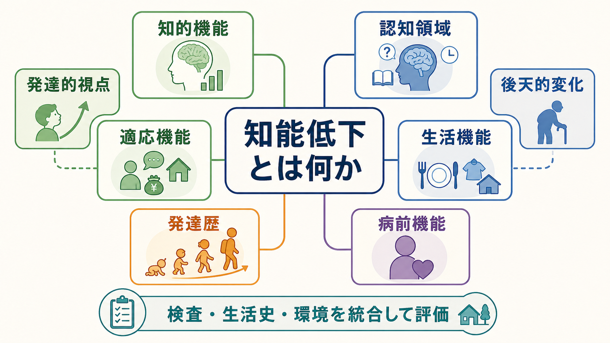
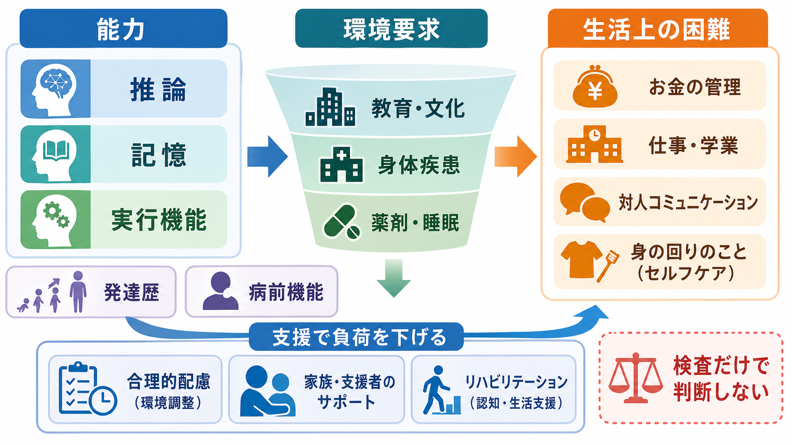
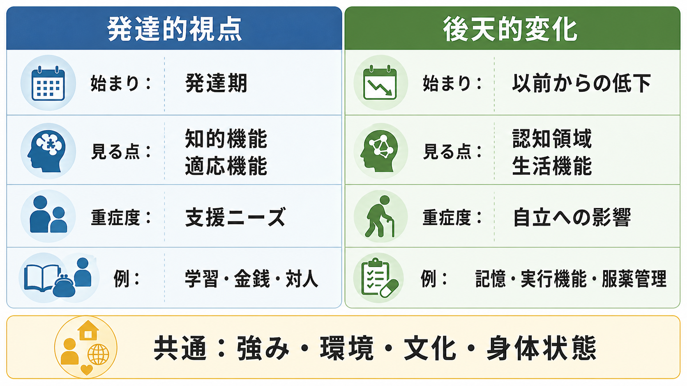

# 知能低下とは何か

## 要点

- 知能低下は、単に「IQが低い」ことではなく、推論・学習・問題解決などの知的機能、日常生活で必要な適応機能、以前の水準からの認知変化、生活機能への影響を合わせて見る臨床的な表現である。
- 発達期から続く知的機能・適応機能の制限は、知的発達症・知的能力障害の枠組みで考える。一方、成人期以降に以前の水準から下がる場合は、せん妄、軽度認知障害、認知症、脳損傷、精神疾患、薬剤・物質、睡眠、身体疾患などを鑑別する。
- 知的機能の検査値は重要だが、それだけで本人の生活上の困難や支援ニーズは決まらない。AAIDD と DSM-5 は、知的機能だけでなく適応機能と発達期からの経過を重視する[1][2]。
- 後天的な認知低下では、「以前できていたこと」と比べた変化、複数の認知領域、日常生活・仕事・学業への影響、可逆的要因の有無を確認する[3][4]。
- 本稿は教育・研究目的の整理であり、個別の診断や治療方針を決めるものではない。実際の評価は、発達歴、生活史、身体・神経学的所見、神経心理検査、家族・支援者からの情報を統合して行う。

## この記事で答える問い

1. 「知能低下」という言葉は、何を指しているのか。
2. 発達期からの知的機能の制限と、後天的な認知機能の低下は何が違うのか。
3. 知的機能、適応機能、認知機能、生活機能はどう関係するのか。
4. 臨床では、何を見れば「低下」と「もともとの特性」を区別しやすいのか。
5. よくある誤解を避けるには、どのような評価軸が必要か。

## まず結論

知能低下とは、医学的に一つの独立した診断名というより、**知的な課題処理や日常生活上の適応が、期待される水準または以前の本人の水準に比べて低い・下がったように見える状態**を指す広い記述である。したがって、最初に分けるべきなのは「発達期からの制限」なのか、「後天的に低下した変化」なのかである。

発達的視点では、知的機能と適応機能の両方を見る。AAIDD は、知的障害を知的機能と適応行動の有意な制限があり、それが 22 歳未満の発達期に始まる状態として定義する[1]。DSM-5 でも、概念的・社会的・実用的領域の適応機能を重視し、重症度は IQ だけでなく適応機能の障害に基づいて考える[2]。

後天的変化の視点では、「以前の本人」からの下がり方を見る。NIA は認知健康を、明瞭に考え、学び、記憶する能力として説明し、認知機能は服薬、支払い、運転、料理などの日常活動に関わるとする[4]。軽度認知障害や軽度認知症の議論でも、客観的な認知障害に加えて、日常生活への干渉の程度が鑑別上の重要な境界になる[5][6]。

## 背景

精神科や神経内科の場面で「知能が落ちた」「理解力が低い」「判断力が下がった」と表現される現象は、かなり異なる状態を含む。たとえば、幼少期から学習・金銭管理・社会的判断に困難がある人と、もともと自立していた高齢者が数年で服薬管理や家計管理に困難を示す人では、同じ「できない」でも意味が違う。

この区別は、[[精神症候学とは何か]]の基本と同じである。観察された症候をすぐ診断名に置き換えるのではなく、時間経過、発達歴、病前機能、身体状態、薬剤、文化的背景、生活環境を合わせて読む必要がある。[[症状と徴候は何が違うのか]]で整理されるように、本人の訴え、周囲の観察、検査所見は互いに補い合うが、どれか一つだけでは十分ではない。

特に「知能」という言葉は、価値判断やスティグマと結びつきやすい。臨床的には、能力を序列化するためではなく、本人がどこで困っているのか、どの環境調整や支援で生活機能が改善しうるのかを明らかにするために使う。AAIDD も、制限の記述の重要な目的を、必要な支援プロフィールを作ることに置いている[1]。

## 基本概念

### 知的機能

知的機能とは、学習、推論、問題解決、抽象的思考、判断、経験から学ぶ力などを含む一般的な精神能力である。標準化された知能検査はこの側面を測る有力な道具であり、AAIDD は IQ 70 から 75 前後を有意な制限の目安として説明している[1]。ただし、検査得点には測定誤差、言語・文化、教育歴、感覚・運動障害、疲労、意欲、精神症状の影響がある。

したがって、知能検査は「本人の全体」を測るものではない。検査結果は、生活史や行動観察、学校・職場での機能、家族や支援者からの情報と合わせて読む必要がある。

### 適応機能

適応機能とは、日常生活の要求に応じて学び、実行する概念的・社会的・実用的スキルである。AAIDD は、概念的スキルを言語・読み書き・時間・数・金銭・自己方向づけ、社会的スキルを対人関係・社会的責任・社会的問題解決・被害回避、実用的スキルを身辺自立・職業技能・健康管理・移動・安全・電話利用などとして整理している[1]。

適応機能は、環境によって見え方が変わる。たとえば、同じ金銭管理の困難でも、家族が毎月の支払いを補助している環境では表面化しにくく、独居や就労開始で急に問題化することがある。これは「能力が突然消えた」というより、環境要求が本人の支援なしの処理能力を上回った状態かもしれない。

### 認知機能

認知機能は、注意、記憶、言語、視空間認知、実行機能、処理速度、社会認知などを含む。後天的な低下を考えるときは、どの認知領域が、いつから、どの程度、どのような経過で変化しているかを見る。[[MSEで認知機能をどう評価するか]]や[[精神状態診察MSEとは何か]]は、面接場面でこの変化の手がかりを拾う入口になる。

NIA は、認知機能の低下に遺伝、環境、生活習慣、加齢、脳損傷、気分障害、物質使用、アルツハイマー病などが関わりうると説明している[4]。そのため、記憶だけに注目すると、うつ病、睡眠不足、薬剤性、せん妄、頭部外傷、神経変性疾患などの区別を誤る。

### 生活機能

生活機能とは、家事、金銭管理、服薬管理、通学・就労、対人関係、安全管理、意思決定など、実際の生活場面での働きである。WHO の ICF は、機能と障害を個人の健康状態だけでなく、環境因子を含む文脈の中で記述する枠組みとして提示している[8]。この考え方は、「低下」を本人の内部だけに閉じ込めず、環境の負荷や支援の有無も含めて見るうえで重要である。

## 仕組み

知能低下を理解するには、能力、環境要求、生活上の困難、支援の相互作用として見るとよい。

### 1. 発達期からの制限

発達期からの制限では、幼少期からの学習、言語、社会的判断、金銭管理、身辺自立、学校生活などの経過が重要になる。[[発達歴は成人精神科でもなぜ重要なのか]]で扱うように、成人期の面接でも、本人がどのように学び、どこで支援を受け、どの環境ではうまく機能していたのかを確認する必要がある。

知的発達症・知的能力障害の評価では、知能検査に加えて、適応機能の評価が必須である。DSM-5 の解説は、概念的・社会的・実用的領域における日常課題への影響を重視し、重症度を IQ 得点だけで決めない方針を示している[2]。これは、検査室での成績と実生活の支援ニーズが一致しないことがあるためである。

### 2. 以前の水準からの低下

後天的な低下では、病前機能との比較が中心になる。[[病前機能とは何か]]の観点からは、学歴や職歴だけでなく、家計管理、予定管理、対人調整、趣味、地域生活、家族内役割などを含めて、「以前はどこまでできていたか」を確認する。

軽度認知障害は、正常加齢と認知症の中間に位置づけられる概念として発展してきた。Petersen は、MCI を正常加齢と認知症の間の状態として整理し、60 歳以上では比較的よく見られ、進行率や原因は一様でないと論じている[5]。Knopman と Petersen は、軽度認知障害と軽度認知症の違いとして、認知障害の客観的証拠に加え、認知症では日常生活への明らかな干渉が重要になると述べている[6]。

### 3. 可逆的・変動性の要因

「知能が落ちた」と見える状態には、可逆的または変動性の要因が多い。睡眠不足、抑うつ、不安、せん妄、薬剤、アルコールや物質、甲状腺機能異常、感染、代謝異常、疼痛、感覚障害、社会的孤立などは、注意・記憶・処理速度を落としうる。[[器質性精神障害を見逃さないためには何を見るべきか]]は、このような身体・神経学的背景を見落とさないための関連ノートである。

高齢期の認知低下を考える場合も、神経変性疾患だけに直行しない。Lancet Commission の 2024 年報告は、教育、聴力、血圧、喫煙、肥満、うつ、身体活動、糖尿病、アルコール、頭部外傷、大気汚染、社会的孤立、高 LDL、視力障害など、ライフコース上の修正可能リスクを広く扱っている[7]。これは「認知症を生活習慣だけで説明できる」という意味ではなく、認知機能を脳病理と生活環境の両方から見る必要があるという意味である。

## 図解

発達的視点と後天的変化は、どちらも知的・認知的な困難を扱うが、問いの立て方が違う。

| 観点 | 発達的視点 | 後天的変化 |
|---|---|---|
| 中心の問い | 発達期から、知的機能と適応機能にどのような制限があったか | 以前の本人から、どの認知領域と生活機能がどう変わったか |
| 主な情報 | 発達歴、学校歴、支援歴、適応機能、知能検査 | 病前機能、発症時期、経過、認知検査、身体・神経所見 |
| 生活上の焦点 | 金銭、学習、対人関係、身辺自立、社会参加 | 服薬、家計、運転、仕事、予定管理、家事、安全 |
| 重症度の見方 | 支援ニーズと適応機能の制限 | 自立性への影響と進行・変動 |
| 注意点 | IQ だけで判断しない | 年齢や性格のせいだけにしない |

## 臨床・研究との接続

### 面接と観察

[[精神科面接とは何か]]では、本人の語りを尊重しながら、生活場面で何が起きているかを構造化して確認する。知能低下が疑われる場合も、本人の説明を否定するのではなく、困っている場面を具体化する。

たとえば、「理解が悪い」ではなく、「書類の手続きでどの段階が難しいのか」「説明を聞いた直後は理解できるが数日後に抜けるのか」「時間制限があると失敗するのか」「支援者が横にいるとできるのか」と聞く。このように、能力を固定的な属性ではなく、課題・環境・支援との関係で見る。

### 検査

知能検査、適応行動尺度、神経心理検査、[[ミニ精神状態検査MMSEとは何か]]のようなスクリーニング、生活機能尺度は、それぞれ違うものを測る。検査は、診断名を機械的に出す装置ではなく、臨床仮説を検証するための道具である。

検査で重要なのは、得点だけでなくプロフィールである。語彙や知識は保たれているが処理速度が低い、記憶より注意の持続が難しい、実行機能課題で計画と切り替えが弱い、言語理解より視空間処理が弱い、といったパターンは、鑑別や支援計画に役立つ。

### 診断分類

[[DSMとICDは何が違うのか]]で扱うように、診断分類は共通言語を与えるが、症候や生活史そのものではない。ICD-11 CDDR は、精神・行動・神経発達症群の臨床記述と診断要件を、臨床現場での正確で信頼できる同定を支えるために整備したものと説明されている[3]。分類体系を使うときも、本人の機能、環境、支援ニーズに戻して読む必要がある。

### 研究

研究では、知能低下や認知低下を、検査得点、縦断変化、脳画像、バイオマーカー、生活機能、社会参加など複数の指標で扱う。軽度認知障害のような概念は、正常加齢、早期認知症、可逆的な認知低下を区別するために発展してきたが、境界は絶対的ではない[5]。

発達的な知的障害の研究でも、後天的な認知低下の研究でも、検査得点だけでなく生活機能をどう測るかが重要になる。WHO の ICF は、心身機能、活動、参加、環境因子を分けて記述する枠組みを与えるため、研究指標と支援目標をつなぐ補助線になる[8]。

## よくある誤解

### 誤解1: IQが低ければ、それだけで知的障害である

IQ は重要な情報だが、知的障害の評価は IQ だけでは決まらない。AAIDD と DSM-5 は、知的機能、適応機能、発達期からの始まり、文化・言語・環境、本人の強みと支援による改善可能性を重視する[1][2]。

### 誤解2: 高齢者のもの忘れはすべて認知症である

もの忘れは、正常加齢、睡眠不足、うつ、不安、薬剤、せん妄、MCI、認知症など多くの状態で起こる。軽度認知障害と軽度認知症の境界でも、客観的な認知障害と日常生活への干渉の程度を分けて見る必要がある[5][6]。

### 誤解3: 生活で困っていなければ問題はない

生活上の困難が見えないことは、困難が存在しないことを意味しない。家族、学校、職場、福祉制度、デジタルツールが補っているために表面化していない場合がある。逆に、環境要求が急に上がると、もともとの脆弱性が「低下」のように見えることもある。

### 誤解4: 知能低下は本人の努力不足である

知的機能や認知機能の困難は、努力だけで説明できない。脳機能、発達歴、教育機会、身体疾患、睡眠、薬剤、精神症状、環境要求、支援の有無が関わる。臨床的には、本人を責める説明ではなく、機能と環境のミスマッチを明らかにし、支援可能な点を探す。

## 関連ノート

- [[精神症候学とは何か]]
- [[症状と徴候は何が違うのか]]
- [[精神状態診察MSEとは何か]]
- [[MSEで認知機能をどう評価するか]]
- [[精神科面接とは何か]]
- [[発達歴は成人精神科でもなぜ重要なのか]]
- [[病前機能とは何か]]
- [[器質性精神障害を見逃さないためには何を見るべきか]]
- [[ミニ精神状態検査MMSEとは何か]]
- [[DSMとICDは何が違うのか]]
- [[GAFやWHODASは何を評価するのか]]

## MOC更新候補

- `content/00_MOC/` 配下の精神医学、症候学、神経心理評価、認知症・神経認知障害に関する MOC があれば、本記事 `[[知能低下とは何か]]` を追加候補とする。
- 並列生成ジョブとの競合を避けるため、本タスクでは MOC ファイル本体は更新しない。

## 理解チェック

1. 知能低下を評価するとき、最初に「発達期からの制限」と「後天的変化」を分ける理由は何か。
2. 知的機能と適応機能はどう違うか。例を一つずつ挙げられるか。
3. 「IQが低い」ことと「生活で支援が必要」なことは、なぜ同じではないのか。
4. 後天的な認知低下を疑うとき、病前機能を確認する理由は何か。
5. 睡眠、薬剤、うつ、せん妄、身体疾患は、知能低下のように見える状態とどう関係するか。

## 未解決問題

- 発達的な知的機能の制限と、成人期以降の神経変性・血管性変化が重なる場合、どのように病前水準を推定するのが妥当か。
- 文化・教育歴・言語背景が異なる人に対して、知能検査と適応機能評価をどのように公平に解釈できるか。
- デジタル化した社会で、金銭管理、行政手続き、情報リテラシーなどの適応機能要求はどのように変化しているか。
- 神経心理検査、日常行動データ、家族報告、本人報告を、臨床的に過不足なく統合する方法は何か。

## 参考文献

[1] American Association on Intellectual and Developmental Disabilities. "Defining Criteria for Intellectual Disability." https://www.aaidd.org/intellectual-disability/definition

[2] American Psychiatric Association. "Intellectual Disability." *DSM-5 Fact Sheet*. https://www.psychiatry.org/File%20Library/Psychiatrists/Practice/DSM/APA_DSM-5-Intellectual-Disability.pdf

[3] World Health Organization. (2024). *Clinical descriptions and diagnostic requirements for ICD-11 mental, behavioural and neurodevelopmental disorders*. WHO. https://www.who.int/publications/i/item/9789240077263

[4] National Institute on Aging. "Cognitive Health and Older Adults." https://www.nia.nih.gov/health/brain-health/cognitive-health-and-older-adults

[5] Petersen, R. C. (2016). Mild Cognitive Impairment. *Continuum, 22*(2 Dementia), 404-418. https://doi.org/10.1212/CON.0000000000000313

[6] Knopman, D. S., & Petersen, R. C. (2014). Mild cognitive impairment and mild dementia: a clinical perspective. *Mayo Clinic Proceedings, 89*(10), 1452-1459. https://doi.org/10.1016/j.mayocp.2014.06.019

[7] Livingston, G., Huntley, J., Liu, K. Y., et al. (2024). Dementia prevention, intervention, and care: 2024 report of the Lancet standing Commission. *The Lancet, 404*(10452), 572-628. https://doi.org/10.1016/S0140-6736(24)01296-0

[8] World Health Organization. "International Classification of Functioning, Disability and Health (ICF)." https://www.who.int/standards/classifications/international-classification-of-functioning-disability-and-health
