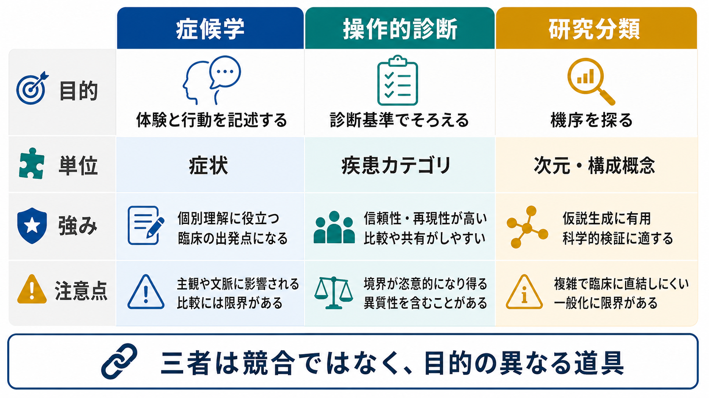
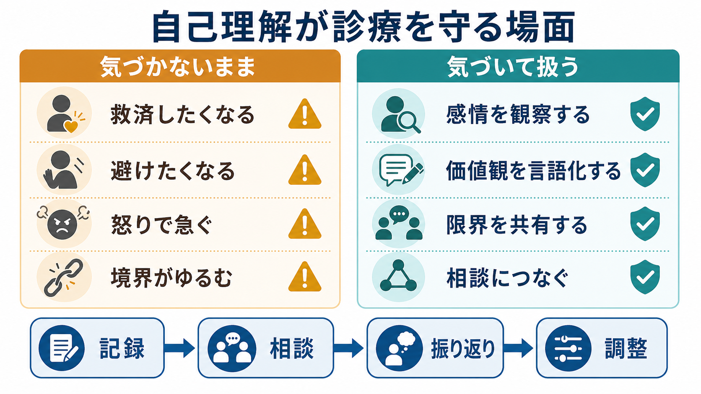

# 精神症候学とは何か

## 要点

- 精神症候学とは、精神症状をできるだけ正確に観察・聴取し、記述し、臨床的に意味のある単位へ整理するための学問である。
- 症候学は診断名を暗記する作業ではなく、「何が、どのように、どの文脈で、どの程度、いつから起きているか」を明確にする技術である。
- 精神科診断、重症度評価、リスク評価、治療方針、研究上の表現型定義は、いずれも症状記述の質に依存する。
- 症状は診断名そのものではない。幻覚、妄想、抑うつ、不安、認知障害などは、複数の疾患、身体疾患、薬剤、文化的背景、生活史の中で異なる意味を持つ。
- 本稿は教育・研究目的の概説であり、個別の診断や治療指示を行うものではない。

## この記事で答える問い

- 精神症候学は何を対象にするのか。
- 精神症状の「記述」と「診断」は何が違うのか。
- なぜ精神科臨床では、症状を細かく聞き分ける必要があるのか。
- DSM・ICD、MSE、評価尺度、RDoCやHiTOPのような研究枠組みと、症候学はどう接続するのか。

## まず結論

精神症候学は、[[精神科面接とは何か|精神科面接]]と[[精神状態診察MSEとは何か|精神状態診察MSE]]で得られる情報を、診断・治療・研究に使える形へ整える「臨床言語」である。たとえば「気分が落ち込む」という訴えを、持続時間、誘因、身体症状、思考内容、希死念慮、生活機能、文化的意味、薬剤や身体疾患との関係に分けて記述できるほど、[[鑑別診断とは何か|鑑別診断]]と治療計画は精密になる。

WHOのICD-11 CDDRは、精神・行動・神経発達症群を臨床場面で正確かつ信頼性高く同定するための診断記述と要件を示すものであり、症状を共通言語化する意義を強調している[1]。DSM-5/DSM-5-TRにおける精神疾患の定義も、認知、情動調整、行動における臨床的に意味のある障害を中心に置く[2]。これらの診断体系を実際に使う前提として、症状を観察し、聞き取り、意味づける症候学が必要になる。

## 背景

精神医学では、身体診察や検査値だけでは把握しにくい現象を扱う。苦痛、恐怖、抑うつ、幻聴、被害的確信、思考のまとまりにくさ、意欲低下、離人感、注意障害などは、本人の語り、面接者の観察、周囲からの情報、時間経過の再構成によって理解される。

このとき重要なのは、症状をすぐに診断名へ飛ばさないことである。たとえば「眠れない」は、うつ病、躁病、不安症、物質使用、疼痛、甲状腺疾患、生活リズムの乱れ、環境要因などで起こりうる。「声が聞こえる」も、精神病性障害だけでなく、睡眠移行期、解離、トラウマ、文化的・宗教的体験、薬剤や神経疾患との関係を検討する必要がある。

記述精神病理学の古典的基盤として、Jaspersは患者の体験を先入観からできるだけ離れて記述し、心的現象を方法論的に区別する重要性を示した[3]。現代の臨床では、この伝統はDSM・ICDの操作的診断、MSE、構造化面接、評価尺度、症例定式化へ引き継がれている。

## 基本概念

### 症状・徴候・症候群

精神症候学では、少なくとも三つの水準を区別する。

| 水準 | 意味 | 例 |
|---|---|---|
| 症状 | 本人が体験し訴える主観的現象 | 悲しさ、不安、幻聴、思考が抜き取られる感じ |
| 徴候 | 面接者や周囲が観察できる現象 | 表情の乏しさ、焦燥、思考途絶、まとまりにくい発話 |
| 症候群 | 複数の症状・徴候がまとまった臨床像 | うつ状態、躁状態、せん妄、緊張病、精神病状態 |

この区別は、[[精神疾患とは何か|精神疾患]]を「名前」ではなく「観察可能な問題のまとまり」として考える助けになる。診断名は重要だが、診断名だけでは、現在の重症度、危険性、生活機能、本人の苦痛、治療反応性までは十分に表せない。

### 内容と形式

精神症状では「何を考えているか」だけでなく、「考えがどのように流れているか」が重要である。たとえば、思考内容では被害妄想、罪業感、希死念慮、強迫観念などを扱う。一方、思考形式では観念奔逸、思考制止、思考途絶、連合弛緩、滅裂さなどを扱う。これは[[MSEで思考内容をどう評価するか]]と[[MSEで思考過程をどう評価するか]]の違いに対応する。

### 横断面と縦断面

横断面は、診察時点での症状の配置である。縦断面は、発症年齢、経過、エピソード性、再発、寛解、増悪因子、治療反応などを含む。症候学的には、同じ「不安」でも、急性発作として出るのか、慢性的な予期不安なのか、外傷記憶と結びつくのか、精神病性体験に伴うのかを区別する。

### 文脈

症状は、文化、発達段階、身体疾患、薬剤、物質使用、睡眠、ストレス、生活史、対人関係の中で意味を変える。DSMの定義でも、文化的に承認された反応や社会的逸脱のみを精神疾患とみなさない注意が示されている[2]。したがって、症候学は「正常と異常を機械的に分ける表」ではなく、文脈を含めて臨床的意味を判断する作業である。

## 仕組み

精神症候学の実践は、次の循環として考えると理解しやすい。

1. 主訴と現病歴を聞く。
2. 面接中の外観、行動、話し方、気分、感情、思考、知覚、認知、病識、判断を観察する。
3. 本人の主観的体験と観察された徴候を分けて記述する。
4. 症状の内容、形式、持続、強度、機能障害、危険性を評価する。
5. 身体疾患、薬剤、物質、発達歴、文化的背景、生活史を含めて鑑別する。
6. 診断、重症度、治療方針、支援計画を仮説として立てる。
7. 経過を追って、症状記述と仮説を更新する。

MSEはこの循環の中心にあり、外観・行動、運動、発話、気分・感情、思考過程、思考内容、知覚、認知、病識、判断などを整理する枠組みである[4]。ただしMSEは単独で診断を確定する検査ではなく、[[現病歴はどのように構造化するべきか|現病歴]]、身体診察、検査、家族や支援者からの情報と統合して使う。

## 図解

上の1枚目は、精神症候学を「観察・聴取」「記述」「分類」「臨床判断・研究」とつなぐ概念地図として示している。2枚目は、主観的体験、行動観察、文脈情報が症候学的記述へ集約され、鑑別診断、リスク評価、重症度評価、治療方針へ進む流れを示している。

3枚目は、症候学、[[操作的診断とは何か|操作的診断]]、研究分類の違いを比較する。症候学は体験と行動を細かく記述し、操作的診断は診断基準に照らして判断をそろえ、研究分類は症状や機能を次元・構成概念として扱う。三者は競合するものではなく、目的の異なる道具である。

## 臨床・研究との接続

### 診断との接続

[[DSMとICDは何が違うのか|DSMとICD]]は、臨床家や研究者が精神疾患を共通の枠組みで記述するための分類体系である。ICD-11 CDDRは臨床現場での同定と診断のために作られ、DSM-5/DSM-5-TRは症状、持続、機能障害、除外条件などを組み合わせて診断を構成する[1][2]。

しかし、分類体系は症状記述の代わりにはならない。診断基準を満たすかどうかを判断するには、まず症状がどのような性質を持つかを見分けなければならない。したがって、症候学は[[精神科診断は何のためにあるのか|精神科診断]]の土台である。

### 評価尺度との接続

構造化面接や評価尺度は、症状評価のばらつきを減らすために発展してきた。Present State Examinationは、面接技法、症状定義、分類手続きを標準化する試みとして位置づけられる[5]。うつ症状ではHamilton Rating Scale for Depression、統合失調症圏ではPANSSなどが、研究や治療効果判定で広く使われてきた[6][7]。

ただし尺度は、症状理解を自動化する装置ではない。尺度得点は、面接の質、症状定義の理解、観察の文脈に依存する。症候学を学ぶ意義は、尺度の項目を機械的に埋めることではなく、その項目が何を測ろうとしているかを理解することにある。

### 次元診断・研究分類との接続

近年は、[[カテゴリ診断と次元診断は何が違うのか|カテゴリ診断と次元診断]]の関係が重要になっている。HiTOPは、従来のカテゴリ診断にみられる併存、異質性、境界の曖昧さに対して、症状や特性の共変動から階層的・次元的に精神病理を整理しようとする研究枠組みである[8]。NIMHのRDoCも、診断マニュアルを置き換えるものではなく、心理・生物学的機能の連続体から精神病理を研究する枠組みとして提示されている[8]。

ここでも症候学は不要にならない。むしろ、研究で扱う表現型を精密に定義するほど、症状の記述、時間経過、機能障害、文化的背景、測定単位を明確にする必要が高まる。

## よくある誤解

### 誤解1: 症候学は古い暗記科目である

症候学には古典的用語が多いが、目的は暗記ではない。目的は、患者の体験と観察所見を、臨床判断に耐える精度で言葉にすることである。言葉が粗いと、鑑別診断、リスク評価、治療反応の追跡も粗くなる。

### 誤解2: 症状が一つあれば診断が決まる

単一症状だけで診断が決まることは少ない。幻聴、抑うつ、不眠、不安、希死念慮、易怒性などは、多くの状態で出現する。診断には、症状のまとまり、持続、重症度、生活機能、身体・薬剤・物質要因、発達歴、文化的背景を含む評価が必要である。

### 誤解3: 主観的体験は客観的でないから信頼できない

精神科では主観的体験そのものが重要な臨床情報である。ただし、それをそのまま結論にするのではなく、本人の語り、観察、周囲の情報、経過、検査所見を突き合わせる。症候学は、主観を排除する方法ではなく、主観を臨床的に扱える形へ整える方法である。

### 誤解4: DSMやICDがあれば症候学は不要である

DSMやICDは共通分類を提供するが、症状をどう聞き、どう記述し、どの文脈で解釈するかまでは自動化しない。分類体系を適切に使うために、症候学が必要である。

## 関連ノート

- [[精神医学とは何か]]
- [[精神疾患とは何か]]
- [[精神科面接とは何か]]
- [[精神状態診察MSEとは何か]]
- [[MSEで外観と行動から何を観察するか]]
- [[MSEで話し方から何がわかるのか]]
- [[MSEで気分と感情をどう区別するか]]
- [[MSEで思考過程をどう評価するか]]
- [[MSEで思考内容をどう評価するか]]
- [[MSEで知覚異常をどう聞くか]]
- [[操作的診断とは何か]]
- [[DSMとICDは何が違うのか]]
- [[カテゴリ診断と次元診断は何が違うのか]]
- [[鑑別診断とは何か]]

## MOC更新候補

- [[MOC｜精神医学]] に「症候学」の入口ノートとして追加候補。
- [[MOC｜臨床実践・治療]] に、精神科面接・MSE・診断の基礎ノートとして追加候補。

## 理解チェック

1. 「症状」「徴候」「症候群」はどのように違うか。
2. 精神症候学と診断名の関係を一文で説明するとどうなるか。
3. 同じ「幻聴」でも、どのような文脈情報を確認すべきか。
4. MSEはなぜ単独の診断検査ではなく、面接・経過・身体評価と統合して使う必要があるのか。
5. 操作的診断、評価尺度、HiTOP/RDoCのような研究枠組みに共通して、症候学が必要になる理由は何か。

## 未解決問題

- 精神症状をカテゴリとして記述する方法と、連続量として測定する方法をどう統合するか。
- 文化的背景、発達特性、身体疾患、薬剤性症状を、標準化された症候記述にどこまで反映できるか。
- 患者の主観的体験を尊重しながら、研究で再現可能な表現型として記述するには、どの程度の構造化が必要か。
- AIや自然言語処理を用いた診療録解析が進むとき、症候学的な用語の曖昧さをどう扱うか。

## 参考文献

[1] World Health Organization. (2024). *Clinical descriptions and diagnostic requirements for ICD-11 mental, behavioural and neurodevelopmental disorders*. WHO. https://www.who.int/publications/i/item/9789240077263

[2] Telles-Correia, D., et al. (2025). Definitions of “Mental Disorder” from DSM-III to DSM-5. *Philosophy, Ethics, and Humanities in Medicine*. https://pmc.ncbi.nlm.nih.gov/articles/PMC12189202/

[3] Häfner, H. (2015). Descriptive psychopathology, phenomenology, and the legacy of Karl Jaspers. *Dialogues in Clinical Neuroscience, 17*(1), 19-29. https://pmc.ncbi.nlm.nih.gov/articles/PMC4421897/

[4] Voss, R. M., & Das, J. M. (2024). Mental Status Examination. *StatPearls*. NCBI Bookshelf. https://www.ncbi.nlm.nih.gov/sites/books/NBK546682/

[5] Timsit-Berthier, M., Bragard-Ledent, A., & Timsit, M. (1984). Standardized psychiatric examination according to the Wing-Cooper-Sartorius method. *Acta Psychiatrica Belgica, 84*(3), 252-272. https://pubmed.ncbi.nlm.nih.gov/6548332/

[6] Worboys, M. (2013). The Hamilton Rating Scale for Depression: The making of a “gold standard” and the unmaking of a chronic illness, 1960-1980. *Chronic Illness, 9*(3), 202-219. https://pmc.ncbi.nlm.nih.gov/articles/PMC3837544/

[7] Aboraya, A., Nasrallah, H. A., Elswick, D. E., et al. (2016). Perspectives on the Positive and Negative Syndrome Scale (PANSS): Use, misuse, drawbacks, and a new alternative for schizophrenia research. *Annals of Clinical Psychiatry, 28*(2), 125-131. https://pubmed.ncbi.nlm.nih.gov/26855990/

[8] Forbes, M. K., et al. (2022). A Hierarchical Taxonomy of Psychopathology (HiTOP) Primer for Mental Health Researchers. *Clinical Psychological Science, 10*(2), 236-258; National Institute of Mental Health. About RDoC. https://pmc.ncbi.nlm.nih.gov/articles/PMC9122089/ ; https://www.nimh.nih.gov/research/research-funded-by-nimh/rdoc/about-rdoc
