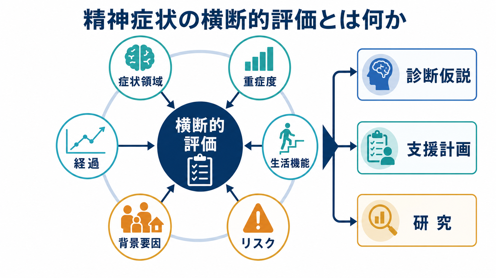
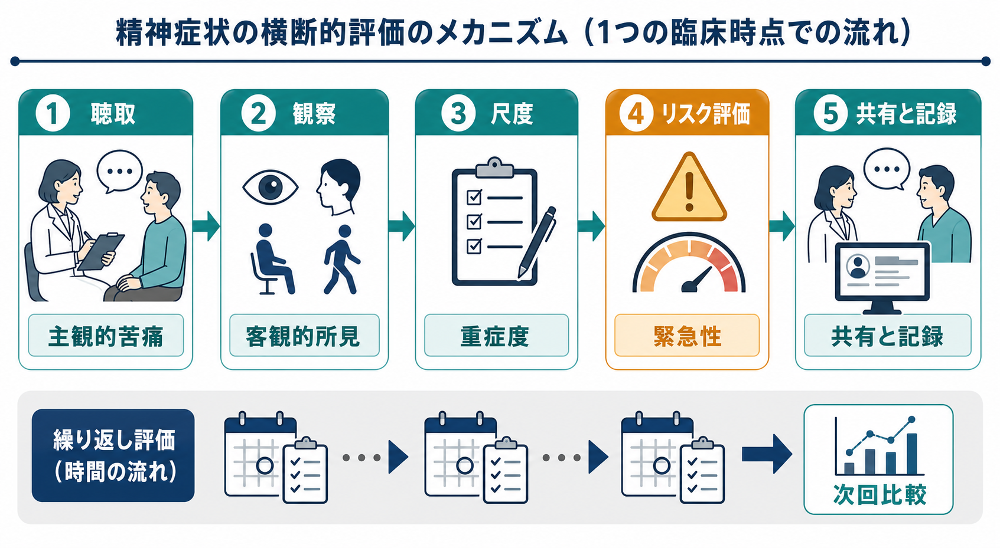
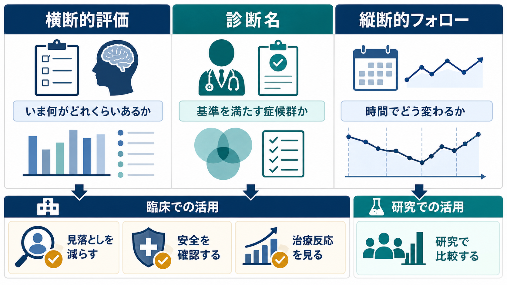

# 精神症状の横断的評価とは何か

## 要点

- 横断的評価とは、「この人は何の診断か」を急いで固定する前に、いま観察できる症状領域、重症度、機能障害、背景要因、安全上のリスクを同じ地図の上に並べる評価である。
- DSM-5 の Level 1 Cross-Cutting Symptom Measure は、抑うつ、不安、躁、精神病症状、睡眠、物質使用、自殺念慮など、診断をまたいで出現する症状を拾い上げるために作られた代表的な枠組みである[1][2]。
- 横断的評価は診断名の代替ではない。[[DSMとICDは何が違うのか|DSMやICD]]による診断、[[鑑別診断とは何か|鑑別診断]]、[[ケースフォーミュレーションとは何か|ケースフォーミュレーション]]を支える前処理である。
- 医療・支援の現場では、リスク評価、初期対応、治療反応の追跡、研究での群間比較をつなぐ共通言語として役立つ。

## この記事で答える問い

1. 「横断的」とは、精神医学評価のどの方向を見ることなのか。
2. 診断名の前に、どのような症状・機能・リスクを整理するのか。
3. 尺度や MSE は、横断的評価の中でどのように位置づくのか。
4. 横断的評価を、診断や治療計画へどう接続するのか。

## まず結論

精神症状の横断的評価は、ある一時点での「症状の断面図」を作る作業である。縦断的評価が「時間の中でどう変わったか」を追うのに対して、横断的評価は「いま、どの領域に、どの程度の症状があり、生活にどれほど影響し、どのリスクがあるか」を整理する。

ここで重要なのは、診断名に飛びつかないことである。たとえば「うつ病」と考えられる人にも、不安、睡眠障害、物質使用、躁的な活動性、精神病症状、自殺念慮が混在することがある。DSM-5 の横断的症状尺度は、こうした診断横断的な症状領域を拾うために導入された[1][2]。ICD-11 CDDR も、診断を臨床的に使いやすくするため、症状だけでなく発達段階、文化、機能、経過を考慮する記述を重視している[4]。

## 背景

精神科診断は、身体医学の一部の検査値のように単一の客観指標で決まるわけではない。面接で語られる主観的苦痛、診察者が観察する行動や感情表出、家族や支援者からの情報、身体疾患・薬剤・物質使用、発達歴、生活史を統合して判断する。

このとき、診断カテゴリだけに注目すると、いくつかの問題が起きる。第一に、同じ診断名でも症状の組み合わせはかなり異なりうる。第二に、不安と抑うつ、物質使用と衝動性、外傷体験と解離のように、診断境界をまたいだ症状が臨床上はしばしば重要になる。第三に、診断基準を満たさない軽度・亜症候性の症状でも、苦痛や機能障害を悪化させることがある[3][7]。

この背景から、[[カテゴリ診断と次元診断は何が違うのか|カテゴリ診断と次元診断]]を補完的に使う発想が重視される。カテゴリ診断は「基準を満たす症候群か」を整理する。横断的評価は「症状とリスクがどの領域にどのくらい分布しているか」を整理する。

## 基本概念

### 横断的評価

横断的評価は、ある評価時点での症状・機能・リスクの分布を、診断名をまたいで確認する方法である。評価対象には、少なくとも次の要素が含まれる。

| 見る領域 | 例 | 関連する既存ノート |
|---|---|---|
| 気分・不安 | 抑うつ、不安、焦燥、易怒性、躁的高揚 | [[不安とは何か]], [[躁状態とは何か]] |
| 精神病症状 | 幻覚、妄想、思考のまとまりにくさ | [[MSEで知覚異常をどう聞くか]], [[MSEで思考内容をどう評価するか]] |
| 認知・意識 | 見当識、記憶、注意、認知機能 | [[MSEで認知機能をどう評価するか]], [[見当識障害とは何か]] |
| 身体・睡眠・食欲 | 不眠、過眠、食欲変化、身体症状 | [[不眠とは何か]], [[食欲と体重変化から何がわかるのか]] |
| 物質・薬剤・身体疾患 | アルコール、薬物、薬剤性、内分泌・神経疾患 | [[薬剤性精神症状とは何か]], [[身体合併症は精神科診療でなぜ重要なのか]] |
| 安全上のリスク | 自殺、自傷、他害、虐待、セルフネグレクト | [[自殺リスク評価では何を聞くべきか]], [[他害リスク評価では何を見るべきか]] |
| 生活機能 | 仕事・学業、家庭、対人関係、セルフケア | [[GAFやWHODASは何を評価するのか]] |

### 縦断的評価との違い

横断的評価は「いまの断面」を見る。縦断的評価は「いつ始まり、どう変化し、何に反応したか」を見る。臨床では両者を分けて考えるが、実際には組み合わせて使う。初診時に横断的評価で全体像をつかみ、再診時に同じ領域を再評価すれば、治療反応や再燃の兆候を比較できる。

### 診断との違い

診断は、症状の組み合わせ、持続期間、除外条件、機能障害、文化的文脈などを総合して、DSM や ICD の基準に照らす作業である[4]。横断的評価は、その材料を偏りなく集める作業であり、診断を自動的に決めるものではない。

## 仕組み

横断的評価は、面接・観察・尺度・リスク評価・記録を組み合わせる。

1. 聴取  
   本人の言葉で、主訴、苦痛、困っている場面、発症時期、悪化・軽快要因を聞く。[[主訴はどのように聞くべきか]]や[[開かれた質問と閉じた質問はどう使い分けるのか]]の技術が基盤になる。

2. 観察  
   [[MSEで外観と行動から何を観察するか|外観と行動]]、話し方、気分と感情、思考過程、思考内容、知覚、認知機能、病識と判断力を観察する。これは主観的苦痛だけでは見えない客観的所見を補う。

3. 尺度  
   DSM-5 Level 1 Cross-Cutting Symptom Measure のような横断的尺度は、診断をまたぐ症状領域を短時間でスクリーニングするために使える。成人版は複数の症状領域を対象とし、必要に応じて領域別の詳細尺度へ進む設計である[1][2]。ただし、尺度は診断面接の代替ではなく、見落としを減らす補助線である。

4. リスク評価  
   自殺念慮、自傷、他害、虐待、急性錯乱、重度のセルフネグレクト、物質離脱、薬物過量服薬などは、診断名より優先して安全確認が必要になる。SAFE-T は、自殺リスクについて危険因子、防御因子、自殺念慮・計画・行動、リスク水準、介入と記録を段階的に整理する枠組みである[5]。

5. 共有と記録  
   評価結果は「抑うつが強い」「危険は低い」といった曖昧な表現だけでなく、症状領域、重症度、根拠、変化の見込み、再評価時期まで記録する。これは[[診療録は精神科でどう書くべきか|診療録]]、[[共同意思決定とは何か|共同意思決定]]、[[クライシスプランとは何か|クライシスプラン]]に接続する。

## 図解

横断的評価は、次の 3 つを混同しないための道具でもある。

- 横断的評価: いま何がどれくらいあるか。
- 診断名: 基準を満たす症候群として整理できるか。
- 縦断的フォロー: 時間と介入によりどう変わるか。

## 臨床・研究との接続

### 臨床での使い道

横断的評価は、初診、病状悪化時、退院前、治療変更前、危機介入の場面で特に重要である。診断名が同じでも、主な苦痛が不眠なのか、不安なのか、幻聴なのか、自殺念慮なのかで、優先すべき対応は変わる。

たとえば、抑うつ気分を訴える人でも、躁的活動性、薬剤性アカシジア、アルコール離脱、甲状腺疾患、せん妄、トラウマ反応が背景にある場合がある。横断的評価は「うつ病かどうか」だけでなく、「いま見逃すと危険な要素は何か」を確認するために使う。

### 研究での使い道

研究では、診断カテゴリだけで対象者を分けると、同じ群の中にかなり異なる症状プロファイルが混ざることがある。RDoC は、診断名ではなく神経行動システムの次元に注目して精神疾患研究を組み立てる枠組みであり、通常から異常まで連続的に変化する機能を測定する考え方を提示している[6]。HiTOP も、症状の共変動に基づいて精神病理を階層的・次元的に整理する試みであり、従来の診断分類における併存、異質性、診断不安定性の問題を補う研究枠組みである[7]。

この意味で、横断的評価は臨床現場のメモにとどまらない。症状次元を揃えて測ることで、治療反応、予後、バイオマーカー、心理社会的要因を比較しやすくする。

## よくある誤解

### 誤解1: 横断的評価をすれば診断は不要になる

不要にはならない。診断名は、治療選択、制度利用、研究参加基準、情報共有で必要になる。横断的評価は、診断をより慎重に行うための材料を整理する。

### 誤解2: 尺度の点数が高ければ、その疾患だと判断できる

尺度はスクリーニングや重症度把握に役立つが、診断を確定するものではない。身体疾患、薬剤、物質使用、文化的背景、発達特性、急性ストレスなどを確認し、面接と観察に戻して解釈する必要がある。

### 誤解3: 横断的評価は初診だけでよい

初診だけでは不十分である。急性期、治療変更後、退院前、生活環境の変化後には、同じ症状領域を再評価することで、改善、悪化、副作用、再発徴候を見つけやすくなる。

### 誤解4: リスク評価は別枠で、症状評価とは独立している

リスク評価は横断的評価の中心に置くべきである。自殺念慮、衝動性、精神病症状、物質使用、不眠、社会的孤立、身体疾患は互いに影響しうる。SAFE-T が示すように、危険因子と防御因子、具体的な念慮・計画・手段、介入とフォローを同時に整理する必要がある[5]。

## 関連ノート

- [[DSMとICDは何が違うのか]]
- [[カテゴリ診断と次元診断は何が違うのか]]
- [[鑑別診断とは何か]]
- [[ケースフォーミュレーションとは何か]]
- [[MSEで外観と行動から何を観察するか]]
- [[MSEで気分と感情をどう区別するか]]
- [[MSEで思考内容をどう評価するか]]
- [[MSEで知覚異常をどう聞くか]]
- [[自殺リスク評価では何を聞くべきか]]
- [[他害リスク評価では何を見るべきか]]
- [[GAFやWHODASは何を評価するのか]]
- [[RDoCは精神疾患研究をどう変えたのか]]

## 理解チェック

1. 横断的評価と縦断的評価は、それぞれ何を見る評価か。
2. 診断名を決める前に、安全上のリスクを確認する必要があるのはなぜか。
3. DSM-5 の横断的症状尺度は、診断面接の代替ではなく何を補助するものか。
4. 同じ「抑うつ」でも、横断的評価で確認すべき併存領域を 3 つ挙げると何か。
5. 研究で診断カテゴリだけでなく症状次元を測る利点は何か。

## 関連ノート候補

- 「精神症状の縦断的評価とは何か」
- 「精神症状の重症度評価とは何か」
- 「精神科初診で評価する領域には何があるか」
- 「精神科尺度は診断とどう違うのか」
- 「診断横断的アプローチとは何か」

## MOC更新候補

- `content/00_MOC/` 配下の精神医学・症候学・診断関連 MOC があれば、本記事を「精神科評価」「症候学」「診断横断的評価」の項目に追加する候補。
- 並列作業との競合を避けるため、このジョブでは MOC 本体は更新しない。

## 未解決問題

- 横断的尺度を日常診療で使う場合、時間負担と臨床的有用性のバランスをどう取るか。
- 自己記入式尺度、臨床家評価、家族・支援者情報の不一致をどう統合するか。
- RDoC や HiTOP のような研究枠組みを、保険診療や地域支援の言語へどの程度翻訳できるか。
- 文化差、発達段階、神経発達特性を、横断的評価の中でどこまで標準化して扱えるか。

## 参考文献

[1] American Psychiatric Association. (2013). *DSM-5 Self-Rated Level 1 Cross-Cutting Symptom Measure-Adult*. https://www.psychiatry.org/File%20Library/Psychiatrists/Practice/DSM/APA_DSM5_Level-1-Measure-Adult.pdf

[2] Narrow, W. E., Clarke, D. E., Kuramoto, S. J., Kraemer, H. C., Kupfer, D. J., Greiner, L., & Regier, D. A. (2013). DSM-5 field trials in the United States and Canada, Part III: Development and reliability testing of a cross-cutting symptom assessment for DSM-5. *American Journal of Psychiatry, 170*(1), 71-82. https://doi.org/10.1176/appi.ajp.2012.12071000

[3] Clarke, D. E., & Kuhl, E. A. (2014). DSM-5 cross-cutting symptom measures: A step towards the future of psychiatric care? *World Psychiatry, 13*(3), 314-316. https://doi.org/10.1002/wps.20154

[4] World Health Organization. (2024). *Clinical descriptions and diagnostic requirements for ICD-11 mental, behavioural and neurodevelopmental disorders*. https://iris.who.int/handle/10665/375767

[5] Substance Abuse and Mental Health Services Administration. (2024). *SAFE-T Suicide Assessment Five-Step Evaluation and Triage*. https://library.samhsa.gov/product/safe-t-suicide-assessment-five-step-evaluation-and-triage/pep24-01-036

[6] National Institute of Mental Health. (n.d.). *About RDoC*. https://www.nimh.nih.gov/research/research-funded-by-nimh/rdoc/about-rdoc

[7] Kotov, R., Krueger, R. F., Watson, D., Achenbach, T. M., Althoff, R. R., Bagby, R. M., Brown, T. A., Carpenter, W. T., Caspi, A., Clark, L. A., Eaton, N. R., Forbes, M. K., Forbush, K. T., Goldberg, D., Hasin, D., Hyman, S. E., Ivanova, M. Y., Lynam, D. R., Markon, K. E., Miller, J. D., Moffitt, T. E., Morey, L. C., Mullins-Sweatt, S. N., Ormel, J., Patrick, C. J., Regier, D. A., Rescorla, L., Ruggero, C. J., Samuel, D. B., Sellbom, M., Simms, L. J., Skodol, A. E., Slade, T., South, S. C., Tackett, J. L., Waldman, I. D., Waszczuk, M. A., Widiger, T. A., Wright, A. G. C., & Zimmerman, M. (2017). The Hierarchical Taxonomy of Psychopathology (HiTOP): A dimensional alternative to traditional nosologies. *Journal of Abnormal Psychology, 126*(4), 454-477. https://doi.org/10.1037/abn0000258
