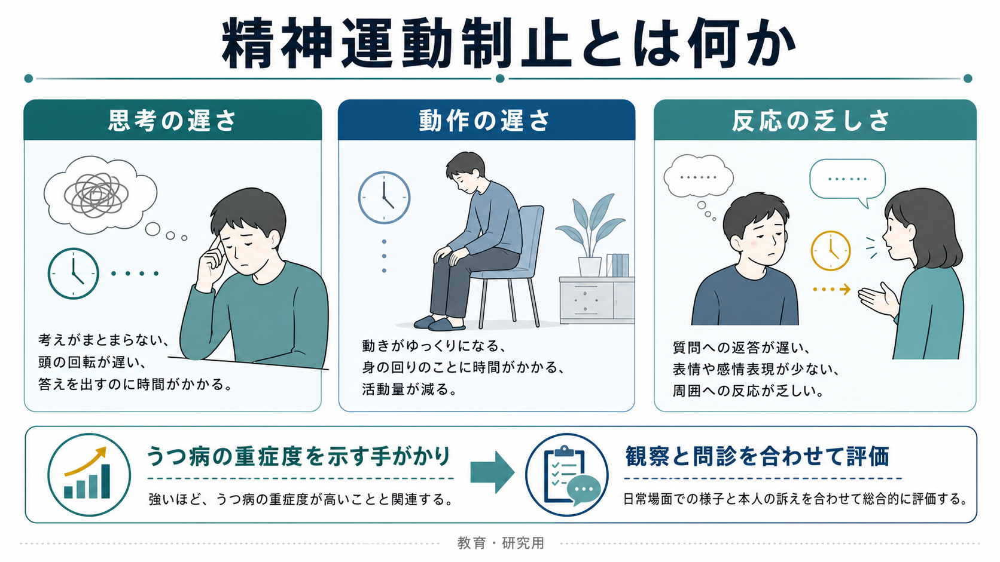
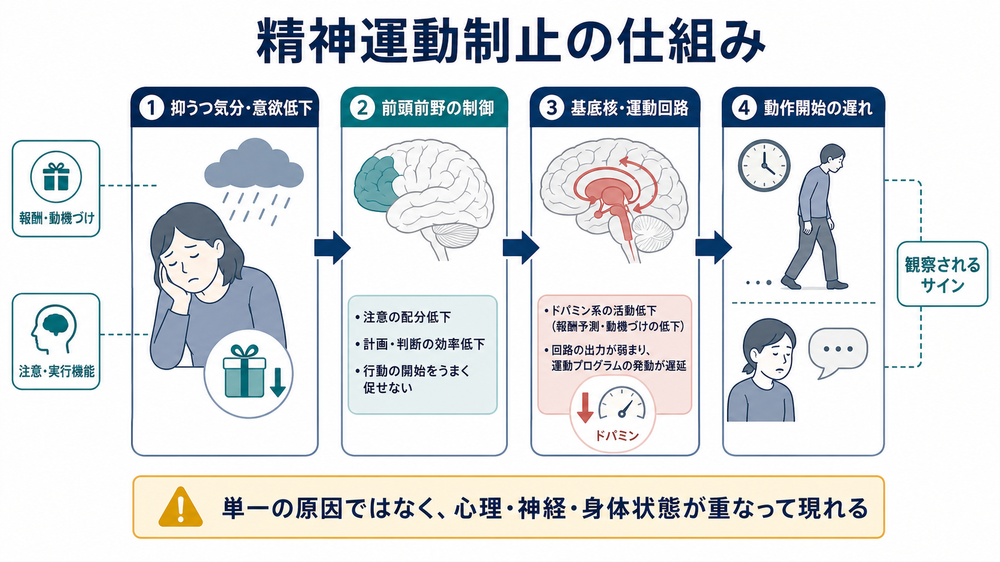
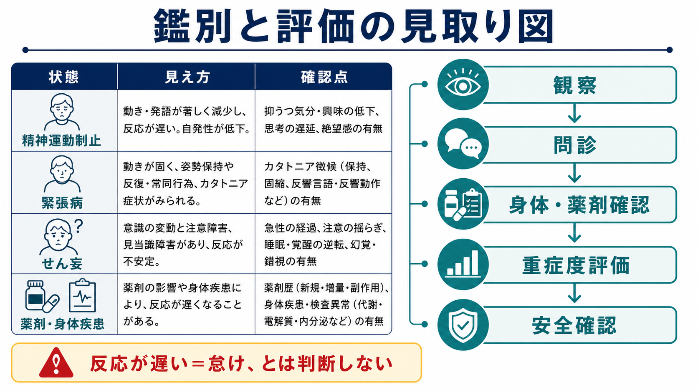

# 精神運動制止とは何か

## 要点

- 精神運動制止とは、考える・話す・動き始める・反応する速度が全体として低下して見える症候である。
- うつ病では、精神運動性の焦燥または制止が診断基準上の症状に含まれ、本人の「遅い気がする」だけでなく、他者から観察できる変化として扱われる [1]。
- 典型的には、発話量の減少、返答までの長い間、声量や抑揚の低下、表情の乏しさ、姿勢や歩行の遅さ、日常動作の開始困難として現れる [2]。
- ただし、反応が遅いことだけでうつ病とは判断できない。[[せん妄とは何か]]、[[意識障害とは何か]]、緊張病、薬剤影響、身体疾患、認知機能低下との鑑別が必要である [4][7]。

## この記事で答える問い

1. 精神運動制止は、単なる「元気のなさ」や「怠け」と何が違うのか。
2. なぜうつ病で、思考・発話・動作が一緒に遅く見えるのか。
3. 臨床では、どのように観察し、何と区別する必要があるのか。

## まず結論

精神運動制止は、うつ病のなかでも「気分が沈む」という主観的苦痛だけではなく、外から見える行動・発話・反応の変化として現れる症候である。診察では[[精神状態診察MSEとは何か]]の一部として、外観、行動、発話、表情、応答潜時、認知機能、生活機能を合わせて評価する。重要なのは、制止を「意志が弱い」「協力的でない」と解釈しないことである。本人の努力不足ではなく、抑うつ、動機づけ、注意、実行機能、身体状態、薬剤、神経回路の状態が重なって見えている可能性がある [2][3]。

## 背景

うつ病は、低い気分や興味・喜びの低下だけで定義されるわけではない。睡眠、食欲、疲労感、罪責感、集中困難、自殺念慮、そして精神運動性の変化が、一定期間まとまって生活機能を損なうときに臨床的な意味をもつ [1][8]。NIMHも、うつ病では疲労、エネルギー低下、思考・集中・意思決定の困難、引きこもりなどが一緒に起こりうると説明している [4]。

精神運動制止が重要なのは、本人が「つらい」と言語化できない場面でも、観察可能なサインとして現れるからである。たとえば、質問に答えるまでに時間がかかる、ほとんど視線が動かない、声が小さく単調になる、椅子から立ち上がるまでが遅い、身だしなみや食事の開始が難しい、といった変化が手がかりになる。これは[[症状と徴候は何が違うのか]]でいう「徴候」と「症状」の境界にまたがる現象であり、本人の主観と観察者の所見を分けて記録する必要がある。

## 基本概念

精神運動制止は、英語では psychomotor retardation と呼ばれる。ここでいう psychomotor は、「心」と「運動」が別々に変化するという意味ではない。思考、注意、意思決定、動機づけ、発話、姿勢、歩行、反応が、まとまりをもって遅くなるという臨床的な見え方を指す。

うつ病の診断基準では、精神運動性の焦燥または制止は、ほぼ毎日みられ、他者から観察可能な変化として扱われる [1]。この点は実務上とても大きい。本人が「頭が回らない」「体が重い」と訴えるだけではなく、面接室での発話、姿勢、表情、視線、動作開始、返答の間を観察する必要がある。観察項目としては、[[MSEで外観と行動から何を観察するか]]、[[MSEで話し方から何がわかるのか]]、[[MSEで認知機能をどう評価するか]]と接続して考えると整理しやすい。

代表的な観察点は次の通りである。

| 領域 | 見え方 | 記録の例 |
|---|---|---|
| 発話 | 小声、単調、返答が短い、返答までが長い | 「質問後、数秒から十数秒の沈黙を置いて短く返答」 |
| 表情・視線 | 表情変化が少ない、視線が合いにくい | 「表情は乏しく、視線は下方に固定されがち」 |
| 動作 | 歩行や立ち上がりが遅い、身振りが少ない | 「入室・着席・退室の動作に時間を要する」 |
| 認知・意思決定 | 考えがまとまらない、選べない | 「質問理解は保たれるが、回答形成に時間を要する」 |
| 生活機能 | 食事、整容、服薬、連絡などの開始が難しい | 「必要性は理解しているが開始できない」 |

## 仕組み

精神運動制止の仕組みは、単一の原因では説明できない。レビューでは、運動機能だけでなく、認知機能、発話、動機づけ、報酬処理、神経内分泌、前頭前野・基底核系など複数の要素が関わると整理されている [2][3]。

うつ病では、まず「やりたい」「始めよう」とする動機づけが低下しやすい。次に、注意や[[実行機能障害とは何か]]に近い計画・選択・開始の困難が重なる。さらに、前頭前野と基底核を含む運動・報酬関連回路の活動変化が、動作開始の遅れや発話の乏しさとして現れる可能性がある [2][3]。このため、制止は「筋力がない」だけでも、「考えがない」だけでもなく、行動を開始し維持する仕組み全体の低下として見るほうがよい。

ただし、神経回路の説明は、個々の患者をその場で機械的に診断するためのものではない。実際の臨床では、睡眠不足、低栄養、疼痛、甲状腺機能低下、パーキンソン症状、抗精神病薬・鎮静薬・抗不安薬などの影響、物質使用、急性身体疾患も、精神運動制止に似た見え方を作る。したがって、[[器質性精神障害を見逃さないためには何を見るべきか]]と同じく、精神症状と身体・薬剤・生活背景を分けずに評価する必要がある [4][8]。

## 図解

精神運動制止は、次の三層で理解すると扱いやすい。

| 層 | 内容 | 見落としやすい点 |
|---|---|---|
| 見える層 | 動作、発話、表情、反応が遅い | 「怠け」「拒否」と誤解されやすい |
| 心理・認知の層 | 意欲低下、注意低下、決断困難、思考制止 | 本人は努力しているが開始できないことがある |
| 背景要因の層 | うつ病、メランコリー性、精神病性うつ病、緊張病、薬剤、身体疾患 | うつ病だけに固定すると危険 |

## 臨床・研究との接続

臨床では、精神運動制止はうつ病の重症度を考えるうえで重要である。NICEは、うつ病の重症度を症状数だけでなく、症状の強さ、持続期間、個人・社会生活への影響の組み合わせとして捉える [8]。精神運動制止が強い場合、食事、整容、服薬、受診、連絡、安全確保などの生活機能が落ちやすいため、[[精神科で生活機能をどう評価するか]]や[[精神科で重症度をどう判断するか]]とつなげて見る必要がある。

研究では、精神運動制止はメランコリー性うつ病や精神病性うつ病との関連で検討されてきた。CORE尺度は、観察可能な精神運動障害を評価する代表的な臨床家評価尺度であり、非相互性、制止、焦燥などの下位領域を扱う [5][6]。精神病性うつ病の研究では、COREの制止・非相互性項目がまとまった因子として示されており、単なる主観的抑うつとは異なる観察可能な行動次元として扱える可能性が示されている [6]。

一方で、精神運動制止は「メランコリー性うつ病に必ずある」とは言い切れない。メランコリーの診断基準を満たしても、観察可能な精神運動障害が弱い例があり、逆に精神病性うつ病では強く出ることがある [5]。したがって、制止は診断名を一発で決める印ではなく、病型、重症度、機能障害、鑑別、安全性を考えるための臨床情報である。

## よくある誤解

### 「動かないなら、やる気がないだけである」

これは危険な誤解である。精神運動制止では、本人は必要性を理解していても、考えをまとめる、選ぶ、立ち上がる、話し始める、連絡するという開始過程が著しく遅れることがある [2][3]。評価では、非難ではなく、どの行動がどの程度始められないのかを具体的に見る。

### 「反応が遅いなら、すべてうつ病で説明できる」

これも不十分である。[[せん妄とは何か]]では注意と意識の変動、[[意識障害とは何か]]では覚醒水準、薬剤影響では服薬変更や鎮静、身体疾患では発熱・脱水・内分泌異常などが問題になる。緊張病では、無言、姿勢保持、拒絶、蝋屈症、反響言語、反響動作など、うつ病性の制止とは異なる精神運動症候が前景化する [7]。

### 「精神運動制止は、質問紙だけで十分に評価できる」

質問紙は有用だが、精神運動制止の中心は観察可能な変化である。本人の訴え、家族や支援者からの情報、面接中の発話・行動、生活機能、身体所見、薬剤歴を合わせる必要がある。[[注意障害とは何か]]や認知機能評価と同じく、主観的な困りごとと観察所見を混ぜずに記録することが重要である。

## 関連ノート

- [[精神症候学とは何か]]
- [[症状と徴候は何が違うのか]]
- [[精神状態診察MSEとは何か]]
- [[MSEで外観と行動から何を観察するか]]
- [[MSEで話し方から何がわかるのか]]
- [[MSEで認知機能をどう評価するか]]
- [[せん妄とは何か]]
- [[意識障害とは何か]]
- [[注意障害とは何か]]
- [[実行機能障害とは何か]]
- [[器質性精神障害を見逃さないためには何を見るべきか]]
- [[精神科で重症度をどう判断するか]]

## MOC更新候補

- `content/00_MOC/` 配下の精神医学・症候学関連MOCに、この記事 `[[精神運動制止とは何か]]` を追加する候補。
- 並列ジョブとの衝突を避けるため、この作業ではMOC本体は更新していない。

## 理解チェック

1. 精神運動制止が「本人の主観だけ」ではなく「観察可能な変化」として重視されるのはなぜか。
2. うつ病性の精神運動制止と、せん妄・意識障害・緊張病・薬剤影響を区別するために、どの情報を確認する必要があるか。
3. 「反応が遅い＝怠け」と判断すると、臨床的にどのような問題が起こるか。
4. 精神運動制止を生活機能の評価に結びつけるなら、食事・整容・服薬・安全確認のどこを観察するか。

## 未解決問題

- 精神運動制止の神経機序は、前頭前野・基底核・報酬系・内分泌・炎症など複数の要素が提案されているが、個々の患者の臨床評価に直接使える単一バイオマーカーは確立していない。
- 観察尺度、発話解析、反応時間、運動計測、ウェアラブル指標をどのように組み合わせると、臨床的に意味のある評価になるかは研究途上である。
- 文化、年齢、身体疾患、薬剤、面接状況によって「遅く見える」基準が変わるため、標準化と個別文脈の両立が課題である。

## 参考文献

[1] Endotext. Table 1, DSM-5 “Major” Depressive Episode. NCBI Bookshelf. https://www.ncbi.nlm.nih.gov/books/NBK498652/table/depress-diab.T.dsm5__major_depressive_ep/

[2] Buyukdura JS, McClintock SM, Croarkin PE. Psychomotor retardation in depression: biological underpinnings, measurement, and treatment. *Progress in Neuro-Psychopharmacology & Biological Psychiatry*. 2011;35(2):395-409. https://doi.org/10.1016/j.pnpbp.2010.10.019

[3] Bennabi D, Vandel P, Papaxanthis C, Pozzo T, Haffen E. Psychomotor retardation in depression: a systematic review of diagnostic, pathophysiologic, and therapeutic implications. *BioMed Research International*. 2013;2013:158746. https://doi.org/10.1155/2013/158746

[4] National Institute of Mental Health. Depression. https://www.nimh.nih.gov/health/publications/depression

[5] Parker G, Hadzi-Pavlovic D, Boyce P, et al. Defining melancholia: properties of a refined sign-based measure. *British Journal of Psychiatry*. 1994;164(3):316-326. https://doi.org/10.1192/bjp.164.3.316

[6] Bingham KS, Neufeld NH, Alexopoulos GS, et al. Factor analysis of the CORE measure of psychomotor disturbance in psychotic depression: Findings from the STOP-PD II study. *Psychiatry Research*. 2022;314:114648. https://doi.org/10.1016/j.psychres.2022.114648

[7] Rasmussen SA, Mazurek MF, Rosebush PI. Catatonia: Our current understanding of its diagnosis, treatment and pathophysiology. *World Journal of Psychiatry*. 2016;6(4):391-398. https://doi.org/10.5498/wjp.v6.i4.391

[8] National Institute for Health and Care Excellence. Depression in adults: treatment and management. NICE guideline NG222. 2022. https://www.nice.org.uk/guidance/ng222/chapter/Recommendations
