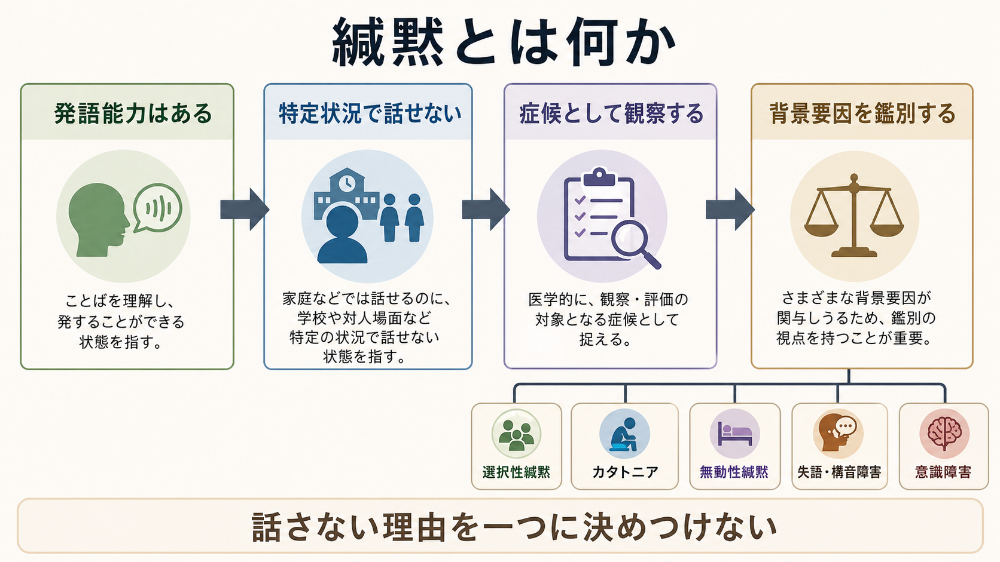
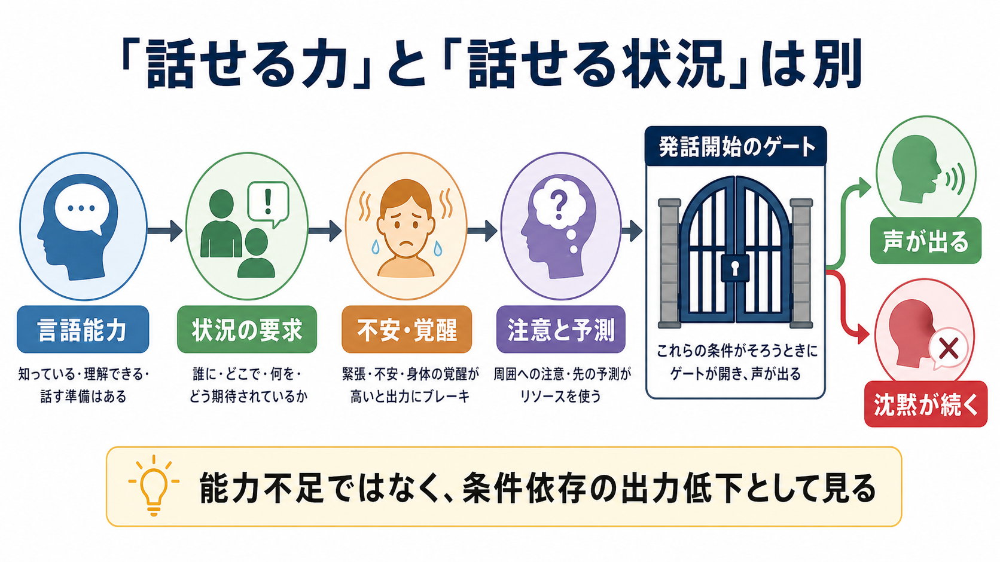
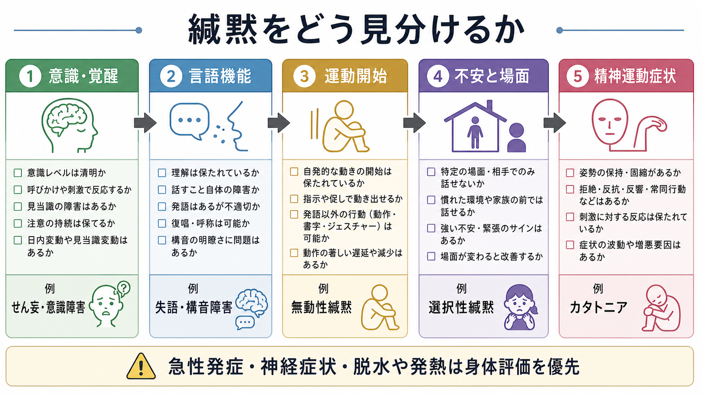

# 緘黙とは何か

## 要点

- 緘黙とは、発語能力が全般的に失われているとは限らないのに、特定の場面または広い場面で発話が著しく減る状態である。
- 「話さない」は、拒否、怠慢、性格だけでは説明できない。[[不安とは何か]]、[[意識障害とは何か]]、[[失語とは何か]]、運動開始の障害、カタトニアなどを分けて見る必要がある。
- 選択性緘黙は、話せる場面と話せない場面が分かれる不安症として整理される。DSM-5-TRでは、特定の社会的状況で一貫して話せず、教育・社会的機能に支障をきたし、1か月以上持続し、言語知識不足やコミュニケーション障害だけでは説明できないことが重視される[1]。
- 急性発症、意識変容、発熱・脱水、神経局在症状、摂食・飲水低下、筋強剛や自律神経症状を伴う緘黙では、精神症状だけでなく身体疾患・神経疾患を先に評価する。
- 本稿は教育・研究目的の整理であり、個別の診断や治療指示ではない。

## この記事で答える問い

1. 緘黙は「話せない」のか、「話さない」のか。
2. 選択性緘黙、カタトニア、無動性緘黙、失語、意識障害はどう違うのか。
3. 臨床面接や研究では、緘黙をどのような観察単位として扱うとよいのか。

## まず結論

緘黙は、単一の診断名というより「発話が期待される状況で発話が著しく乏しい」という症候である。したがって最初に問うべきことは、「本人が意図的に話していないのか」ではなく、発話を成立させるどの条件が詰まっているのかである。

発話には、少なくとも言語理解、語の検索、音声・構音運動、発話開始、注意・覚醒、社会的安全感が必要である。選択性緘黙では、家庭などでは話せる一方、学校や見知らぬ相手の前では不安・回避・凍りつきが発話を止める。カタトニアでは、緘黙は昏迷、拒絶、姿勢保持、常同、反響症状などと並ぶ精神運動症状の一部になりうる[2]。無動性緘黙では、覚醒や基本的な運動能力が残っていても、自発的な発話と行動の開始が極端に低下する[3]。失語では言語ネットワークの障害により、理解、呼称、復唱、流暢性、読み書きのいずれかが障害される[4]。

## 背景

日常語では「黙っている」という表現が、沈黙、無口、拒否、緊張、怒り、恥ずかしさをまとめて指す。しかし症候学では、このまとめ方は危険である。発話がない同じ外観でも、背景には[[回避行動とは何か]]、[[精神運動制止とは何か]]、[[認知機能障害とは何か]]、[[せん妄とは何か]]、神経局在病変などが隠れていることがある。

選択性緘黙は、歴史的には「elective mutism」と呼ばれ、あたかも本人が選んで話さないように理解されやすかった。しかし現在は、不安に基づく条件依存的な発話困難として整理される。ASHAは「selective」という語について、本人が自由に場所を選んで話さないという意味ではなく、話せる状況が限られることを表すと説明している[1]。この理解は、本人を責める見方から、場面・要求・不安・支援環境を評価する見方への転換である。

## 基本概念

### 緘黙は症候であり、原因名ではない

緘黙を見たときは、まず次の軸で分ける。

| 評価軸 | 観察すること | 主な鑑別 |
|---|---|---|
| 場面依存性 | 家庭では話せるか、特定の人・場所・活動で止まるか | 選択性緘黙、社会不安、文化・言語環境 |
| 意識・覚醒 | 見当識、注意、日内変動、発熱、脱水、薬物影響 | [[意識障害とは何か]]、[[せん妄とは何か]] |
| 言語機能 | 理解、呼称、復唱、流暢性、読み書き | [[失語とは何か]]、構音障害、聴覚障害 |
| 運動開始 | 覚醒はあるが自発的行動が乏しいか | 無動性緘黙、前頭葉・帯状回・基底核病変 |
| 精神運動症状 | 昏迷、拒絶、姿勢保持、反響、常同、筋強剛 | カタトニア、重症うつ、薬剤性症候群 |

この表は診断を一発で決めるためのものではなく、観察を粗く分けるための地図である。特に医療場面では、急性発症の緘黙を「心理的」と決めつける前に、身体疾患、神経疾患、薬物・物質、代謝異常を確認する。

### 選択性緘黙

選択性緘黙では、話せる能力があるにもかかわらず、学校など発話が期待される特定状況で一貫して話せない。ASHAの整理では、発症はしばしば3-6歳、診断は就学後に気づかれることが多く、家庭では話せるのに学校・地域・見知らぬ相手の前では話せないという形を取りやすい[1]。有病率推定は研究によってばらつくが、多くは0.2-1.6%程度とされる[1]。

重要なのは、選択性緘黙が「話し方の好み」ではなく、教育、社会的交流、評価場面への参加を妨げうることである。評価では、言語能力、聴覚、発達歴、多言語環境、学校での要求、非言語的コミュニケーション、家族・教師からの情報を統合する[1][5]。

### カタトニアに伴う緘黙

カタトニアでは、緘黙は精神運動症状の一部として現れる。BAPのコンセンサスガイドラインは、カタトニアを運動、発話、複雑行動、自律神経、感情の徴候を含む重篤な神経精神症候群として扱い、診断には複数のカタトニア徴候を観察する必要があると整理している[2]。緘黙だけでカタトニアとは言えないが、昏迷、姿勢保持、ろう屈、拒絶、反響言語、反響動作、常同、興奮、発熱・自律神経不安定などを伴う場合は重要な鑑別になる。

### 無動性緘黙

無動性緘黙では、目は開いていて覚醒しているように見えることがあるが、自発的な発話と行動の開始が著しく低下する。前頭葉内側部、前部帯状回、視床、基底核、脳幹など、行動開始と動機づけに関わる回路の障害で説明されることがある[3][6]。この場合、本人が「拒否している」のではなく、発話を開始する神経行動システムが動きにくいと考える。

### 失語・構音障害・聴覚障害との違い

[[失語とは何か]]は、言語そのものの理解・表出・復唱・呼称・読み書きの障害である。NIDCDは、失語を言語を理解し表現する能力の障害として説明し、脳卒中などの脳損傷後に生じやすいとする[4]。したがって、発話が少ない人に対しては、簡単な命令理解、物品呼称、復唱、読字、書字、身振りでの応答を分けて見る必要がある。

緘黙では、状況が変わると発話が出ることがある。失語では、場面が安心できるかどうかだけでは言語課題の障害が十分に説明できない。構音障害では、言語内容よりも発声・構音・嚥下・口腔運動の問題が前景に出る。聴覚障害では、入力の問題が発話発達や応答性に影響する。

## 仕組み

緘黙を理解するには、「発語能力」と「発語が実際に出力される条件」を分けるとよい。

発話は、単に言語知識があれば自動的に出るものではない。話す相手、失敗したときの評価予測、身体の覚醒、視線、場所、声量、順番待ち、教師や面接者の問い方によって、発話開始のハードルは大きく変わる。選択性緘黙では、こうした条件が特定状況で発話を止める。ASHAは、子どもが不快なコミュニケーション要求を避けることで自分を守ろうとし、その行動が反抗的・失礼と誤解されることがあると述べている[1]。

一方、カタトニアや無動性緘黙では、場面不安だけでなく、運動開始、精神運動調整、覚醒、前頭皮質-皮質下回路の問題が前景に出る。MegaとCohenourは、無動性緘黙を前部帯状回から皮質下回路への連結障害として説明しうることを示した[6]。これは、緘黙を「心因か器質か」という二分法だけで見ないために重要である。

## 図解

緘黙を観察したら、次の順で考えると混乱しにくい。

1. 意識・覚醒が保たれているか。変動、発熱、脱水、薬剤、物質、頭部外傷がないか。
2. 言語理解と非言語応答が保たれているか。命令理解、指差し、書字、身振りで確認する。
3. 音声・構音・嚥下・口腔運動に問題がないか。
4. 場面、相手、活動、評価要求で発話が変わるか。
5. 昏迷、拒絶、姿勢保持、常同、反響症状、筋強剛、自律神経症状を伴うか。
6. 発話だけでなく、食事、水分摂取、移動、セルフケア、学業・社会参加がどの程度妨げられているか。

## 臨床・研究との接続

### 臨床評価での接続

臨床では、緘黙を「本人が話さない」と要約する前に、本人・家族・学校・支援者から複数場面の情報を集める。選択性緘黙では、家庭での発話、学校での非言語応答、特定の教師や同級生との違い、発表・音読・挨拶など活動ごとの違いが手がかりになる。ASHAは、評価に親・教師の報告、観察、聴覚スクリーニング、言語・コミュニケーション評価を含めることを勧めている[1]。

カタトニアが疑われる場合は、緘黙だけでなく全身の運動徴候を観察する。BAPガイドラインは、カタトニアの評価では病歴、身体診察、必要な検査、基礎疾患の探索が重要であり、診断は単一検査ではなく臨床観察と総合評価に基づくと述べている[2]。これは[[症状と徴候は何が違うのか]]で扱う、主観的訴えと観察可能な徴候を分ける発想にもつながる。

### 研究での接続

研究では、緘黙を「発話量」だけで測ると不十分である。観察者、場所、課題、相手の親密度、発話の自発性、非言語応答、身体的凍りつき、主観的不安を分ける必要がある。選択性緘黙の長期追跡研究では、学校ベースの認知行動療法後に発話が改善しうる一方、年齢が高いことや重症度が予後に影響する可能性が示されている[7]。ただし研究はサンプルが小さく、文化・言語環境、併存症、評価方法の違いが大きい。

### 支援との接続

本稿は治療指示ではないが、症候学的には「話させる圧力」よりも「発話が出やすい条件を細かく設計する」発想が重要である。選択性緘黙では、不安の少ない相手・場所・課題から段階的に広げる介入、家庭と学校の連携、言語聴覚士・心理職・教師の協働がしばしば必要になる[1][5]。カタトニアや急性神経症状が疑われる場合は、心理教育的対応より先に医学的評価を優先する。

## よくある誤解

### 「本人が頑固だから話さない」

この見方は、緘黙を意志の問題に狭めすぎる。選択性緘黙では、本人が安心できる状況では話せることがあり、話せない状況では強い不安、凍りつき、回避が関わる[1][5]。カタトニアや無動性緘黙では、意志だけで説明できない精神運動・神経行動の障害が関わる[2][3]。

### 「家庭で話せるなら問題はない」

家庭で話せることは重要な情報だが、学校・医療面接・地域場面で話せないことが教育、社会参加、安全確認を妨げるなら臨床的に意味がある。話せる場面があることは、問題の不存在ではなく、条件依存性を示す手がかりである。

### 「緘黙はすべて選択性緘黙である」

緘黙には、選択性緘黙以外にもカタトニア、重症うつ、解離、失語、意識障害、無動性緘黙、聴覚・構音障害、薬物・物質、身体疾患が関わる。特に急性発症や神経症状を伴う場合は、選択性緘黙という発達・不安症の枠だけで見ない。

### 「話さない人には質問を増やせばよい」

質問を増やすと、評価される感覚や失敗予測が強まり、かえって発話が止まることがある。観察、非言語応答、書字、選択肢、慣れた相手からの情報など、発話以外のルートを使って評価する。

## 関連ノート

- [[精神症候学とは何か]]
- [[症状と徴候は何が違うのか]]
- [[不安とは何か]]
- [[回避行動とは何か]]
- [[恐怖とは何か]]
- [[精神運動制止とは何か]]
- [[意識障害とは何か]]
- [[せん妄とは何か]]
- [[失語とは何か]]
- [[解離とは何か]]
- [[認知機能障害とは何か]]
- [[注意障害とは何か]]

### 関連ノート候補

- 選択性緘黙とは何か
- カタトニアとは何か
- 無動性緘黙とは何か
- 構音障害とは何か
- 社会不安症とは何か
- 発話開始とは何か

### MOC更新候補

- `content/00_MOC/` 配下の精神医学・症候学関連MOCに `[[緘黙とは何か]]` を追加する候補。
- 並列ジョブとの衝突を避けるため、本タスクではMOC本体は更新しない。

## 理解チェック

1. 選択性緘黙で「選択性」と呼ばれるのは、本人が自由に話す場面を選んでいるという意味ではない。では何を指すか。
2. 緘黙と失語を分けるために、発話以外で確認できる言語機能は何か。
3. カタトニアに伴う緘黙では、緘黙以外にどのような精神運動徴候を探すべきか。
4. 急性発症の緘黙で、身体・神経学的評価を優先すべきサインは何か。
5. 「家庭では話すが学校では話さない」という情報は、問題がない証拠ではなく、どのような評価軸を示す情報か。

## 参考文献

[1] American Speech-Language-Hearing Association. *Selective Mutism*. ASHA Practice Portal. https://www.asha.org/practice-portal/clinical-topics/selective-mutism/

[2] Rogers, J. P., Oldham, M. A., Fricchione, G., et al. (2023). Evidence-based consensus guidelines for the management of catatonia: Recommendations from the British Association for Psychopharmacology. *Journal of Psychopharmacology, 37*(4), 327-369. https://doi.org/10.1177/02698811231158232

[3] Ramakrishnan, S., & De Jesus, O. (2023). *Akinesia*. StatPearls, NCBI Bookshelf. https://www.ncbi.nlm.nih.gov/sites/books/NBK562177/

[4] National Institute on Deafness and Other Communication Disorders. (2025). *Aphasia*. NIH/NIDCD. https://www.nidcd.nih.gov/health/aphasia

[5] Wong, P. (2010). Selective mutism: A review of etiology, comorbidities, and treatment. *Psychiatry (Edgmont), 7*(3), 23-31. https://pmc.ncbi.nlm.nih.gov/articles/PMC2861522/

[6] Mega, M. S., & Cohenour, R. C. (1997). Akinetic mutism: Disconnection of frontal-subcortical circuits. *Neuropsychiatry, Neuropsychology, and Behavioral Neurology, 10*(4), 254-259. https://pubmed.ncbi.nlm.nih.gov/9359123/

[7] Oerbeck, B., Overgaard, K. R., Stein, M. B., Pripp, A. H., & Kristensen, H. (2018). Treatment of selective mutism: A 5-year follow-up study. *European Child & Adolescent Psychiatry, 27*, 997-1009. https://pmc.ncbi.nlm.nih.gov/articles/PMC6060963/

[8] World Health Organization. (2024). *Clinical descriptions and diagnostic requirements for ICD-11 mental, behavioural and neurodevelopmental disorders*. WHO. https://iris.who.int/handle/10665/375767

## 未解決問題

- 選択性緘黙の長期予後を、社会不安、発達特性、多言語環境、学校環境を分けて予測するモデルはまだ十分ではない。
- 緘黙における「凍りつき」と発話開始困難を、主観的不安、身体反応、運動開始、社会的文脈のどの組み合わせとして測るべきかは研究課題である。
- カタトニア、無動性緘黙、重症うつ、解離、神経疾患が重なる症例で、どの評価手順が最も誤診を減らすかはさらに検証が必要である。
