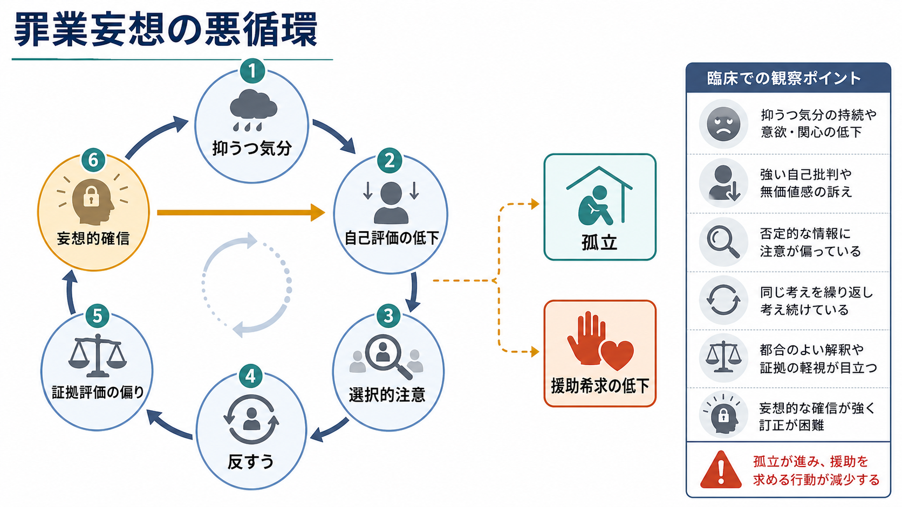
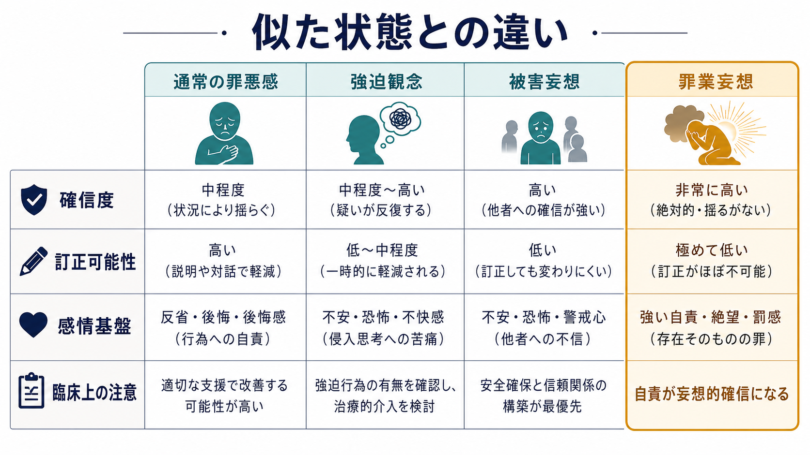
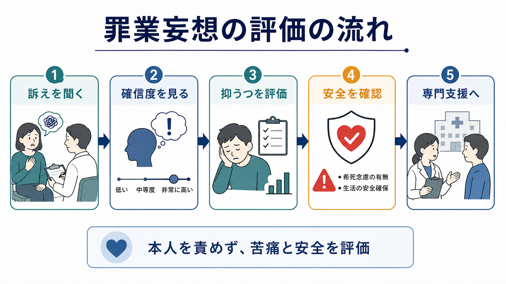

# 罪業妄想とは何か

## 要点

- 罪業妄想とは、自分が重大な罪を犯した、他者や社会に取り返しのつかない害を与えた、罰を受けるべきだと強く確信する妄想である。
- 単なる後悔や罪悪感ではなく、根拠が乏しい、反証で修正されにくい、生活や安全に影響するほど確信される点が重要である[1]。
- 典型的には重い[[抑うつ気分とは何か|抑うつ]]や精神病症状を伴ううつ病でみられ、気分に一致した精神病症状として理解されることが多い[2][3]。
- 臨床では内容の真偽をその場で論破するより、確信度、苦痛、抑うつの重症度、[[希死念慮とは何か|希死念慮]]、自傷・自殺リスク、身体疾患・物質・他の精神病性障害との鑑別を評価する。
- 本記事は教育・研究目的の整理であり、個別の診断や治療指示ではない。差し迫った危険がある場合は地域の救急・危機介入資源につなぐ必要がある。

## この記事で答える問い

1. 罪業妄想は、通常の罪悪感や反省と何が違うのか。
2. なぜ抑うつ状態で「自分は許されない」という確信が強まるのか。
3. [[強迫観念とは何か|強迫観念]]、[[被害妄想とは何か|被害妄想]]、通常の罪悪感とどう区別するのか。
4. 臨床・研究ではどのような点を安全に評価するのか。

## まず結論

罪業妄想は「罪悪感が強い」だけではない。中心にあるのは、抑うつ的な気分と自己評価の低下を背景に、過去の些細な出来事や曖昧な記憶が「重大な罪の証拠」として解釈され、反証や説明を受けても揺らぎにくい確信へ固定されることである。DSM-5-TR でも大うつ病エピソードの症状には、単なる自己非難ではなく「過剰または不適切な罪責感、場合によっては妄想的な罪責感」が含まれる[1]。NICE の精神病性うつ病レビューも、うつ病に伴う精神病症状として、虚無的妄想、罪業妄想、不全感や疾病に関する妄想、非難的な幻聴を挙げている[3]。

## 背景

罪業妄想は、古典的にはメランコリーや重症うつ病の文脈で記載されてきた。たとえば「自分のせいで家族が不幸になる」「昔の小さな失敗が犯罪だった」「生きているだけで周囲に害を与えている」「罰を受けなければならない」といった内容をとることがある。内容は文化・宗教・道徳観・対人関係に影響されるが、症候学的には「罪」「責任」「罰」「救済不能性」が、抑うつ気分と強く結びつく。

重要なのは、罪業妄想を診断名としてではなく、思考内容の症候として扱うことである。精神病性うつ病、双極性障害の抑うつエピソード、統合失調症スペクトラム、認知症やせん妄、薬物・身体疾患の影響など、複数の病態で罪責的な妄想内容が現れる可能性がある。したがって、罪業妄想というラベルだけで疾患を決めるのではなく、気分症状、経過、知覚異常、思考過程、認知機能、身体状態を合わせてみる必要がある[2][3]。

## 基本概念

### 妄想としての特徴

[[妄想とは何か|妄想]]は、反証があっても容易に修正されない固定的な信念として扱われる[1]。罪業妄想では、その信念の主題が「自分の罪」「自分の責任」「自分への罰」に向かう。本人にとっては単なる思いつきではなく、道徳的・存在的な確信として体験される。

評価では、次の軸を分けると理解しやすい。

| 軸 | 見る点 |
|---|---|
| 内容 | 何を罪だと考えているか。実際の出来事、記憶、想像、宗教的・道徳的意味づけのどれが中心か |
| 確信度 | 「もしかしたら」なのか、「絶対にそうだ」なのか |
| 訂正可能性 | 説明、証拠、周囲の保証でどの程度揺らぐか |
| 苦痛 | 恐怖、絶望、恥、罰への期待、救済不能感の強さ |
| 行動 | 謝罪の反復、確認、回避、出頭、拒食、自傷、援助拒否などがあるか |
| 安全 | 希死念慮、自殺企図、自傷、セルフネグレクト、入院や保護の必要性 |

### 通常の罪悪感との違い

通常の罪悪感は、出来事と感情の対応が比較的理解しやすく、時間経過や対話、償い、状況改善によって軽くなることがある。罪業妄想では、出来事の重大性が極端に拡大され、反証が「自分を安心させるための嘘」「まだ発覚していないだけ」と解釈されることがある。つまり問題は「罪悪感の量」だけでなく、根拠の扱い方、確信の硬さ、抑うつと絶望の結びつきにある。

## 仕組み

罪業妄想の形成は、単一原因ではなく、複数の過程が重なって説明される。

第一に、抑うつ気分は自己評価を下げ、過去の失敗や曖昧な記憶を否定的に検索しやすくする。[[認知バイアスとは何か|認知バイアス]]の観点では、都合の悪い情報だけが注意を引き、肯定的な証拠や周囲の説明が十分に統合されにくくなる。

第二に、反すうが確信を強める。同じ問いを何度も考え続けると、「考え続けていること」自体が重大性の証拠のように感じられる。罪業妄想では、「自分は本当に悪いことをしたのではないか」という問いが、「やはり自分は取り返しのつかない罪を犯した」という結論へ固定化しやすい。

第三に、精神病性うつ病では、妄想内容が気分と一致することが多い。抑うつの中心が無価値感、罪責感、絶望であるほど、妄想も「自分には価値がない」「罰されるべきだ」「助からない」という方向へ組織化されやすい[3][4]。これは、本人が道徳的に弱いという意味ではなく、気分・認知・確信形成が一体化している状態として理解する方が臨床的に有用である。

## 図解

| 観点 | 臨床での意味 |
|---|---|
| 抑うつ気分 | 罪責感が気分全体に飲み込まれていないかを見る |
| 自己評価の低下 | 「自分は悪い」「存在してはいけない」という全体化を確認する |
| 選択的注意 | 否定的な記憶・証拠だけが集められていないかを見る |
| 反すう | 同じ自責的思考が止まらず、生活を占有していないかを見る |
| 妄想的確信 | 反証で修正されにくい確信になっていないかを見る |
| 安全評価 | 希死念慮、自傷、自殺企図、援助拒否、セルフネグレクトを確認する |

## 臨床・研究との接続

精神病性うつ病は、非精神病性うつ病より重症で、心理社会的機能障害が大きく、入院治療を要することが多いとされる[3]。また、精神病性うつ病と自殺企図の関連を検討したシステマティックレビュー・メタ分析では、精神病性うつ病が自殺企図リスクの高さと関連することが報告されている[6]。したがって、罪業妄想が疑われる場合は、単に「考えすぎ」と扱わず、抑うつの重症度と安全性を丁寧に評価する必要がある。

治療について、本記事は個別方針を示さない。ただしエビデンスの整理として、NICE はうつ病に精神病症状がある場合、専門的精神保健サービスへの紹介、リスク評価、ニーズ評価、多職種ケア、急性の精神病症状改善後の心理的治療へのアクセスを推奨している[5]。薬物療法では抗うつ薬と抗精神病薬の併用を検討することがあり、Cochrane レビューや専門的レビューでも、精神病性うつ病の急性期治療では併用療法や ECT が重要な選択肢として扱われる[4][7]。

研究面では、罪業妄想は「妄想の内容」と「気分状態」の交点にある。[[MSEで思考内容をどう評価するか|MSEでの思考内容評価]]では、内容を記録するだけでなく、確信度、訂正可能性、感情負荷、行動化、安全リスクまで観察する必要がある。加えて、うつ病の認知モデル、反すう、自己関連処理、予測誤差処理、[[妄想は予測誤差処理の異常として説明できるのか|妄想の計算論的モデル]]と接続して研究できる主題でもある。

## よくある誤解

### 「罪悪感が強ければ罪業妄想である」

誤りである。強い罪悪感があっても、現実的な根拠、訂正可能性、出来事との釣り合い、生活機能への影響を合わせて判断する必要がある。罪業妄想では、根拠に比して確信が強く、反証で揺らぎにくく、抑うつや絶望と結びつく。

### 「本人の道徳性や性格の問題である」

誤りである。罪業妄想は、道徳的な反省の深さではなく、精神病性の確信と抑うつ症状の組み合わせとして理解する。本人を責める関わりは、羞恥や孤立を強める可能性がある。

### 「内容が事実でなければ、すぐ否定すればよい」

単純すぎる。内容を即座に論破しようとすると、本人には「理解されない」「隠されている」と感じられることがある。臨床的には、確信をその場で崩すことより、苦痛、安全、生活機能、援助につながる経路を整えることが優先される。

### 「罪業妄想だけを治せばよい」

不十分である。罪業妄想は、抑うつ、睡眠、食欲、焦燥、精神運動制止、幻聴、希死念慮、身体疾患、薬物、家族・社会的支援と一緒に評価されるべき症候である[3][5]。

## 関連ノート

既存ノート:

- [[妄想とは何か]]
- [[抑うつ気分とは何か]]
- [[希死念慮とは何か]]
- [[強迫観念とは何か]]
- [[被害妄想とは何か]]
- [[認知バイアスとは何か]]
- [[MSEで思考内容をどう評価するか]]
- [[MSEで病識と判断力をどう評価するか]]
- [[妄想は予測誤差処理の異常として説明できるのか]]

今後の作成候補:

- 気分に一致した精神病症状とは何か
- 精神病性うつ病とは何か
- 罪悪感と羞恥は精神医学でどう区別されるのか
- 抑うつにおける反すうとは何か
- 妄想の確信度をどう評価するか

MOC 更新候補:

- `content/00_MOC/` 配下の精神医学・症候学関連 MOC に、バッチ統合時に `[[罪業妄想とは何か]]` を追加する。

## 理解チェック

1. 通常の罪悪感と罪業妄想を分けるとき、内容の「重さ」以外にどの軸を見るべきか。
2. 抑うつ気分、自己評価低下、反すう、証拠評価の偏りは、どのように妄想的確信を強めうるか。
3. 罪業妄想を聞いたとき、なぜ希死念慮や安全評価が重要になるのか。
4. 強迫観念と罪業妄想を区別するとき、確信度と訂正可能性はどのように役立つか。

## 未解決問題

- 罪業妄想の内容は文化・宗教・法意識に影響されるが、その差異を国際比較で十分に説明する研究はまだ限られている。
- 精神病性うつ病における罪業妄想が、自殺リスクにどの程度独立して寄与するかは、抑うつ重症度、絶望感、焦燥、過去の自殺企図と分けて検討する必要がある。
- 妄想的確信の変化を、臨床面接、自然言語、行動データ、計算論的モデルでどのように安全かつ説明可能に測定するかは今後の課題である。

## 参考文献

[1] American Psychiatric Association. (2022). *Diagnostic and Statistical Manual of Mental Disorders* (5th ed., text rev.; DSM-5-TR). American Psychiatric Association Publishing. https://doi.org/10.1176/appi.books.9780890425787

[2] World Health Organization. (2025). *ICD-11 for Mortality and Morbidity Statistics*. https://icd.who.int/browse/2025-01/mms/en

[3] National Institute for Health and Care Excellence. (2022). *Psychotic depression*. In *Depression in adults: Evidence review G* (NICE Guideline, No. 222). NCBI Bookshelf. https://www.ncbi.nlm.nih.gov/books/NBK583078/

[4] Rothschild, A. J. (2013). Challenges in the treatment of major depressive disorder with psychotic features. *Schizophrenia Bulletin, 39*(4), 787-796. https://doi.org/10.1093/schbul/sbt046

[5] National Institute for Health and Care Excellence. (2022). *Depression in adults: treatment and management. Recommendations 1.12.1-1.12.6: Psychotic depression* (NG222). https://www.nice.org.uk/guidance/ng222/chapter/Recommendations

[6] Gournellis, R., Tournikioti, K., Touloumi, G., Thomadakis, C., Michalopoulou, P. G., Christodoulou, C., Papadopoulou, A., & Douzenis, A. (2018). Psychotic (delusional) depression and suicidal attempts: a systematic review and meta-analysis. *Acta Psychiatrica Scandinavica, 137*(1), 18-29. https://doi.org/10.1111/acps.12826

[7] Kruizinga, J., Liemburg, E., Burger, H., Cipriani, A., Geddes, J., Robertson, L., & Nolen, W. A. (2021). Pharmacological treatment for psychotic depression. *Cochrane Database of Systematic Reviews, 12*, CD004044. https://doi.org/10.1002/14651858.CD004044.pub5
