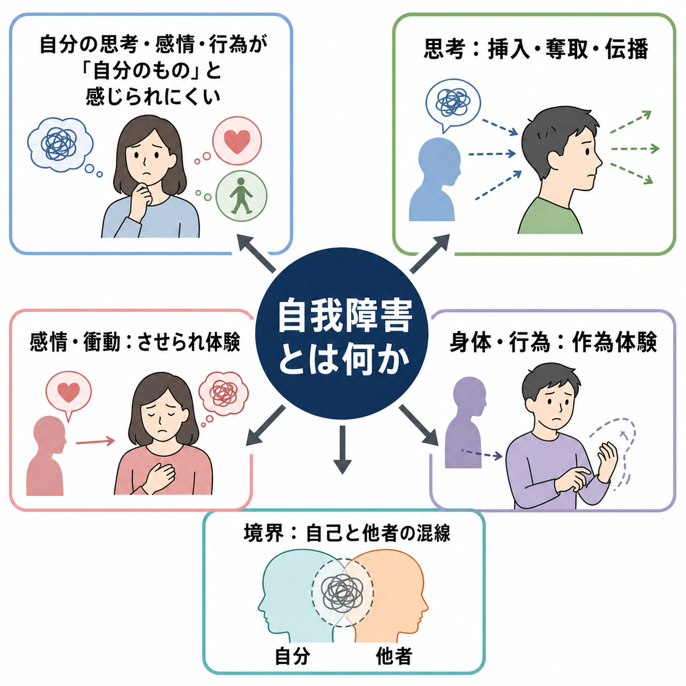
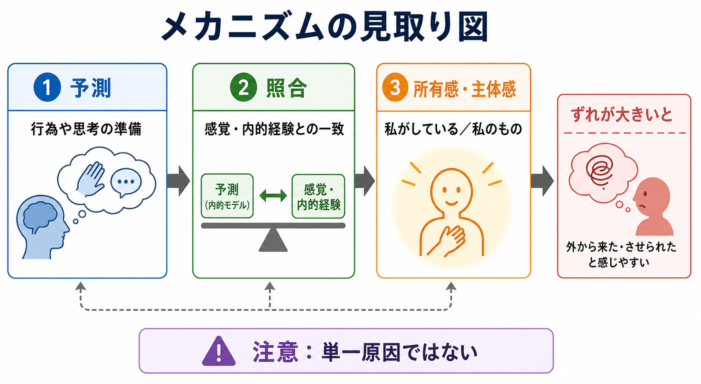
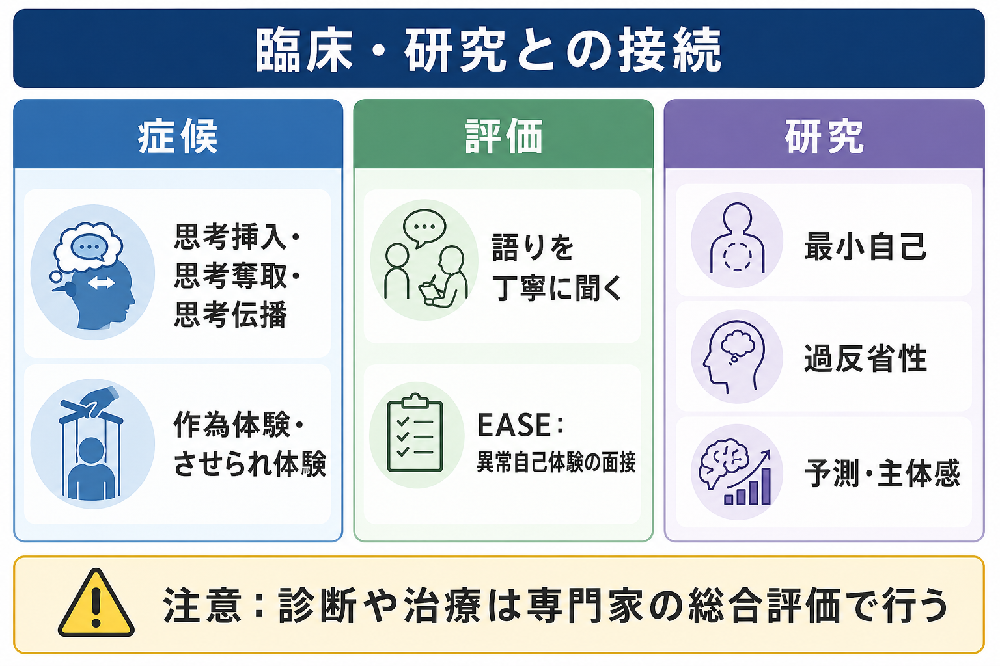

# 自我障害とは何か

## 要点

- 自我障害とは、思考・感情・衝動・身体感覚・行為が「自分から生じ、自分のものとして経験される」という基本的な感覚が揺らぐ症候群である。
- 典型例には、思考挿入、思考奪取、思考伝播、作為体験、させられ体験、自己と他者の境界の混乱がある。ICD-11 では、統合失調症の中核症状の一つとして「影響・受動性・支配の体験」が挙げられている[1]。
- 自我障害は[[妄想とは何か|妄想]]や[[幻覚とは何か|幻覚]]と重なりうるが、中心にあるのは「内容が奇妙か」ではなく、「誰の思考・感情・行為として経験されているか」という自己所属感の問題である。
- 近年の自己障害研究では、統合失調スペクトラムにおける「最小自己」や「一人称性」の変調として、EASE などの半構造化面接で検討されている[2][3]。
- 本記事は教育・研究目的の整理であり、個別の診断や治療方針を決めるものではない。

## この記事で答える問い

1. 自我障害とは、どのような症候をまとめる概念なのか。
2. 思考挿入、作為体験、させられ体験は、どこが共通しているのか。
3. 自我障害は、妄想、幻覚、[[解離とは何か|解離]]、[[現実感消失とは何か|現実感消失]]とどう違うのか。
4. 自己障害研究や主体感のメカニズム研究は、臨床理解に何を加えるのか。

## まず結論

自我障害は、「自分で考えている」「自分が動かしている」「自分の感情である」という、ごく当たり前に感じられる自己所属感が障害される状態である。たとえば「考えが外から入ってくる」「自分の考えが抜き取られる」「自分の行為を誰かに操られている」といった体験では、思考や行為の内容そのものよりも、それが「私に属する」という感覚が壊れている点が重要である[1]。

ただし、自我障害を一つの原因で説明することはできない。古典的な精神症候学では Schneider の一級症状や作為体験として記述され、現代の現象学的精神医学では「最小自己」や「ipseity」の変調として研究されてきた[3][4]。また、認知神経科学では、行為の予測、感覚フィードバック、主体感の照合に関するモデルが提案されているが、これは有用な見取り図であって、すべての自我障害を説明する確定理論ではない[7]。

## 背景

[[精神症候学とは何か|精神症候学]]では、症状を単に名前で分類するだけでなく、本人にとって「どのように経験されているか」を丁寧に記述する。自我障害はその典型である。同じ「誰かに操られている」という訴えでも、被害的な解釈が中心なのか、身体や行為が自分のものとして感じられないのか、思考が外から来るように感じられるのかで、臨床的な意味は変わる。

歴史的には、思考挿入、思考奪取、思考伝播、作為体験は統合失調症の診断で重視されてきた。Schneider の一級症状は、統合失調症に特異的な徴候として期待されたが、後の研究では、単独で診断を決定できるほどの特異性はないと整理されている[6]。したがって、これらは「診断名を一発で決める症状」ではなく、本人の経験構造を理解するための重要な手がかりとして扱うのが適切である。

一方、EASE に代表される現象学的研究は、明らかな妄想に至る前の、より微細で持続的な自己経験の変調を扱う。EASE は「認知と思考の流れ」「自己意識と現前」「身体経験」「自己境界」「実存的変化」などの領域を面接で探索するための道具であり、診断そのものを機械的に決める検査ではない[2][3]。

## 基本概念

### 自己所属感と主体感

自我障害を理解するうえで、まず二つの感覚を分けて考えるとよい。

| 概念 | 意味 | 例 |
|---|---|---|
| 自己所属感 | 思考・感情・身体感覚・行為が「自分のもの」と感じられること | 「この考えは私の考えだ」 |
| 主体感 | 行為や思考を「自分が起こしている」と感じられること | 「私が手を動かした」 |
| 自己境界 | 自分と他者、内側と外側が区別されること | 「相手の考えと自分の考えは別である」 |

自我障害では、これらの感覚が弱まったり、外部の力に置き換えられたり、他者との境界が混線したりする。

### 典型的な症候

| 症候 | 体験の中心 | 注意点 |
|---|---|---|
| 思考挿入 | 自分のものではない考えが入ってくる | [[侵入思考とは何か|侵入思考]]のように「嫌な考えが浮かぶ」だけではない |
| 思考奪取 | 自分の考えが抜き取られる | 思考停止や注意散漫とは区別して聞く |
| 思考伝播 | 自分の考えが他者に知られている、漏れている | [[注察妄想とは何か|注察妄想]]や関係づけと重なることがある |
| 作為体験 | 行為・身体運動・感覚が外部から操作される | 神経疾患、薬物、[[体感幻覚とは何か|体感幻覚]]との鑑別が必要 |
| させられ体験 | 感情・衝動・意志が外から起こされる | 「やりたくないのにしてしまう」とは質的に異なる場合がある |
| 自己境界の混乱 | 自分と他者の思考や感情の境界が曖昧になる | 解離、トラウマ、発達特性との関係も確認する |

### 妄想・幻覚・解離との違い

自我障害は、妄想や幻覚と独立した箱に入るわけではない。むしろ、妄想的確信や幻聴の内容として現れることがある。たとえば「誰かが私を操っている」という確信は妄想として記述されうるが、その背後に「自分の行為が自分のものではない」という主体感の変調があるなら、自我障害としての記述が重要になる。

解離や現実感消失では、「自分が自分でない感じ」「世界が現実でない感じ」が語られることがある。しかし、自我障害で問題になるのは、より特定の思考・行為・感情が「私に属さない」「外から来る」「誰かに支配される」と経験される点である。したがって、訴えの言葉が似ていても、体験の構造、持続、現実検討、他の精神病症状との関係を分けて聞く必要がある。

## 仕組み

### 最小自己の変調

現象学的な自己障害研究では、自我障害を「反省して作られる自己イメージ」の問題ではなく、より基礎的な一人称性の変調として考える。ここでいう最小自己とは、「この経験は私に開かれている」という前反省的な自己性である。統合失調スペクトラムでは、この最小自己の弱まり、過剰な自己注視、世界との自然な接触感の変化が組み合わさると考えられてきた[3][4]。

この見方では、思考挿入や作為体験は、単なる「奇妙な信念」ではない。むしろ、普段は背景に退いている自己所属感が不安定になり、思考や身体が対象物のように目立ち、外部の力として解釈されやすくなる体験として理解される。

### 主体感と予測のずれ

認知神経科学では、行為を起こすときに脳が予測を作り、その予測と実際の感覚フィードバックを照合することで「自分が行った」という主体感が支えられる、と考えるモデルがある。Frith の comparator model は、作為体験や支配妄想を説明するための代表的な枠組みである[7]。

このモデルを単純化すると、次のようになる。

1. 行為や思考に先立って、予測や準備が生じる。
2. 実際に生じた感覚・内的経験と予測が照合される。
3. 一致が十分であれば、「私がした」「私の考えだ」と感じられる。
4. ずれが大きい場合、行為や思考が外から来たものとして経験されやすくなる。

ただし、この説明はすべての自我障害を説明するものではない。とくに思考挿入や自己境界の混乱には、言語、記憶、注意、情動、対人関係、文化的意味づけが関わる。近年のレビューも、自己障害を単一の欠損としてではなく、自己と世界の経験の多様な変化として再検討している[8]。

### 自己障害研究のエビデンス

EASE などを用いた研究では、自己障害が統合失調スペクトラムに高く集積し、臨床的ハイリスク状態や経過の理解にも関係することが示されている[4][5]。2021 年の systematic review は、自己障害が統合失調スペクトラムで目立ち、時間的安定性、社会機能、自殺傾向、後のスペクトラム診断との関連が報告されていると整理している[4]。

とはいえ、自己障害は「統合失調症だけに存在する印」ではない。重度の離人感、解離、気分症、発達特性、トラウマ関連症状、物質使用、神経疾患でも、自己感や主体感の変化は起こりうる。したがって、研究上の関連を臨床で用いるときは、症状の質、経過、機能障害、併存症、文化的文脈を総合して評価する必要がある。

## 図解

1枚目は、自我障害を「思考」「感情・衝動」「身体・行為」「自己境界」の四つの入口から整理した概念地図である。2枚目は、主体感を支える予測と照合のモデルを、作為体験の理解に使うための見取り図である。3枚目は、臨床評価と研究領域をつなぐ地図であり、症候、面接、EASE、最小自己、予測・主体感研究の位置づけを示している。

## 臨床・研究との接続

### 面接で確認すること

自我障害を評価するときは、まず本人の言葉を保ったまま聞く。いきなり「思考挿入ですか」「作為体験ですか」と分類名を当てると、体験の質を取り逃がすことがある。確認したいのは、少なくとも次の点である。

| 確認点 | 目的 |
|---|---|
| 何が自分のものではないと感じられるか | 思考、感情、衝動、身体、行為を分ける |
| 外部性はどの程度あるか | 「勝手に浮かぶ」と「誰かに入れられる」を区別する |
| 確信度と現実検討 | 体験への距離、疑い、説明可能性を見る |
| 持続と経過 | 一過性、反復性、慢性化、急性増悪を分ける |
| 苦痛と機能障害 | 生活、対人関係、安全性への影響を見る |
| 併存症状 | 妄想、幻覚、気分症状、解離、認知機能障害を確認する |
| 身体・物質要因 | 神経疾患、睡眠、薬物、アルコール、医薬品の影響を確認する |

### 診断分類との接続

ICD-11 は統合失調症を、思考、知覚、自己経験、認知、意欲、感情、行動など複数の精神機能の障害として記述し、その中で影響・受動性・支配の体験を中核症状の一つに置いている[1]。この点で、自我障害は診断分類上も重要な位置をもつ。

しかし、診断分類は症候の意味をすべて説明するものではない。自我障害の臨床的理解には、操作的診断に加えて、どのような自己経験が、いつから、どの文脈で、どれほどの苦痛と障害を伴っているのかを記述する必要がある。

### 研究との接続

研究では、少なくとも三つの方向から自我障害が扱われる。

| 研究方向 | 問い | 代表的な道具・概念 |
|---|---|---|
| 現象学的精神医学 | 体験の構造はどう変わっているか | EASE、最小自己、過反省性 |
| 精神病理学・症候学 | どの症候として記述するか | 思考挿入、作為体験、一級症状 |
| 認知神経科学 | 主体感はどの機構で支えられるか | comparator model、予測、感覚フィードバック |

これらは競合する説明ではなく、抽象度の異なる地図である。臨床では、本人の語りを現象学的に聞き、症候学的に記述し、必要に応じて認知神経科学的な仮説を慎重に参照する、という組み合わせが有用である。

## よくある誤解

### 「自我障害」は自我が弱いという意味ではない

日常語の「自我が強い」「自我が弱い」とは別の概念である。自我障害は性格評価ではなく、思考・感情・行為が自分のものとして経験される仕組みの障害を指す。

### 思考挿入は侵入思考と同じではない

侵入思考では、不快で望まない考えが浮かぶが、多くの場合「自分の心に浮かんだ考え」という自己所属感は保たれる。思考挿入では、考えそのものが外から入れられた、あるいは自分のものではないと経験される点が重要である。

### 作為体験は「言い訳」ではない

作為体験は、本人が責任を避けるために作る説明ではなく、行為や身体感覚が自分のものとして感じられない苦痛な体験として現れることがある。安全性や責任能力の評価は、法的・臨床的文脈で慎重に行われるべきであり、症候名だけで判断できない。

### 自己障害だけで診断は決まらない

自己障害は統合失調スペクトラム研究で重要だが、単独で診断名を決めるものではない。気分症状、発達歴、トラウマ、物質使用、身体疾患、文化的背景、経過を含めた総合評価が必要である。

## 関連ノート

- [[精神症候学とは何か]]
- [[妄想とは何か]]
- [[幻覚とは何か]]
- [[体感幻覚とは何か]]
- [[侵入思考とは何か]]
- [[強迫観念とは何か]]
- [[解離とは何か]]
- [[現実感消失とは何か]]
- [[認知機能障害とは何か]]

MOC更新候補: `content/00_MOC/` 配下の精神医学・症候学系 MOC に、本記事 `[[自我障害とは何か]]` を追加する。

## 理解チェック

1. 自我障害では、「思考の内容」よりも、どのような感覚が障害されるのか。
2. 思考挿入と侵入思考は、どの点で区別されるか。
3. 作為体験を主体感のモデルで説明するとき、どのような限界があるか。
4. EASE は、診断名を自動的に決める検査ではなく、何を探索するための面接か。
5. 自我障害を評価するとき、身体疾患・物質使用・解離を確認すべき理由は何か。

## 参考文献

[1] World Health Organization. ICD-11 for Mortality and Morbidity Statistics, 6A20 Schizophrenia. https://icd.who.int/browse/2026-01/mms/en#1683919430

[2] Parnas, J., Møller, P., Kircher, T., Thalbitzer, J., Jansson, L., Handest, P., & Zahavi, D. (2005). EASE: Examination of Anomalous Self-Experience. *Psychopathology*, 38(5), 236-258. https://doi.org/10.1159/000088441

[3] Nordgaard, J., Henriksen, M. G., Jansson, L., Handest, P., Møller, P., Rasmussen, A. R., Sandsten, K. E., Nilsson, L. S., Zandersen, M., Zahavi, D., & Parnas, J. (2021). Disordered Selfhood in Schizophrenia and the Examination of Anomalous Self-Experience: Accumulated Evidence and Experience. *Psychopathology*, 54(6), 275-281. https://doi.org/10.1159/000517672

[4] Henriksen, M. G., Raballo, A., & Nordgaard, J. (2021). Self-disorders and psychopathology: a systematic review. *The Lancet Psychiatry*, 8(11), 1001-1012. https://doi.org/10.1016/S2215-0366(21)00097-3

[5] Burgin, S., Reniers, R., & Humpston, C. S. (2022). Prevalence and assessment of self-disorders in the schizophrenia spectrum: a systematic review and meta-analysis. *Scientific Reports*, 12, 1165. https://doi.org/10.1038/s41598-022-05232-9

[6] Soares-Weiser, K., Maayan, N., Bergman, H., Davenport, C., Kirkham, A. J., Grabowski, S., & Adams, C. E. (2015). First rank symptoms for schizophrenia. *Cochrane Database of Systematic Reviews*, 2015(1), CD010653. https://doi.org/10.1002/14651858.CD010653.pub2

[7] Frith, C. (2012). Explaining delusions of control: the comparator model 20 years on. *Consciousness and Cognition*, 21(1), 52-54. https://doi.org/10.1016/j.concog.2011.06.010

[8] Feyaerts, J., & Sass, L. A. (2024). Self-Disorder in Schizophrenia: A Revised View (1. Comprehensive Review-Dualities of Self- and World-Experience). *Schizophrenia Bulletin*, 50(2), 460-471. https://doi.org/10.1093/schbul/sbad169

## 未解決問題

- 自己障害が統合失調スペクトラムの脆弱性マーカーとしてどの程度予測的に使えるかは、対象集団、面接者訓練、追跡期間によって変わる。
- 主体感の予測モデルは作為体験の理解に役立つが、思考挿入や自己境界の混乱をどこまで説明できるかは未解決である。
- 自己障害を治療的面接や心理社会的支援にどう組み込むかについては、標準化された方法がまだ十分ではない。
