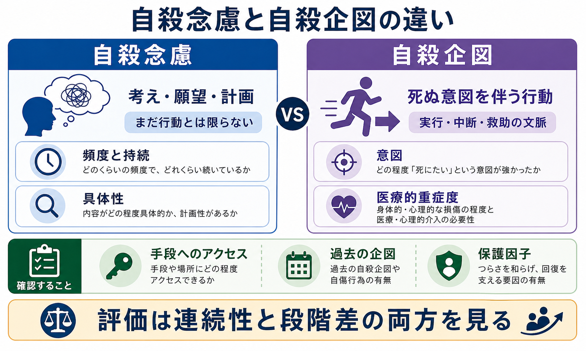
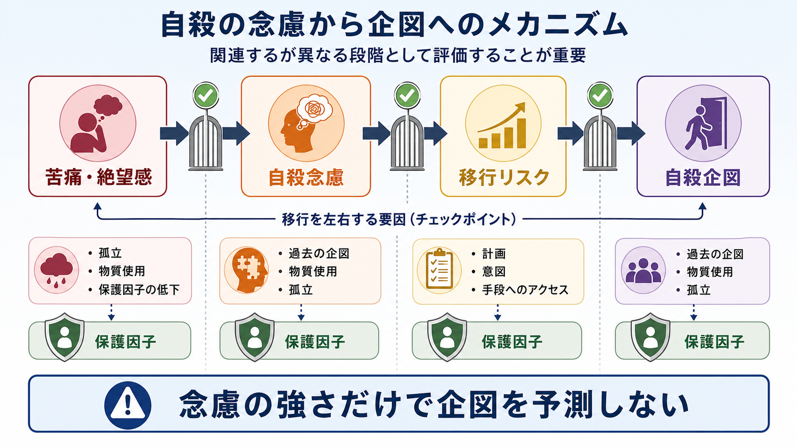

# 自殺念慮と自殺企図は何が違うのか

## 要点

- 自殺念慮は「死にたい」「自分を消したい」「自殺するかもしれない」といった考え・願望・計画を含む。自殺企図は、死ぬ意図を少なくとも一部伴う行動であり、結果として死亡しなかったものを指すことが多い [1][2]。
- 念慮と企図は連続しているが、同じものではない。念慮の強さだけで企図を予測せず、計画、意図、手段へのアクセス、過去の企図、物質使用、孤立、保護因子を分けて評価する [3][4]。
- 臨床では「点数で危険度を決める」よりも、本人の語り、現在の文脈、支援資源、直近の変化を統合する。NICE はリスク尺度や「低・中・高」の分類だけで将来の自殺や反復自傷を予測したり支援の可否を決めたりしないよう勧めている [5]。
- 本稿は教育・研究目的の整理であり、個別の診断や治療指示ではない。差し迫った危険が疑われる場合は、地域の救急、精神科救急、相談窓口など現実の支援につなぐ必要がある。

## この記事で答える問い

1. 自殺念慮と自殺企図は、定義上どこが違うのか。
2. 「考えている」ことから「行動に移る」ことを分けて評価する理由は何か。
3. 精神科面接では、どの情報を聞けばリスク評価と支援計画につながるのか。

## まず結論

自殺念慮は、内的な考え・願望・計画を中心にした概念である。自殺企図は、死ぬ意図を伴う自傷的または自己破壊的な行動を中心にした概念である [1][2]。したがって、両者の違いは「重いか軽いか」だけではなく、「考えとして存在しているのか、行動として生じたのか」「死ぬ意図がどの程度あったのか」「準備・中断・救助・身体的損傷・医療的介入がどのような文脈で起きたのか」にある。

## 背景

自殺リスク評価でよく起きる混乱は、「死にたいと言っている人」と「実際に行動した人」を同じ危険度として扱うこと、あるいは逆に「考えているだけなら危険ではない」と過小評価することである。どちらも不十分である。念慮は重要な警告信号だが、念慮をもつ人すべてが企図に至るわけではない。一方で、企図が生じた後には再企図や死亡リスクが高まるため、行動の文脈を丁寧に確認する必要がある [3][6]。

CDC の自傷・自殺関連行動の定義では、自殺念慮は自殺について考えること、自殺企図は死ぬ意図を伴う非致死的な自己指向性の潜在的有害行動として整理される [1]。C-SSRS も、念慮、準備行動、中断された企図、中止された企図、実際の企図を分けて評価する [2]。この区別は、[[精神症候学とは何か]]でいう症候の記述を、[[精神状態診察MSEとは何か]]やリスク評価に接続するための基本である。

## 基本概念

### 自殺念慮

自殺念慮は、自殺に関する考えの総称である。受動的な「目が覚めなければよい」「消えてしまいたい」から、能動的な「自殺したい」、さらに具体的な時期・場所・手段・準備を伴う計画まで幅がある [1][2]。面接では、単に「ある・ない」ではなく、頻度、持続時間、制御しやすさ、具体性、本人がそれをどれほど切迫したものとして体験しているかを確認する。

### 自殺企図

自殺企図は、死ぬ意図を伴う行動であり、結果として死亡しなかったものを指す。身体的損傷が軽い場合でも、意図が強く、発見されにくい状況で、救助可能性が低い文脈で起きていれば、臨床的には重く評価される [1][2]。逆に、身体的損傷の程度だけで意図の強さを決めることもできない。

### 関連するが異なる概念

「希死念慮」は、死にたい気持ちや生きていたくない感覚を広く指す語として使われることがある。自殺念慮はその中でも自殺という行為に向かう考えを含む概念である。非自殺性自傷は、つらさの調整や感情の緩和などを目的とし、死ぬ意図を伴わない自傷として区別される。ただし、非自殺性自傷が将来の自殺関連行動と関連する場合もあるため、「意図がないなら安全」とは言えない [6]。

## 仕組み

近年の自殺研究では、念慮が生じる要因と、念慮から企図へ移行する要因を分けて考える「ideation-to-action framework」が重視されている [3]。強い心理的苦痛、絶望感、孤立、負担感などは念慮に関わりやすい。一方で、企図への移行には、過去の企図、具体的な計画、手段へのアクセス、衝動性、物質使用、急な喪失や対人危機、支援からの切断などが関わる。

この考え方の利点は、「死にたい気持ちがどれほど強いか」だけでなく、「その考えが行動に移りやすい条件が今そろっているか」を見られる点である。たとえば、同じ程度の自殺念慮でも、手段にアクセスできない、信頼できる人に連絡できる、本人が受診に同意している、危機時の計画がある場合と、物質使用、孤立、具体的な準備、過去の企図が重なっている場合では、支援の優先度は変わる。

## 図解

1枚目は、念慮と企図を二列で比較している。左側の自殺念慮は「考え・願望・計画」を中心に、右側の自殺企図は「死ぬ意図を伴う行動」を中心に整理している。下段の確認項目は、面接で評価すべき情報が単一の点数ではなく、複数の文脈情報から成ることを示す。

2枚目は、念慮から企図への移行を段階として示している。苦痛や絶望感は念慮と関連しやすいが、企図への移行には計画、意図、手段へのアクセス、過去の企図、物質使用、孤立、保護因子の低下などが関与する。ここで重要なのは、念慮を軽く扱うことではなく、念慮と企図を同じ指標で潰さず、評価の焦点を増やすことである。

## 臨床・研究との接続

### 面接で確認すること

[[MSEで思考内容をどう評価するか]]では、罪責感、絶望感、被害念慮、強迫観念などと並んで、自殺関連の思考内容を確認する必要がある。自殺念慮については、次を分けて聞く。

| 領域 | 確認すること |
|---|---|
| 頻度・持続 | どのくらい頻繁に、どのくらい続くか |
| 具体性 | 時期、場所、手段、準備がどれほど具体的か |
| 意図 | 死にたい意図がどの程度強いか、迷いがあるか |
| 制御可能性 | 考えを止められるか、誰かに伝えられるか |
| 手段へのアクセス | 危険な手段や場所に近づける状態か |
| 過去の行動 | 過去の企図、自傷、準備行動、中断された行動があるか |
| 動的要因 | 物質使用、睡眠不足、急な喪失、孤立、治療中断があるか |
| 保護因子 | 支援者、受診意欲、役割、将来目標、危機時の連絡先があるか |

### 企図後の評価

企図があった場合は、身体的重症度だけでなく、意図、準備、発見されやすさ、救助可能性、中断の理由、企図後の後悔や安心、再企図の可能性を確認する。C-SSRS が区別する「実際の企図」「中断された企図」「本人が中止した企図」「準備行動」は、企図の有無だけでは見落とされやすい臨床情報である [2]。

### 支援計画への接続

リスク評価の目的は、危険な人を分類することではなく、今必要な支援を決めることである。NIMH の ASQ は、短時間で自殺関連リスクを拾い上げ、その後の詳しい評価につなげるためのスクリーニングとして使われる [7]。NICE は、自傷後の評価で本人のニーズ、心理社会的文脈、強み、支援を包括的に扱うことを重視し、リスク尺度だけで支援を決めないよう勧めている [5]。

実践上は、[[物質使用歴はどのように聞くべきか]]、[[家族面接では何を評価するべきか]]、[[精神科で重症度をどう判断するか]]、[[クライシスプランとは何か]]と接続する。危機時の安全確保、信頼できる人への連絡、受診や相談の導線、手段へのアクセスを減らす調整は、念慮の有無だけでなく移行リスクの評価に基づいて具体化される。

### 研究との接続

予測研究では、自殺関連行動のリスク因子は多数知られているが、単独の因子で高精度に将来の企図を予測することは難しい。Franklin らのメタ分析は、従来のリスク因子研究の予測力が限定的であることを示した [6]。このため、研究では念慮、企図、死亡、非自殺性自傷を明確に分け、時間軸をそろえ、動的要因を測定することが重要になる。

## よくある誤解

### 誤解1: 自殺念慮があるなら、必ず企図に進む

必ず進むわけではない。念慮をもつ人の中で企図に至る人は一部であり、移行には別の条件が関わる [3]。ただし、念慮は重要な苦痛のサインであり、軽視してよいという意味ではない。

### 誤解2: 自殺企図は身体的損傷が重いほど危険である

身体的重症度は重要だが、それだけで意図や再企図リスクは判断できない。低致死性に見える行動でも、死ぬ意図が強い、発見可能性が低い、準備が進んでいる場合は重く評価する必要がある [1][2]。

### 誤解3: 自殺について聞くと、かえって自殺を誘発する

自殺について直接聞くことは、臨床評価と支援への接続に必要である。ASQ のようなスクリーニングは、短い質問でリスクを拾い上げ、次の評価につなげる設計になっている [7]。大切なのは、責める聞き方ではなく、具体的で落ち着いた聞き方をすることである。

### 誤解4: リスクを「低・中・高」に分ければ十分である

十分ではない。NICE は、リスク尺度や包括的なリスク分類を、将来の自殺や反復自傷の予測、退院可否、支援提供の判断に単独で使わないよう勧めている [5]。臨床で必要なのは、分類名ではなく、今変えられる条件と支援計画である。

## 関連ノート

- [[精神症候学とは何か]]
- [[精神状態診察MSEとは何か]]
- [[MSEで思考内容をどう評価するか]]
- [[MSEで気分と感情をどう区別するか]]
- [[MSEで病識と判断力をどう評価するか]]
- [[物質使用歴はどのように聞くべきか]]
- [[家族面接では何を評価するべきか]]
- [[クライシスプランとは何か]]
- [[精神科で重症度をどう判断するか]]

## MOC更新候補

- `content/00_MOC/MOC｜精神医学.md`
- `content/00_MOC/MOC｜臨床実践・治療.md`
- `content/00_MOC/MOC｜神経科学と精神疾患.md`

並列ジョブとの競合を避けるため、本ジョブでは MOC ファイルそのものは更新しない。

## 理解チェック

1. 自殺念慮と自殺企図の違いを、「考え」と「行動」だけでなく「意図」と「文脈」を含めて説明できるか。
2. 念慮の強さだけで企図を予測しない理由を説明できるか。
3. 企図後の評価で、身体的重症度以外に確認すべき情報を3つ挙げられるか。
4. リスク尺度の結果を、支援計画にそのまま置き換えてはいけない理由を説明できるか。

## 未解決問題

- 短期的な自殺企図を高精度に予測するモデルは、臨床現場でまだ十分に確立していない。
- 自殺念慮、非自殺性自傷、準備行動、企図をどの文化・年齢・臨床状況でも同じように測定できるかには課題が残る。
- 機械学習による予測は有望だが、偽陽性、偽陰性、説明可能性、介入可能性、倫理的運用を分けて検討する必要がある。

## 参考文献

[1] Crosby AE, Ortega L, Melanson C. (2011). *Self-directed Violence Surveillance: Uniform Definitions and Recommended Data Elements*. Centers for Disease Control and Prevention. https://stacks.cdc.gov/view/cdc/11997

[2] Posner K, Brown GK, Stanley B, et al. (2011). The Columbia-Suicide Severity Rating Scale: Initial validity and internal consistency findings from three multisite studies with adolescents and adults. *American Journal of Psychiatry*, 168(12), 1266-1277. https://doi.org/10.1176/appi.ajp.2011.10111704

[3] Klonsky ED, May AM, Saffer BY. (2016). Suicide, suicide attempts, and suicidal ideation. *Annual Review of Clinical Psychology*, 12, 307-330. https://doi.org/10.1146/annurev-clinpsy-021815-093204

[4] Silverman MM, Berman AL, Sanddal ND, O'Carroll PW, Joiner TE. (2007). Rebuilding the tower of Babel: A revised nomenclature for the study of suicide and suicidal behaviors. Part 1: Background, rationale, and methodology. *Suicide and Life-Threatening Behavior*, 37(3), 248-263. https://doi.org/10.1521/suli.2007.37.3.248

[5] National Institute for Health and Care Excellence. (2022). *Self-harm: assessment, management and preventing recurrence (NICE guideline NG225)*. https://www.nice.org.uk/guidance/ng225

[6] Franklin JC, Ribeiro JD, Fox KR, et al. (2017). Risk factors for suicidal thoughts and behaviors: A meta-analysis of 50 years of research. *Psychological Bulletin*, 143(2), 187-232. https://doi.org/10.1037/bul0000084

[7] National Institute of Mental Health. (n.d.). *Ask Suicide-Screening Questions (ASQ) Toolkit*. https://www.nimh.nih.gov/research/research-conducted-at-nimh/asq-toolkit-materials

[8] World Health Organization. (2021). *LIVE LIFE: An implementation guide for suicide prevention in countries*. https://www.who.int/publications/i/item/9789240026629
