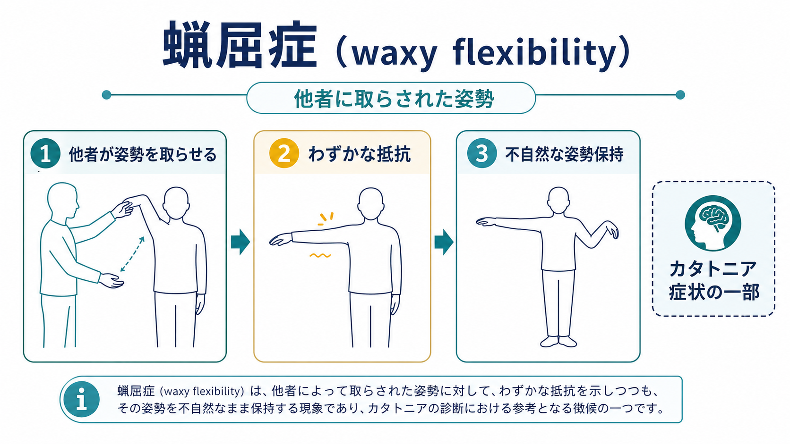
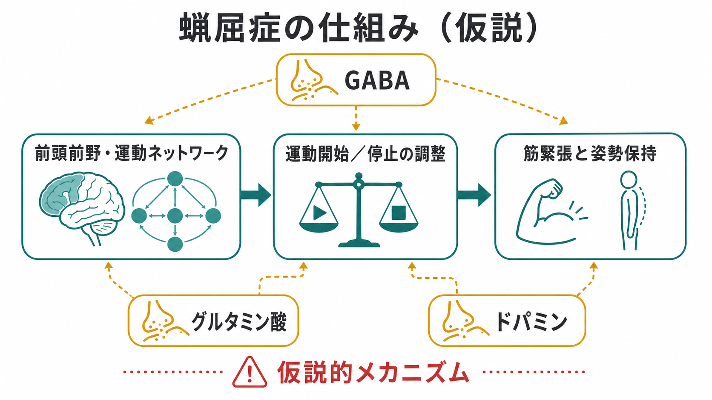

# 蝋屈症とは何か

## 要点

- 蝋屈症（waxy flexibility）は、診察者などが四肢や体幹を一定の姿勢に動かしたとき、本人が軽い、均等な抵抗を示しつつ、その姿勢を不自然に保持する現象である [1][2]。
- DSM-5-TR ではカタトニアの12特徴の一つとして「位置づけに対する軽い均等な抵抗」と説明され、カタレプシー、姿勢保持、拒絶症、無言、反響言語などと並んで評価される [1][2]。
- 重要なのは、蝋屈症だけでカタトニアを診断しないことである。カタトニアは複数の精神運動症状、時間経過、背景疾患、身体状態を合わせて判断する症候群である [1][5]。
- 蝋屈症は「わざと固まっている」「単なる頑固さ」とは異なる。意志、筋緊張、運動開始・停止、注意、情動、身体疾患、薬剤影響が絡む可能性を含めて観察する必要がある [2][6]。
- 医療・臨床の文脈では、脱水、低栄養、褥瘡、血栓、悪性カタトニアなどのリスクも考えるため、教育・研究上の概念理解と個別診断・治療判断は分けて扱う [1][7]。

## この記事で答える問い

1. 蝋屈症とは、何がどのように「蝋のよう」なのか。
2. カタレプシー、姿勢保持、拒絶症、筋強剛とは何が違うのか。
3. 蝋屈症は、カタトニアの理解や臨床評価でどのような意味をもつのか。
4. どのような誤解を避けるべきか。

## まず結論

蝋屈症とは、他者が患者の腕や身体をある姿勢に動かそうとしたとき、最初から最後まで「軽く、均等な抵抗」が感じられ、その後、その姿勢が不自然に保持されるカタトニア関連の運動徴候である [1][2]。名称は、蝋を曲げるときのように、硬すぎず、完全に脱力してもおらず、一定の抵抗を伴って形が変わる印象に由来する。

ただし、臨床的には「腕を曲げたらそのままになった」という一点だけで判断しない。姿勢を他者に取らされたのか、自発的に取ったのか、抵抗は均等か、最初だけか、強い筋強剛か、拒絶症や反響症状を伴うか、意識障害や薬剤影響がないかを合わせて評価する [2][4]。このため、蝋屈症は [[精神症候学とは何か]] の中でも、本人の訴えだけでなく観察と身体診察を要する徴候として理解するとよい。

## 背景

カタトニアは、運動、発話、行動、情動、自律神経機能にまたがる精神運動症候群である。かつては統合失調症の一亜型として扱われやすかったが、現在は気分症、精神病性障害、神経疾患、自己免疫性脳炎、薬剤・物質、身体疾患など、幅広い背景で生じうる横断的な症候群として整理されている [2][5][6]。

DSM-5-TR では、カタトニアの特徴として、昏迷、カタレプシー、蝋屈症、無言、拒絶症、姿勢保持、常同症、興奮、しかめ面、反響言語、反響動作などが挙げられ、一定数以上の特徴の組み合わせで判断される [1]。ICD-11 でも、カタトニアは独立した診断カテゴリーとして整理され、低下・増加・異常な精神運動活動の組み合わせとして記述される [5]。

蝋屈症はその中の一項目であり、特に「身体を他者が動かしたときの筋緊張と姿勢保持」を見る徴候である。したがって、[[精神運動制止とは何か]] のような全体的な動きの遅さ、[[意識障害とは何か]] のような覚醒水準の問題、[[せん妄とは何か]] のような急性混乱状態とは、重なりうるが同じ概念ではない。

## 基本概念

### 何が観察されるのか

典型的には、診察者が患者の腕を持ち上げたり、肘を曲げたり、手首や姿勢を変えようとしたときに、抵抗が「軽く」「均等に」続く。筋肉が鉛管のように強く固まるというより、蝋を曲げるような、成形可能だが抵抗のある質感として記述される [2][4]。

このとき重要なのは、患者が自分で姿勢を選んで保持しているとは限らない点である。他者に取らされた姿勢が、重力に逆らって不自然に保たれる場合、カタレプシーや姿勢保持との区別も問題になる [4]。DSM-5-TR では、カタレプシーは「他者に受動的に取らされた姿勢を重力に抗して保持すること」、蝋屈症は「位置づけに対する軽い均等な抵抗」として分けられる [1][4]。

### 似た用語との違い

| 用語 | 中心となる見方 | 蝋屈症との違い |
|---|---|---|
| カタレプシー | 他者に取らされた姿勢を保持する | 姿勢保持そのものに焦点がある |
| 姿勢保持 | 自発的に取った姿勢を長く保つ | 他者に取らされた姿勢とは限らない |
| 拒絶症 | 指示や外的刺激への抵抗・反対 | 意味的・行動的な抵抗を含む |
| 筋強剛 | 受動運動に対する筋緊張の増加 | 強さや質が異なり、神経疾患や薬剤影響も鑑別に入る |
| 蝋屈症 | 軽い均等な抵抗と姿勢保持 | 身体診察で触れて確認する徴候である |

BFCRS（Bush-Francis Catatonia Rating Scale）では、蝋屈症は「再姿勢づけの際に初期抵抗を示した後、曲げた蝋のように再配置を許す」と定義され、0/3 の二値項目として扱われる [3]。一方、DSM-5-TR や ICD-11 の記述では「軽い均等な抵抗」が強調されるため、尺度や診断体系によって用語の切り方が完全には一致しない [2][4]。

## 仕組み

蝋屈症の仕組みは、単一の神経機構だけで説明されているわけではない。カタトニア全体としては、前頭前野、補足運動野、基底核、視床、皮質下回路などを含む運動制御ネットワークの異常、ならびに GABA、グルタミン酸、ドパミン系の調節異常が候補として議論されている [1][6]。

直感的には、蝋屈症は「動くか、止まるか、どの程度の筋緊張で姿勢を保つか」を調整するシステムが、外からの姿勢変化に対して柔軟に切り替わらなくなった状態として理解できる。通常であれば、腕を持ち上げられた人は、意図に応じて脱力する、戻す、協力する、拒むといった反応を文脈に合わせて選ぶ。しかしカタトニアでは、その選択や切り替えが滞り、軽い抵抗を伴う姿勢保持として見えることがある。

ただし、この説明は仮説的であり、個々の患者の症状をその場で特定の神経伝達物質に還元するものではない。カタトニアは、気分症、精神病性障害、自己免疫性脳炎、てんかん、代謝性疾患、薬剤・物質、神経変性疾患など、複数の経路から似た精神運動症候群として現れうる [1][2][6]。したがって、研究上は神経回路と薬理学的反応を結びつけて考えつつ、臨床上は鑑別診断と安全確認を優先する。

## 図解

蝋屈症は、次の三層に分けると整理しやすい。

| 層 | 見るもの | 具体例 |
|---|---|---|
| 現象の層 | 姿勢と抵抗 | 他者に腕を上げられ、軽い抵抗を示しつつ保持する |
| 症候群の層 | カタトニアの他症状 | 無言、昏迷、拒絶症、姿勢保持、反響言語、反響動作など |
| 背景の層 | 原因・文脈 | 気分症、精神病性障害、身体疾患、神経疾患、薬剤、自己免疫性脳炎など |

この三層を分けると、「蝋屈症が見える」ことと、「カタトニアの診断が確定する」ことと、「背景疾患が何であるか」を混同しにくくなる。これは [[症状と徴候は何が違うのか]] で扱う、本人の体験と観察可能な徴候の区別にも関係する。

## 臨床・研究との接続

臨床では、蝋屈症はカタトニアを疑う手がかりの一つである。BAP 2023 ガイドラインは、活動水準や行動が文脈に対して著しく変化している場合、カタトニアを鑑別に入れ、病歴、身体診察、薬剤歴、神経学的・身体医学的評価、必要に応じた検査を組み合わせることを推奨している [2]。

BFCRS は、カタトニアのスクリーニングと重症度評価に広く用いられる尺度で、最初の14項目をスクリーニングに使い、全23項目で重症度を追跡する [2][3]。蝋屈症はその項目の一つだが、単独項目としてよりも、昏迷、無言、凝視、姿勢保持、拒絶症、筋強剛、自律神経異常などとの組み合わせで意味をもつ。

研究では、カタトニアは一つの疾患名というより、精神運動制御の破綻が複数の疾患背景で収束する「共通表現型」として扱われることが多い [5][6]。そのため、蝋屈症は古典的な症候学用語であると同時に、運動ネットワーク、神経伝達、情動・行動調整をつなぐ観察点でもある。

安全面では、カタトニアが長引くと脱水、低栄養、肺炎、尿閉、褥瘡、静脈血栓塞栓、横紋筋融解、自律神経不安定などが問題になりうる [1][7]。本記事は教育・研究目的の整理であり、個別の診断や治療指示ではない。実際の評価では、医療者が文脈、身体所見、リスク、本人の意思決定能力、家族や支援者からの情報を合わせて判断する必要がある。

## よくある誤解

### 「蝋屈症があれば、必ず統合失調症である」

これは誤りである。カタトニアは歴史的に統合失調症と結びつけられてきたが、現在は気分症、身体疾患、神経疾患、自己免疫性脳炎、薬剤・物質関連など、多様な背景で生じうる [2][5][6]。蝋屈症は診断名ではなく、カタトニアを構成しうる徴候の一つである。

### 「腕を上げたままなら、すべて蝋屈症である」

姿勢保持だけならカタレプシーや姿勢保持に近い場合がある。蝋屈症では、姿勢を取らせる過程で感じる「軽い均等な抵抗」が重要である [1][4]。また、パーキンソニズム、薬剤性筋強剛、神経疾患、疼痛、防御的反応、意識障害などでも、身体が動かしにくく見えることがある。

### 「本人が反抗しているだけである」

蝋屈症やカタトニアを、性格、怠慢、わざとらしさとして扱うのは危険である。カタトニアでは、本人が外界を理解していても動けない、話せない、反応を開始できない場合があり、医学的リスクも伴う [1][7]。観察される抵抗を、ただちに意図的な拒否と決めつけないことが重要である。

### 「治療反応だけで診断できる」

ベンゾジアゼピンや ECT への反応はカタトニア理解で重要だが、反応性だけで診断を単純化するべきではない [2][7]。せん妄、神経疾患、薬剤影響、悪性症候群、セロトニン症候群など、重なって見える状態があるため、診断と治療は医療者による総合評価を要する。

## 関連ノート

- [[精神症候学とは何か]]
- [[症状と徴候は何が違うのか]]
- [[精神運動制止とは何か]]
- [[意識障害とは何か]]
- [[せん妄とは何か]]
- [[認知機能障害とは何か]]
- [[幻覚とは何か]]
- [[妄想とは何か]]

今後の作成候補:

- カタトニアとは何か
- カタレプシーとは何か
- 拒絶症とは何か
- 反響言語・反響動作とは何か
- BFCRS とは何か

MOC 更新候補:

- `content/00_MOC/` 配下の精神医学・症候学関連 MOC に `[[蝋屈症とは何か]]` を追加する。
- 並列ジョブとの衝突を避けるため、本作業では MOC 本体は更新しない。

## 理解チェック

1. 蝋屈症では、姿勢を保持することに加えて、どのような「抵抗の質」が重要になるか。
2. カタレプシー、姿勢保持、蝋屈症は、姿勢が「誰によって」「どのように」取られたかでどう区別できるか。
3. 蝋屈症だけでカタトニアや背景疾患を診断しない理由は何か。
4. 蝋屈症を「わざと反抗している」と解釈すると、どのような臨床的リスクがあるか。

## 参考文献

[1] Iyer V, Spurling BC, Rizvi A. Catatonia. *StatPearls*. Last Update: 2025-12-13. NCBI Bookshelf. https://www.ncbi.nlm.nih.gov/books/NBK430842/

[2] Rogers JP, Oldham MA, Fricchione G, et al. Evidence-based consensus guidelines for the management of catatonia: Recommendations from the British Association for Psychopharmacology. *Journal of Psychopharmacology*. 2023;37(4):327-369. https://doi.org/10.1177/02698811231158232

[3] University of Rochester Medical Center. Bush-Francis Catatonia Rating Scale. https://www.urmc.rochester.edu/MediaLibraries/URMCMedia/psychiatry/about/docs/BFCRS-with-Manual-links.pdf

[4] Wilson JE, Oldham MA, Lee HB. Describing the features of catatonia: A comparative phenotypic analysis. *Schizophrenia Research*. 2023. https://pmc.ncbi.nlm.nih.gov/articles/PMC9938840/

[5] Rogers JP, Wilson JE, Oldham MA. Catatonia in ICD-11. *BMC Psychiatry*. 2025;25:405. https://doi.org/10.1186/s12888-025-06857-6

[6] Rasmussen SA, Mazurek MF, Rosebush PI. Catatonia: Our current understanding of its diagnosis, treatment and pathophysiology. *World Journal of Psychiatry*. 2016;6(4):391-398. https://doi.org/10.5498/wjp.v6.i4.391

[7] Sienaert P, Dhossche DM, Vancampfort D, De Hert M, Gazdag G. A clinical review of the treatment of catatonia. *Frontiers in Psychiatry*. 2014;5:181. https://doi.org/10.3389/fpsyt.2014.00181
