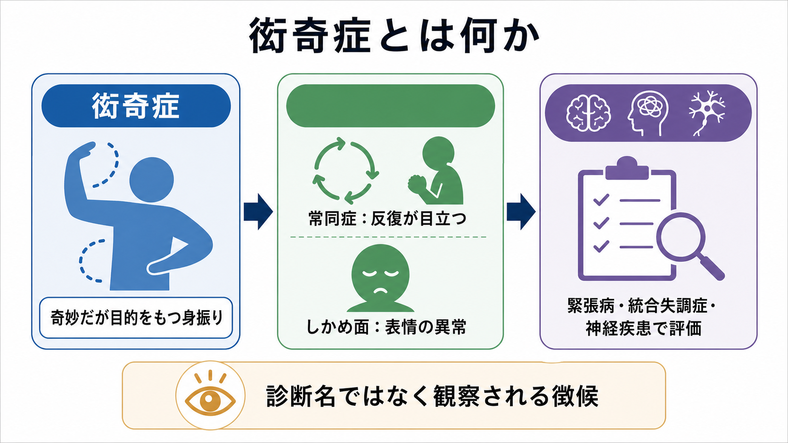
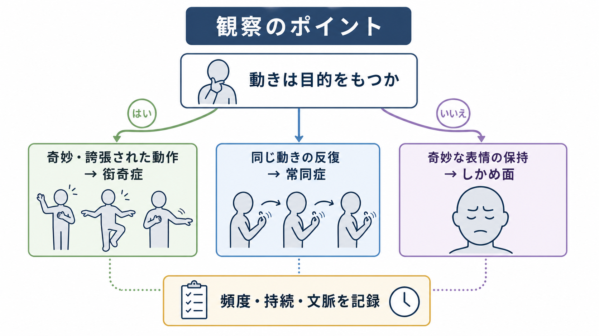
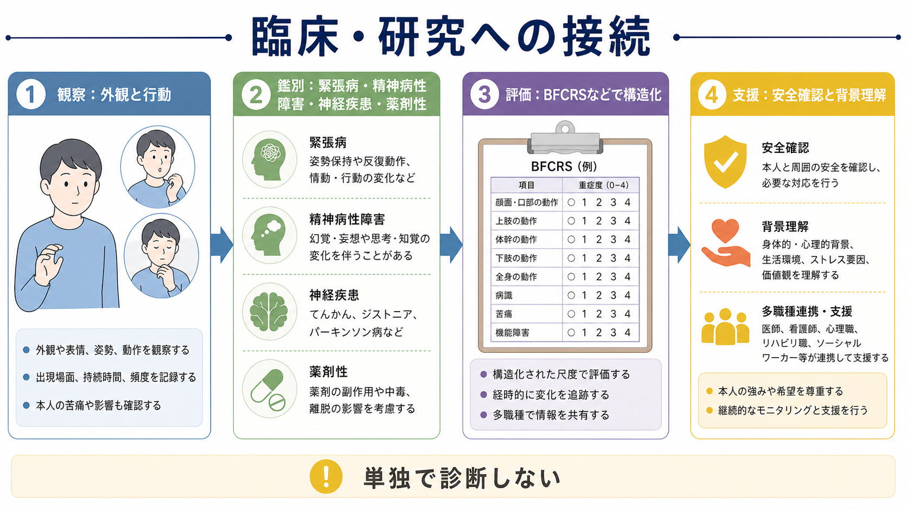

# 衒奇症とは何か

## 要点

- 衒奇症は、精神医学の症候学では「奇妙・不自然・誇張されているが、ある程度目的をもつように見える身振りや行動」を指す観察用語である[1][2]。
- 診断名ではなく、[[精神症候学とは何か|精神症候学]]や[[精神状態診察MSEとは何か|MSE]]で記述される徴候である。
- 緊張病の評価では、常同症、しかめ面、反響動作、姿勢保持、無言、昏迷、興奮などと一緒に観察する必要がある[1][3]。
- 単独で疾患を決める所見ではない。精神病性障害、気分障害、神経疾患、発達特性、薬剤性症状、文化的文脈を含めて鑑別する[4][5]。

## この記事で答える問い

1. 衒奇症とは、どのような身振り・表情・行動を指すのか。
2. 常同症、しかめ面、チック、薬剤性の不随意運動と何が違うのか。
3. 臨床では、どのように観察し、記録し、鑑別につなげるのか。
4. 緊張病や統合失調症研究では、なぜこのような運動症状が重要になるのか。

## まず結論

衒奇症は、目立つ奇妙さそのものを笑ったり、人格特徴として決めつけたりする言葉ではない。面接中のあいさつ、歩き方、座り方、手の動かし方、発話時の身振り、表情の作り方が、場面に比べて不自然に誇張され、通常の動作の「戯画」のように見えるときに使われる記述語である[1][2]。

ただし、衒奇症と呼ぶ前に、観察された動きが本当に随意的な動作なのか、反復運動なのか、表情の固定なのか、薬剤性の不随意運動なのかを分ける必要がある。したがって、[[MSEで外観と行動から何を観察するか|外観と行動のMSE]]では、「奇妙だった」とまとめず、どの部位が、いつ、どの文脈で、どれくらい続き、本人が止められるか、生活機能に影響するかを記録する。

## 背景

緊張病は、運動、発話、反応性、情動表出にまたがる精神運動症候群である。DSM系の説明では、緊張病の候補症状に昏迷、カタレプシー、蝋屈症、無言、拒絶症、姿勢保持、衒奇症、常同症、外的刺激に影響されない興奮、しかめ面、反響言語、反響動作が含まれる[2][6]。ICD-11でも、異常な精神運動活動の一部として、衒奇症、常同症、しかめ面、姿勢保持、反響現象などが整理されている[1]。

歴史的には、衒奇症や常同症は統合失調症や緊張病の記述の中で扱われてきた。近年は、緊張病が統合失調症だけでなく、気分障害、医学的疾患、神経疾患、薬剤・物質、発達症と関連しうることが強調されている[5][6]。そのため、衒奇症を見たときも「統合失調症らしい」と短絡せず、症候群、経過、身体疾患、薬剤、物質使用、発達歴を含めて評価する必要がある。

## 基本概念

### 衒奇症

衒奇症は、通常の目的をもつ行為が、場面にそぐわないほど誇張され、奇妙で、戯画化されたように見える場合に使われる。例として、つま先立ちで歩く、通行人に敬礼する、ありふれた動作を芝居がかった形で行う、といった説明がBFCRSで用いられる[3]。重要なのは、異常が「その行為の仕方そのもの」にある点である。

### 常同症

常同症は、反復的で、頻度が異常に高く、目標に向かわない運動として整理される[1][3]。同じ指遊び、体をなでる、同じ姿勢や動きを繰り返すなどが典型であり、異常は行為そのものよりも、反復の強さ、頻度、文脈から見た不自然さにある。衒奇症と常同症は重なりうるが、前者は「奇妙に様式化された動作」、後者は「反復性」が中心になる。

### しかめ面

しかめ面は、奇妙または歪んだ表情を保つ、あるいは反復的に示す所見である[1][3]。表情の異常は、[[感情平板化とは何か|感情表出の低下]]や不安、疼痛、ジストニア、チック、薬剤性不随意運動とも紛らわしい。顔面・口部・頸部の動きでは、抗精神病薬などに関連する急性ジストニア、アカシジア、遅発性ジスキネジアも鑑別に入る。

### チック・不随意運動との違い

チックは、突然で、反復的で、非律動的な運動または発声として現れ、前駆衝動や一時的抑制可能性が問題になることがある。薬剤性不随意運動では、口舌部、顔面、四肢、体幹の不随意な動きが薬剤変更や用量、使用期間と関連することがある。衒奇症を評価するときは、[[薬剤性精神症状とは何か|薬剤性精神症状]]、神経疾患、物質使用、睡眠不足、疼痛などを確認する。

## 仕組み

衒奇症の「仕組み」は、単一の脳部位や単一の心理機制で説明できるものではない。現時点では、緊張病や統合失調症における精神運動症状の一部として、皮質-基底核-視床-皮質回路、運動開始・停止の調整、情動・意欲、予測と行為選択、薬剤性運動症状などが重なって検討される[5][7]。

一方で、臨床記述では「機序の推定」よりも、「どのような行動が観察されたか」を精密に書く方が先である。たとえば「奇妙な動きあり」ではなく、「入室時に右手を額へ大きく振り上げて敬礼するような動作を毎回行う。質問に答える前にも同じ動作が出る。本人は動作について明確に説明しない」のように記録する。こうすると、衒奇症、常同症、強迫行為、チック、演技的行動、文化的習慣のどれに近いかを後から検討しやすい。

## 図解

図1は、衒奇症を「診断名」ではなく、観察される精神運動徴候として位置づける概念地図である。図2は、奇妙な動作を見たときに、目的性、反復性、表情、頻度、持続、文脈を分けて観察する流れを示している。図3は、外観と行動の観察から、鑑別、構造化評価、支援へ進む臨床的な接続をまとめている。

## 臨床・研究との接続

### MSEでの観察

MSEでは、衒奇症を「見た印象」ではなく、観察可能な行動として記録する。具体的には、部位、動作内容、開始契機、持続時間、頻度、反復性、本人の自覚、苦痛、抑制可能性、場面依存性、周囲への影響を確認する。[[精神状態診察MSEとは何か|MSE]]全体の中では、外観と行動、発話、気分・感情、思考過程、思考内容、知覚、認知、病識・判断力と照合して意味づける。

### 緊張病評価

緊張病が疑われるときは、衒奇症だけでなく、昏迷、無言、凝視、姿勢保持、拒絶症、常同症、しかめ面、反響言語、反響動作、興奮、離脱、自律神経症状などをまとめて見る。BFCRSは、緊張病のスクリーニングと重症度評価で広く使われ、しかめ面、常同症、衒奇症を別項目として扱う[3]。これは、似た所見を一語で済ませず、臨床的に追跡可能な形へ分けるために有用である。

### 鑑別診断

衒奇症様の動作があるとき、[[鑑別診断とは何か|鑑別診断]]では少なくとも次を検討する。

| 観察される特徴 | 近い候補 | 確認したいこと |
|---|---|---|
| 奇妙だが目的をもつように見える身振り | 衒奇症 | 動作そのものが場面に比べて戯画的か |
| 同じ動作を何度も繰り返す | 常同症、強迫行為、チック | 反復性、前駆衝動、抑制可能性、目的感 |
| 顔面・口部の歪みや固定 | しかめ面、ジストニア、遅発性ジスキネジア | 薬剤歴、筋緊張、疼痛、随意性 |
| 落ち着かず歩き回る | 焦燥、アカシジア、緊張病性興奮 | 主観的内的静坐不能、薬剤変更、外的刺激との関係 |
| 反応が乏しく動かない | [[精神運動制止とは何か|精神運動制止]]、昏迷、せん妄 | 意識水準、反応性、身体疾患、急性経過 |

### 統合失調症研究との接続

統合失調症では、幻覚・妄想や思考障害だけでなく、運動症状も古くから記述されてきた。レビューでは、カタトニア、神経学的ソフトサイン、パーキンソニズム、異常不随意運動、精神運動遅滞、陰性症状などが重なり合い、定義の不一致や薬剤影響が研究上の難点になると整理されている[7]。この意味で、衒奇症は小さな観察語に見えても、精神運動症状をどう分類し、どう測定するかという研究上の問題に接続している。

## よくある誤解

### 誤解1: 衒奇症は「目立ちたがり」や「変な性格」のこと

衒奇症は人格評価ではない。臨床で使う場合は、奇妙に見える動作を、病態、文脈、神経学的所見、薬剤、文化的背景の中で記述するための用語である。本人をからかったり、道徳的に評価したりするための言葉ではない。

### 誤解2: 衒奇症があれば統合失調症である

衒奇症は統合失調症だけに特異的な所見ではない。緊張病は気分障害、医学的疾患、神経疾患、薬剤・物質、発達症とも関連しうる[5][6]。診断には、症状のまとまり、時間経過、身体所見、検査、生活機能、本人の体験を含めた総合評価が必要である。

### 誤解3: 見ればすぐに衒奇症・常同症・チックを区別できる

実際には区別が難しいことが多い。動作の目的性、反復性、頻度、部位、抑制可能性、主観的衝動、薬剤歴、神経学的所見を見ないと、同じ「奇妙な動き」に見えても別の意味をもつ。

### 誤解4: 画像や動画だけで診断できる

画像や動画は観察を助けることがあるが、単独で診断はできない。衒奇症は文脈依存的な所見であり、面接場面、生活歴、文化的背景、薬剤、身体疾患、意識状態と合わせて判断する必要がある。

## 関連ノート

- [[精神症候学とは何か]]
- [[症状と徴候は何が違うのか]]
- [[精神状態診察MSEとは何か]]
- [[MSEで外観と行動から何を観察するか]]
- [[DSMとICDは何が違うのか]]
- [[鑑別診断とは何か]]
- [[薬剤性精神症状とは何か]]
- [[精神運動制止とは何か]]
- [[せん妄とは何か]]
- [[幻覚とは何か]]
- [[妄想とは何か]]
- [[認知機能障害は統合失調症でなぜ重要なのか]]

MOC更新候補:

- `content/00_MOC/MOC｜症候学.md`
- `content/00_MOC/MOC｜精神医学.md`
- `content/00_MOC/MOC｜総論・診断・面接.md`

並列ジョブとの競合を避けるため、このタスクではMOC本体は更新しない。

## 理解チェック

1. 衒奇症と常同症の違いを、「目的性」と「反復性」という言葉を使って説明できるか。
2. しかめ面を見たとき、緊張病以外にどのような鑑別を考えるべきか。
3. MSEで「奇妙な動作」とだけ書くと、どのような臨床情報が失われるか。
4. 衒奇症が単独で診断名にならない理由を説明できるか。
5. 薬剤性不随意運動と衒奇症様の動作を区別するために、どの情報を確認するか。

## 参考文献

[1] Rogers JP, Wilson JE, Oldham MA. (2025). Catatonia in ICD-11. *BMC Psychiatry, 25*, 405. Table 2: Features of catatonia in ICD-11 and DSM-5-TR. https://bmcpsychiatry.biomedcentral.com/articles/10.1186/s12888-025-06857-6/tables/2

[2] UCL Faculty of Brain Sciences. *Diagnosis: Catatonia*. https://www.ucl.ac.uk/brain-sciences/psychiatry/our-research/catatonia/diagnosis

[3] University of Rochester Medical Center. *Bush-Francis Catatonia Rating Scale*. https://www.urmc.rochester.edu/psychiatry/divisions/collaborative-care-and-wellness/bush-francis-catatonia-rating-scale/bfcrs

[4] Wilson JE, et al. (2023). Describing the features of catatonia: a comparative phenotypic analysis. *Schizophrenia Bulletin Open*. https://pmc.ncbi.nlm.nih.gov/articles/PMC9938840/

[5] Medina Y, et al. (2024). Mannerisms and stereotypies in catatonia: beyond simple motor movements. *Frontiers in Psychiatry*. https://pmc.ncbi.nlm.nih.gov/articles/PMC11424461/

[6] Iyer V, Spurling BC, Rizvi A. *Catatonia*. StatPearls. NCBI Bookshelf. Last Update: 2025-12-13. https://www.ncbi.nlm.nih.gov/books/NBK430842/

[7] Walther S, Strik W. (2012). Motor symptoms and schizophrenia. *Neuropsychobiology, 66*(2), 77-92. https://doi.org/10.1159/000339456
