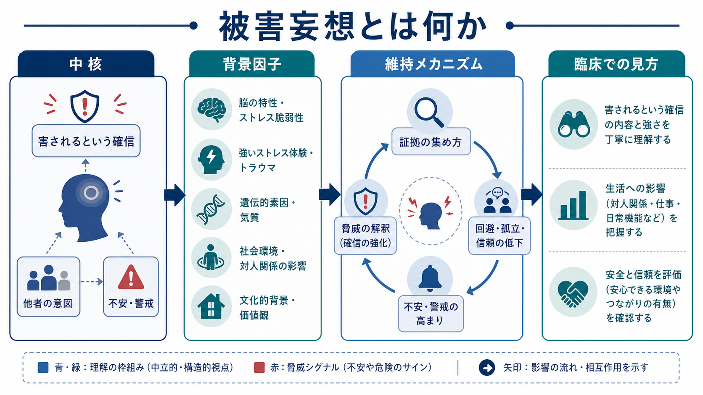
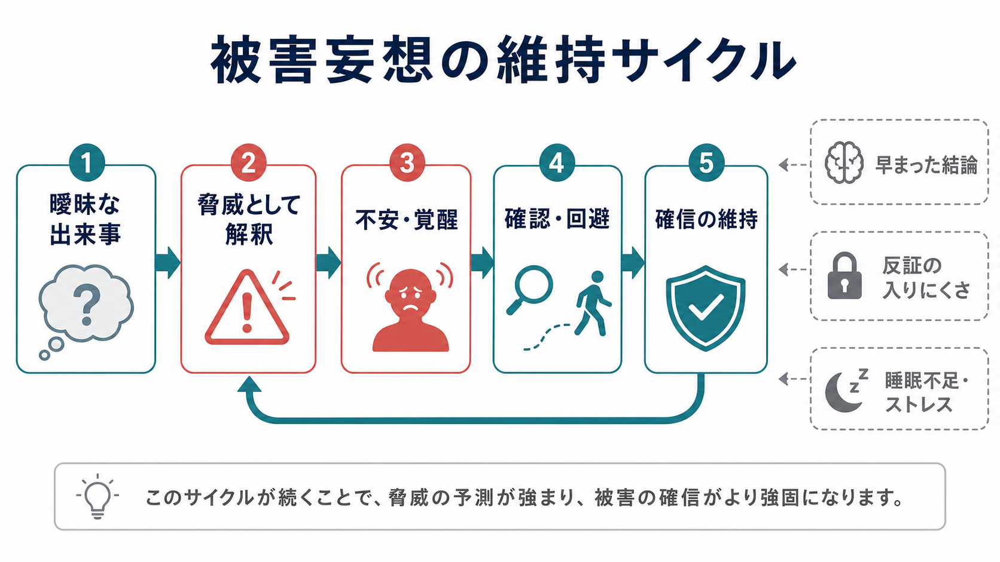

# 被害妄想とは何か

## 要点

- 被害妄想とは、「誰か・何かが自分を害しようとしている」という考えが、強い確信を伴い、反証によっても修正されにくい状態である。
- 内容は「悪口を言われている」「監視されている」「毒を盛られる」「組織に狙われている」など多様だが、中核は「害」と「他者の意図」の結びつきにある[1][3]。
- 被害妄想は単なる疑い深さではなく、不安、警戒、睡眠、ストレス、推論バイアス、異常な知覚体験、社会的逆境などが重なって維持されることが多い[4][5]。
- 臨床では、内容の真偽をその場で論破するより、確信度、苦痛、行動への影響、安全性、併存する幻覚・気分症状・物質使用・身体疾患を丁寧に評価する。
- 本稿は教育・研究目的の整理であり、個別の診断や治療指示ではない。

## この記事で答える問い

1. 被害妄想は、通常の警戒心や不安と何が違うのか。
2. どのような認知・情動・社会的要因が、被害的な確信を強めるのか。
3. 臨床面接では、どの点を観察し、どの点を慎重に扱うべきか。
4. 研究では、被害妄想はどのような症状次元・メカニズムとして扱われているのか。

## まず結論

被害妄想は、「危険を予測する心の働き」が過剰になっただけでは説明しきれない。重要なのは、曖昧な出来事が「自分への害意」として解釈され、その解釈が不安・覚醒・確認行動・回避行動によってさらに強まり、生活の中で反証が入りにくくなる点である[3][4]。

たとえば、隣人の物音を「偶然の生活音」と考える余地が狭まり、「自分を威嚇している」と確信される。職場の同僚の小声が「自分を陥れる相談」と感じられる。スマートフォンの通知や広告が「監視の証拠」と結びつくこともある。ここでは、知覚された出来事そのものよりも、「それが自分に向けられた害意を示す」という意味づけが問題の中心になる。

この点で、被害妄想は[[不安とは何か|不安]]、[[認知バイアスとは何か|認知バイアス]]、[[精神症候学とは何か|精神症候学]]、[[MSEで思考内容をどう評価するか|MSEでの思考内容評価]]と深く関係する。

## 背景

DSM-5-TR では、妄想は反証があっても変わりにくい固定した信念として扱われ、被害型は「自分が迫害される、だまされる、監視される、毒を盛られる、悪意を向けられる」といった主題をもつ[1]。NICE の精神病・統合失調症ガイドラインでも、妄想は幻覚と並ぶ主要な陽性症状として位置づけられる[2]。

ただし、被害妄想は診断名そのものではない。統合失調症スペクトラム、妄想症、気分障害に伴う精神病症状、認知症やせん妄、物質・医薬品の影響、神経疾患、強いストレス状況など、複数の文脈で見られうる。したがって、記事名としての「被害妄想」は、診断ラベルではなく「思考内容の症候」を指す。

日常的な警戒心も、人間にとって必要な認知機能である。相手が信頼できるか、危険があるかを判断することは、社会生活に不可欠である。しかし、被害妄想では、その判断が強い確信と苦痛を伴い、生活上の選択や対人関係を狭める方向に働きやすい[3]。

## 基本概念

### 被害妄想の中核

被害妄想の中核は、次の二つで整理できる。

| 軸 | 内容 | 評価で見る点 |
|---|---|---|
| 害の予測 | 自分が傷つけられる、監視される、だまされる、攻撃されるという予測 | どのような害を予測しているか、差し迫り感はどの程度か |
| 意図の帰属 | その害が偶然ではなく、誰かの意図によると考える | 誰が、なぜ、どのように害すると考えているか |

ここで大切なのは、本人にとっては「ありえない考え」ではなく「切迫した現実」として経験されることである。そのため、臨床では「それは妄想です」と結論だけを伝えても、体験の理解にはつながりにくい。

### 通常の疑い・不安との違い

通常の疑いは、追加情報によって柔軟に変化しやすい。被害妄想では、反証が「証拠隠し」「相手の巧妙さ」「まだ表に出ていないだけ」と解釈され、信念体系の中に取り込まれることがある。

また、[[強迫観念とは何か|強迫観念]]では「自分でも不合理だと思うが、頭から離れない」という自我違和感が前景に出やすい。一方、被害妄想では「実際に危険がある」という確信が前景に出やすい。ただし現実の臨床では、疑い、強迫的確認、不安、トラウマ反応、解離、幻覚が重なり、明確に切り分けにくいこともある。

### 関係妄想・追跡妄想との近さ

「テレビやSNSの発言が自分へのメッセージだ」と感じる関係的な解釈や、「誰かに尾行されている」と感じる追跡的な解釈は、被害的な意味づけと結びつきやすい。症候学的には、内容、確信度、根拠の扱い方、生活への影響を分けて記述することが重要である。

## 仕組み

### 維持サイクル

被害妄想は、しばしば次のような循環として理解できる。

1. 曖昧な出来事が起こる。
2. それが脅威として解釈される。
3. 不安・覚醒・警戒が高まる。
4. 確認、回避、相手への接触、検索、録音、相談の反復が増える。
5. 反証に触れる機会が減り、確信が維持される。

この循環は、本人の「考え方が悪い」という意味ではない。むしろ、危険を避けようとする自然な努力が、短期的には安心をもたらし、長期的には被害的な解釈を固定しやすくする、という機能的な理解である[4][5]。

### 推論バイアス

妄想研究では、少ない証拠で結論に到達しやすい「早まった結論」傾向が繰り返し検討されてきた。メタ分析では、精神病圏の人々でこの傾向が比較的強く見られることが示されている[6]。ただし、これだけで被害妄想を説明することはできない。推論バイアスは、ストレス、睡眠不足、情動、社会的孤立、過去の被害経験、知覚異常と組み合わさって意味をもつ。

### 異常なサリエンスと意味づけ

精神病の生物学的モデルでは、ドパミン系の異常なサリエンス付与が、ふだんなら目立たない出来事を「特別な意味がある」と感じさせる可能性が論じられてきた[7]。この見方では、被害妄想は単なる誤った信念ではなく、「世界の出来事が自分に向けて不穏に意味づけられる」経験として理解される。

この観点は[[予測処理とは何か|予測処理]]とも接続できる。脅威予測の重みが高まり、曖昧な感覚入力や社会的手がかりが、その予測に沿って解釈されると、本人にとっては「やはり危険がある」という感覚が強化される。

## 図解

| 図 | 読み方 |
|---|---|
| 図1 | 被害妄想を「中核」「背景因子」「維持メカニズム」「臨床での見方」に分け、全体像を示している。 |
| 図2 | 曖昧な出来事が脅威解釈、不安、確認・回避、確信維持へ進み、再び脅威解釈に戻る循環を示している。 |

## 臨床・研究との接続

### 面接で確認すること

臨床評価では、次の点を分けて聞く。

| 観点 | 確認すること |
|---|---|
| 内容 | 誰が、何を、どのように害すると考えているか |
| 確信度 | どの程度確信しているか、揺らぎはあるか |
| 根拠 | 何を証拠としているか、反証をどう扱うか |
| 苦痛 | 恐怖、不眠、怒り、疲労、孤立がどの程度あるか |
| 行動 | 確認、回避、通報、対決、録音、検索、外出制限など |
| 安全性 | 自傷他害、衝動性、物質使用、被害に対する防衛行動 |
| 背景 | 身体疾患、薬剤、物質、せん妄、認知症、トラウマ、文化的文脈 |

この評価は[[鑑別診断とは何か|鑑別診断]]に直結する。とくに急性発症、意識変容、見当識障害、発熱、薬剤変更、物質使用がある場合は、[[せん妄とは何か|せん妄]]や身体疾患を含む評価が重要になる。

### 治療研究との接続

被害妄想への介入研究では、妄想内容そのものを直接論破するより、維持因子に焦点を当てる試みが進んできた。たとえば、心配に焦点を当てた認知行動療法のランダム化比較試験では、心配の低下が被害妄想の改善と関連することが示されている[8]。これは、被害妄想を「固定した信念」だけでなく、「不安・心配・警戒の循環」として扱う意義を示す。

ただし、個別の治療方針は診断、重症度、安全性、本人の希望、家族・支援環境、薬物療法の適応、身体疾患の有無によって大きく変わる。本稿は治療法の選択を指示するものではない。

## よくある誤解

### 誤解1: 被害妄想は「性格の問題」である

被害妄想は、単なる性格傾向として片づけられない。強い不安、睡眠、ストレス、認知バイアス、知覚異常、社会的逆境、精神疾患や身体疾患が関わりうる症候である[3][4]。

### 誤解2: 内容が事実でなければ、すぐ妄想と判断できる

内容の真偽だけでは不十分である。現実に被害や差別、ハラスメント、ストーキングが存在する場合もある。重要なのは、根拠の性質、確信度、反証の扱い方、苦痛、生活障害、安全性を合わせて評価することである。

### 誤解3: 妄想は説得すれば消える

強い確信を伴う妄想では、正面からの反論が不信感を強めることがある。支援では、本人の恐怖や困りごとを理解し、安全を確保しながら、生活への影響や対処の幅を扱う必要がある。

### 誤解4: 被害妄想のある人は危険である

精神病症状がある人を一律に危険視するのは誤りである。NIMH は、統合失調症のある人の多くは暴力的ではなく、むしろ害を受けやすいことも強調している[3]。ただし、強い恐怖、物質使用、切迫した防衛行動、自傷他害リスクがある場合は、安全評価が必要である。

## 関連ノート

既存ノート:

- [[精神症候学とは何か]]
- [[MSEで思考内容をどう評価するか]]
- [[鑑別診断とは何か]]
- [[不安とは何か]]
- [[強迫観念とは何か]]
- [[認知バイアスとは何か]]
- [[予測処理とは何か]]
- [[サリエンスネットワークとは何か]]
- [[せん妄とは何か]]
- [[DSMとICDは何が違うのか]]

今後の作成候補:

- 関係妄想とは何か
- 追跡妄想とは何か
- 誇大妄想とは何か
- 妄想の確信度をどう評価するか
- 精神病症状とトラウマ反応はどう鑑別するのか

MOC更新候補:

- `content/00_MOC/` 配下の精神医学・症候学関連 MOC に、バッチ統合時に `[[被害妄想とは何か]]` を追加する。

## 理解チェック

1. 被害妄想における「害」と「他者の意図」は、どのように結びつくか。
2. 通常の警戒心と被害妄想を分けて考えるとき、確信度、反証、生活への影響はどのように役立つか。
3. 早まった結論、心配、回避行動は、被害妄想の維持にどのように関わるか。
4. 被害妄想を評価するとき、なぜ身体疾患、薬剤、物質、せん妄、文化的文脈を確認する必要があるか。
5. 「妄想は説得すれば消える」という理解には、どのような限界があるか。

## 参考文献

[1] American Psychiatric Association. (2022). *Diagnostic and Statistical Manual of Mental Disorders* (5th ed., text rev.; DSM-5-TR). American Psychiatric Association Publishing. https://doi.org/10.1176/appi.books.9780890425787

[2] National Institute for Health and Care Excellence. (2014). *Psychosis and schizophrenia in adults: prevention and management* (NICE guideline CG178). NCBI Bookshelf. https://www.ncbi.nlm.nih.gov/books/NBK555203/

[3] National Institute of Mental Health. (2024). *Schizophrenia*. https://www.nimh.nih.gov/health/publications/schizophrenia

[4] Freeman, D. (2016). Persecutory delusions: a cognitive perspective on understanding and treatment. *The Lancet Psychiatry, 3*(7), 685-692. https://doi.org/10.1016/S2215-0366(16)00066-3

[5] Freeman, D., & Garety, P. (2014). Advances in understanding and treating persecutory delusions: a review. *Social Psychiatry and Psychiatric Epidemiology, 49*, 1179-1189. https://pmc.ncbi.nlm.nih.gov/articles/PMC4108844/

[6] McLean, B. F., Mattiske, J. K., & Balzan, R. P. (2017). Association of the jumping to conclusions and evidence integration biases with delusions in psychosis: a detailed meta-analysis. *Schizophrenia Bulletin, 43*(2), 344-354. https://doi.org/10.1093/schbul/sbw056

[7] Kapur, S. (2003). Psychosis as a state of aberrant salience: a framework linking biology, phenomenology, and pharmacology in schizophrenia. *American Journal of Psychiatry, 160*(1), 13-23. https://doi.org/10.1176/appi.ajp.160.1.13

[8] Freeman, D., Dunn, G., Startup, H., Pugh, K., Cordwell, J., Mander, H., Cernis, E., Wingham, G., Shirvell, K., & Kingdon, D. (2015). Effects of cognitive behaviour therapy for worry on persecutory delusions in patients with psychosis (WIT): a parallel, single-blind, randomised controlled trial with a mediation analysis. *The Lancet Psychiatry, 2*(4), 305-313. https://pmc.ncbi.nlm.nih.gov/articles/PMC4698664/
