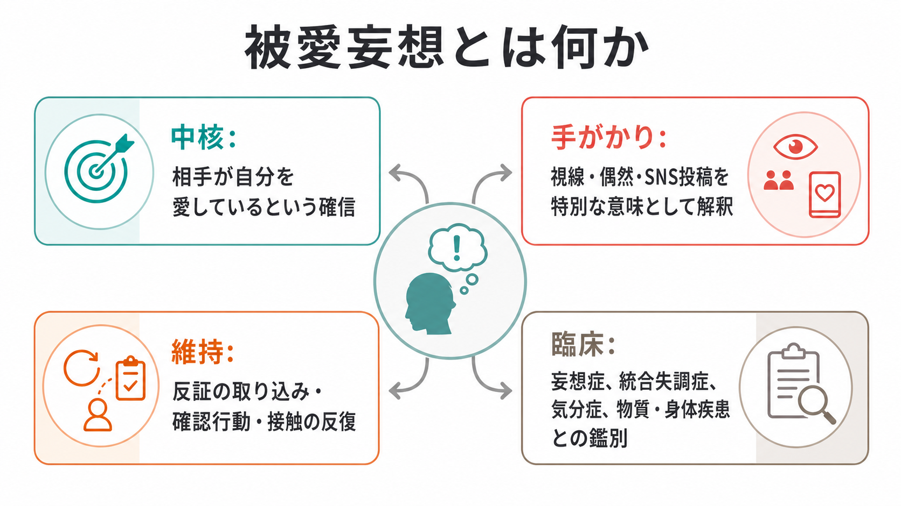
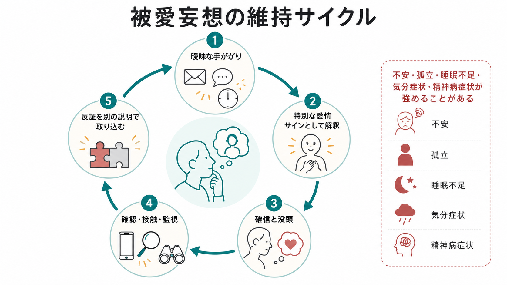
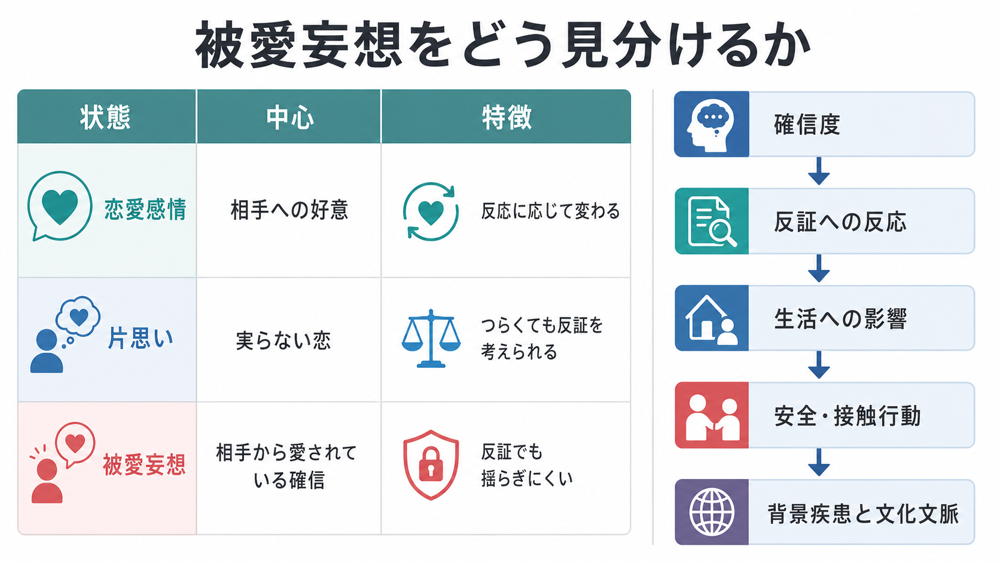

# 被愛妄想とは何か

## 要点

- 被愛妄想とは、「相手が自分を愛している」「相手が自分に恋愛的な合図を送っている」と、十分な根拠がないにもかかわらず強く確信する[[妄想とは何か|妄想]]である[1][2]。
- DSM 系の分類では妄想症の主題の一つとして、ICD-11 でも妄想症の典型的な内容の一つとして扱われる。ただし、被愛妄想それ自体は一つの診断名ではなく、思考内容の症候として記述するのが安全である[2][3]。
- 恋愛感情や片思いと違い、被愛妄想では反証が入りにくく、相手の拒否、沈黙、偶然の一致まで「隠された愛情の証拠」として取り込まれることがある[4][6]。
- 統合失調症スペクトラム、妄想症、気分症、物質・薬剤、神経疾患、認知症、せん妄など複数の背景で生じうるため、評価では[[鑑別診断とは何か|鑑別診断]]と安全確認が重要になる[2][6][7]。
- 本記事は教育・研究目的の整理であり、個別の診断、治療、法的判断を行うものではない。

## この記事で答える問い

1. 被愛妄想とは、通常の恋愛感情や片思いと何が違うのか。
2. どのような出来事が「愛情の証拠」として解釈されやすいのか。
3. 被愛妄想はどのように維持され、臨床ではどの点を評価するのか。
4. ストーキング、SNS、背景疾患、文化文脈とはどのように接続するのか。

## まず結論

被愛妄想の中心は、「自分が相手を好きである」ではなく、「相手が自分を愛している」という確信である。相手は有名人、医療者、教師、職場の相手、SNS 上の人物、ほとんど接点のない人物などでありうる。古典的には、相手が本人より高い社会的地位にあると記述されてきたが、現代の臨床ではそれだけに限定されない[4][6]。

重要なのは、内容が恋愛に見えることではなく、確信の強さ、反証への反応、生活への影響、接触・確認行動、安全上の問題である。たとえば、相手の沈黙を「周囲に隠しているから」と解釈したり、拒否を「本当は好きだが立場上そう言っている」と解釈したりする場合、信念体系が反証を吸収して維持されることがある[6][7]。

この点で被愛妄想は、[[関係妄想とは何か|関係妄想]]、[[被害妄想とは何か|被害妄想]]、[[注察妄想とは何か|注察妄想]]、[[精神症候学とは何か|精神症候学]]と深く関係する。恋愛の問題としてだけではなく、「社会的手がかりをどう意味づけるか」という思考内容の問題として読む必要がある。

## 背景

被愛妄想は、英語では erotomania、erotomanic delusion、または de Clerambault syndrome と呼ばれる。歴史的には「恋に苦しむ状態」や「情熱の精神病」など、時代ごとに異なる意味で使われてきた。Berrios と Kennedy は、エロトマニア概念が古典的な恋愛病から、現代的な妄想主題へと変化してきた経緯を整理している[5]。

古典的記述では、相手が高い社会的地位にある、本人への愛情を先に抱いたのは相手である、相手はさまざまな合図で愛を伝えている、という構造が強調された[4]。ただし、現代の診療では、性別、年齢、性的指向、相手との関係性、SNS やメディア環境、文化文脈を含めて幅広く考える必要がある。古典的な「女性が高位の男性に愛されていると信じる」という型だけに固定すると、男性、若年者、同性対象、オンライン上の対象、二次性の症例を見落としやすい。

ICD-11 の妄想症では、妄想または関連する妄想群が通常 3 か月以上持続し、統合失調症に特徴的な持続的幻覚、著しい思考解体、陰性症状などが前景でない場合が記述される。被愛的内容は、被害、身体、誇大、嫉妬などと並ぶ典型的主題の一つとして挙げられる[2]。DSM-5-TR でも、妄想症の erotomanic type は「他者が自分に恋愛感情を抱いている」という主題で整理される[3]。

## 基本概念

### 中核

被愛妄想の中核は、次の三つで整理できる。

| 軸 | 内容 | 評価で見る点 |
|---|---|---|
| 確信 | 相手が自分を愛している、合図を送っていると信じる | 確信度、揺らぎ、反証への反応 |
| 解釈 | 視線、偶然、SNS 投稿、沈黙、拒否を特別な意味として読む | どの出来事が証拠化されるか |
| 行動化 | 確認、連絡、待ち伏せ、検索、贈り物、接近などにつながる | 本人と相手の安全、生活機能への影響 |

被愛妄想は「恋愛感情が強い」ことと同じではない。恋愛感情では、自分の感情が中心にある。片思いでは、実らないつらさがあっても、相手の反応や現実の制約をある程度考慮できる。被愛妄想では、相手の内面に関する確信が固定し、反証が別の説明に置き換えられやすい。

### 関係妄想との近さ

被愛妄想では、周囲の出来事が自分への恋愛的な合図として読まれることがある。たとえば、テレビ番組の言葉、SNS の投稿時刻、相手の服装、偶然の遭遇、第三者の発言が、「自分に向けた暗号」として意味づけられる。この構造は[[関係妄想とは何か|関係妄想]]に近い。

ただし、関係妄想の主題は恋愛に限らない。被害、使命、誇大、宗教、罪業などの意味づけもありうる。被愛妄想は、その自己関連づけが「相手からの愛情」に組織化された場合として理解できる。

### 強迫観念との違い

[[強迫観念とは何か|強迫観念]]では、「自分でも不合理だと思うが、頭から離れない」という自我違和感が前景に出やすい。一方、被愛妄想では「相手が自分を愛しているのは事実だ」という確信が前景に出やすい。もちろん現実の臨床では、強迫的確認、不安、孤立、トラウマ反応、気分症状、幻覚、関係妄想が重なり、明確に分けにくいこともある。

## 仕組み

### 維持サイクル

被愛妄想は、しばしば次のような循環として理解できる。

1. 曖昧な手がかりが生じる。
2. それが「相手からの愛情サイン」として解釈される。
3. 確信、没頭、不安、期待が高まる。
4. 確認、検索、連絡、接触、監視などの行動が増える。
5. 反証が「周囲に隠している」「本当は好きだから拒否している」など別の説明で取り込まれる。

この循環は、本人の意思が弱いから起こるという意味ではない。むしろ、曖昧な社会的手がかりに強い意味が付与され、反証が入りにくくなると、本人にとっては信念体系全体が現実らしく見え続ける。Kelly は、一次性の被愛妄想と、精神疾患・神経疾患・身体疾患などを背景にもつ二次性の被愛妄想を区別して整理している[6]。

### 一次性と二次性

一次性の被愛妄想は、比較的限局した妄想主題として現れることがある。一方、二次性の被愛妄想は、統合失調症スペクトラム、双極症やうつ病に伴う精神病症状、認知症、神経疾患、物質・薬剤の影響など、より広い背景の一部として生じる[6][7]。

この区別は、原因を単純に一つに決めるためではなく、評価の漏れを減らすために重要である。急な発症、意識の変動、見当識障害、発熱、薬剤変更、物質使用、頭部外傷、神経症状がある場合は、[[せん妄とは何か|せん妄]]や身体疾患を含めた評価が必要になる。

### 社会的孤立と対象への没頭

Kennedy らの症例系列では、対象者の多くに孤立、パートナー不在、就労や社会参加の困難が見られた一方、被愛妄想のある人が常に危険であるという単純な像は支持されなかった[7]。この知見は、リスクを軽視してよいという意味ではない。むしろ、孤立、生活機能、接触行動、本人の苦痛、相手側への影響を個別に見る必要があることを示している。

## 図解

図1は、被愛妄想を「中核」「手がかり」「維持」「臨床での鑑別」に分けた概念地図である。図2は、曖昧な手がかりが愛情サインとして解釈され、確認行動と反証の取り込みによって維持される循環を示している。

図3は、恋愛感情、片思い、被愛妄想の比較と、臨床で確認する軸をまとめている。画像だけで判断せず、本文の評価軸と合わせて読むことが重要である。

## 臨床・研究との接続

### 面接で確認すること

面接では、信念を正面から否定するよりも、本人にとって何が起きていると感じられているのかを具体的に聞く。確認する軸は次のように整理できる。

| 観点 | 確認すること |
|---|---|
| 内容 | 誰が、どのように、どんな合図で愛情を示していると考えているか |
| 確信度 | どの程度確信しているか、揺らぎはあるか |
| 根拠 | 何を証拠とみなしているか、別の説明を考えられるか |
| 反証 | 拒否、沈黙、第三者の説明をどう解釈するか |
| 行動 | 連絡、待機、検索、贈り物、接近、監視、外出制限があるか |
| 影響 | 睡眠、仕事、学業、家族関係、対人関係への影響 |
| 安全 | 自傷他害、相手への接近、衝動性、物質使用、被害を受けるリスク |
| 背景 | 気分症状、幻覚、[[認知機能障害とは何か|認知機能障害]]、神経症状、薬剤、身体疾患、文化文脈 |

この評価は、個人を責めるためではない。本人の苦痛を理解し、相手側の安全も含めて、どの支援が必要かを見立てるためである。

### ストーキングとの関係

被愛妄想では、接触、手紙、電話、SNS、待ち伏せ、贈り物、監視などが問題になることがある。Mullen と Pathe は、法精神医学的実践で出会った erotomania 症例において、対象者への追跡や接近が問題化した例を報告している[8]。ただし、これは法精神医学サンプルであり、被愛妄想のある人すべてが危険であるという根拠にはならない。

臨床的には、「危険な人かどうか」というラベルづけではなく、具体的行動、切迫性、物質使用、衝動性、相手の拒否への反応、第三者を巻き込む可能性、本人が被害を受ける可能性を評価する。必要に応じて、医療、家族支援、福祉、危機介入、法的資源が連携する。

### SNS と現代的文脈

SNS では、投稿、既読、未読、いいね、アルゴリズムによる表示、配信者の発言、偶然の一致が、本人にとって非常に個人的な合図として感じられることがある。これは単に「SNS が原因」という意味ではない。曖昧な社会的手がかりが多く、相手の内面を推測しやすく、確認行動を反復しやすい環境が、信念の維持に関与しうるということである。

研究上は、被愛妄想を、社会的認知、自己関連づけ、確証バイアス、孤立、愛着、気分、精神病症状、デジタル環境の相互作用として読むことができる。ただし、現時点では単一のモデルで説明できる段階ではない。

## よくある誤解

### 誤解1: 被愛妄想は「恋愛体質」や「思い込みが強い性格」である

被愛妄想は、単なる性格傾向として片づけられない。反証に揺らぎにくい確信、生活機能への影響、接触行動、安全上の問題、背景疾患との関連をもつ精神症候である[2][6]。

### 誤解2: 相手への好意が強いほど被愛妄想である

中心は「自分が好き」ではなく「相手が自分を愛している」という確信である。恋愛感情や片思いでは、自分の気持ち、喪失感、嫉妬、期待が中心になることが多い。被愛妄想では、相手の内面についての確信が固定しやすい。

### 誤解3: 被愛妄想のある人は必ずストーカーになる

そうではない。接触行動や相手側への影響は重要な評価対象だが、すべての人が追跡や暴力に至るわけではない[7]。一方で、接近行動、拒否への反応、切迫性がある場合には安全評価を避けてはいけない[8]。

### 誤解4: 否定すればすぐに修正される

強い確信を伴う妄想では、直接の否定が不信感や孤立を強めることがある。支援では、本人の体験を肯定するのではなく、苦痛、睡眠、生活機能、確認行動、安全、別の説明を考えられる余地を丁寧に扱う必要がある。

## 関連ノート

既存ノート:

- [[妄想とは何か]]
- [[被害妄想とは何か]]
- [[関係妄想とは何か]]
- [[注察妄想とは何か]]
- [[精神症候学とは何か]]
- [[強迫観念とは何か]]
- [[不安とは何か]]
- [[せん妄とは何か]]
- [[認知機能障害とは何か]]

今後の作成候補:

- 妄想症とは何か
- ストーキングと精神医学
- 恋愛妄想と関係妄想はどう違うのか
- 妄想の確信度をどう評価するか
- SNS と精神病症状はどう関係するのか

MOC 更新候補:

- `content/00_MOC/` 配下の精神医学・症候学関連 MOC に、バッチ統合時に `[[被愛妄想とは何か]]` を追加する。

## 理解チェック

1. 被愛妄想の中心が「自分が相手を好き」ではなく「相手が自分を愛している」という確信であることは、評価上なぜ重要か。
2. 片思いと被愛妄想を分けて考えるとき、確信度、反証への反応、生活への影響はどのように役立つか。
3. SNS 投稿や偶然の一致が、被愛妄想ではどのように「証拠」として取り込まれうるか。
4. 被愛妄想を評価するとき、なぜ気分症状、精神病症状、物質・薬剤、身体疾患、せん妄、文化文脈を確認する必要があるか。
5. 被愛妄想とストーキングを結びつけて考えるとき、どのような単純化を避けるべきか。

## 参考文献

[1] National Center for Biotechnology Information. *Erotomanic Type Delusional Disorder*. MedGen; source: NCI Thesaurus. https://www.ncbi.nlm.nih.gov/medgen/452759

[2] World Health Organization. (2024). *Clinical descriptions and diagnostic requirements for ICD-11 mental, behavioural and neurodevelopmental disorders*. https://iris.who.int/bitstream/handle/10665/375767/9789240077263-eng.pdf

[3] American Psychiatric Association. (2022). *Diagnostic and Statistical Manual of Mental Disorders* (5th ed., text rev.; DSM-5-TR). American Psychiatric Association Publishing. https://doi.org/10.1176/appi.books.9780890425787

[4] Jordan, H. W., & Howe, G. (1980). De Clerambault syndrome (erotomania): a review and case presentation. *Journal of the National Medical Association, 72*(10), 979-985. https://pmc.ncbi.nlm.nih.gov/articles/PMC2552541/

[5] Berrios, G. E., & Kennedy, N. (2002). Erotomania: a conceptual history. *History of Psychiatry, 13*(52 Pt 4), 381-400. https://doi.org/10.1177/0957154X0201305202

[6] Kelly, B. D. (2005). Erotomania: epidemiology and management. *CNS Drugs, 19*(8), 657-669. https://doi.org/10.2165/00023210-200519080-00002

[7] Kennedy, N., McDonough, M., Kelly, B., & Berrios, G. E. (2002). Erotomania revisited: clinical course and treatment. *Comprehensive Psychiatry, 43*(1), 1-6. https://doi.org/10.1053/comp.2002.29856

[8] Mullen, P. E., & Pathe, M. (1994). Stalking and the pathologies of love. *Australian and New Zealand Journal of Psychiatry, 28*(3), 469-477. https://doi.org/10.3109/00048679409075876

## 未解決問題

- 被愛妄想に特異的な認知メカニズムと、妄想一般に共通する確証バイアス・自己関連づけ・異常な意味づけをどのように分けて研究できるか。
- オンライン環境、配信文化、SNS のアルゴリズム表示が、被愛妄想の内容や維持にどの程度影響するか。
- 一次性と二次性の被愛妄想を、臨床経過、治療反応、安全評価、生活支援の観点からどのように実用的に分類できるか。
