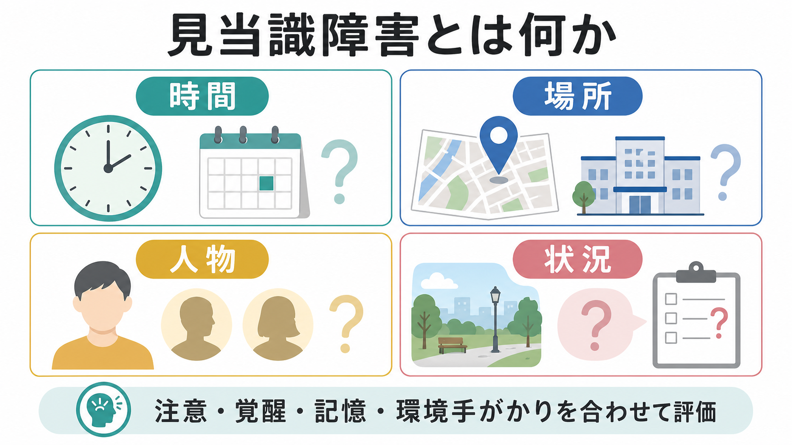
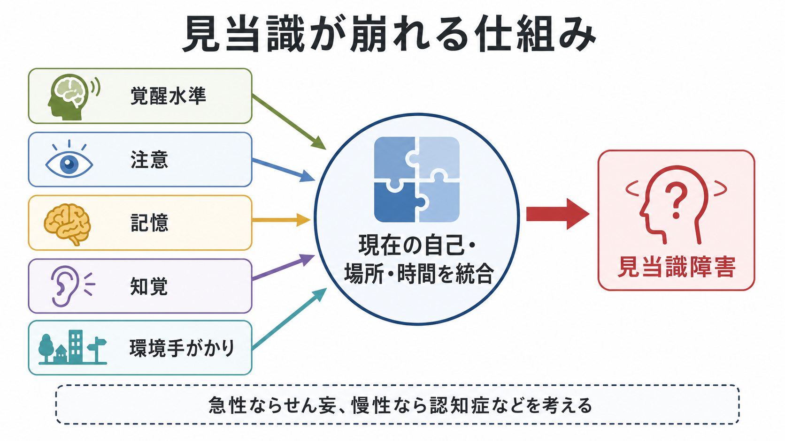
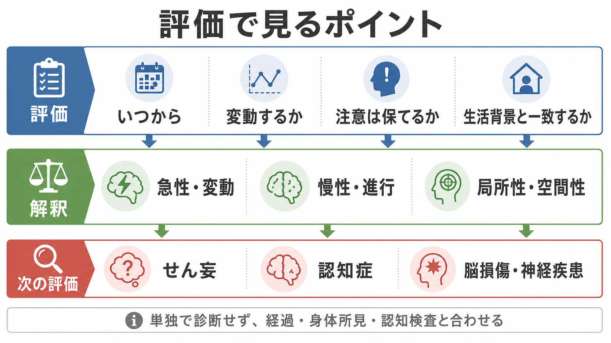

# 見当識障害とは何か

## 要点

- 見当識障害とは、「いまがいつか」「ここがどこか」「相手や自分が誰か」「いま何が起きている状況か」を、現在の文脈に合わせて把握しにくくなる状態である。
- 評価では、見当識そのものの質問より前に、覚醒水準、注意、聴力・視力、言語理解、文化・生活背景を確認する。
- 急性発症で日内変動があり注意障害を伴う場合は[[意識障害とは何か]]やせん妄を考える。慢性・進行性なら認知症、局所性が強ければ脳損傷や神経疾患を考える。
- 見当識障害は単独で診断名を決める所見ではなく、[[精神状態診察MSEとは何か]]、認知検査、身体所見、経過情報と合わせて解釈する。

## この記事で答える問い

1. 見当識障害は、単なる「日付を間違えること」と何が違うのか。
2. 時間・場所・人物・状況の見当識は、どの順序で評価するとよいのか。
3. せん妄、認知症、脳損傷では、見当識障害の意味がどう変わるのか。

## まず結論

見当識障害は、現在の自己を時間・場所・対人関係・状況の中に位置づける能力の障害である。臨床では「今日は何日ですか」「ここはどこですか」といった質問で評価されるが、実際には[[MSEで認知機能をどう評価するか]]の一部であり、注意、記憶、言語、知覚、環境手がかりの統合に依存する[1]。そのため、見当識の誤りだけを切り出して病名を推測するのではなく、発症時期、変動性、覚醒・注意の状態、背景疾患、薬剤、身体疾患を同時に見る必要がある[2][3]。

## 背景

見当識は、[[精神症候学とは何か]]の中では認知機能評価の入り口に位置づけられる。一般的な精神状態診察では、注意を確認したうえで、人物、時間、場所への見当識を尋ねる[1]。ただし実際の面接では、「状況の見当識」も重要である。たとえば、病院にいることは答えられても、なぜ診察を受けているのか、誰が支援者なのか、いま何を求められているのかが把握できない場合、生活上の安全や同意能力にも影響しうる。

見当識障害が臨床的に重要なのは、せん妄や認知症などの大きな診断カテゴリーと接続するからである。NICE のせん妄ガイドラインでは、せん妄は急性発症・変動性のある意識、認知、知覚の障害として整理され、見当識障害や混乱、記憶困難が観察されうる[2]。一方、認知症では時間や場所の混乱、慣れた場所で迷うこと、人物認知の低下が進行とともに問題になる[4]。

## 基本概念

### 時間の見当識

時間の見当識は、年、月、日、曜日、季節、時間帯、出来事の前後関係を把握する能力である。最も崩れやすく、疲労、入院環境、睡眠覚醒リズムの乱れ、感覚遮断でも揺らぎやすい。日付を一日間違える程度なら、生活文脈や緊張の影響も考える。急に「昼夜がわからない」「入院した日から経過がつながらない」といった状態になった場合は、せん妄や身体疾患を優先して考える[2][3]。

### 場所の見当識

場所の見当識は、現在いる建物、地域、病棟、自宅か外出先かを把握する能力である。空間認知やナビゲーションには海馬、嗅内皮質、海馬傍皮質、後部帯状皮質、頭頂葉、線条体などを含む広いネットワークが関与する[7]。そのため、場所の見当識障害は、記憶低下だけでなく、視空間認知、注意、環境手がかりの利用、身体を基準にした自己位置づけの問題としても理解できる。

### 人物の見当識

人物の見当識は、自分の名前、家族や医療者との関係、目の前の相手が誰かを把握する能力である。一般に、自己の名前がわからないほどの人物見当識障害は重い意識障害、重度のせん妄、進行した認知症などで問題になりやすい[1]。ただし、失語、相貌失認、聴覚障害、文化的背景、緊張や不信による応答困難と混同しない。

### 状況の見当識

状況の見当識は、「なぜここにいるのか」「いま何が行われているのか」「次に何をする必要があるのか」を理解する能力である。これは単なる記憶テストではなく、病識、判断、注意、作業記憶、社会的文脈の理解と重なる。[[MSEで病識と判断力をどう評価するか]]や[[同意能力の評価はどのように行うのか]]とも接続する。

## 仕組み

見当識は一つの独立した「見当識中枢」だけで成立するわけではない。まず覚醒水準が保たれ、注意が現在の手がかりに向けられ、短期記憶・エピソード記憶から現在位置を補い、視覚・聴覚・身体感覚から得た環境情報を統合する必要がある[1][3]。この観点では、[[皮質視床ループは意識や注意にどう関わるのか]]、[[アセチルコリンは注意や記憶にどう関わるのか]]、[[海馬回路は記憶をどう形成するのか]]、[[シータリズムは記憶とナビゲーションをどう支えるのか]]が関連する。

時間の見当識では、時計やカレンダーだけでなく、睡眠覚醒リズム、食事、面会、診療予定などの周期的手がかりが使われる。場所の見当識では、地図のような外界中心の表象と、自分の身体を基準にした自己中心的表象を切り替える必要がある。人の空間ナビゲーション研究では、海馬だけでなく海馬傍皮質、後部帯状皮質、頭頂葉、線条体が相補的に働くことが示されている[7]。

## 図解

上の図は、見当識を「覚醒・注意・記憶・知覚・環境手がかりの統合」として整理したものである。臨床的には、ここから次の順に確認すると解釈しやすい。

| 評価する点 | 見ること | 解釈の注意 |
|---|---|---|
| 覚醒 | 眠気、反応の遅さ、刺激で保てるか | 覚醒が低いと見当識質問の信頼性は下がる |
| 注意 | 会話を追えるか、質問を保持できるか | 注意障害が強いと、記憶障害のように見える |
| 時間 | 日付、曜日、季節、入院からの経過 | 最も崩れやすく、環境変化の影響も受ける |
| 場所 | 建物、病棟、地域、自宅との区別 | 視空間障害や環境手がかり不足も考える |
| 人物 | 自己、家族、医療者との関係 | 自己の名前の障害は重症度が高いことが多い |
| 状況 | 診察・入院・支援の目的理解 | 病識、判断、同意能力と重なる |

## 臨床・研究との接続

### せん妄

急性発症、日内変動、注意障害、睡眠覚醒リズムの乱れ、幻覚や精神運動変化を伴う場合は、せん妄を強く考える[2][3]。せん妄では、時間や場所の見当識が短時間で変動し、質問を繰り返すたびに答えが変わることがある。低活動型せん妄では、静かで眠そうに見えるため、単なる認知症や抑うつと誤認されやすい[2]。

### 認知症

認知症では、初期には最近の予定や日付、慣れない場所での迷いが目立ち、進行すると慣れた場所、家族関係、時間の流れの混乱が問題になる[4][5]。MMSE や MoCA には時間・場所の見当識項目が含まれ、スクリーニングや経過観察の手がかりになる[5][6]。ただし、得点だけで生活上のリスクや本人の困りごとは十分に表せないため、家族・支援者からの経過情報も重要である。

### 脳損傷・神経疾患

局所性の空間失見当、半側空間無視、失認、失語、記憶障害があると、見当識障害のように見えることがある。たとえば「ここがどこかわからない」という訴えが、場所記憶の障害なのか、視空間認知の障害なのか、言語で答えられないのかで意味は異なる。[[器質性精神障害を見逃さないためには何を見るべきか]]、[[鑑別診断とは何か]]と合わせて評価する。

### 現実見当識訓練との関係

認知症ケアでは、時計、カレンダー、名札、予定表、会話を通じて現在の時間・場所・人を支える現実見当識訓練が使われてきた。Cochrane 系のレビューでは認知機能や行動面に一定の効果が示唆された一方、効果の範囲や個別適応には限界がある[8]。本人を追い詰めるような訂正ではなく、安心できる手がかりを環境に組み込む発想が重要である。

## よくある誤解

### 「日付を間違えたら見当識障害である」

日付の誤りだけでは不十分である。入院、時差、睡眠不足、緊張、カレンダーを見ない生活でも日付はずれる。重要なのは、誤りの程度、急性か慢性か、注意障害の有無、生活機能への影響、本人らしさからの変化である。

### 「見当識障害があれば認知症である」

見当識障害は認知症でみられるが、せん妄、薬剤、感染、代謝異常、頭部外傷、てんかん、強い不安、感覚障害などでも起こりうる[2][3]。急な変化では、認知症よりもまず身体疾患や薬剤性の要因を確認する。

### 「人物の見当識が保たれていれば軽い」

人物の見当識は比較的保たれやすいため、人物が答えられることだけで軽症とは判断できない。時間・場所・状況の見当識、注意の持続、生活上の安全、同意能力を別々に見る。

### 「現実を正しく教えればよい」

見当識を支える手がかりは有用だが、強い訂正や詰問は不安や混乱を強めることがある。教育・研究目的の整理としては、時計や予定表などの環境手がかり、穏やかな説明、本人の感情への配慮を分けて考える必要がある[8]。

## 関連ノート

- [[精神症候学とは何か]]
- [[意識障害とは何か]]
- [[精神状態診察MSEとは何か]]
- [[MSEで認知機能をどう評価するか]]
- [[ミニ精神状態検査MMSEとは何か]]
- [[MoCAとは何か]]
- [[器質性精神障害を見逃さないためには何を見るべきか]]
- [[鑑別診断とは何か]]
- [[海馬回路は記憶をどう形成するのか]]
- [[シータリズムは記憶とナビゲーションをどう支えるのか]]

## MOC更新候補

- `content/00_MOC/MOC｜精神医学.md`
- `content/00_MOC/MOC｜認知機能.md`
- `content/00_MOC/MOC｜意識・自己・身体性.md`

## 理解チェック

1. 見当識を評価する前に、なぜ注意と覚醒を確認する必要があるか。
2. 時間の見当識障害と場所の見当識障害では、疑う背景機序がどう違うか。
3. 急性・変動性の見当識障害と、慢性・進行性の見当識障害では、臨床的な意味がどう異なるか。
4. 「状況の見当識」は、同意能力や病識とどのように関係するか。

## 未解決問題

- 時間・場所・人物・状況の見当識を、日常生活上の安全や意思決定能力とどう対応づけるか。
- せん妄の短時間変動を、通常診療の短い面接でどの程度検出できるか。
- 環境手がかりや現実見当識訓練を、本人の安心感を損なわずにどのように設計するか。
- 文化、生活歴、入院環境、デジタル機器利用が、見当識評価の妥当性にどう影響するか。

## 参考文献

[1] Merck Manual Professional Edition. How To Assess Mental Status. Reviewed/Revised Aug 2025. https://www.merckmanuals.com/professional/neurologic-disorders/neurologic-examination/how-to-assess-mental-status

[2] National Institute for Health and Care Excellence. Delirium: prevention, diagnosis and management in hospital and long-term care. NICE Clinical Guideline CG103. Last updated 18 January 2023. https://www.ncbi.nlm.nih.gov/books/NBK553009/

[3] Merck Manual Professional Edition. Delirium. https://www.merckmanuals.com/professional/neurologic-disorders/delirium-and-dementia/delirium

[4] Centers for Disease Control and Prevention. Signs and Symptoms of Alzheimer's Disease. 2024. https://www.cdc.gov/alzheimers-dementia/signs-symptoms/alzheimers.html

[5] Folstein, M. F., Folstein, S. E., & McHugh, P. R. (1975). “Mini-mental state”: A practical method for grading the cognitive state of patients for the clinician. *Journal of Psychiatric Research*, 12(3), 189-198. https://doi.org/10.1016/0022-3956(75)90026-6

[6] Nasreddine, Z. S., Phillips, N. A., Bedirian, V., et al. (2005). The Montreal Cognitive Assessment, MoCA: A brief screening tool for mild cognitive impairment. *Journal of the American Geriatrics Society*, 53(4), 695-699. https://doi.org/10.1111/j.1532-5415.2005.53221.x

[7] Baumann, O., & Mattingley, J. B. (2021). Extrahippocampal contributions to spatial navigation in humans: A review of the neuroimaging evidence. *Hippocampus*, 31(7), 640-657. https://doi.org/10.1002/hipo.23313

[8] Rands, G. (1999). Review: reality orientation improves cognitive functioning and behaviour in dementia. *Evidence-Based Mental Health*, 2(1), 17. https://mentalhealth.bmj.com/content/2/1/17
