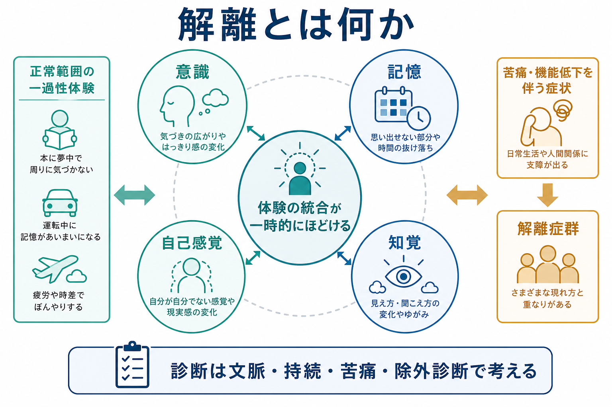
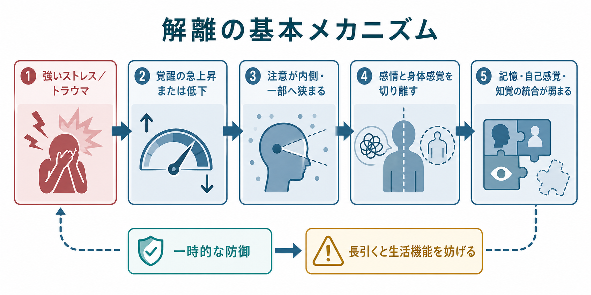
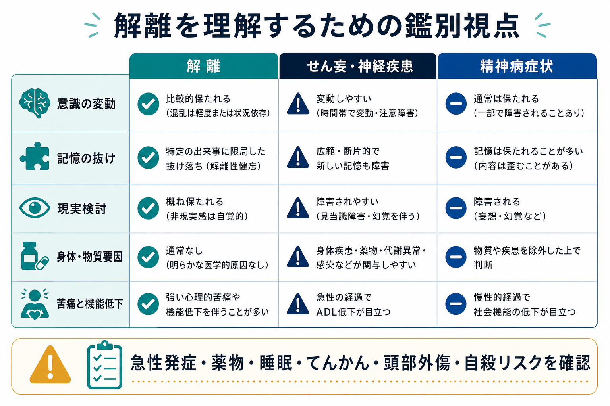

# 解離とは何か

## 要点

- 解離とは、[[意識とは何か|意識]]、[[記憶障害とは何か|記憶]]、[[自己とは何か|自己感覚]]、[[知覚とは何か|知覚]]、感情、身体感覚、行動制御などが、通常のまとまり方から一時的または持続的に外れる現象である[1][2]。
- 白昼夢や没入のような軽い解離は広くみられるが、苦痛、生活機能の低下、反復性、健忘、離人感、現実感消失、同一性の断続などを伴うと臨床的評価の対象になる[1][3]。
- 解離は「嘘」や「演技」ではなく、強いストレス、トラウマ、覚醒調節、注意、身体感覚、記憶処理が絡む症候群として理解する[4]。
- 診断では、薬物、睡眠不足、てんかん、せん妄、頭部外傷、神経疾患、精神病症状、パニック発作などを丁寧に除外する[2][8]。

## この記事で答える問い

1. 解離はどのような体験の変化を指すのか。
2. 正常範囲の解離と、臨床的な解離症状はどこで分けて考えるのか。
3. 解離はトラウマ、脳ネットワーク、精神症状の評価とどうつながるのか。
4. 解離について、どのような誤解を避けるべきか。

## まず結論

解離は、「ここにいる私が、今の出来事を、連続した記憶と自己感覚の中で体験している」というまとまりが弱くなる現象である。たとえば、ぼんやりして時間が飛んだように感じる、身体や感情が自分のものではないように感じる、周囲が夢のように遠く感じられる、出来事の一部を思い出せない、といった形をとる[1][3]。

ただし、解離は単一の病名ではない。軽い没入から、[[離人感とは何か|離人感]]、現実感消失、解離性健忘、同一性の断続、身体・運動症状までを含む幅のある概念である。臨床では「何が解離しているのか」「どの程度続くのか」「苦痛や生活機能低下があるのか」「別の医学的要因で説明できないか」を分けて考える[2][8]。

## 背景

日常的な心の働きでは、感覚入力、身体感覚、感情、記憶、注意、行動意図がひとつの体験として統合されている。解離は、この統合が一時的に緩むことで生じる。APA は解離症状を、記憶、同一性、感情、知覚、行動、自己感覚に関わる問題として説明し、体験の各領域を広く横断するものとして位置づけている[1]。

ICD-11 では、解離症群は同一性、感覚、知覚、感情、思考、記憶、身体運動の制御、行動の正常な統合が不随意に途切れるものとして記述される。さらに、物質、薬剤、睡眠覚醒障害、神経疾患、他の精神疾患、文化・宗教的実践によってよりよく説明されないこと、生活上の重要な機能障害を伴うことが重視される[2]。

## 基本概念

### 解離で変化しやすい領域

| 領域 | 体験の例 | 関連して考えること |
|---|---|---|
| 意識・注意 | ぼんやりする、周囲への気づきが狭まる、時間が飛ぶ | [[変性意識状態とは何か]]、[[せん妄とは何か]]との鑑別 |
| 記憶 | 出来事の一部が抜ける、気づくと別の場所にいる | 通常の物忘れ、神経認知障害、物質影響との区別 |
| 自己感覚 | 自分が自分でない、身体が自分のものではない | [[離人感とは何か]]、[[身体所有感とは何か]] |
| 知覚 | 周囲が夢のよう、遠い、平板に見える | 現実感消失、[[幻覚は脳内でどのように生じるのか|幻覚]]との区別 |
| 行動制御 | 自動操縦のように行動する、後で思い出せない | 安全確認、リスク評価、状況文脈の把握 |

### 正常範囲と臨床的症状

軽い解離は、疲労時のぼんやり、運転中の「いつの間にか着いていた」感覚、読書や映画への没入のように、広く経験されうる[1]。一方で、強い苦痛、反復、長時間の持続、日常生活への支障、健忘、自己感覚の断続、安全上の問題を伴う場合は、臨床的に評価する必要がある[2][3]。

ここで重要なのは、「珍しい体験があるか」だけで判断しないことである。症状の文脈、持続、頻度、苦痛、機能低下、併存症、身体疾患、薬物・薬剤の影響を合わせてみる。

## 仕組み

解離の仕組みは単一ではない。代表的には、強いストレスやトラウマ状況で覚醒が急上昇したり、逆に低反応へ傾いたりする中で、注意が狭まり、感情・身体感覚・記憶の結びつきが弱まると考えられる[4]。この反応は短期的には圧倒的な苦痛から距離をとる防御として働くことがあるが、長引くと記憶の連続性、対人関係、学業・仕事、安全行動を妨げる。

神経科学的には、解離は感覚統合だけの問題ではなく、前頭前野、辺縁系、身体表象、注意、自己関連処理、大規模脳ネットワークの変化として検討されている[4]。たとえば離人感・現実感消失では、強い不安や恐怖を感じる状況で、感情反応が鈍くなる、身体感覚が遠のく、自己と世界の実在感が薄れるといった報告がある[3][4]。

ただし、脳画像所見は個人の診断にそのまま使える段階ではない。現時点では、[[解離症状は脳ネットワークでどう説明できるのか|脳ネットワークの説明]]は研究仮説として有用だが、臨床では詳細な面接、経過、身体・神経学的評価、生活機能の評価が中心である[8]。

## 図解

解離を評価するときは、「解離らしいか」だけでなく、「別の緊急性の高い状態ではないか」を同時に確認する。急性の意識変容、発熱、頭部外傷、けいれん、薬物・アルコール、低血糖、睡眠不足、高齢発症、急な認知変化がある場合は、[[せん妄とは何か|せん妄]]や神経疾患、身体疾患の評価を優先する[8]。

## 臨床・研究との接続

### トラウマとの関係

解離はトラウマと関連して語られることが多い。APA も、解離症群は過去のトラウマ経験としばしば関連すると説明している[1]。一方で、トラウマがあれば必ず解離が起きるわけではなく、解離があれば必ず特定のトラウマが存在するとも限らない。離人感・現実感消失や PTSD に関する研究は、解離をストレス反応、覚醒調節、身体感覚、注意、治療文脈の中で評価する必要を示している[4][7]。

### 離人感・現実感消失

離人感・現実感消失症では、自分の心身や周囲から切り離されたように感じるが、現実検討は保たれる点が重要である[3]。これは「本当に世界が変わった」と確信する精神病症状とは異なる。人口研究の系統的レビューでは、離人感・現実感消失症の有病率推定には幅があるが、一般人口で無視できない頻度の現象として扱われている[5]。

### 精神病症状との接点

解離と精神病症状は完全に別々ではない。メタ分析では、解離体験は幻覚、妄想、パラノイアなどの陽性症状と中等度以上に関連することが報告されている[6]。これは「解離は精神病と同じ」という意味ではなく、[[幻覚は脳内でどのように生じるのか|幻覚]]や現実感の変化を評価するときに、トラウマ、離人感、現実感消失、健忘、自己感覚の断続を一緒に尋ねる必要がある、という意味である。

### PTSD治療との関係

[[PTSDでは恐怖記憶ネットワークに何が起きているのか|PTSD]] では、離人感・現実感消失を伴う解離症状がみられることがある。PTSD 心理療法に関するメタ分析では、治療前の解離症状が PTSD 心理療法の効果を一貫して弱める証拠は見いだされなかった[7]。したがって、解離があることだけを理由に、トラウマ焦点化治療を機械的に避けるのではなく、安全性、安定化、治療同盟、ペース調整を含めて個別に判断する。

## よくある誤解

### 「解離は全部、病気である」

軽い解離は日常的にも起こる。臨床的に問題になるのは、苦痛、反復、持続、機能低下、危険、健忘、同一性の断続などを伴う場合である[1][2]。

### 「解離は演技である」

解離症状は本人の意思で単純に起こしたり止めたりできるものではない。ICD-11 でも、不随意の統合の途切れとして整理される[2]。もちろん、臨床評価では詐病、物質影響、神経疾患、文化的文脈を含めて慎重にみるが、「演技」と決めつけることは評価を狭める。

### 「解離は必ず多重人格を意味する」

解離は、離人感、現実感消失、健忘、身体・運動症状、同一性の断続などを含む広い概念である[1][2]。解離性同一性症はその一部であり、解離全体と同義ではない。

### 「現実感がないなら精神病である」

離人感・現実感消失では、通常「これは自分の感覚がおかしいのだ」とわかっており、現実検討が保たれる[3][8]。一方、精神病症状では現実検討の障害が前景化することがある。両者は重なりうるため、短いラベルで判断せず、体験の質と確信度を丁寧に聞く。

## 関連ノート

- [[精神症候学とは何か]]
- [[意識とは何か]]
- [[記憶障害とは何か]]
- [[離人感とは何か]]
- [[変性意識状態とは何か]]
- [[身体所有感とは何か]]
- [[せん妄とは何か]]
- [[パニック発作とは何か]]
- [[解離症状は脳ネットワークでどう説明できるのか]]

MOC更新候補: `content/00_MOC/` 配下の精神医学・症候学・トラウマ関連 MOC に、本記事へのリンクを追加する。

## 理解チェック

1. 解離では、どのような心理機能の統合が変化すると考えられるか。
2. 白昼夢のような日常的解離と、臨床的に問題になる解離症状を分ける観点は何か。
3. 離人感・現実感消失と精神病症状を区別するとき、現実検討はなぜ重要か。
4. 解離を評価するときに、物質、てんかん、せん妄、頭部外傷を確認する理由は何か。
5. 解離とトラウマの関係を、単純な因果関係として断定しない方がよい理由は何か。

## 未解決問題

- 解離の下位症状ごとに、どの脳ネットワーク変化が再現性高く対応するのかはまだ確定していない。
- トラウマ、注意、覚醒、身体感覚、記憶処理のどれが原因で、どれが結果なのかは個人差が大きい。
- 解離を伴う PTSD、パニック症、境界性パーソナリティ障害、精神病症状への最適な治療順序は、症状の重症度と安全性に応じて検討が必要である。

## 参考文献

[1] American Psychiatric Association. What Are Dissociative Disorders? https://www.psychiatry.org/patients-families/dissociative-disorders/what-are-dissociative-disorders

[2] World Health Organization. ICD-11 for Mortality and Morbidity Statistics: Dissociative disorders. https://icd.who.int/browse/2026-01/mms/en#108180424

[3] Mayo Clinic. Depersonalization-derealization disorder: Symptoms and causes. 2025. https://www.mayoclinic.org/diseases-conditions/depersonalization-derealization-disorder/symptoms-causes/syc-20352911

[4] Murphy RJ. Depersonalization/Derealization Disorder and Neural Correlates of Trauma-related Pathology: A Critical Review. *Innovations in Clinical Neuroscience*. 2023;20(1-3):53-59. https://pmc.ncbi.nlm.nih.gov/articles/PMC10132272/

[5] Yang J, Millman LSM, David AS, Hunter ECM. The Prevalence of Depersonalization-Derealization Disorder: A Systematic Review. *Journal of Trauma & Dissociation*. 2023;24(1):8-41. https://pubmed.ncbi.nlm.nih.gov/35699456/

[6] Longden E, Branitsky A, Moskowitz A, Berry K, Bucci S, Varese F. The Relationship Between Dissociation and Symptoms of Psychosis: A Meta-analysis. *Schizophrenia Bulletin*. 2020;46(5):1104-1113. https://pubmed.ncbi.nlm.nih.gov/32251520/

[7] Hoeboer CM, de Kleine RA, Molendijk ML, Schoorl M, Oprel DAC, Mouthaan J, van Minnen A, Huntjens RJC. Impact of dissociation on the effectiveness of psychotherapy for post-traumatic stress disorder: meta-analysis. *BJPsych Open*. 2020;6(3):e53. https://pmc.ncbi.nlm.nih.gov/articles/PMC7345665/

[8] MSD Manual Professional Edition. Depersonalization/Derealization Disorder. Reviewed/Revised Jun 2025; Modified Jan 2026. https://www.msdmanuals.com/professional/psychiatric-disorders/dissociative-disorders/depersonalization-derealization-disorder
