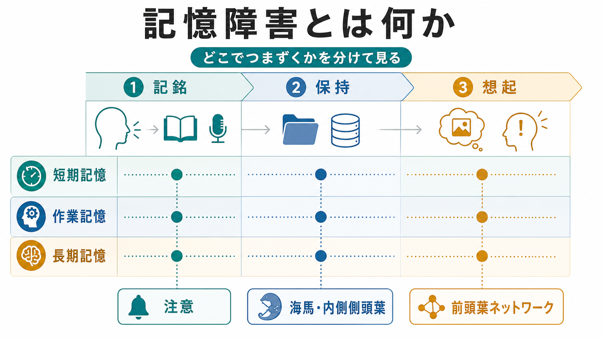
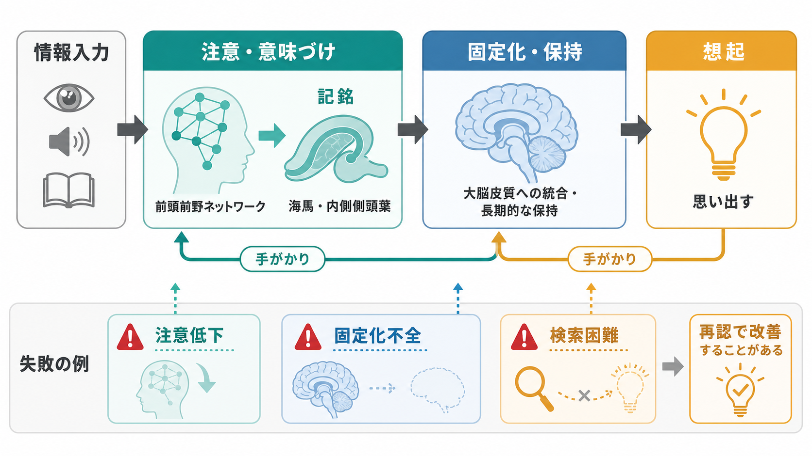

# 記憶障害とは何か

## 要点

- 記憶障害は「忘れる」という一語でまとめず、情報を入れる**記銘**、時間をおいて保つ**保持**、必要な時に取り出す**想起**のどこで破綻しているかを分けて考える。
- 短期記憶は数秒から数十秒の一時的保持、作業記憶は保持しながら操作する機能、長期記憶は出来事・知識・技能などをより長く利用できる記憶である[1][2]。
- 海馬・内側側頭葉は新しい宣言的記憶の形成に重要で、前頭前野を含むネットワークは注意、検索方略、作業記憶に関わる[3][4]。
- 臨床では、本人の訴え、家族や支援者からの情報、生活機能、注意・意識・気分・薬剤・身体疾患を合わせて評価する。この記事は教育・研究目的の整理であり、個別診断や治療指示ではない。

## この記事で答える問い

- 記憶障害を「記銘・保持・想起」に分けると何が見えやすくなるのか。
- 短期記憶、作業記憶、長期記憶はどのように違うのか。
- 海馬、前頭葉ネットワーク、注意、認知症・せん妄・うつ病などは記憶障害とどう接続するのか。
- 面接や認知機能評価では、どのような誤解を避けるべきか。

## まず結論

記憶障害とは、過去の情報を保存する「倉庫」だけの問題ではない。情報に注意を向け、意味づけ、記銘し、一定時間保持し、手がかりに応じて取り出す一連の過程のどこかがうまく働かない状態である。したがって、「最近のことを忘れる」という訴えがあっても、実際には注意低下、作業記憶の容量低下、海馬系の記銘障害、前頭葉性の検索困難、抑うつや不安による集中困難、薬剤や身体疾患の影響など、複数の説明がありうる[1][5]。

この区別は、[[精神症候学とは何か]]で扱う症候記述の考え方に近い。診断名をすぐに決めるのではなく、「どの場面で、どの種類の情報が、どの時間幅で、どの手がかりがあると改善するのか」を記述することで、[[MSEで認知機能をどう評価するか]]や神経心理検査につなげやすくなる。

## 背景

記憶は単一の能力ではない。古典的には感覚記憶、短期記憶、長期記憶の区別があり、その後、短期的な保持だけでなく情報を操作する作業記憶、出来事を思い出すエピソード記憶、知識として使う意味記憶、技能や習慣に関わる手続き記憶などが区別されてきた[2][3]。

臨床で重要なのは、この分類を暗記することではなく、観察される困難を機能単位に分けることである。たとえば、会話の直後に同じ質問をくり返す場合、数秒の短期保持が弱いのか、そもそも注意が向いていないのか、新しい出来事を長期記憶へ固定化できないのか、取り出しの手がかりが乏しいのかを切り分ける必要がある。

記憶障害は、神経変性疾患、脳血管障害、外傷、てんかん、感染症、栄養障害、薬剤、アルコール関連障害、せん妄、うつ病、不安、睡眠障害など、さまざまな背景で出現しうる[1][6]。そのため、記憶の評価は「記憶だけ」を見る作業ではなく、意識、注意、言語、遂行機能、気分、生活機能、身体疾患を統合する作業である。

## 基本概念

### 記銘・保持・想起

記憶過程は、少なくとも三つの段階に分けて考えられる。

| 段階 | 意味 | つまずきの例 | 評価の視点 |
|---|---|---|---|
| 記銘 | 新しい情報を取り入れ、符号化する | 聞いた直後から内容が入っていない | 注意、理解、意味づけ、感覚入力 |
| 保持 | 記銘した情報を時間をおいて保つ | 少し時間がたつと消える | 遅延再生、干渉、固定化 |
| 想起 | 必要な時に情報を取り出す | 手がかりなしでは出ないが、選択肢では分かる | 自由再生、手がかり再生、再認 |

記銘障害では、情報が十分に入っていないため、後から手がかりを出しても改善しにくいことがある。想起障害では、情報そのものはある程度保持されていても、検索方略や手がかりの利用がうまくいかず、再認や文脈提示で改善することがある。現実の症例では、記銘・保持・想起が混在して障害されることも多い。

### 短期記憶

短期記憶は、数秒から数十秒のあいだ、限られた量の情報を一時的に保持する機能である[1]。電話番号を一時的に覚える、今聞いた単語をすぐ復唱する、数語の指示を短時間保持する、といった場面が典型である。

ただし、短期記憶は単なる「短い長期記憶」ではない。感覚入力、注意、言語、視空間処理と密接に関わる。したがって、短期記憶の低下に見えるものが、実際には聴覚・視覚の入力問題、注意障害、言語理解の問題であることもある。

### 作業記憶

作業記憶は、情報を一時的に保持しながら操作する機能である。Baddeley の古典的定義では、理解、学習、推論などの複雑な認知活動に必要な一時的保持と操作のシステムとされる[2]。暗算、会話の文脈保持、複数手順の実行、読解中の前文保持などが含まれる。

作業記憶は[[前頭頭頂ネットワークは認知制御をどう支えるのか]]や注意制御と強く関係する。近年のメタ解析では、作業記憶の記銘、保持、検索には、背側注意ネットワークや前頭頭頂制御ネットワークを含む複数領域が関わることが示されている[4]。

### 長期記憶

長期記憶は、より長い時間幅で利用される記憶であり、宣言的記憶と非宣言的記憶に大きく分けられる。宣言的記憶には、個人的出来事に関わるエピソード記憶と、知識・概念に関わる意味記憶が含まれる。非宣言的記憶には、技能、習慣、プライミング、条件づけなどが含まれる[3]。

内側側頭葉、とくに海馬と関連皮質は、新しい宣言的記憶の形成に重要である。[[海馬回路は記憶をどう形成するのか]]で扱うように、海馬は単純な保存場所というより、出来事の要素を結びつけ、後で再構成できる形にするネットワークの要として理解される。

## 仕組み

記憶障害の仕組みを考える時は、三つの水準を分けると整理しやすい。

第一に、入力と注意の水準である。意識が混濁している、注意が続かない、聴覚や視覚の入力が不十分、言語理解が弱い場合、情報はそもそも十分に記銘されない。せん妄や強い不安、睡眠不足、薬剤の影響では、この水準の問題が前景に出やすい。

第二に、記銘と固定化の水準である。新しい出来事を長期記憶に移す過程には、海馬・内側側頭葉、間脳、関連する皮質ネットワークが関わる[3][6]。脳血管障害や低酸素、頭部外傷、アルコール関連障害、神経変性疾患などでは、この水準の障害が前向性健忘として表れることがある。

第三に、想起と制御の水準である。記憶が完全に失われていなくても、どの手がかりを使うか、どの文脈から検索するか、誤った想起を抑制できるかは、前頭葉を含む制御ネットワークに依存する。想起時のモニタリングが不十分だと、思い違い、作話、虚偽記憶のような現象が問題になることもある[5]。

## 図解

1枚目の図は、記憶障害を「記銘・保持・想起」と「短期記憶・作業記憶・長期記憶」の交差として見るための概念地図である。どの種類の記憶が、どの段階で失敗しているかを分けることで、「忘れる」という訴えを臨床的に扱いやすい問いに変換できる。

2枚目の図は、情報入力から注意・意味づけ、記銘、固定化・保持、想起へ進む流れを示している。注意低下、固定化不全、検索困難は互いに重なりうるが、再認や手がかりで改善するかどうかは切り分けの手がかりになる。

3枚目の図は、短期記憶、作業記憶、長期記憶を、よくある訴えと評価の視点で比較したものである。生活機能と合わせて見るという点は、軽度認知障害や認知症の評価でも重要である[7][8]。

## 臨床・研究との接続

### 面接と MSE

面接では、本人の主観的な困りごとを尊重しつつ、具体的な場面に落とし込む。「いつから」「急にか徐々にか」「同じ質問をくり返すか」「約束や服薬を忘れるか」「道に迷うか」「仕事や家事に影響があるか」「周囲はどう見ているか」を確認する。[[MSEで認知機能をどう評価するか]]では、見当識、注意、即時再生、遅延再生、言語、遂行機能を組み合わせて評価する。

ただし、簡易検査の点数だけで記憶障害を説明してはいけない。教育歴、文化的背景、母語、感覚障害、疲労、緊張、うつ、不安、睡眠、薬剤、身体疾患が影響する。検査は、面接と生活情報を補助する道具である。

### 認知症・軽度認知障害

記憶障害は認知症や軽度認知障害で頻繁に問題になるが、記憶障害があることだけで認知症とはいえない。ICD-11 CDDR は、精神・行動・神経発達症群の臨床記述と診断要件を示すための手引きであり、認知症などの診断では認知領域の低下だけでなく、日常生活機能や臨床的文脈が重要になる[7]。

軽度認知障害では、本人や周囲が認知変化に気づくが、日常生活の自立は大きく損なわれていないことが多い。臨床評価では、本人の訴えだけでなく、家族や支援者など信頼できる情報提供者からの情報も重要になる[8]。この区別は、記憶障害を「病名」ではなく「症候」としてまず記述する理由でもある。

### 精神疾患と記憶

うつ病、不安症、PTSD、統合失調症、ADHD、睡眠障害などでも記憶の訴えは出現する。ここでは、記憶の保存そのものだけでなく、注意、動機づけ、処理速度、遂行機能、情動的な手がかり、侵入的想起が関わる。たとえば、[[認知機能障害は統合失調症でなぜ重要なのか]]では、記憶を含む認知機能が生活機能に影響することが中心的な問題になる。

PTSD では、恐怖記憶や文脈記憶の偏りが問題になりうる。[[PTSDでは恐怖記憶ネットワークに何が起きているのか]]と接続すると、記憶障害は単に「少ない」か「多い」かではなく、どの記憶がどの文脈で過剰に想起されるかという問題としても理解できる。

## よくある誤解

### 誤解1: 記憶障害はすべて認知症を意味する

記憶障害は認知症で重要な症候だが、原因はそれだけではない。せん妄、うつ病、不安、睡眠障害、薬剤、アルコール、てんかん、内分泌・代謝異常、脳血管障害なども鑑別に入る[1][6]。急性発症、変動性、意識障害、発熱、神経症状、服薬変化などがあれば、臨床的な評価の優先度は大きく変わる。

### 誤解2: 「昔のことを覚えている」なら記憶障害ではない

新しい記憶の形成が障害されても、遠い過去の記憶やよく学習された知識は比較的保たれることがある。内側側頭葉損傷では、即時記憶や非宣言的記憶が保たれつつ、新しい宣言的記憶が著しく障害されることがある[3][6]。したがって、古い記憶が保たれていることは、新しい記銘の障害を否定しない。

### 誤解3: 再認できるなら記憶障害ではない

自由再生が弱くても、手がかり再生や再認で改善することがある。これは、情報が完全に失われたというより、検索方略や手がかり利用に問題がある可能性を示す。逆に、再認でも改善しにくい場合は、記銘や保持の障害がより疑われる。

### 誤解4: 作業記憶は短期記憶の別名である

短期記憶は一時的な保持を中心にした概念であり、作業記憶は保持しながら操作する機能を含む[2]。暗算や複数手順の遂行が難しい場合、単純な記憶容量だけでなく、注意制御や遂行機能も評価する必要がある。

## 関連ノート

- [[精神症候学とは何か]]
- [[MSEで認知機能をどう評価するか]]
- [[海馬回路は記憶をどう形成するのか]]
- [[シータリズムは記憶とナビゲーションをどう支えるのか]]
- [[リカレント回路はどのように記憶や持続活動を支えるのか]]
- [[前頭頭頂ネットワークは認知制御をどう支えるのか]]
- [[アセチルコリンは注意や記憶にどう関わるのか]]
- [[認知機能障害は統合失調症でなぜ重要なのか]]
- [[PTSDでは恐怖記憶ネットワークに何が起きているのか]]

## MOC更新候補

- 精神医学または症候学系 MOC に、記憶障害・健忘・認知機能評価の入口ノートとして追加する候補。
- 脳・神経科学系 MOC に、海馬、作業記憶、前頭頭頂ネットワークをつなぐ基礎ノートとして追加する候補。

## 理解チェック

1. 記銘障害と想起障害は、手がかり再生や再認でどのように見分けられるか。
2. 短期記憶と作業記憶は、どの点で同じではないのか。
3. 海馬・内側側頭葉の障害で、古い記憶より新しい記憶が問題になりやすいのはなぜか。
4. 記憶障害を評価する時、注意・意識・気分・薬剤・生活機能を確認する必要があるのはなぜか。
5. 認知症や軽度認知障害を考える時、記憶検査の点数だけでは不十分なのはなぜか。

## 限界と未解決問題

- 記憶分類は研究上便利だが、実際の脳内過程は短期記憶、作業記憶、長期記憶にきれいに分断されているわけではない。
- 「記銘」「保持」「想起」は臨床的な見取り図として有用だが、検査課題ごとに複数の過程が同時に関わる。
- 認知症、精神疾患、睡眠、薬剤、ストレスが記憶に与える影響を、個人ごとの生活文脈とどう統合して評価するかは、今後も重要な課題である。

## 参考文献

[1] Asuncion, R. M. D., & Al Khalili, Y. (2024). Short-Term Memory Impairment. *StatPearls*. NCBI Bookshelf. https://www.ncbi.nlm.nih.gov/books/NBK545136/

[2] Baddeley, A. (1992). Working memory. *Science, 255*(5044), 556-559. https://doi.org/10.1126/science.1736359

[3] Squire, L. R. (2004). Memory systems of the brain: A brief history and current perspective. *Neurobiology of Learning and Memory, 82*(3), 171-177. https://doi.org/10.1016/j.nlm.2004.06.005

[4] Kim, H. (2019). Neural activity during working memory encoding, maintenance, and retrieval: A network-based model and meta-analysis. *Human Brain Mapping, 40*(17), 4912-4933. https://doi.org/10.1002/hbm.24747

[5] Straube, B. (2012). An overview of the neuro-cognitive processes involved in the encoding, consolidation, and retrieval of true and false memories. *Behavioral and Brain Functions, 8*, 35. https://doi.org/10.1186/1744-9081-8-35

[6] Kumral, E., & Bayam, F. E. (2021). Memory Impairment Due to Stroke. In *Stroke*. NCBI Bookshelf. https://www.ncbi.nlm.nih.gov/books/NBK571999/

[7] World Health Organization. (2024). *Clinical descriptions and diagnostic requirements for ICD-11 mental, behavioural and neurodevelopmental disorders (CDDR)*. WHO. https://www.who.int/publications/i/item/9789240077263

[8] Atri, A. (2024). Mild Cognitive Impairment. *StatPearls*. NCBI Bookshelf. https://www.ncbi.nlm.nih.gov/books/NBK599514/
