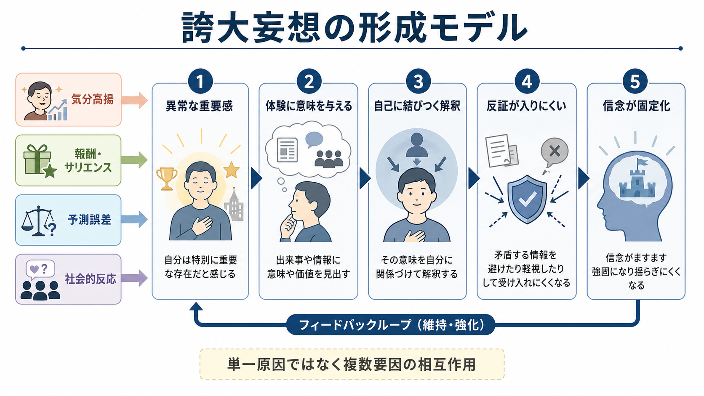

# 誇大妄想とは何か

## 要点

- 誇大妄想とは、自分には並外れた才能、発見、地位、富、権力、使命、特別な血統、神や著名人との特別な関係があると確信する妄想である[1][2]。
- 重要なのは「自信が強い」ことではなく、反証や周囲の説明を受けても信念が修正されにくく、本人の行動・対人関係・安全・生活機能に影響することである[1][3]。
- 誇大妄想は、[[躁状態とは何か|躁状態]]、双極性障害の気分エピソード、統合失調症スペクトラム、妄想性障害、物質使用、身体疾患・神経疾患など、複数の文脈で生じうる[1][2][3]。
- 形成・維持には、気分高揚、異常な重要感、報酬・サリエンス処理、予測誤差、推論バイアス、本人にとっての意味づけ、社会的反応が関わると考えられている[3][4][6][7][8]。
- 本稿は教育・研究目的の整理であり、個別診断や治療指示ではない。

## この記事で答える問い

1. 誇大妄想は、強い自信・高い自己評価・夢や目標と何が違うのか。
2. どのような精神疾患・身体疾患・生活文脈で見られるのか。
3. なぜ「特別な力がある」「使命がある」という信念が形成・維持されるのか。
4. 臨床や研究では、どのような観点で評価すればよいのか。

## まず結論

誇大妄想は、単なる楽観性や自己肯定感の高さではない。症候学的には、本人が自分の能力・地位・使命・価値を現実より大きく見積もり、その信念が強い確信をもち、反証で修正されにくく、生活上の判断や行動に影響する状態を指す[1][2]。

たとえば「自分は将来大きな仕事をしたい」と語ることは、それだけでは妄想ではない。一方で、「自分は世界を救うために選ばれた」「有名人や神が自分に特別な任務を与えている」「自分の発見はすでに世界を変えた」と確信し、そのために仕事・学業・金銭・安全・対人関係が損なわれても修正できない場合、誇大妄想として評価されることがある。

## 背景

妄想は、[[精神症候学とは何か|精神症候学]]で「思考内容」の異常として扱われる。StatPearls は妄想を、反対証拠にもかかわらず持続し、文化的・宗教的背景だけでは説明できない固定した誤った信念として整理している[2]。[[MSEで思考内容をどう評価するか|MSEで思考内容を評価する]]ときも、発言内容そのものだけでなく、確信度、訂正可能性、苦痛、行動化、文化的背景、機能障害を合わせてみる必要がある。

誇大妄想は、妄想の「テーマ」による分類のひとつである。被害妄想が「自分が攻撃・監視・妨害されている」という方向を取りやすいのに対し、誇大妄想は「自分が特別である」「大きな力や使命をもつ」という方向を取る。ただし、両者は排他的ではない。たとえば「自分は特別な使命をもつために、組織から狙われている」という形で、誇大性と被害性が結びつくこともある。

## 基本概念

### 誇大妄想と誇大観念

誇大妄想では、信念の内容が大きいだけでなく、確信度と訂正困難性が高い。臨床上は、次の軸を分けて観察すると整理しやすい。

| 観察軸 | 確認すること |
|---|---|
| 内容 | 能力、富、血統、地位、使命、宗教的役割、著名人との関係など |
| 確信度 | どれほど確かだと感じているか |
| 反証可能性 | 別の説明や証拠を検討できるか |
| 占有度 | その考えにどれほど時間や注意が奪われるか |
| 行動化 | 金銭、性、対人、仕事、移動、危険行動に結びつくか |
| 苦痛と機能 | 本人・家族・周囲に苦痛や生活機能低下があるか |
| 文脈 | 気分高揚、睡眠低下、物質使用、身体疾患、文化・宗教的背景 |

この区別は、[[病識とは何か|病識]]の評価にも関わる。本人が「自分は特別だ」と語っていても、それを比喩・目標・価値観として語っているのか、現実検証が低下した確信として語っているのかで意味が変わる。

### よくある内容

誇大妄想の内容には、天才的な知性、特別な発明、霊的・宗教的使命、王族や著名人との関係、莫大な富、政治的・歴史的な役割、世界を救う責任などが含まれる[1][2][3]。Knowles らのレビューは、誇大妄想が双極性障害、統合失調症、物質使用関連の精神病状態など幅広い状態で見られることを整理している[3]。

一方で、誇大妄想を「傲慢」「自己愛が強い」とだけ理解すると不正確になる。質的研究では、誇大妄想は本人にとって目的、所属感、自己同一性、困難な出来事への意味づけを与えることがあり、単なる優越感とは限らないことが示されている[4]。

## 仕組み

### 1. 異常な重要感と意味づけ

精神病性体験では、普段なら流れていく出来事が異様に重要に感じられることがある。Kapur は、精神病を「異常なサリエンス」の状態として捉え、無関係な刺激や偶然の出来事に過剰な意味が付与される枠組みを提案した[7]。誇大妄想では、この「重要に感じる」体験が自己に結びつき、「自分には特別な役割がある」という解釈へ進むことがある。

### 2. 予測誤差と信念更新

予測誤差とは、期待と実際の出来事のずれである。通常、予測誤差は学習や信念更新を促す。しかし精神病性体験では、予測誤差信号や報酬学習の処理が乱れ、意味のない出来事が強く学習される、あるいは既存の信念が不適切に強化される可能性がある[8]。この観点は、[[予測処理とは何か]]やサリエンス研究と接続できるが、まだ単一の確定理論ではない。

### 3. 気分高揚と報酬系

誇大妄想は、躁状態や混合状態の中で目立つことがある。[[躁状態とは何か|躁状態]]では、気分高揚、易怒性、活動性増加、睡眠欲求低下、観念奔逸、リスク行動がまとまって現れることがあり、その文脈で「自分には特別な才能や使命がある」という確信が強まる場合がある[1][3]。この場合、誇大妄想だけを切り出すのではなく、睡眠、活動性、金銭行動、性的リスク、攻撃性、自殺・他害リスクを含めて評価する。

### 4. 本人にとっての意味と維持

近年の質的研究は、誇大妄想が本人にとって「役に立つ意味」をもつことを重視している。誇大信念は、つらい体験を説明したり、孤立感を補ったり、自己同一性を支えたりすることがある[4]。そのため、外から単に「間違い」と指摘すると、本人にとっては自己や人生の意味を否定されたように感じられ、治療関係が損なわれることがある。

## 図解

上の 2 枚の図は、次のように読む。

| 図 | 使い方 |
|---|---|
| 概念地図 | 誇大妄想を、内容・確信・現実検証・生活機能・鑑別の観点から俯瞰する |
| 形成モデル | 異常な重要感、意味づけ、自己への結びつき、反証困難性、固定化の流れを確認する |

図は理解補助であり、診断フローチャートではない。実際の評価では、本人の語り、時間経過、周囲からの情報、身体状態、物質使用、気分エピソード、安全リスクを統合する。

## 臨床・研究との接続

### 評価で見ること

臨床的には、誇大妄想を見つけたら、まず安全と生活機能を確認する。たとえば「自分は不死身だ」と信じて危険な行動を取る、「使命のため」として浪費や性的リスクを取る、仕事や学業を急に放棄する、家族や支援者との関係が急速に悪化する、といった場合は注意が必要である[4][5]。

同時に、[[器質性精神障害を見逃さないためには何を見るべきか|器質性精神障害]]、物質・薬剤、睡眠不足、せん妄、認知症、てんかん、内分泌疾患なども考える。急な発症、高齢発症、意識・注意の変動、神経症状、発熱、頭部外傷、薬剤変更、アルコールや薬物の使用がある場合は、身体医学的評価の重要度が上がる[1][2]。

### 研究上の論点

研究では、誇大妄想は被害妄想や[[幻聴とは何か|幻聴]]に比べて注目されにくかったと指摘されている[3][4]。しかし近年は、誇大妄想を「陽性症状の一部」と一括するのではなく、本人にとっての意味、感情、報酬学習、推論、社会的反応を含む固有の現象として捉える研究が増えている[4][5]。

特に重要なのは、誇大妄想が必ずしも快い症状ではないことである。本人が高揚して見えても、その裏に重い責任感、孤立、周囲との衝突、危険行動、抑うつや自殺念慮が隠れることがある[4][5]。したがって「本人は気分がよさそうだから問題ない」とは判断できない。

## よくある誤解

### 誤解1：大きな夢を語る人は誇大妄想である

大きな夢や野心は、それ自体では妄想ではない。現実検証が保たれ、失敗可能性や他者の意見を検討でき、生活機能を大きく損なわないなら、通常は価値観や目標として理解される。誇大妄想では、確信の固定性、反証困難性、文脈からの逸脱、機能障害が問題になる。

### 誤解2：誇大妄想は本人にとって常に楽しい

誇大妄想には高揚感が伴うこともあるが、責任の重さ、恐怖、孤立、周囲との衝突を伴うこともある[4][5]。「世界を救わなければならない」「特別な使命を果たさなければならない」と感じることは、本人にとって強い負担になりうる。

### 誤解3：内容を論破すればよい

直接の論破は、本人の防衛や不信を強めることがある。評価では、信念の真偽を即座に争うよりも、「その考えがいつからあるか」「どれほど確信しているか」「生活にどんな影響があるか」「安全上の問題があるか」「他の説明をどの程度考えられるか」を確認する方が有用である[1][2][6]。

### 誤解4：誇大妄想は自己愛だけで説明できる

自己愛的な傾向と誇大妄想が重なる場合はあるが、同じものではない。誇大妄想は、気分エピソード、精神病性体験、物質・身体疾患、予測誤差、異常サリエンス、社会的文脈などが複合して生じうる症状である[3][7][8]。

## 関連ノート

- [[精神症候学とは何か]]
- [[MSEで思考内容をどう評価するか]]
- [[精神状態診察MSEとは何か]]
- [[躁状態とは何か]]
- [[軽躁状態とは何か]]
- [[幻聴とは何か]]
- [[病識とは何か]]
- [[器質性精神障害を見逃さないためには何を見るべきか]]

MOC 更新候補: `content/00_MOC/` 配下の精神医学・症候学系 MOC に追加する。並列ジョブとの競合を避けるため、本稿では MOC 本体は更新しない。

関連ノート候補: 「妄想とは何か」「被害妄想とは何か」「関係妄想とは何か」「サリエンスとは何か」「予測誤差とは何か」「双極性障害とは何か」「統合失調症とは何か」。

## 理解チェック

1. 誇大妄想と高い自己評価を分ける観察軸は何か。
2. 誇大妄想が躁状態で見られるとき、睡眠や活動性を確認するのはなぜか。
3. 異常サリエンス仮説は、誇大妄想のどの部分を説明しようとしているか。
4. 誇大妄想が本人にとって意味をもつ場合、臨床面接では何に注意すべきか。

## 未解決問題

- 誇大妄想に特異的な心理・神経メカニズムが、被害妄想や幻聴とどの程度異なるのかは十分に確定していない。
- 異常サリエンスや予測誤差の研究は有力だが、個々の誇大妄想の内容や人生史を直接説明するにはまだ粗い。
- 誇大妄想に特化した心理的介入の有効性は、今後さらに検証が必要である[4][5]。

## 参考文献

[1] Joseph, S. M., & Siddiqui, W. (2023). *Delusional Disorder*. StatPearls. NCBI Bookshelf. https://www.ncbi.nlm.nih.gov/books/NBK539855/

[2] Fariba, K. A., & Fawzy, F. (2022). *Delusions*. StatPearls. NCBI Bookshelf. https://www.ncbi.nlm.nih.gov/sites/books/n/statpearls/article-79308/

[3] Knowles, R., McCarthy-Jones, S., & Rowse, G. (2011). Grandiose delusions: A review and theoretical integration of cognitive and affective perspectives. *Clinical Psychology Review, 31*(4), 684-696. https://doi.org/10.1016/j.cpr.2011.02.009

[4] Isham, L., Griffith, L., Boylan, A.-M., Hicks, A., Wilson, N., Byrne, R., Sheaves, B., Bentall, R. P., & Freeman, D. (2021). Understanding, treating, and renaming grandiose delusions: A qualitative study. *Psychology and Psychotherapy: Theory, Research and Practice, 94*(1), 119-140. https://pmc.ncbi.nlm.nih.gov/articles/PMC7984144/

[5] Isham, L., Griffith, L., Boylan, A.-M., Hicks, A., Wilson, N., Byrne, R., Sheaves, B., Bentall, R. P., & Freeman, D. (2023). The Difficulties of Grandiose Delusions: Harms, Challenges, and Implications for Treatment Engagement. *Schizophrenia Bulletin Open*. https://pmc.ncbi.nlm.nih.gov/articles/PMC10483449/

[6] Garety, P. A., & Freeman, D. (1999). Cognitive approaches to delusions: A critical review of theories and evidence. *British Journal of Clinical Psychology, 38*(2), 113-154. https://doi.org/10.1348/014466599162700

[7] Kapur, S. (2003). Psychosis as a state of aberrant salience: A framework linking biology, phenomenology, and pharmacology in schizophrenia. *American Journal of Psychiatry, 160*(1), 13-23. https://doi.org/10.1176/appi.ajp.160.1.13

[8] Murray, G. K., Corlett, P. R., Clark, L., Pessiglione, M., Blackwell, A. D., Honey, G., Jones, P. B., Bullmore, E. T., Robbins, T. W., & Fletcher, P. C. (2008). Substantia nigra/ventral tegmental reward prediction error disruption in psychosis. *Molecular Psychiatry, 13*, 267-276. https://doi.org/10.1038/sj.mp.4002058
