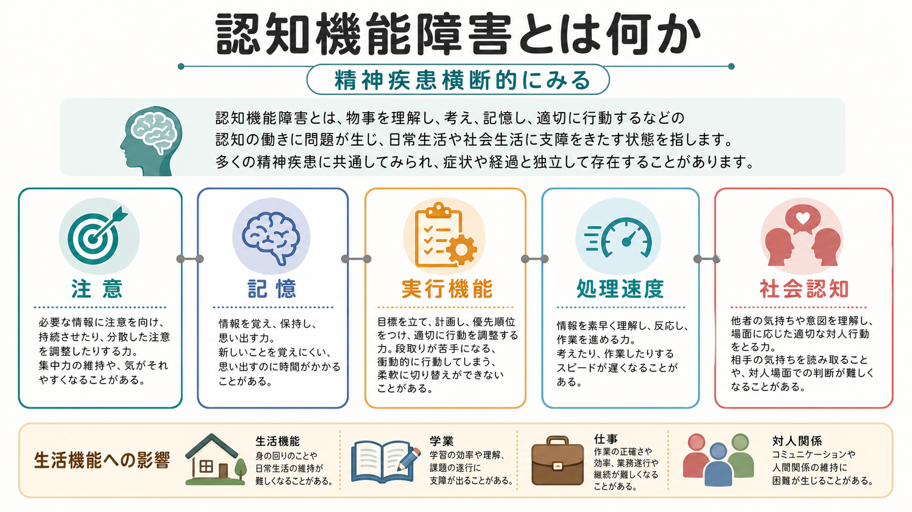
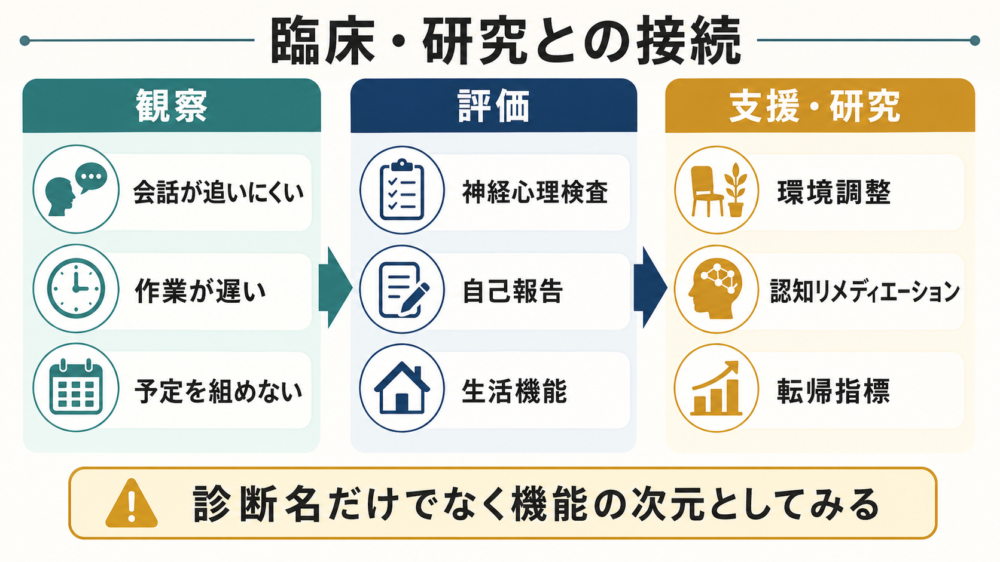

# 認知機能障害とは何か

## 要点

- 認知機能障害とは、注意、記憶、作業記憶、実行機能、処理速度、社会認知などの働きが、その人の生活課題に対して十分に機能しにくくなる状態である。
- 統合失調症だけでなく、うつ病、双極性障害、ADHD、不安症、PTSD、物質使用、身体疾患、睡眠障害などでも問題になるため、診断名をまたいだ次元として見る必要がある[1][2]。
- 症状そのもの、薬剤、睡眠、身体疾患、教育歴、発達歴、環境負荷、評価方法が結果に影響するため、単一の検査点だけで「能力」を断定しない。
- 臨床では、診断の補助というより、学業、仕事、家事、服薬管理、対人関係、治療参加を妨げる具体的な障害として評価する。

## この記事で答える問い

1. 認知機能障害は、記憶力低下だけを指すのか。
2. なぜ精神疾患で注意、処理速度、実行機能が問題になるのか。
3. 認知機能障害は症状、知能、意欲、性格とどう区別するのか。
4. 臨床・研究では、どのように評価し、どのような限界に注意するのか。

## まず結論

認知機能障害は、「頭が悪くなる」という一語でまとめるべき現象ではない。むしろ、情報を選ぶ、保つ、更新する、思い出す、計画する、切り替える、相手の意図を読む、といった複数の機能のどこに負荷がかかっているかを分けて見るための言葉である。

精神医学では、幻覚、妄想、抑うつ、不安、躁状態のような目立つ症状に注意が向きやすい。しかし、認知機能障害は生活機能や社会参加を強く左右する。統合失調症では認知機能が機能転帰と関連することが繰り返し示されており[5]、うつ病や双極性障害でも寛解期を含めて認知機能低下が残ることがある[6][7]。

## 背景

精神疾患の研究は、長く「疾患カテゴリ」ごとに行われてきた。一方で、認知機能は診断名の境界をまたいで現れる。NIMH の RDoC は、精神疾患を症状カテゴリだけでなく、認知システム、負の感情価、正の感情価、覚醒・調節、社会過程などの機能次元として研究する枠組みを示している[2]。この観点は、[[RDoCは精神疾患研究をどう変えたのか]]と接続する。

認知機能障害が重要なのは、本人の主観的な苦痛だけでなく、日常生活の失敗として現れやすいからである。たとえば、会話の途中で話題を追えない、予定を組めない、作業開始まで時間がかかる、説明を聞いても保持できない、複数の手順を同時に扱えない、といった形で表面化する。これらは「やる気がない」「理解する気がない」と誤解されやすいが、認知処理の制約として見直す必要がある。

## 基本概念

認知機能障害を扱うときは、少なくとも次の領域を分ける。

| 領域 | 何を支えるか | 生活上の見え方 |
|---|---|---|
| 注意 | 必要な情報を選び、維持し、切り替える | 話を聞き続けられない、刺激に引っ張られる |
| 処理速度 | 情報を一定時間内に処理する速さ | 作業が遅い、疲れると極端に遅くなる |
| 作業記憶 | 情報を一時的に保持し、操作する | 指示を覚えながら実行できない |
| 記憶 | 学習、保持、想起 | 約束、手順、学習内容を思い出しにくい |
| 実行機能 | 計画、抑制、切替、問題解決 | 段取りが組めない、予定変更に弱い |
| 社会認知 | 表情、意図、文脈、対人信号の理解 | 相手の反応を読み違える |

この分類は唯一の正解ではない。MATRICS Consensus Cognitive Battery は、統合失調症の認知機能評価の標準化を目指し、処理速度、注意・警戒、作業記憶、言語学習、視覚学習、推論・問題解決、社会認知の 7 領域を整理した[3]。一方、DSM-5 系の神経認知領域では複雑性注意、実行機能、学習と記憶、言語、知覚運動、社会認知が重視される[4]。臨床では、目的に応じて分類を使い分ける。

関連する基礎概念として、[[注意とは何か]]、[[持続的注意とは何か]]、[[選択的注意はどのように働くのか]]、[[実行機能とは何か]]、[[エピソード記憶とは何か]]、[[長期記憶とは何か]]がある。精神医学的な症候としては、[[注意障害とは何か]]と重なる部分も大きい。

## 仕組み

認知機能障害は、単一の脳部位の故障として説明しきれない。前頭前野、頭頂葉、海馬、線条体、視床、感覚皮質、デフォルトモードネットワーク、顕著性ネットワーク、前頭頭頂制御ネットワークなどが、課題と状態に応じて協調する。注意、作業記憶、実行機能は特に前頭前野と前頭頭頂ネットワークに依存し、記憶は海馬系、社会認知は前頭側頭葉・辺縁系を含む広いネットワークと関わる[1]。

ただし、脳ネットワークだけを見れば十分というわけではない。睡眠不足、抑うつ、不安、精神病症状、疼痛、甲状腺機能、貧血、感染、薬剤の鎮静作用、アルコールや薬物、発達特性、教育歴、文化的背景、検査への慣れも成績を変える。したがって、認知機能障害は「脳」「症状」「環境」「測定」の相互作用として理解する。

## 図解

上の図は、認知機能障害を三段階で見るための模式図である。

1. 背景要因として、睡眠、気分症状、不安、薬剤、物質使用、身体疾患がある。
2. それらが、前頭前野、海馬、注意ネットワークなどの働きに負荷をかける。
3. 結果として、注意の維持、作業記憶、計画・切替、処理速度の低下が生活場面で見える。

重要なのは、同じ「忘れっぽい」という訴えでも、原因が記銘の弱さ、注意の途切れ、処理速度低下、抑うつによる検索困難、睡眠不足、薬剤性鎮静のいずれかで意味が変わることである。

## 臨床・研究との接続

臨床では、まず本人と周囲が困っている場面を具体化する。たとえば「仕事ができない」ではなく、「会議で複数人の発言を保持できない」「手順変更があると止まる」「締切から逆算できない」と記述する。そのうえで、症状評価、生活機能評価、神経心理検査、自己報告、家族・支援者からの情報を組み合わせる。

評価には [[心理測定とは何か]]、[[信頼性とは何か]]、[[妥当性とは何か]] の観点が欠かせない。検査成績は、その日の睡眠、緊張、薬剤、検査理解、母語、教育歴、感覚運動機能に影響される。したがって、点数は「その条件で観察された認知パフォーマンス」であり、その人の価値や固定的能力ではない。

研究では、認知機能は疾患横断的な転帰指標として使われる。統合失調症では認知機能障害が中核的特徴として扱われ、機能転帰との関連も強い[5]。うつ病では実行機能、記憶、注意の低下がメタ分析で示され[6]、双極性障害でも寛解期を含む認知機能の異質性が報告されている[7]。認知リメディエーションは、特に統合失調症で認知成績と心理社会的機能を改善しうる介入としてメタ分析が蓄積しているが、効果は介入内容、リハビリテーションとの組み合わせ、対象者、評価指標によって変わる[8]。

## よくある誤解

### 誤解1: 認知機能障害は認知症のことだけである

認知症や神経認知障害では認知機能低下が中心問題になるが、精神疾患でいう認知機能障害はそれに限られない。若年者の統合失調症、うつ病、双極性障害、ADHD、PTSD、不安症でも、注意、作業記憶、処理速度、実行機能が問題になることがある。

### 誤解2: 検査で低い点が出れば、本人の能力は固定的に低い

検査点は重要な情報だが、状態依存性がある。抑うつ、不安、睡眠、薬剤、疼痛、検査環境、緊張で成績は変動する。評価は一回の点数ではなく、生活場面、経過、複数情報を合わせて行う。

### 誤解3: 認知機能障害は意欲の問題である

意欲低下と認知機能障害は重なりうるが、同じではない。本人が努力していても、処理速度や作業記憶の制約により課題が進まないことがある。逆に、認知機能が保たれていても抑うつや不安のために行動開始が難しい場合もある。

### 誤解4: 診断名が分かれば認知機能も分かる

診断名は有用な手がかりだが、同じ診断でも認知プロフィールは大きく異なる。双極性障害では認知機能の異質性が大きいことが報告されており[7]、うつ病でも症状期、寛解期、反復性、年齢、併存症によって見え方が変わる。診断名ではなく、機能領域ごとに評価する必要がある。

## 関連ノート

- [[注意障害とは何か]]
- [[認知機能障害は統合失調症でなぜ重要なのか]]
- [[RDoCは精神疾患研究をどう変えたのか]]
- [[DSMとICDは何が違うのか]]
- [[注意とは何か]]
- [[持続的注意とは何か]]
- [[実行機能とは何か]]
- [[エピソード記憶とは何か]]
- [[心理測定とは何か]]
- [[心理測定と臨床判断はどう組み合わせるべきか]]

## MOC更新候補

- `content/00_MOC/MOC｜精神医学.md` または症候学系 MOC がある場合に追加候補。
- `content/00_MOC/MOC｜認知機能.md` に、精神疾患横断的な応用ノートとして追加候補。
- `content/00_MOC/MOC｜神経科学と精神疾患.md` に、[[認知機能障害は統合失調症でなぜ重要なのか]]の上位概念として追加候補。

## 理解チェック

1. 認知機能障害を「記憶力低下」だけで説明すると、どの領域を見落としやすいか。
2. 同じ「忘れっぽい」という訴えを、注意、作業記憶、記憶、処理速度の観点からどう分けられるか。
3. 検査点を解釈するとき、睡眠、薬剤、抑うつ、不安、教育歴をなぜ確認する必要があるか。
4. 診断名横断的に認知機能を見ることは、RDoC 的な考え方とどうつながるか。

## 未解決問題

- 疾患横断的な認知プロフィールを、個別支援の選択にどこまで使えるか。
- 神経心理検査、自己報告、日常生活での観察、デジタル行動指標をどう統合すべきか。
- 認知リメディエーション、心理社会的支援、薬物療法、環境調整のどの組み合わせが、どの人に有効か。
- 認知機能障害と陰性症状、抑うつ、不安、疲労、睡眠障害をどのように分離・統合して評価するか。

## 参考文献

[1] Millan, M. J., Agid, Y., Brüne, M., Bullmore, E. T., Carter, C. S., Clayton, N. S., et al. (2012). Cognitive dysfunction in psychiatric disorders: characteristics, causes and the quest for improved therapy. *Nature Reviews Drug Discovery*, 11, 141-168. https://doi.org/10.1038/nrd3628

[2] National Institute of Mental Health. (2026年4月確認). RDoC Matrix / Cognitive Systems. https://www.nimh.nih.gov/research/research-funded-by-nimh/rdoc/constructs/rdoc-matrix

[3] Nuechterlein, K. H., Green, M. F., Kern, R. S., Baade, L. E., Barch, D. M., Cohen, J. D., et al. (2008). The MATRICS Consensus Cognitive Battery, part 1: Test selection, reliability, and validity. *American Journal of Psychiatry*, 165(2), 203-213. https://doi.org/10.1176/appi.ajp.2007.07010042

[4] American Psychiatric Association. (2013). *Diagnostic and Statistical Manual of Mental Disorders* (5th ed.). Neurocognitive Disorders section. https://doi.org/10.1176/appi.books.9780890425596

[5] Green, M. F., Kern, R. S., Braff, D. L., & Mintz, J. (2000). Neurocognitive deficits and functional outcome in schizophrenia: Are we measuring the "right stuff"? *Schizophrenia Bulletin*, 26(1), 119-136. https://doi.org/10.1093/oxfordjournals.schbul.a033430

[6] Rock, P. L., Roiser, J. P., Riedel, W. J., & Blackwell, A. D. (2014). Cognitive impairment in depression: a systematic review and meta-analysis. *Psychological Medicine*, 44(10), 2029-2040. https://doi.org/10.1017/S0033291713002535

[7] Bora, E. (2018). Neurocognitive features in clinical subgroups of bipolar disorder: A meta-analysis. *Journal of Affective Disorders*, 229, 125-134. https://doi.org/10.1016/j.jad.2017.12.057

[8] Wykes, T., Huddy, V., Cellard, C., McGurk, S. R., & Czobor, P. (2011). A meta-analysis of cognitive remediation for schizophrenia: methodology and effect sizes. *American Journal of Psychiatry*, 168(5), 472-485. https://doi.org/10.1176/appi.ajp.2010.10060855
