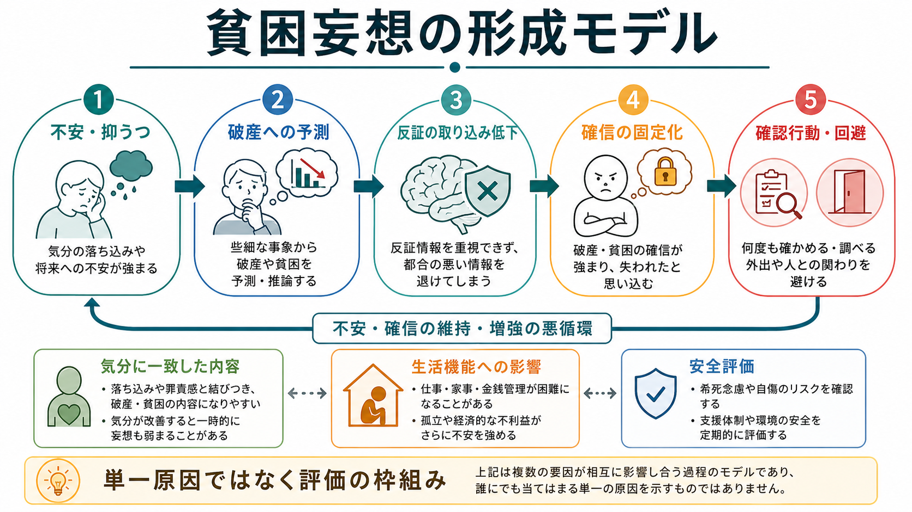
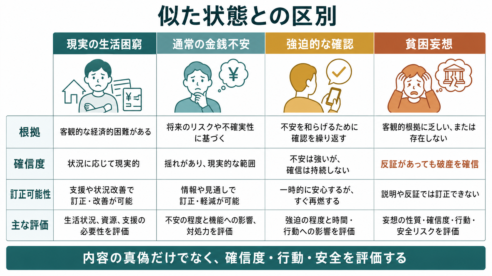

# 貧困妄想とは何か

## 要点

- 貧困妄想とは、客観的な財産、収入、制度的支援、家族からの説明と合わないにもかかわらず、「破産した」「もう生活できない」「家族を路頭に迷わせる」と確信する妄想である。
- 単なる金銭不安や現実の生活困窮ではなく、確信度の高さ、反証で揺らぎにくいこと、行動や安全への影響を見て評価する。
- 古典的には、罪業妄想、心気妄想、虚無妄想などと並んで、抑うつ状態、とくに精神病症状を伴ううつ病やメランコリー性の文脈で論じられてきた[3][4]。
- ただし、貧困妄想だけで診断名は決まらない。うつ病、双極症、統合失調症スペクトラム、認知症、せん妄、物質・薬剤、身体疾患を含めて時間経過と全体像を見る必要がある[1][2]。
- 臨床では、妄想内容の真偽をその場で論破するより、確信度、訂正可能性、生活機能、希死念慮、食事・服薬・金銭管理への影響を具体的に確認する。

## この記事で答える問い

1. 貧困妄想は、通常の金銭不安や現実の貧困と何が違うのか。
2. なぜ抑うつ、罪責感、身体不安、自殺リスクと一緒に評価されるのか。
3. 精神状態診察では、どの軸で記述すると臨床的に役立つのか。

## まず結論

貧困妄想は、「お金が心配」という不安の強さだけでは定義できない。中心にあるのは、現実の情報と合わない破産・貧困の確信であり、その確信が説明、通帳、家族の保証、制度的支援の情報によっても修正されにくい点である。妄想一般は、反証があっても固定して保たれる信念として説明されることが多く、文化的背景や本人の生活状況を踏まえて判断する必要がある[1][2]。

貧困妄想は、内容としては金銭に関する信念だが、臨床的には金銭問題だけを見ればよい症状ではない。抑うつ気分、罪責感、無価値感、将来への破局的予測、[[精神運動制止とは何か|精神運動制止]]、希死念慮、食事拒否、受診拒否、家族への過度な謝罪や確認行動と結びつくことがある。したがって、[[MSEで思考内容をどう評価するか|思考内容]]、[[MSEで病識と判断力をどう評価するか|病識と判断力]]、安全評価を一体として扱う。

## 背景

精神医学でいう妄想は、単に「間違った考え」ではない。多くの解説では、外的現実の解釈にもとづく固定した誤信念であり、反対証拠があっても変わりにくく、その人の文化や宗教的背景だけでは説明しにくいものとして記述される[1][2]。この意味で、妄想を評価するときは、内容の奇妙さだけでなく、確信度、訂正可能性、根拠づけの仕方、行動への影響を観察する。

貧困妄想は、妄想のテーマが「破産」「生活不能」「財産喪失」「家族を経済的に破滅させること」に向かう状態である。NCBI MedGen では depressive delusion of poverty という概念項目があり、SNOMED CT の用語として「抑うつ性の貧困妄想」が収載されている[3]。これは、貧困妄想が少なくとも臨床用語・医療概念として整理されてきたことを示す。

古典的な精神病理学では、抑うつ状態に伴う妄想として、罪業妄想、貧困妄想、心気妄想、虚無妄想が重視されてきた。Tölle は、抑うつにおける妄想を整理し、罪、貧困、病気に関する妄想やその前段階が、内因性うつ病・メランコリーの診断を支える症状として現れうると述べている[4]。NICE の精神病性うつ病レビューも、うつ病における精神病症状として、虚無、罪、不十分さ、病気に関する妄想や非難的な幻聴がよく見られること、精神運動障害や心理社会的障害が重くなりやすいことを指摘している[5]。

## 基本概念

### 貧困妄想の定義

貧困妄想とは、実際には破産していない、生活資源が残っている、支援制度や家族の支えがある、あるいは少なくとも確認が必要な段階であるにもかかわらず、「もう破産した」「すべてを失った」「家族を養えない」「治療費を払えないから終わりだ」と強く確信する妄想的信念である。

ここで重要なのは、実際の経済状況が苦しい人の訴えを「妄想」と決めつけないことである。現実の生活困窮、借金、失業、介護費、医療費、住居不安は、それ自体が重大な支援課題である。貧困妄想という言葉を使うのは、現実の根拠と本人の確信が大きく食い違い、反証や説明で修正されにくく、その信念が生活・安全に影響している場合である。

### 通常の金銭不安との違い

通常の金銭不安では、将来のリスクを心配しながらも、収支表、預金残高、家族や支援者の説明、社会資源の情報によって見通しが多少変わる。強い不安があっても、「まだ確認できていない」「不安が強くなっているのかもしれない」と考える余地が残る。

貧困妄想では、この余地が乏しい。通帳に残高があっても「これは間違いだ」、家族が説明しても「迷惑をかけないために嘘をついている」、制度利用が可能でも「自分には使えない」と解釈されることがある。[[強迫観念とは何か|強迫観念]]でも確認行動は起こりうるが、強迫観念では「考えたくないのに浮かぶ」「不合理かもしれない」という自我違和感が残ることが多い。一方、妄想では確信が強く、現実検討の障害が前景に出やすい。

### 現実の貧困との違い

現実の貧困と貧困妄想は、対立概念ではない。実際に経済的困難がある人に、妄想的な破局確信が重なることもある。したがって評価では、「本当に困っているか」か「妄想か」の二分法にしない。

実際の生活困窮では、家賃、食費、医療費、借金、就労、福祉制度、家族支援などを具体的に確認し、必要な支援につなぐ。貧困妄想が疑われる場合でも、現実の困窮がないと即断しない。むしろ、客観的な生活状況の確認と、本人の確信の性質の記述を分けることが重要である。

## 仕組み

貧困妄想の仕組みを、単一の脳部位や単一の心理機制だけで説明することはできない。ここでは臨床的な理解のために、いくつかの層に分けて考える。

### 1. 気分に一致した破局的意味づけ

抑うつ状態では、自己評価が下がり、将来を悲観し、罪責感や無価値感が強まることがある。そこに「自分は家族に迷惑をかける」「取り返しのつかないことをした」という意味づけが加わると、金銭の心配が「破産はすでに確定している」という形に固定されることがある。これは、[[抑うつ気分とは何か|抑うつ気分]]の内容と妄想内容が一致する場合として理解しやすい。

精神病性うつ病では、精神病症状が見逃されやすいことも問題になる。NICE のレビューは、精神病性うつ病では妄想が微妙で断続的だったり、本人が隠したりするため、専門場面でも正確に診断されないことがあると述べている[5]。金銭の話が「心配性」や「老後不安」に見える場合でも、確信度と訂正可能性を確認する必要がある。

### 2. 反証の取り込みにくさ

妄想研究では、確証バイアス、少ない情報から結論へ飛びつく傾向、信念の柔軟性の低下、外的出来事への意味づけの偏りなどが議論されてきた。Garety と Freeman のレビューは、妄想に関する複数の認知モデルを検討し、結論への飛びつきや帰属バイアスが繰り返し示されていることを整理している[6]。また、妄想的信念の維持には、データ収集や代替説明の生成が乏しくなる推論バイアスが関わる可能性がある[7]。

貧困妄想では、反証となる情報が入っても、「まだ隠れた借金がある」「今は残高があるように見えるだけ」「これから必ず破滅する」と解釈されることがある。このとき、現実の情報が単に無視されるだけでなく、妄想を補強する材料として再解釈されることがある。

### 3. 確認行動と回避による悪循環

破産への確信が強まると、通帳確認、家族への謝罪、支払いの過度な確認、外出や買い物の回避、食事や受診の拒否が起こることがある。確認は一時的に安心をもたらすが、すぐに「やはり足りない」「隠された問題がある」と不安が再燃し、確認が反復されることがある。

この悪循環は、妄想だけでなく不安や強迫的確認とも重なる。しかし、貧困妄想では「不安を打ち消すための確認」というより、「すでに破産しているという確信を前提にした確認」になりやすい。したがって、行動の形だけでなく、その背後にある確信の性質を聞く。

### 4. 神経・身体・薬剤要因との接続

妄想は一次性精神疾患だけでなく、認知症、せん妄、てんかん、脳血管障害、内分泌・代謝異常、感染、薬剤、物質使用・離脱などでも生じうる。[[せん妄とは何か|せん妄]]では意識・注意の変動が重要であり、固定した妄想だけを見て精神病性障害と判断すると危険である。貧困妄想らしい訴えが急に出た場合、発症時期、意識、注意、見当識、身体症状、服薬変更を確認する。

また、高齢者では、実際の孤立、退職、配偶者喪失、認知機能低下、年金や医療費への不安が重なりやすい。これは妄想内容を「社会的に理解できる不安」として見逃す方向にも、「高齢だから仕方ない」と過小評価する方向にも働く。[[鑑別診断とは何か|鑑別診断]]では、心理社会的文脈と精神状態の両方を扱う必要がある。

## 図解

この記事では、貧困妄想を「内容」「確信度」「反証への反応」「生活・安全への影響」に分けて整理する。1枚目は、抑うつや不安から破産予測が固定化し、確認行動や回避によって悪循環が維持されるモデルである。これは病因を断定する図ではなく、評価の枠組みである。

2枚目は、現実の生活困窮、通常の金銭不安、強迫的確認、貧困妄想を比較する図である。臨床では、本人の語りの内容だけでなく、根拠、確信度、訂正可能性、行動、安全リスクを合わせて見る。

## 臨床・研究との接続

### 精神状態診察での記述

[[精神状態診察MSEとは何か|精神状態診察]]では、貧困妄想を「貧困妄想あり」とだけ書くより、次のように分けると情報量が増える。

| 評価軸 | 見ること | 記述例 |
|---|---|---|
| 内容 | 何を失ったと確信しているか | 「全財産を失い、家族も生活できない」と述べる |
| 根拠 | どの出来事を証拠にしているか | 光熱費の通知を「破産の証拠」と解釈する |
| 確信度 | どれほど確信しているか | 100%確実、説明されても変わらない |
| 訂正可能性 | 反証にどう反応するか | 預金残高を見ても「偽装だ」と述べる |
| 気分との関係 | 抑うつ、罪責感、不安との連動 | 落ち込みが強い日に破産確信が増す |
| 行動への影響 | 食事、受診、支払い、外出、家族関係 | 「お金がない」と食事や受診を拒む |
| 安全 | 希死念慮、自傷、他害、ネグレクト | 「家族に迷惑をかけるくらいなら死にたい」と述べる |

この記述は、診断名を急いで確定するためではなく、経時的に症状の変化を追うために役立つ。精神病性うつ病では精神病症状が隠れやすく、重症度や安全リスクと関係するため、面接では直接かつ非対決的に確認する[5]。

### 自殺リスクとの関係

貧困妄想は、「自分が家族を破滅させる」「治療費を払えない」「生きているだけで迷惑だ」という罪責感や無価値感と結びつくと、希死念慮や自殺企図のリスク評価が重要になる。一般人口調査では、抑うつ症状をもつ人の一部に妄想や幻覚がみられ、無価値感・罪責感や自殺念慮は精神病症状と関連していた[8]。この知見は、貧困妄想だけから個別リスクを推定できるという意味ではないが、抑うつと精神病症状が重なる場合に安全評価を省略しない根拠になる。

### 研究上の位置づけ

貧困妄想そのものを大規模に扱う研究は、被害妄想や幻聴に比べると多くない。MedGen には「抑うつ性の貧困妄想」という概念項目があり、近年も貧困妄想を主題にした症例報告が登録されている[3]。一方で、研究の多くは、精神病性うつ病、抑うつに伴う妄想、妄想一般の認知モデル、推論バイアス、異常な意味づけという広い枠組みで進んでいる[4][6][7]。

したがって、貧困妄想を理解するには、症候学としての記述と、[[妄想は予測誤差処理の異常として説明できるのか|妄想と予測誤差処理]]、認知バイアス、気分障害研究を接続して読む必要がある。ただし、研究モデルを個別患者に機械的に当てはめて、診断や原因を断定しない。

## よくある誤解

### 誤解1: お金の心配が強ければ貧困妄想である

違う。金銭不安は、失業、物価上昇、借金、医療費、介護費、住居不安などに対する現実的な反応として起こる。貧困妄想と呼ぶには、現実の根拠と確信のずれ、反証で修正されにくいこと、生活や安全への影響を確認する必要がある。

### 誤解2: 実際に貧しい人には貧困妄想は起こらない

これも違う。現実の困窮がある人にも、現実以上に破局的で訂正不能な確信が重なることがある。重要なのは、「支援が必要な現実の困窮」と「妄想的確信」を混同せず、両方を評価することである。

### 誤解3: 通帳を見せれば解決する

通帳や請求書の確認は、現実確認として必要な場合がある。しかし妄想的確信が強い場合、反証はそのまま安心につながらず、「偽装されている」「今だけ残っている」「すぐ失う」と再解釈されることがある。面接では、論破よりも、本人が何を恐れ、どの程度確信し、どの行動に影響しているかを確認する。

### 誤解4: 貧困妄想はうつ病だけで起こる

貧困妄想は抑うつ文脈でよく論じられるが、診断名を一つに固定する症状ではない。双極症の抑うつ相、統合失調症スペクトラム、妄想性障害、認知症、せん妄、物質・薬剤、身体疾患などを含めて検討する。[[幻聴とは何か|幻聴]]、思考障害、躁症状、認知機能、意識変動、身体所見を合わせて見る。

## 関連ノート

- [[精神症候学とは何か]]
- [[MSEで思考内容をどう評価するか]]
- [[MSEで病識と判断力をどう評価するか]]
- [[妄想は予測誤差処理の異常として説明できるのか]]
- [[抑うつ気分とは何か]]
- [[精神運動制止とは何か]]
- [[強迫観念とは何か]]
- [[せん妄とは何か]]
- [[幻聴とは何か]]
- [[鑑別診断とは何か]]

## MOC更新候補

- `content/00_MOC/` 配下の精神医学・症候学系MOCに、バッチ統合時に `[[貧困妄想とは何か]]` を追加する候補。
- 並列ジョブとの競合を避けるため、本タスクではMOCファイル自体は更新しない。

## 理解チェック

1. 貧困妄想と通常の金銭不安を分けるとき、確信度と訂正可能性はどのように役立つか。
2. 実際の生活困窮がある場合、なぜ「現実の支援課題」と「妄想的確信」を分けて評価する必要があるか。
3. 貧困妄想が抑うつ、罪責感、希死念慮と結びつく場合、精神状態診察で何を追加確認するべきか。
4. 反証を示しても本人の確信が弱まらないとき、面接ではどの情報を記述すべきか。

## 未解決問題

- 貧困妄想だけを対象にした疫学研究や縦断研究は限られており、どの診断群・年齢層・社会的文脈でどの程度多いかは十分に整理されていない。
- 抑うつに伴う罪責感、現実の経済不安、認知機能低下、社会的孤立、妄想的確信がどの順序で相互作用するかは、個人差が大きい。
- 認知モデルや予測処理モデルは有用な説明枠組みだが、貧困妄想の内容特異性をどこまで説明できるかは慎重に検討する必要がある。

## 参考文献

[1] World Health Organization. (2025). *Schizophrenia*. https://www.who.int/news-room/fact-sheets/detail/schizophrenia

[2] Joseph, S. M., & Siddiqui, W. (2023). *Delusional Disorder*. StatPearls, NCBI Bookshelf. https://www.ncbi.nlm.nih.gov/sites/books/NBK539855/

[3] National Center for Biotechnology Information. *Depressive delusion of poverty (Concept Id: C0424032)*. MedGen. https://www.ncbi.nlm.nih.gov/medgen/602821

[4] Tölle, R. (1998). Delusion in depression. *Der Nervenarzt, 69*(11), 956-960. https://doi.org/10.1007/s001150050369

[5] National Institute for Health and Care Excellence. (2022). *Psychotic depression: Evidence review G*. NCBI Bookshelf. https://www.ncbi.nlm.nih.gov/books/NBK583078/

[6] Garety, P. A., & Freeman, D. (1999). Cognitive approaches to delusions: A critical review of theories and evidence. *British Journal of Clinical Psychology, 38*(2), 113-154. https://doi.org/10.1348/014466599162700

[7] Waller, H., Emsley, R., Freeman, D., Bebbington, P., Dunn, G., Fowler, D., Hardy, A., Kuipers, E., & Garety, P. (2015). Thinking Well: A randomised controlled feasibility study of a new CBT therapy targeting reasoning biases in people with distressing persecutory delusional beliefs. *Journal of Behavior Therapy and Experimental Psychiatry, 48*, 82-89. https://pmc.ncbi.nlm.nih.gov/articles/PMC4429971/

[8] Ohayon, M. M., & Schatzberg, A. F. (2002). Prevalence of depressive episodes with psychotic features in the general population. *American Journal of Psychiatry, 159*(11), 1855-1861. https://doi.org/10.1176/appi.ajp.159.11.1855
