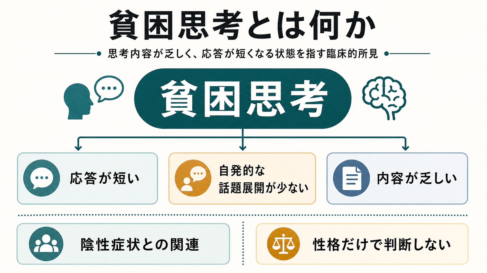
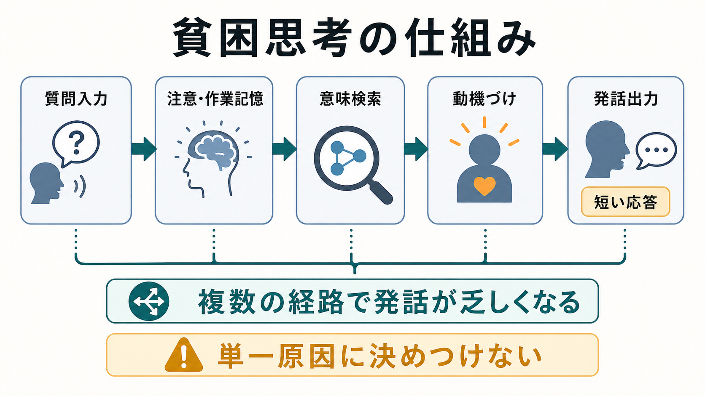
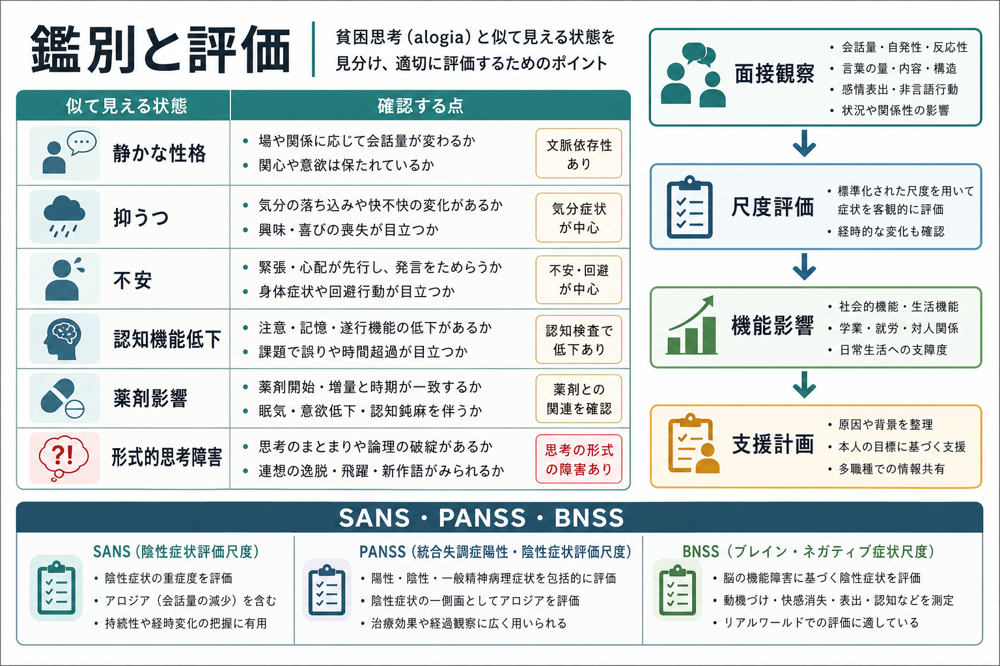

# 貧困思考とは何か

## 要点

- 貧困思考とは、面接での応答が短く、話題の自発的展開や内容の豊かさが乏しく見える所見である。英語圏ではしばしば *alogia*、*poverty of speech*、*poverty of content of speech* と重なって扱われる。
- これは「何も考えていない」「知能が低い」「話す気がない」と同義ではない。[[MSEで話し方から何がわかるのか]]、[[MSEで思考過程をどう評価するか]]、[[MSEで思考内容をどう評価するか]]を合わせて、発話量、応答潜時、文脈、生活機能への影響を観察する必要がある[1]。
- 統合失調症スペクトラムでは、貧困思考・アロギアは陰性症状の一部として重要である。現代的な陰性症状研究では、陰性症状を、感情表出の低下、アロギア、意欲低下、非社交性、快感消失などの領域として整理することが多い[2][3]。
- ただし、抑うつ、不安、幻聴への注意集中、認知機能低下、薬剤性の鎮静、文化的・対人的文脈などでも、応答は短くなりうる。一次性陰性症状と二次性に見える発話低下を区別する視点が重要である[3][4]。
- 本記事は教育・研究目的の整理であり、個別の診断や治療指示ではない。

## この記事で答える問い

1. 貧困思考とは、具体的にどのような面接所見なのか。
2. 「静かな性格」「抑うつ」「失語」「思考途絶」とは何が違うのか。
3. 陰性症状、統合失調症、評価尺度とどのように接続されるのか。
4. 臨床記述では、何を観察し、どのような誤解を避けるべきか。

## まず結論

貧困思考は、頭の中を直接のぞいて「思考が少ない」と断定する用語ではない。面接で観察されるのは、発話量が少ない、返答が短い、質問への最小限の応答にとどまる、自発的な話題展開が少ない、内容が具体性や広がりを欠く、といった「表出された思考・言語」の乏しさである[1][5]。

したがって、貧困思考は、[[精神症候学とは何か]]の中では「思考内容」だけでなく、発話、思考過程、意欲、感情表出、認知機能、対人文脈の交差点にある所見として理解した方がよい。特に統合失調症スペクトラムでは、アロギアとして陰性症状に含まれ、生活機能や社会機能の低下と結びつきやすい[2][3]。

## 背景

精神科面接では、本人が語る内容だけでなく、語りの量、速さ、間、まとまり、具体性、質問への反応を観察する。Mental Status Examination では、発話の量・流暢性・速度・音量・トーン、思考過程、思考内容、認知、洞察、判断などを分けて記述する[1]。貧困思考を理解するには、この分け方が役に立つ。

統合失調症では、陽性症状として幻覚・妄想・解体した発話が注目されやすい。一方で、陰性症状は「通常ならある機能や行動が減る」側面を指し、意欲、快感、社会的関心、感情表出、言語表出の低下として現れる[2][3]。貧困思考は、このうち言語表出の低下、すなわちアロギアと近い。

ただし、日本語の「貧困思考」はやや広い言い方である。英語文献の *alogia* は「言葉の量や言語表出の減少」に焦点を置くことが多い。*poverty of speech* は発話量の少なさ、*poverty of content of speech* は発話量はあっても情報量が乏しい状態を指すことがある[5]。そのため、記述では「応答が短い」「内容が抽象的で具体性に乏しい」「自発的な展開が少ない」など、観察された現象を分けて書く方が誤解が少ない。

## 基本概念

### 貧困思考とアロギア

アロギアは、陰性症状研究ではしばしば「話される語数の減少」または「言語表出の低下」として定義される[2][3]。古典的な SANS では、陰性症状を感情鈍麻、アロギア、意欲低下・アパシー、快感消失・非社交性、注意障害などの領域に分け、アロギアを詳細に観察する枠組みを作った[6]。

面接で見える貧困思考は、次のような形をとる。

| 観察される形 | 面接での見え方 | 注意点 |
|---|---|---|
| 発話量の少なさ | 「はい」「いいえ」「別に」など短い返答が続く | 性格、緊張、警戒、文化差だけで決めない |
| 応答潜時の延長 | 質問後に返答まで時間がかかる | [[思考途絶とは何か]]、注意障害、認知機能低下も考える |
| 内容の乏しさ | 発話量はあるが具体的情報が少ない | 回避、失語、抽象化困難、形式的思考障害と区別する |
| 自発性の低下 | 質問されないと話題を広げない | [[意欲低下とは何か]]や抑うつとの重なりを見る |
| 表出の乏しさ | 感情や関心が伝わりにくい | [[快感消失とは何か]]、感情鈍麻、薬剤性鎮静と分ける |

### 思考内容ではなく、表出された思考の所見

「貧困思考」という語は、思考そのものの量や質を直接測定しているように聞こえる。しかし実際に観察できるのは、発話、表情、非言語的反応、質問への応答、生活機能の変化である[1]。本人が内的には多くを考えていても、言語化、動機づけ、注意、対人不安、幻聴への注意集中などによって表出が少なくなることがある。

そのため、臨床記述では「貧困思考あり」とだけ書くよりも、「開かれた質問に対して一語返答が多く、自発的な説明が乏しい」「促すと具体例を一部述べる」「応答潜時が長いが、理解は保たれる」などの観察文を添える方が有用である。

## 仕組み

貧困思考は、単一の脳部位や単一の心理過程だけで説明できる現象ではない。面接で「短い応答」として見えるまでには、少なくとも次の過程が関与する。

1. 質問を聞き取り、注意を向ける。
2. 質問の意味を保持し、関連する記憶や語を検索する。
3. 何をどの程度話すかを選び、話す動機づけを保つ。
4. 発話として組み立て、声や表情で表出する。

このどこか、または複数箇所に負荷がかかると、応答は短く、内容は乏しく見える。陰性症状としてのアロギアでは、言語表出や動機づけの低下が持続的にみられることがある[2][3]。一方で、抑うつによる制止、不安による回避、薬剤性鎮静、認知機能低下、幻聴や妄想への没入、社会的環境の乏しさなどでも、二次的に似た所見が生じる[3][4]。

一次性陰性症状と二次性陰性症状を分ける議論は、この点で重要である。一次性陰性症状は疾患過程により比較的持続する陰性症状として考えられる。一方、二次性の発話低下は、陽性症状、抑うつ、不安、錐体外路症状、薬剤の鎮静、環境的剥奪などに続いて現れることがある[3][4]。両者は面接だけで完全に分けられるとは限らないが、経過、併存症状、薬剤、生活環境、本人と周囲の情報を合わせることで見立ての精度が上がる。

## 図解

図1は、貧困思考を「短い応答」「自発的な話題展開の少なさ」「内容の乏しさ」として整理した要約図である。ここで重要なのは、貧困思考を人格評価ではなく、観察された臨床所見として扱う点である。

図2は、質問入力から発話出力までの過程を単純化した図である。注意、作業記憶、意味検索、動機づけ、発話出力のどこかに負荷がかかると、同じ「短い応答」として見える可能性がある。

図3は、鑑別と評価の入口をまとめた図である。静かな性格、抑うつ、不安、認知機能低下、薬剤影響、形式的思考障害は、面接上は貧困思考に似ることがある。したがって、観察、尺度評価、生活機能、支援計画をつなげて考える必要がある。

## 臨床・研究との接続

### 面接での観察

面接では、まず自由に話せる質問を置く。「最近の一日を教えてください」「困っていることを、最初から順に話してください」のような開かれた質問に対し、どの程度自発的に話が広がるかを見る。そのうえで、具体化の促し、選択肢提示、時間を置いた再質問を行い、どこまで内容が出てくるかを確認する。

観察では、次の点が有用である。

| 観察軸 | 確認すること |
|---|---|
| 発話量 | 語数、文の長さ、質問への最小限応答の多さ |
| 応答潜時 | 返答までの時間、沈黙の性質、促しへの反応 |
| 自発性 | 質問されない話題展開、補足説明、感情や関心の表明 |
| 内容の具体性 | 時間、場所、人物、行動、理由、結果を述べられるか |
| 文脈依存性 | 慣れた相手、緊張場面、文化背景、言語能力で変化するか |
| 機能影響 | 学業、就労、対人関係、セルフケア、治療参加への影響 |

### 評価尺度

研究や構造化評価では、陰性症状尺度が用いられる。SANS は陰性症状の包括的評価を早期に整備した尺度で、アロギアを含む複数領域を扱う[6]。PANSS は統合失調症の陽性・陰性・一般精神病理を評価する代表的尺度で、陰性尺度の中に会話の自発性や流暢さに関わる項目が含まれる[7]。BNSS は、NIMH-MATRICS の陰性症状概念を踏まえ、感情鈍麻、アロギア、非社交性、快感消失、意欲低下を測る13項目尺度として開発された[8]。

尺度は診断そのものではなく、観察を再現可能にし、経時変化や研究上の比較をしやすくする道具である。本人の語り、家族や支援者からの情報、生活機能、薬剤・身体疾患・認知機能の評価と合わせて読む必要がある。

### 鑑別で見る状態

| 似て見える状態 | 違いを見るポイント |
|---|---|
| 静かな性格 | 場や相手が変わると話せるか、生活機能が保たれているか |
| [[抑うつ気分とは何か]] | 気分の落ち込み、罪責感、睡眠・食欲、精神運動制止が前景か |
| [[不安とは何か]] | 緊張、回避、評価懸念、身体症状が発話を妨げているか |
| [[認知機能障害とは何か]] | 注意、記憶、遂行機能、処理速度の低下があるか |
| [[幻聴とは何か]] | 内的刺激への反応、注意の逸れ、被害的解釈があるか |
| [[思考途絶とは何か]] | 発話が急に止まる、再開できない、中断の主観があるか |
| 失語・構音障害 | 言語理解、呼称、復唱、流暢性、神経学的所見を確認する |
| 薬剤・身体疾患 | 鎮静、錐体外路症状、睡眠不足、疼痛、内分泌・神経疾患を確認する |

## よくある誤解

### 誤解1: 貧困思考は「頭が悪い」という意味である

違う。貧困思考は知能や人格の評価ではなく、面接で観察される発話・表出の所見である。本人が何を考えているか、どの程度理解しているか、どのように言語化できるかは別々に評価する必要がある[1]。

### 誤解2: 応答が短ければ貧困思考である

短い応答だけでは不十分である。疲労、緊張、不信感、文化的に控えめな話し方、言語の問題、面接者との関係性でも応答は短くなる。貧困思考として扱うには、複数場面での一貫性、促しへの反応、生活機能への影響、他の症状との関連を確認する。

### 誤解3: 貧困思考があれば統合失調症である

貧困思考・アロギアは統合失調症の陰性症状として重要だが、単独で診断を決める所見ではない。統合失調症の診断では、妄想、幻覚、解体した発話、解体または緊張病性の行動、陰性症状、期間、機能低下、除外診断などを総合する[2]。

### 誤解4: 陰性症状なら薬だけで判断すればよい

陰性症状には一次性と二次性があり、二次性の背景には抑うつ、不安、陽性症状、薬剤副作用、社会的孤立、身体疾患などがありうる[3][4]。支援では、症状名だけでなく、どの過程が妨げられているかを見立てる必要がある。

## 関連ノート

既存ノート:

- [[精神症候学とは何か]]
- [[MSEで話し方から何がわかるのか]]
- [[MSEで思考過程をどう評価するか]]
- [[MSEで思考内容をどう評価するか]]
- [[思考途絶とは何か]]
- [[意欲低下とは何か]]
- [[快感消失とは何か]]
- [[認知機能障害とは何か]]
- [[抑うつ気分とは何か]]
- [[不安とは何か]]
- [[幻聴とは何か]]

今後の作成候補:

- アロギアとは何か
- 感情鈍麻とは何か
- 陰性症状とは何か
- SANS・PANSS・BNSSは何を測るのか
- 一次性陰性症状と二次性陰性症状は何が違うのか

MOC更新候補:

- `content/00_MOC/MOC｜精神医学.md`
- `content/00_MOC/MOC｜神経科学と精神疾患.md`
- 並列ジョブとの競合を避けるため、本タスクでは MOC 本体は更新しない。

## 理解チェック

1. 貧困思考を「思考内容そのもの」ではなく「表出された思考・言語の所見」として扱うべき理由は何か。
2. 貧困思考、思考途絶、抑うつによる短い応答は、面接でどのように区別できるか。
3. 陰性症状としてのアロギアを評価するとき、一次性と二次性を分ける視点が必要な理由は何か。
4. SANS、PANSS、BNSS のような尺度は、診断ではなく何を助ける道具か。
5. 「静かな性格」と貧困思考を混同しないために、どのような文脈情報を確認すべきか。

## 参考文献

[1] Voss, R. M., & Das, J. M. (2024). Mental Status Examination. *StatPearls*. NCBI Bookshelf. https://www.ncbi.nlm.nih.gov/books/NBK546682/

[2] Hany, M., & Rizvi, A. (2024). Schizophrenia. *StatPearls*. NCBI Bookshelf. https://www.ncbi.nlm.nih.gov/books/NBK539864/

[3] Correll, C. U., & Schooler, N. R. (2020). Negative symptoms in schizophrenia: A review and clinical guide for recognition, assessment, and treatment. *Neuropsychiatric Disease and Treatment, 16*, 519-534. https://doi.org/10.2147/NDT.S225643

[4] Galderisi, S., Mucci, A., Buchanan, R. W., & Arango, C. (2018). Negative symptoms of schizophrenia: New developments and unanswered research questions. *The Lancet Psychiatry, 5*(8), 664-677. https://doi.org/10.1016/S2215-0366(18)30050-6

[5] Andreasen, N. C. (1979). Thought, language, and communication disorders. I. Clinical assessment, definition of terms, and evaluation of their reliability. *Archives of General Psychiatry, 36*(12), 1315-1321. https://doi.org/10.1001/archpsyc.1979.01780120045006

[6] Andreasen, N. C. (1989). The Scale for the Assessment of Negative Symptoms (SANS): Conceptual and theoretical foundations. *The British Journal of Psychiatry Supplement, 7*, 49-58. https://pubmed.ncbi.nlm.nih.gov/2695141/

[7] Kay, S. R., Opler, L. A., & Lindenmayer, J. P. (1988). Reliability and validity of the Positive and Negative Syndrome Scale for schizophrenics. *Psychiatry Research, 23*(1), 99-110. https://doi.org/10.1016/0165-1781(88)90038-8

[8] Kirkpatrick, B., Strauss, G. P., Nguyen, L., Fischer, B. A., Daniel, D. G., Cienfuegos, A., & Marder, S. R. (2011). The Brief Negative Symptom Scale: Psychometric properties. *Schizophrenia Bulletin, 37*(2), 300-305. https://doi.org/10.1093/schbul/sbq059

## 未解決問題

- 自然言語処理や音声解析で、貧困思考・アロギアをどこまで妥当に補助評価できるか。
- 一次性陰性症状と二次性の発話低下を、短時間面接でどの程度再現性高く区別できるか。
- 貧困思考の評価に、文化差、母語差、面接者との関係性をどのように組み込むべきか。
- 発話量の増加が、本人の生活機能や主観的回復に直結するとは限らない点を、支援計画でどう扱うか。
